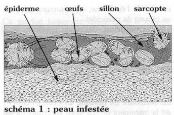
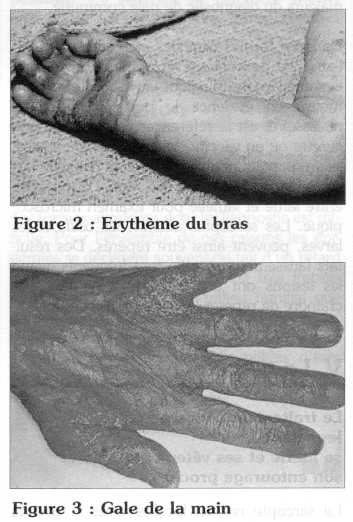
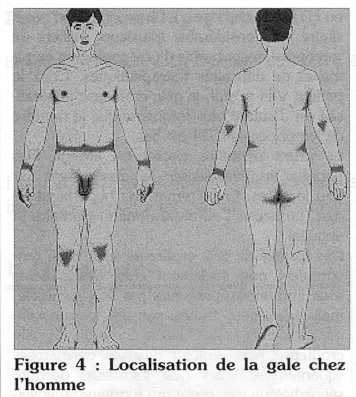

La gale est une maladie contagieuse, se manifestant par des démangeaisons intenses, provoquée par un ectoparasite, <em>Sarcoptes scabiei</em>.

## I. Le parasite

*Sarcoptes scabiei* est un acarien, parasite humain obligatoire, qui vit dans la couche cornée de l'épiderme. La femelle adulte mesure 0,4 mm de long, le mâle 0,1 à 0,2 mm. Le parasite est peu visible à l'oeil nu, il est gris, translucide. Il a la tête soudée au thorax et il est muni de 4 paires de pattes, permettant son déplacement sur l'épiderme. Après fécondation, la femelle creuse un sillon où elle dépose ses oeufs. Elle pond 40 à 50 oeufs durant sa vie qui dure 4 à 6 semaines, en restant dans le même sillon. Les larves éclosent après 3 à 4 jours, sortent du sillon, se transforment en nymphes et puis en parasites adultes en 10 jours. Le sarcopte adulte ne survit que 24 à 36 heures en dehors de son hôte à température ambiante alors que les oeufs vivent au moins 10 jours.

L'infestation résulte de la transmission de la femelle adulte fécondée, très rarement de formes parasitaires immatures.

## II. L'épidémiologie

C'est une affection très répandue dans le monde (le nombre d'individus infestés est estimé à 300 millions).

La transmission par contact humain direct est la plus fréquente, favorisée par la promiscuité, la gale étant ainsi une maladie sexuellement transmissible. Les sujets infestés, mais non symptomatiques, sont contagieux en période d'incubation.

Du fait de la survie limitée mais possible du parasite en dehors de son hôte, quelques cas peuvent être dus à une contamination indirecte par la literie, les vêtements, ou autres objets en contact avec les personnes infectées. La gale survient par épidémies cycliques dans les collectivités.

La gale croûteuse généralisée, improprement appelée gale norvégienne, est une forme d'infestation massive. Elle survient en cas d'immunodépression, et elle est extrêmement contagieuse.

## III. La clinique

### 1. La gale commune de l'adulte

L'incubation est de 3 semaines, mais elle peut être limitée à 1 à 3 jours en cas de réinfestation. Le signe majeur est un prurit (démangeaisons) généralisé, surtout la nuit, prédominant au niveau des doigts, des poignets, des aisselles, du nombril et des organes génitaux externes.

Le parasite femelle creuse dans l'épiderme une galerie formant un sillon superficiel, appelé sillon scabieux, long de 0,5 à 3 cm, portant à l'une des extrémités une surélévation de la taille d'une tête d'épingle correspondant à l'acarien. Les lésions touchent les espaces interdigitaux des mains (vésicules perlées), la face antérieure des poignets, les coudes, les aisselles, les plis inguinaux, la région ombilicale, les fesses, la face interne des cuisses et les seins. Ces lésions spécifiques peuvent manquer. Les lésions secondaires non spécifiques sont plus fréquentes : stries de grattage, papules excoriées, eczématisation, impétigo.

### 2. Chez le nourrisson

Le prurit se traduit initialement par une agitation et des mouvements de contorsion du bébé pour se frotter le dos, puis surviennent les lésions de grattage. Elles peuvent s'étendre sur tout le corps. Les lésions palmo-plantaires sont caractéristiques.

Les lésions secondaires par surinfections sont souvent au premier plan, atteignant le visage, et sont en général polymorphes : prurigo, impétigo croûteux, eczéma.

### 3. Chez le sujet âgé

La gale atteint fréquemment les sujets âgés, en particulier lorsqu'ils vivent en collectivité. Le diagnostic est parfois tardif, car les personnes âgées ont souvent du prurit.

### 4. Chez l'immunodéprimé

La gale croûteuse généralisée (improprement appelée norvégienne), survient chez des patients immunodéprimés ou débilités (corticothérapie locale ou générale, infection à VIH ou HTLV-1, cirrhose ... ). La prolifération parasitaire est considérable (plusieurs milliers de sarcoptes), responsable d'une contagion extrême et de difficultés thérapeutiques. Chez le patient VIH positif, la gale croûteuse généralisée est d'autant plus fréquente que le nombre de lymphocytes CD4 est bas.

Le prurit peut-être discret ou absent. Des papules érythémateuses se disséminent sur tout le corps. On observe une hyperkératose dite "farineuse", au niveau palmo-plantaire et unguéal.

Des formes de gale croûteuse sont aussi rencontrées, non seulement chez des patients sous immunosuppresseurs par voie générale, mais également traités par des dermocorticoïdes locaux (gale du cuir chevelu). La gale croûteuse peut simuler diverses dermatoses squameuses, telles que psoriasis, dermite séborrhéique ou éruption d'origine médicamenteuse.

Une personne non immunodéprimée, en contact avec un patient atteint de gale croûteuse, développera une gale commune. Ceci peut survenir entre autre chez le personnel hospitalier.

## IV. Le diagnostic

Le diagnostic essentiellement clinique est souvent difficile. Le prurit, la notion de contage, et l'emplacement des lésions sont les éléments majeurs du diagnostic de gale commune.

Dans les formes cliniques atypiques et/ou en l'absence de contexte épidémique évocateur, l'examen parasitologique au laboratoire pour mettre en évidence le parasite, répété si nécessaire, est la référence : un grattage à la curette ou au vaccinostyle, sur plusieurs sites, sillon, papule, nodule, permet de recueillir des sérosités ou des squames, que l'on dépose entre lame et lamelle pour examen microscopique. Les sarcoptes adultes, les oeufs et les larves, peuvent ainsi être repérés. Des résultats faussement négatifs sont fréquents quand les lésions ont été grattées. Il ne faut pas craindre de répéter l'examen plusieurs fois.

## V. Le traitement

**Le traitement concerne le malade, sa literie et ses vêtements,** **son entourage proche.**

Le sarcopte restant localisé dans la couche cornée de l'épiderme, le traitement est local au moyen de pesticides.

**La perméthrine,** dérivé du pyrèthre, sous forme de crème à 5 % est considérée actuellement comme le produit le plus efficace et le moins toxique. C'est le produit de référence de L'OMS. Il est utilisé en une application, à laisser en place 8 à 14 heures avant de se laver.

**Le benzoate de benzyle** en lotion (Ascabiol®) est le traitement de référence en France; il est utilisé en application unique, après un bain tiède, sur la peau encore humide. 24 heures après l'application, les vêtements et la literie sont changés, et le produit rincé.

**Une autre pyréthrine** est également utilisée sous forme d'aérosol, (Sprégal®). Le produit est appliqué puis rincé 12 heures après. En cas d'échec le traitement peut-être renouvelé une semaine plus tard. Ce produit est utilisable chez le nourrisson après 6 mois. Il peut provoquer une irritation cutanée locale. Il est contre-indiqué chez les enfants ayant des antécédents asthmatiques en raison de sa présentation en aérosol.

**Le lindane** (HCH, Scabecid®), est appliqué 12 heures sur une peau sèche. Il est moins irritant que le benzoate de benzyle, mais un peu moins efficace. Il peut induire des résistances. Ce produit est bon marché, mais possède une toxicité neurologique. Son absorption cutanée peut conduire à des phénomènes toxiques chez l'enfant ou en cas de lésions épidermiques importantes. L'OMS l'a retiré de la liste des médicaments essentiels à cause de sa toxicité. Il est contre-indiqué chez l'enfant de moins de 10 ans et pendant la grossesse et l'allaitement.

**Le soufre** est le plus ancien traitement de la gale, utilisé en de nombreuses régions du monde. Il est préconisé sous forme de pommade à 6 %. Peu coûteux et moins toxique que le lindane, son efficacité est mal évaluée.

**Le crotamiton** (Eurax) est un antiprurigineux, il a une action contre le sarcopte, mais son efficacité est plus faible que celle des autres traitements.

**L'ivermectine,** (Stromectol®) vient d'obtenir l'autorisation de mise sur le marché : une seule prise, 4 comprimés de 3 mg pour un sujet de 60 kg (soit 0,2 mg/kg).

Ce produit largement utilisé dans le monde pour le traitement des filarioses, en particulier de l'onchocercose, est actif contre la gale. Il peut être intéressant dans le traitement de la gale des patients infectés par le VIH et de la gale croûteuse hyperkératosique souvent longues et difficiles à traiter par les produits utilisés en application locale.

Malgré un traitement bien conduit, le prurit peut persister 2 semaines, après son arrêt. Au delà, la persistance d'un prurit après traitement antiscabieux doit faire penser à une réaction allergique ou d'irritation, à un prurit psychogène, à une recontamination, à un traitement insuffisant, ou à une résistance au produit utilisé.

En cas de difficulté de diagnostic par manque de signes cliniques spécifiques, le "traitement d'épreuve" consiste à traiter par un acaricide un patient présentant un prurit persistant; il peut entraîner des erreurs de diagnostic, faux positifs par disparition du prurit en l'absence de gale, ou faux négatifs si le prurit persiste malgré un traitement efficace. Il peut cependant rendre service en cas d'épidémie difficile à diagnostiquer et lorsque le diagnostic parasitologique ne peut être fait.

## VI. La prévention

La prise en charge sera différente selon qu'il s'agit d'un cas isolé, à son domicile ou en collectivité, ou d'un phénomène épidémique.

### Cas isolé

Le patient doit être traité, ainsi que les personnes de son entourage proche, même en l'absence de signes cliniques.

Les vêtements et la literie devront être lavés à 60'C, voire à l'eau bouillante.

Les vêtements et objets non lavables (oreillers, matelas, coussins etc), devront être traités avec un désinfectant antiparasitaire sous forme d'aérosol. (A-Par, par exemple, qui est un produit à base de pyréthrine).

### Devant un cas isolé en collectivité

Il faut isoler le malade dès le diagnostic, le traiter rapidement et maintenir l'isolement 48 heures. Le personnel devra se laver les mains, porter des gants et des blouses à usage unique pour tout contact direct avec le malade. Les vêtements et la literie seront traités comme précédemment.

### En cas d'épidémie dans un établissement

Il est nécessaire d'informer de façon précise le patient, le personnel et les familles sur l'affection, son mode de prévention et de traitement. Les précautions d'hygiène doivent être observées de façon extrêmement stricte. Tous les patients suspects ou atteints doivent être traités et isolés 48 heures. Un traitement préventif du personnel ayant été en contact est conseillé. Le traitement des vêtements et de la literie doivent être effectués comme précédemment. Les mesures d'hygiène et d'entretien des locaux doivent être renforcées. La rapidité avec laquelle les mesures sont prises et la bonne organisation sont des facteurs très importants, conditionnant les chances de se débarrasser de l'épidémie.

**Dans un local sans présence humaine** **pendant 72 heures, le parasite meurt** **car il ne peut survivre sans contact** **humain.**

## VII. Conclusion

La gale est une affection très contagieuse, peu grave, mais souvent mal vécue et ressentie à tort comme une maladie honteuse. Il existe des formes atypiques dont le diagnostic est difficile. Pour l'ensemble de ces raisons les épidémies se déclarent souvent du fait d'un retard au diagnostic. L'information est très importante, aussi bien dans le milieu familial que dans les collectivités. L'éradication passe par une prise en charge correcte, avec traitement de toutes les personnes susceptibles d'être contaminées et la désinfection de l'environnement proche.

*Développement et Santé, n°160, août 2002*
