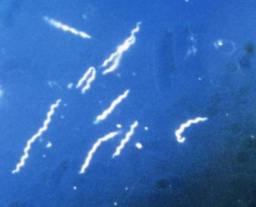
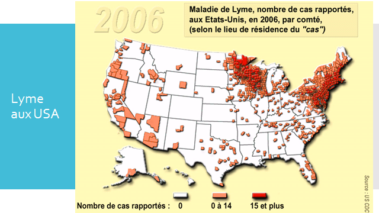
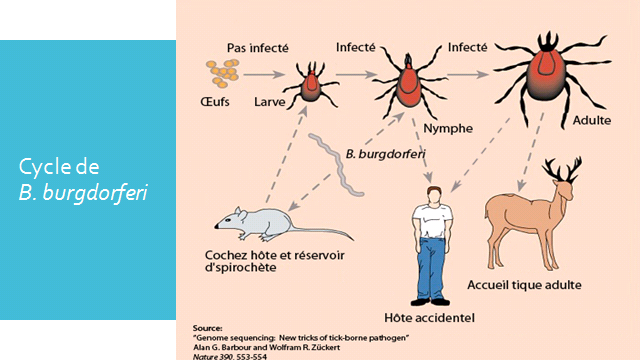
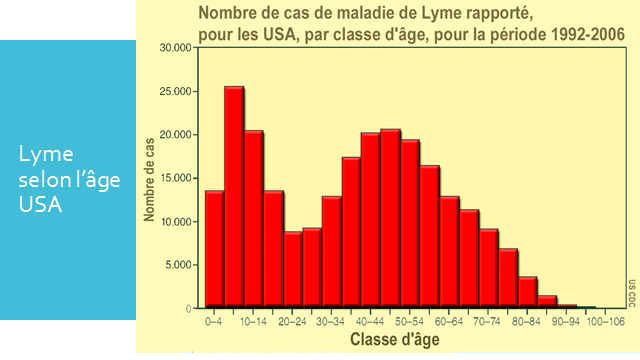
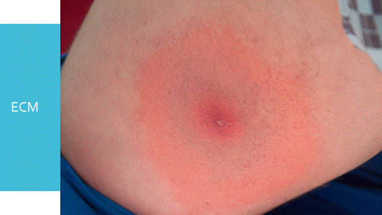
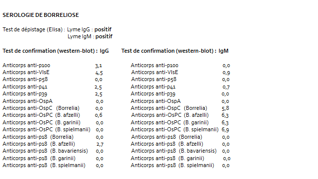

La maladie de Lyme a été décrite en 1977 par AC Steere aux USA, dans la ville de Lyme (Connecticut), chez des enfants atteints d’arthralgies. Le germe responsable (spirochète) (figure 1) a été découvert chez les tiques en 1981 par W. Burgdorfer, puis il sera décelé dans la peau, le sang et le LCR des patients atteints de maladie de Lyme.

**Figure 1. Le spirochète**

## Due aux morsures de tiques
En fonction de la conformation de leurs mandibules, les tiques « mordent » et ne piquent pas. La maladie de Lyme est une zoonose ayant un grand polymorphisme clinique. La prévalence en est très variable, estimée à 60 000 cas par an aux USA (figure 2), et 10 000 par an en France (surtout le centre et l’Alsace). 

**Figure 2. La maladie de Lyme aux Etats-Unis (la ville de Lyme est à l'est des Etats-Unis).**

Les vecteurs sont des tiques (Ixodes) de différentes espèces selon la répartition géographique (tableau I). La proportion de tiques infestées est très variable selon les régions, allant de 2 % en Californie à 60 % dans certaines régions d’Autriche.

<table>
  <tr>
    <th><strong>Géographie</strong>
    <th><strong>Vecteur</strong>
    <th><em>Borrelia</em</th>
  </tr>
  <tr>
    <td>Ouest des Etats-Unis</td>
    <td><em>Ixodes scapularis</em</td>
    <td><em>B . burgdorferi</em</td>
  </tr>
  <tr>
    <td>Est des Etats-Unis</td>
    <td><em>Ixodes pacificus</em</td>
    <td><em>B . burgdorferi</em</td>
  </tr>
  <tr>
    <td>Europe de l’ouest</td>
    <td><em>Ixodes ricinus</em</td>
    <td><em>B. afzelii, B. garinii</em</td>
  </tr>
  <tr>
    <td>Asie</td>
    <td><em>Ixodes persulcatus</em</td>
    <td><em>B. afzelii, B. garinii</em</td>
  </tr>
</table>

**Tableau I. Agents pathogènes et vecteurs sont différents selon les régions.**

Plus de **300 espèces animales**, comme les petits rongeurs (surtout pour les larves et les nymphes), les oiseaux et les grands mammifères **sont des réservoirs** de *Borrelia*. Les cervidés et les sangliers sont moins sensibles à l’infection que les mammifères domestiques.  
Le cycle de la tique s’effectue en 2 ans environ, mais tous les stades (larves, nymphes, adultes) sont infestants (figure 3). 

**Figure 3. Tous les stades des tiques sont infestants.**

Un mois après la ponte des œufs, naissent les larves qui se fixent sur des petits rongeurs pour se nourrir et devenir nymphes en six semaines. Ces dernières se fixent sur des mammifères pour assurer leur mue vers le stade adulte, atteint en quelques mois. Les tiques adultes se nourrissent sur les cervidés, bovidés, ovins, suidés et autres grands mammifères. Quand une tique s’est infestée au stade larvaire, elle le restera lors des mues suivantes jusqu’au stade adulte .

Le complexe *Borrelia burgdorferi* regroupe 30 espèces, dont **4 sont infestantes** pour l’homme. La contamination s’effectue lors de promenades en forêt, de jeux dans les jardins avec des grandes herbes et certaines professions sont particulièrement exposées (forestiers, bucherons).  
 Les tiques détectent la présence d’un hôte grâce à se capteurs sensibles au CO2. L’infection s’effectue uniquement par morsures de tiques, mais le risque de développer une maladie de Lyme n’est que de 1 à 5 %.  
Il n’y a **pas de contamination interhumaine**. La morsure de tiques est indolore (liquide salivaire contenant des anticoagulants, des immunomodulateurs et des substances anesthésiantes). Tous les âges sont touchés, mais surtout les enfants de 5 à 10  ans et les jeunes adultes (figure 4). 

**Figure 4. La maladie de Lyme atteint tous les âges, avec des pics chez l'enfant et le jeune adulte.**

## Evolution en trois stades
La maladie reste **asymptomatique chez 70 % des patients**. Dans les autres cas, après une incubation de minimum 10 jours, la maladie évolue en 3 stades. 

### Le stade primaire (qui dure de 1 à 30 jours)
C'est l’*erythema chronicum migrans*, plaque érythémateuse indolore de 2 à 10 cm, avec une extension centrifuge, située au point de morsure. Dans 10 % des cas, la bordure externe est rouge, ainsi que le centre, alors que la peau dans l’intervalle est normale, donnant un aspect en cocarde (figure 5), qu’il ne faut pas confondre avec une simple réaction inflammatoire due à un corps étranger, ou à une morsure de tique non infestée (figure 6 ). 

**Figure 5. *Erythema chronicum migrans* typique.**

**Figure 6. Simple réaction inflammatoire réactionnelle à une morsure de tique (non infectée).**

Parfois, quelques symptômes généraux peuvent être constatés, comme une fébricule, des céphalées, une raideur de la nuque, des arthralgies et des myalgies et une asthénie. Mais cette phase peut passer inaperçue dans 20% des cas.

### Le stade secondaire (mois ou années)
Il apparaît chez les sujets non traités, la bactérie ayant diffusé dans l’organisme et se manifeste par des troubles généraux (fièvre, asthénie, céphalées, palpitations, vertiges, uvéite, paralysie oculo-motrice, myalgies), neurologiques (15 % des cas) et articulaires.  
Les **arthralgies** (« arthrite de Lyme ») sont surtout des mono- ou des oligoarthrites (genoux++, épaules, coudes) ou diffuses.  
Les **troubles neurologiques** (« neuroborréliose ») se manifestent par une paralysie faciale (figure 7), une neuropathie optique, ou encore une méningite lymphocytaire. Des atteintes radiculaires sont possibles, en particulier touchant les paires crâniennes III, IV, V, VI et VII. Un syndrome de Guillain-Barré est possible. 

**Figure 7. Paralysie faciale**

### Le stade tertiaire (mois ou années) 
Il est marqué, chez les patients non ou insuffisamment traités, par une **meningo-encéphalite**, ou une exacerbation des troubles avec une **polyneuropathie** (douleurs, paresthésies, vertiges) avec des **troubles cognitifs** (difficulté de concentration, pertes de mémoire).  
A ce stade, les **troubles cardiaques** sont assez fréquents (arythmie, bloc auriculo-ventriculaire avec des anomalies ECG dans 50 à 80% des cas) ainsi que les troubles cutanés (achrodermatite chronique atrophiante, touchant les membres inférieurs, avec une peau fine et violacée, lymphocytome cutané bénin.

Mais il arrive souvent que des patients consultent pour des **troubles divers**, non étiquetés, après de nombreuses consultations, en étant persuadés d’être atteints de maladie de Lyme, avec ou non le souvenir de morsure de tique, remontant à plusieurs mois ou années.  
Les sérologies répétées sont toujours restées négatives et le bilan biologique est normal par ailleurs. En fonction des informations des médias, ces patients souhaitent une **antibiothérapie qui n’est pas justifiée et en plus inutile**. 

A ce propos, la Haute Autorité de Santé a diffusé récemment un document évoquant la persistance de « troubles chroniques » divers après les morsures de tiques : ce document est très discutable et a d’ailleurs été réfuté par la Société de Pathologie Infectieuse, par l’Académie de Médecine et par le collège des Généralistes, mais qui est très apprécié par certains praticiens qui multiplient sans raison, et d’ailleurs sans résultat, les consultations et les prescriptions abusives d’antibiotiques et de divers produits « naturels », à la manière des « Lyme doctors » américains.…

## Diagnostic : le western-blot 
Le diagnostic est établi **sur la clinique dans la première phase**, en l’absence de production d’anticorps, puis **sur la sérologie (Elisa avec recherche des IgM et des IgG, western-blot) pour les stades secondaire ou tertiaire.**
L’Elisa est un test de dépistage assez sensible, mais peu spécifique, avec des possibilités de réactions croisées avec d’autres agents infectieux (fièvres récurrentes à tiques, syphilis, leptospirose, mononucléose, *Helicobacter pylori*), En outre, les IgG et IgM peuvent persister pendant plusieurs années après un traitement correct, sans être un élément de chronicité ou de réinfection et ne justifiant pas de nouveaux antibiotiques.  
**Il ne faut donc pas établir un diagnostic sur le seul test ELISA.**
**Le western blot** est un **test de confirmation** avec des bandes spécifiques en IgM (24kDa, 39kDa et 41kDa) et en IgG (18kDa, 21kDa, 28kDa, 30kDa, 39kDa, 41kDa, 45kDa, 58kDa, 66kDa et 93kDa) (tableau II). Le germe est retrouvé par PCR, dans le sang et le LCR.  Pour affirmer un neuroborréliose, il faut déterminer un index de synthèse intrathécale, en comparant les taux d’anticorps du sérum et du LCR. 

## Traitement
Le traitement est basé sur les **antibiotiques** : 
- stade primaire : amoxicilline  2 à 3g/j/21j ou doxycycline 200mg/j/21j chez l’adulte ou amoxicilline 50mg/kg/j/21 jours chez l’enfant, 
- stades secondaire et tertiaire : ceftriaxone 2g/j/ 6 semaines. 

Une prolongation du traitement n’est pas justifiée et n’a pas prouvé son efficacité.  
En cas de **méningite**, la ceftriaxone (2g/j) ou la pénicilline G en IV (18 à 24 MU/j), ces deux produits étant prescrits pendant 3 à 4 semaines. 

## Prévention
La prévention nécessite de mettre des **vêtements protecteurs**, couvrant les bras et les jambes, pour les promenades en forêt (en dessous de 1 500m d’altitude) avec des produits répulsifs contre les insectes sur la peau et les vêtements. Les tiques étant postées sur les feuillages en bordure des chemins, il est préférable de marcher au milieu des chemins. 

En rentrant à domicile, il faut inspecter la peau à la recherche des tiques fixées sur la peau. L’extraction des tiques s’effectue par un tire-tique (figure 8), en évitant l’éther, suivie d’une désinfection du point de morsure. 

**Figure 8. Tire-tique**
Il n’y a pas encore de vaccin disponible, après l’essai provisoire du Lymarix aux USA entre 1998 et 2002, suspendu en raison de suspicion d’effets indésirables à type d’arthrites auto-immunes.