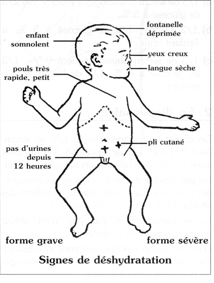
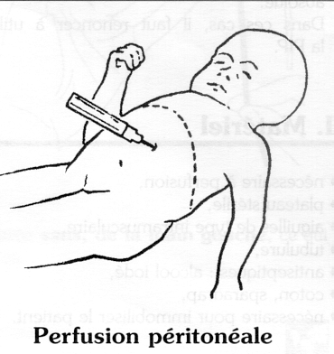
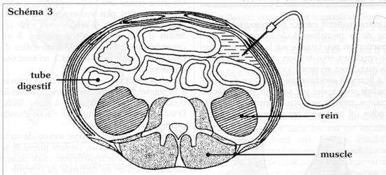

Les déshydratations sévères nécessitent la plupart du temps, surtout chez les nourrissons, des traitements appropriés en urgence. S'il est vrai que les mères ou les agents de santé communautaire peuvent agir très vite et efficacement, certaines techniques sont indispensables pour prendre le relais la perfusion intrapéritonéale (PIP), en est une de choix.

Nous ne reviendrons pas sur les grandes déshydratations, chacun en connaît les signes, les dangers et le degré d'extrême urgence que présente le traitement *(Schéma 1).*

La PIP est une technique simple, mais exi­geant une grande maîtrise, et la possibilité de disposer d'un matériel rigoureusement stérile. Sinon, il vaut mieux ne pas s'en servir et en choisir une autre.

## I. Contre-indications

- La présence d'anses intestinales dilatées (météorisme).
- L'ascite.
- L'impossibilité d'assurer une asepsie absolue.

Dans ces cas, il faut renoncer à utiliser la PIP.

## II. Matériel

- Nécessaire à perfusion
- Plateau stérile
- Aiguilles de type intramusculaire
- Tubulure
- Antiseptiques : alcool iodé
- Coton, sparadrap
- Nécessaire pour immobiliser le patient.

## III. Liquide de perfusion

Il faut disposer de flacons de différentes capa­cités selon la quantité à passer 100, 250, 500 millilitres.

### 1. En milieu hospitalier

Liquide de perfusion sans potassium tant que l'enfant n'urine pas.

Il peut être composé de plusieurs façons selon les possibilités

a\) 1/3 de sérum physiologique (Nacl 9 °%°) 2/3 de glucosé à 5 %,

b\) 1/2 Darow, 1/2 de glucosé à 5 %, si l'enfant urine,

c\) 1/3 de sérum physiologique à 9 °/°°, 1/3 de glucosé à 5 %, 1/3 de lactate à 1/6 molaire.

### 2. En dispensaire

On choisit un mélange simple 1/2 de sérum, Nacl 9 °/oo et 1/2 de glucosé à 5 % qui peut aussi être le seul réalisable en milieu hospitalier.

Ne pas ajouter de calcium qui peut provoquer des nécroses quand il est injecté en dehors des veines.

Le potassium, 3 g par litre n'est ajouté qu'après reprise de la diurèse.

Dans la plupart des cas, l'urgence et l'absence d'ionogramme obligent à fixer les mélanges de perfusion arbitrairement.

## IV. Volume à injecter

### 1. Quantité

Le calcul du volume à perfuser se fait en addi­tionnant les pertes liquidiennes, généralement appréciées cliniquement ou par mesure de la perte de poids, et la ration hydrique en eau par jour.

Les volumes à perfuser sont les suivants :

- 150 à 200 ml/kg pour une déshydratation modérée (5 % de perte de poids du corps) ;
- 240 ml/kg pour une déshydratation sévère (10 % de perte de poids);
- 280 ml/kg pour une déshydratation gravis­sime (15 % de perte de poids).

### 2. Rythme de la perfusion

- 50 à 60 ml/kg à température ambiante;
- durée 10 à 30 minutes ;
- attendre deux heures ;
- recommencer si nécessaire, en fonction de la correction apportée par la première PIP, et de la possibilité de reprendre une autre voie d'abord, notamment la voie orale.

## V. Technique

Etablir un bilan général, en particulier, estimer le taux de déshydratation en appréciant les pertes liquidiennes.

Immobiliser le malade, en particulier les enfants à faire tenir par la mère.

## VI. Lieux d'injection

On choisit de préférence un point situé à mi-distance entre l'épine iliaque antéro-posté­rieure gauche et l'ombilic. Il est possible d'utili­ser la région sus et sous ombilicale dans l'axe médian *(schéma 2)*.

- Pratiquer une asepsie large et rigoureuse de la région choisie.
- Quand l'aiguille est fixée sur la tubulure, la faire pénétrer en maintenant la peau avec l'autre main.
- Ouvrir le débit de la perfusion qui coule alors goutte à goutte, le liquide en sous-cuta­né entraînant un gonflement local.
- Incliner l'aiguille perpendiculairement au corps ; l'enfoncer très lentement jusqu'à voir le débit s'accélérer brusquement au moment où elle pénètre l'espace situé entre le muscle et le péritoine (schéma 3). Ceci se traduit par une moindre résistance à l'enfoncement de l'aiguille ; cesser immédiatement la pres­sion sur celle-ci.
- Régler le débit.
- Maintenir l'aiguille à l'aide de sparadrap.
- Laisser une boucle de la tubulure en-dessous du niveau de l'abdomen.

## VII. Surveillance

Surveiller le patient, ne pas s'inquiéter de l'aug­mentation du volume abdominal pendant la perfusion, rassurer les mères souvent inquiètes à cause de cela pour leur enfant.

L'absorption du liquide, et donc le retour à un volume abdominal, se font très rapidement après la fin de la perfusion.

## VIII. Conclusion

La réhydratation par perfusion intrapérito­néale est une technique simple et très efficace en cas de déshydratation importante, lorsque l'utilisation des autres voies d'abord n'est pas accessible (IV, dénudation veineuse, etc.).

Elle constitue un traitement d'attaque en atten­dant de prendre le relais par une autre voie. Cependant, elle ne peut et ne doit être prati­quée que dans des conditions d'asepsie abso­lument parfaites, en attendant de reprendre le relais par la voie orale.

*Développement et santé, n°184, 2006*
