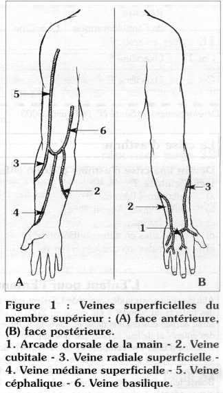
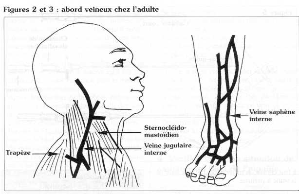
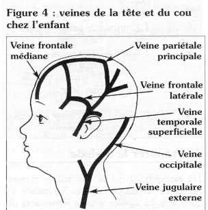
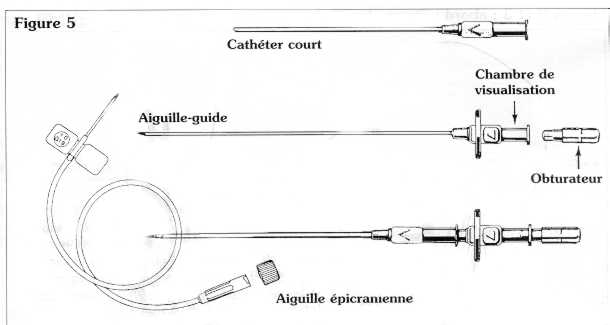
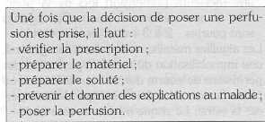
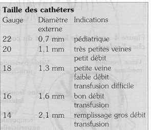
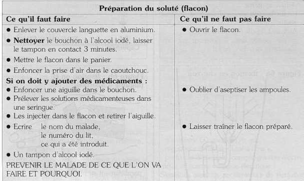
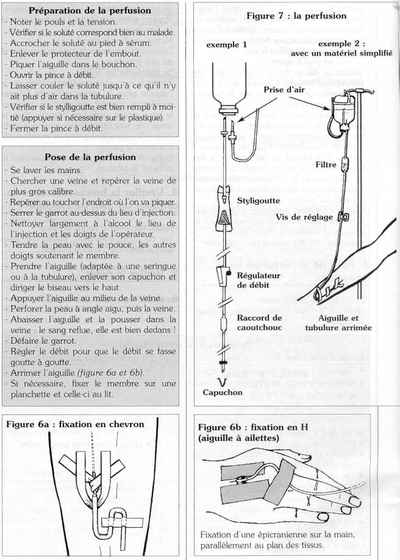
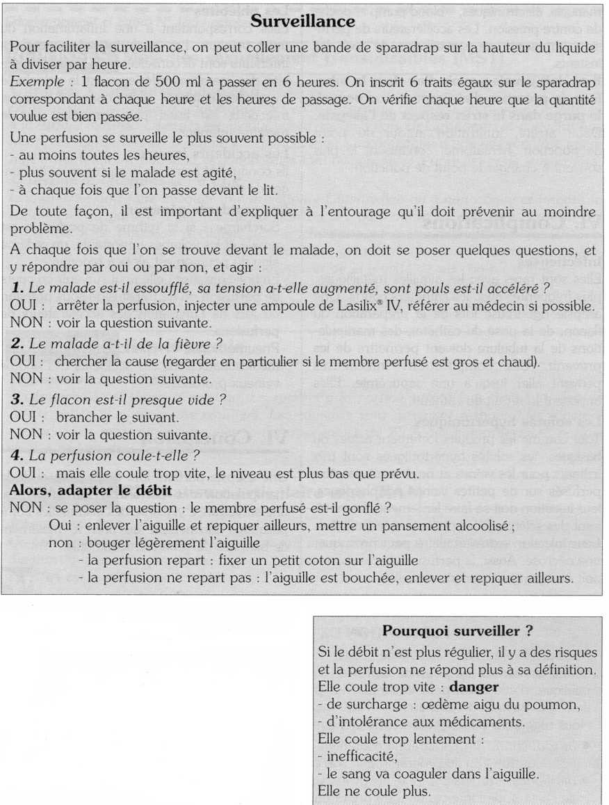

## I. Introduction

**Une perfusion intraveineuse** est une technique d'injection continue intraveineuse. Elle est justifiée lorsque l'on doit assurer

- une injection continue intraveineuse de quantités précises, souvent importantes, de médicaments, solutés, produits sanguins, dans un but thérapeutique ou diagnostique, à un rythme régulier, étalé dans le temps;

- des injections discontinues répétées, elle permet alors de respecter le capital veineux en évitant des ponctions veineuses répétitives.

**Pourquoi perfuse-t-on ?**

- Pour apporter de l'eau et des électrolytes (sel, potassium, etc.) en quantité précise

- rapidement : réhydratation, collapsus;

- étalée dans le temps : alimentation intraveineuse.

- Pour administrer un médicament rapidement et de façon continue : exemple Quinimax®.

**Que perfuse-t-on ?**

- Des solutés

- - isotoniques (de " concentration équivalente " au sang)
  - chlorure de sodium à 9 %o
  - sérum glucosé à 5 %
  - Ringer®, Lactate®, etc.

- De grosses molécules : Rhéomacrodex®, Dextran®, Plasmagel®.

- Du sang ou du plasma avec des précautions particulières.

- D'autres produits, plus rarement (hypertoniques contenant des acides aminés, des lipides, etc.).

## II. Les sites *(Figures 1, 2, 3, 4)*

Les perfusions intraveineuses peuvent se faire sur :

### 1. Des veines superficielles

- du membre supérieur : plexus veineux du dos de la main, veines basiliques, céphaliques, veines cubitales internes,
- du membre inférieur : saphène interne
- des veines temporales et veines du scalp chez le nourrisson, veines jugulaires externes.

### 2. Des veines profondes

Jugulaires internes, sous-clavières, fémorales, basiliques, sinus longitudinal, voire veine ombilicale chez le nouveau-né.

Les abords veineux profonds sont réalisés par des médecins expérimentés. Un cathéter placé dans la veine cave permet la surveillance de la pression veineuse centrale. Les veines fines n'assurent pas un débit important. Il vaut mieux éviter de poser un abord veineux à proximité d'une articulation. Le choix d'un tel site expose au risque de transpercer la veine, de perfusion extravasculaire et d'irrégularité de débit lors de flexion du bras, l'immobilisation du membre perfusé est alors nécessaire. Le respect du capital veineux impose de commencer les ponctions par les veines les plus distales.

## III. Matériel *(figure* 5)

### 1. Les aiguilles

- Aiguilles classiques à biseau court.

- Aiguilles à ailettes ou " épicrâniennes " (pour les petites veines) conçues à l'origine pour les veines du scalp du nourrisson et du nouveau-né. La présence d'ailettes permet une meilleure préhension lors de la ponction, et une meilleure fixation. Ces aiguilles sont courtes : 2 à 3 cm, à biseau court.

Les aiguilles métalliques imposent, en général, une immobilisation du membre perfusé et des perfusions de courte durée. Leur utilisation au pli de flexion est à éviter : risque de transpercer la veine. Le risque infectieux est réduit.

### 2. Les cathéters

- Les cathéters courts en chlorure de polyvinyle ou polyéthylène, mais surtout en téflon. Ils possèdent une aiguille-guide interne, leur longueur est de 4 à 8 cm, le diamètre externe de 0,7 à 2 mm. Ils permettent des perfusions de longue durée (une semaine).

- Les cathéters longs réservés aux abords profonds.

Il faut choisir un matériel adapté à la taille de la veine à perfuser.

### 3. La tubulure de perfusion

En matière plastique, stérile, elle comprend :

- une prise d'air séparée ou incorporée au dispositif,
- un styligoutte, de préférence avec filtre associé pour les produits sanguins,
- un régulateur ou une pince pour régler le débit,
- un dispositif permettant les injections intraveineuses directes au cours de la perfusion.

## III. Technique

La voie percutanée est la plus courante. Dans certains cas, on peut avoir recours à une dénudation : il s'agit alors d'un acte chirurgical à ne faire qu'exceptionnellement (échec de la voie percutanée) car, respectant moins le capital veineux.

### 1. Préparer le malade

Lui expliquer ce qui va être fait, le rassurer, demander sa coopération (si le malade est conscient), lui signaler certains événements : fin d'un flacon, débit, infiltration autour du point de ponction. Rapprocher les effets personnels du malade si une immobilisation est nécessaire. Examiner et choisir le site de ponction.

### 2. Préparer le matériel

Le geste doit être effectué avec une **asepsie** **rigoureuse.**

- Prévoir un plateau. Sur le plateau : compresses ou coton et antiseptiques (alcool iodé, alcool à 70° ... ), aiguilles, cathéters courts stériles, seringue (dont on aura vérifié l'adaptabilité avec les aiguilles), garrot, matériel de fixation (sparadrap), ciseaux, matériel d'immobilisation (attelle ou une bande de gaze avec une planchette pour fixer le membre).

<!-- -->

- Prévoir un pied à sérum.

- Vérifier le flacon ou la poche : date de péremption, intégrité (s'assurer qu'il n'a pas été ouvert), correspondance avec le malade.

- Vérifier la prescription.

- Après désinfection du bouchon, enfoncer la prise d'air, enfoncer la tubulure. Si des solutés sont à rajouter au flacon de perfusion, éviter les effractions multiples du bouchon.

- Fermer le régulateur de débit, placer le flacon sur le pied à sérum, remplir la chambre du styligoutte en la comprimant légèrement, sans la noyer, ce qui empêcherait de pouvoir compter les gouttes.

- Oter le capuchon protégeant l'embout terminal, ne pas toucher cet embout, purger la tubulure et remettre le capuchon.

La perfusion doit être mise en place rapidement.

### 3. Pose de la perfusion au lit du malade

- Noter le pouls et la tension.
- vérifier si le soluté préparé correspond bien au malade.
- Se laver les mains.
- Repérer soigneusement au toucher l'endroit où l'on va piquer.
- Mettre en place le garrot.
- Désinfecter largement la zone de ponction et ne plus y toucher.
- Se désinfecter les doigts.
- Tendre la peau et immobiliser la veine ; tenir l'aiguille entre le pouce et l'index (ailettes repliées, si matériel avec ailettes), pénétrer le plan cutané, enfoncer l'aiguille dans la veine : on sent une résistance vaincue et du sang reflue dans la chambre de visualisation.
- Desserrer le garrot.
- Brancher la tubulure, fixer soigneusement le cathéter, la tubulure.

### 4. Vérifier la bonne situation du cathéter ou bien de l'aiguille

- reflux, bon débit = bonne situation
- pas de débit, infiltration, hématome, douleurs = mauvaise position possible.

### 5. Régler le débit

### 6. Jeter le matériel souillé

## V. Surveillance

**Le débit**

1 ml de soluté correspond à 20 gouttes.

Exemple : un flacon de 500 ml à passer en 6 heures, soit 360 minutes : le débit sera de

500x20
