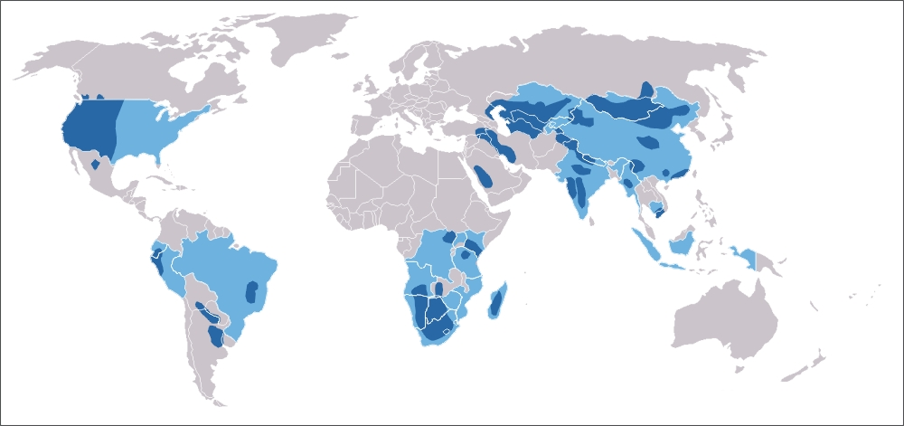
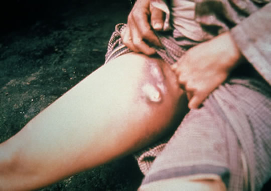
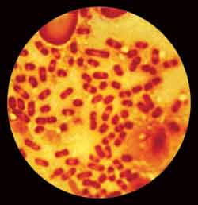

## I. Madagascar : un foyer permanent

Une épidémie de peste a débuté fin aout 2013 à Madagascar dans la région des hauts plateaux et s’est rapidement répandue dans l’île, ayant atteint 189 personnes dont 47 sont décédées. Mais en fait, la peste est connue depuis très longtemps à Madagascar où elle a été introduite en 1898 par les rats d’un navire marchand chargé de riz, en provenance de Bombay. Les premiers cas sont apparus à Antananarivo, puis la peste s’est décalée vers les hauts plateaux  du centre où elle persiste depuis à bas bruit (figure 1), le climat relativement frais et la promiscuité en ayant favorisé la transmission interhumaine.

**Figure 1. La peste à Madagascar**

    

Cependant, quelques épidémies sont survenues sporadiquement, comme en 1933 (responsable de 3 000 décès). D’autres épidémies sont apparues en 1978 à Antananarivo et en 1997 à Majunga. La peste sévit toujours actuellement dans différents pays du monde (figure 2), avec une mortalité non négligeable (figure 3), mais la moitié des cas mondiaux sont localisés à Madagascar.

**Figue 2. La peste dans le monde**

**Figure 3. Morbidité et mortalité de la peste dans le monde**

## II. Le vecteur : la puce

La peste est une zoonose due à une bactérie, Yersinia pestis, découvert par Alexandre Yersin en Chine, en 1894 (figure 4).

**Figure 4. A. Yersin devant son laboratoire de Hong-Kong**

Ce bacille, Gram négatif, aéro-anaérobie facultatif, est très résistant dans la nature, peut rester plusieurs jours dans un organisme en décomposition et peut survivre dans les terriers des rongeurs infestés. _Y. pestis_, dont le séquençage du génome, réalisé en 2001, a détecté plus de 4 000 gènes codant des protéines, est transmis par un vecteur, une puce du rat, _Xenopsylla cheopis_ (figure 5) qui s’est préalablement contaminée en piquant l’animal réservoir, à savoir le rat noir (Rattus rattus) (figure  6).          

                                             

**Figure 5. _Xenopsylla cheopis_, la puce du rat                                       Figure 6. _Rattus rattus_**

Après ingestion du sang contaminé, le bacille se multiplie et bloque la digestion de la puce, qui doit dégorger pour pouvoir se nourrir de nouveau. Ce liquide de régurgitation contient les bacilles qui sont donc inoculés à l’homme au moment de la piqûre. Après inoculation, les bacilles se multiplient au point d’inoculation puis migrent dans les voies lymphatiques et gagnent les ganglions satellites, formant une adénite suppurée. Puis ils diffusent dans l’ensemble de l’organisme où ils se multiplient dans les macrophages. Les puces piquent préférentiellement les rongeurs, mais comme ces derniers meurent vite et en grand nombre, les puces sont obligées de chercher de nouvelles réserves de sang et se rabattent sur les animaux domestiques et l’homme.

## III. Une affection polymorphe

La peste se présente sous trois formes qui peuvent se succéder dans le temps.

### 1. La peste bubonique

C'est la plus fréquente. Une semaine après l’inoculation, le patient présente une fièvre élevée, des frissons, des vertiges et une sensation de malaise. L’examen clinique retrouve une adénopathie inflammatoire, œdémateuse (ou bubon) et très douloureuse à la palpation. Ce bubon est le plus souvent inguinal (figure 7) en raison des piqûres de puces au niveau des jambes ou parfois dans la région axillaire. Sans traitement, l’évolution est  souvent mortelle en quelques jours, mais certains patients peuvent en guérir spontanément avec une longue convalescence.

**Figure 7. Bubon pesteux**

### 2. La peste septicémique

Ellesurvient dans environ 20 % des cas, est une complication de la forme bubonique, due à une grande multiplication des bacilles qui se répandent dans la circulation. Cette forme est particulièrement grave.

### 3. La peste pulmonaire

Observée dans environ 20 % des cas, elle est due à une contamination directe par voie aérienne, par l’expectoration contenant des bacilles. Une pneumopathie aiguë s’installe en quelques heures dans un tableau de choc septique d’évolution mortelle en quelques jours par œdème pulmonaire et défaillance respiratoire aiguë.

## IV. Diagnostic

Le diagnostic est établi sur la mise en évidence du bacille de Yersin dans le pus du ganglion, dans l’expectoration ou dans le sang. Au microscope, il apparaît conne un bâtonnet de 1 à 3 microns de long x 0,5 à 0,8 microns de large, Gram négatif, avec une coloration bipolaire (figure 8). Le test de recherche d’antigène F1 permet de faire un diagnostic rapide. Les prélèvements d’un patient atteints de peste sont très contagieux et doivent être manipulés avec d’extrêmes précautions.

**                                Figure 8. _Yersinias pestis_**

                 

## V. Traitement : croyances populaires puis antibiotiques

Dans l’Antiquité, Hippocrate recommandait d’allumer des feux dans les places publiques pour « brûler les miasmes ». Au Moyen-âge, le traitement des sujets pestiférés se limitait à des prières à St Roch (patron des pesteux et d’ailleurs toujours représenté avec un bubon) (figure 9), des processions, des flagellations et le bûcher pour quelques personnes (les hérétiques et les lépreux) soupçonnées de propager la maladie (figure 10).

          

**Figure 9. Saint Roch                      Figure 10. Processions pour invoquer la protection divine contre la peste**

Les classiques purges et saignées aggravaient le patient au lieu de le soulager. A partir du XVIème siècle, les patients sont isolés, leurs habitations subissent des fumigations et les morts sont incinérés. La mise en quarantaine des navires ayant à bord un patient suspect d’avoir une peste a permis d’éviter la propagation de la maladie dans les ports puis dans les autre villes. Tout manquement à cette règle pouvait être responsable d’une épidémie (comme dans le cas de la peste de Marseille en 1720) (figure 11).

                          

                          ** Figure 11. Epidémie de peste à Marseille (peinture de M. Serre)  **

<table>

<tbody>

<tr>

<td>

A l’époque, les médecins s’occupant de la peste étaient  
revêtus d’une cape et la figure était cachée par un masque  
à bec de canard contenant des plantes aromatiques  
clou de girofle, romarin) (figure 12). Ce masque, mis au point  
par Charles de Lorme, médecin de Louis XIII, permettait  
de mieux supporter l’odeur de la mort et une éponge imprégnée  
de différents vinaigres et placée devant la bouche devait éviter  
une contamination. Les notions d’odeur étaient importantes et,  
selon la tradition, les palefreniers, les chevriers et les porteurs d’huile étaient épargnés  par les puces qui ne supportent  
pas ces odeurs.

</td>

<td>

Figure 12.  
Costume des médecins luttant contre la peste (XVIIIème siècle)

</td>

</tr>

</tbody>

</table>

### L’antibiothérapie

Le traitement de la peste repose sur l’antibiothérapie, par voie orale ou parentérale, le bacille étant sensible à pratiquement tous les antibiotiques (aminosides : cyclines, gentamicine, kanamycine), quinolones, rifampicine, triméthoprime-sulfaméthoxale), sauf aux béta-lactamines.

Maladie à déclaration obligatoire (n° 9) car ayant un potentiel épidémique, les cas de peste doivent être déclarés à l’ARS, qui avertit alors la Direction Générale de la Santé pour déclencher le plan Biotox (diagnostic confirmé, enquête sur la source et les sujets contacts, limitation des déplacements, antibioprophylaxie de l’entourage par cyclines ou rifampicine, désinsectisation, dératisation). Il n’existe ni vaccin ni chimioprophylaxie.et la lutte contre les rats et les puces est difficile, d’autant plus que les puces se retrouvent souvent dans les terriers des rongeurs.