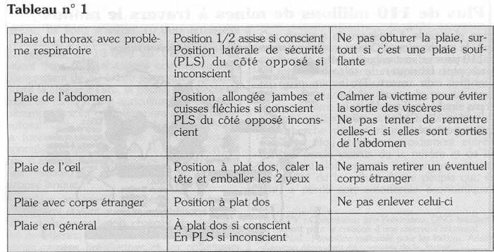

La peau est un revêtement protecteur du corps, c'est une véritable enveloppe. Celle-ci, fragile, est souvent endommagée par les actes de la vie courante. Ces atteintes peuvent revêtir des aspects différents et présenter ou non des facteurs de gravité, mais il faudra toujours redouter le tétanos. On distingue les plaies simples et les plaies graves.

## I. Les plaies simples

Ce sont des atteintes superficielles (petite éraflure, coupure légère, piqûre non profonde) ne saignant pas ou peu et qui ne siègent pas à côté d'un orifice naturel.

La conduite à tenir est simple :

*   se laver les mains ;
*   porter des gants de soins à usage unique ;
*   laver la plaie à l'eau et au savon ;
*   nettoyer ensuite à l'aide d'une compresse stérile imbibée d'un antiseptique non coloré en partant du centre de la plaie vers la périphérie ; assurer la protection par un pansement (compresse et sparadrap ou bandage pour une plaie superficielle mais étendue) dont la taille est adaptée aux dimensions de la lésion ; veiller à la vaccination antitétanique de la victime.

La plaie doit être surveillée afin de prévenir tout début d'infection (rougeur, chaleur, douleur, gonflement) qui doit amener à consulter un médecin. Il est par ailleurs conseillé de renouveler le pansement au bout de 24 heures.

## II. Les plaies graves

Toute plaie qui n'est pas une atteinte superficielle doit être considérée comme grave et être montrée à un médecin.

Les facteurs de gravité sont les suivants :

*   plaie hémorragique ;
*   plaie souillée avec présence ou non de corps étranger ;
*   plaie étendue et profonde ;
*   plaie dont le siège est l'oeil, le thorax, l'abdomen, le cou, le dos, la proximité d'un orifice naturel ;
*   plaie contuse à bords irréguliers ou déchiquetés.

Par ailleurs, l'âge (vieillards, nourrissons), l'état de santé, la non-vaccination contre le tétanos seront toujours des facteurs de gravité.

### La conduite à tenir consiste à :

Evaluer l'importance du saignement,

Installer la victime dans la position adaptée (_cf. tableau n° 1_).

*   Oxygéner le patient si on dispose d'une source d'oxygène.  
*   Faire un bilan complet de la victime.  
*   La plaie est protégée au moyen d'un emballage stérile : compresses maintenues à l'aide de bandes ou de triangles de toile, voir si la surface est importante à l'aide d'un drap stérile.  
*   La victime est adressée à un médecin le plus rapidement possible.

_Développement et Santé, n°133, février 1998_