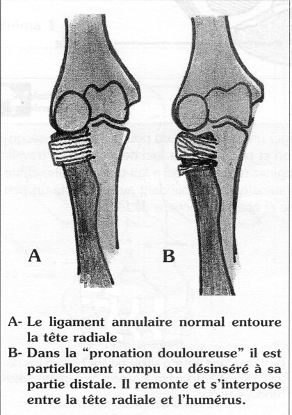
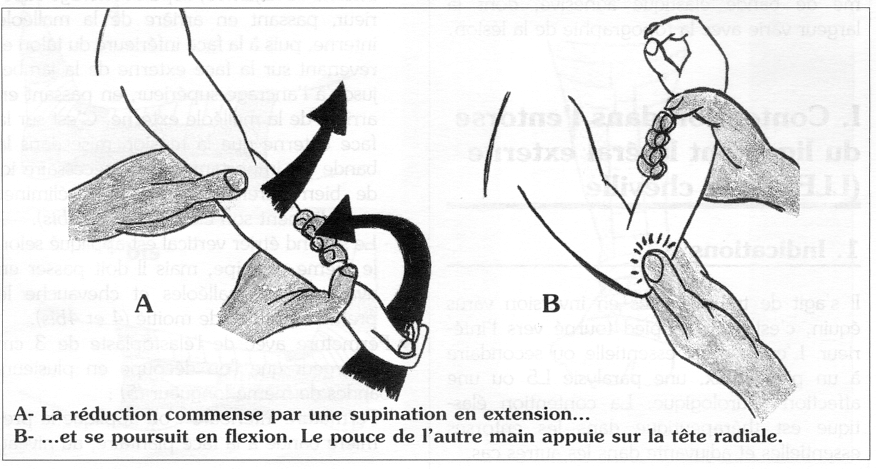
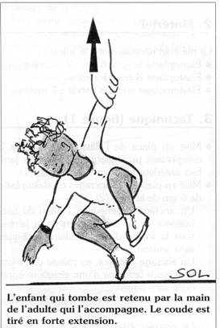

## **I. Mécanisme et lésion**

Un traumatisme mineur est toujours à l'origi­ne de la pronation douloureuse. C'est une traction un peu brusque sur la main alors que le coude est en extension et que l'avant-bras, la main, sont en pronation.

Le ligament annulaire qui fait le tour de la tête radiale reste inséré par ses deux extrémités au cubitus mais il se détache partiellement du radius : il peut alors remonter et s'interposer entre la tête radiale et le condyle huméral. Tant que le ligament annulaire n'a pas repris sa place normale, la pronation reste douloureuse.

## **II. Tableau clinique**

Un jeune enfant arrive aux urgences : il a (ou elle a, car c'est plus souvent une fille qu'un garçon) entre 2 et 4 ans, encore que ces limites d'âge ne soient pas strictes. Il est cependant exceptionnel de voir un enfant de plus de 5 ans ou de moins de 1 an avec une pronation douloureuse.

Il souffre dès qu'il veut se servir de sa main et il la soutient avec sa main saine, gardant le coude également douloureux à demi fléchi. D'autres enfants laissent leur coude étendu pendre le long du corps. Dès que l'on essaie de bouger son coude ou sa main pour les examiner, l'enfant pleure et se défend. Il souffre et regarde son coude ou son poignet lorsqu'on lui demande de montrer là où il a mal.

Cependant, il n'y a aucune défor­mation, aucun gonflement de la racine à l'extrémité du membre supérieur douloureux.

L'enfant est en bonne santé, il n'a pas de fièvre.

Tout ceci rend peu probable une frac­ture ou une infection osseuse ou articulaire. En reprenant doucement l'examen tout en essayant de distraire l'enfant et de le rassurer, en le laissant assis sur les genoux de la per­sonne qui l'a accompagné, on remarque que la mobilisation de l'avant-bras en pronation ou en supination est douloureuse. Le doigt qui remonte le long du radius depuis le poignet provoque une douleur juste au-dessous du coude. Si l'on apprend que la douleur a été provoquée par une brusque traction sur la main de l'enfant pour lui éviter une chute ou pour le forcer à marcher plus vite, la prona­tion douloureuse est certaine. La personne qui donnait la main à l'enfant a parfois senti un déclic au moment du geste malheureux.

Une radiographie ne montrerait rien d'anor­mal. Elle n'est utile que si l'on garde un doute d'une fracture tassement du radius distal, ou d'une fracture sans déplacement des dia­physes de l'avant-bras.

## **III. Le traitement**

Il est très simple, mais un peu douloureux. Comme le succès n'est pas toujours acquis dès la première tentative de réduction, il est sage de faire inhaler à l'enfant quelques bouffées d'Antonox.

Pour que le ligament annulaire regagne son emplacement anatomique, il faut porter l'avant-bras en flexion et en supination. On le fait assez rapidement tout en appuyant de dehors en dedans sur la tête radiale. Si l'on perçoit une sorte de déclic, c'est que la réduc­tion est obtenue, mais ce déclic n'est pas constant, même en cas de succès. Dans l'in­certitude, on refait une deuxième fois le mou­vement de réduction en essayant d'obtenir une flexion complète en supination.

Seule la disparition de toute douleur, le retour à une mobilité spontanée de la main et de l'avant­bras peut rassurer tout le monde.  
Il faut donc garder l'enfant quelques 10 à 15 minutes dans la salle d'attente avant de le laisser repartir à la maison. Les parents doivent être bien avertis du risque de récidives, mais aussi de la béni­gnité de cette pronation douloureuse. Il n'y a jamais de séquelle, de raideur ni de douleur.

C'est uniquement dans les cas de récidives multiples, prouvant une certaine instabilité du ligament annulaire qu'une immobilisation du coude à angle droit par une écharpe ou une attelle plâtrée pendant 2 à 3 semaines est justifiée.

_Développement et santé, n°184, 2006_