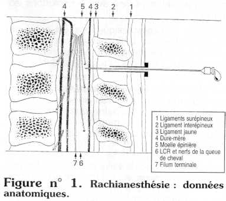
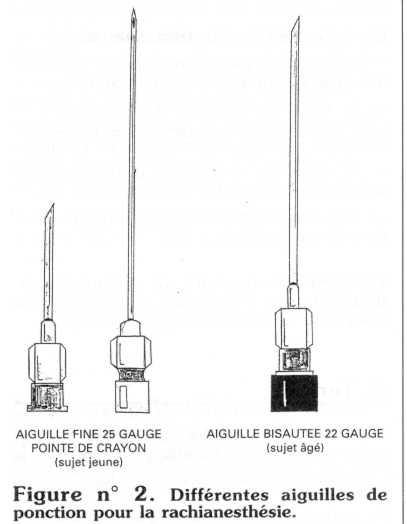
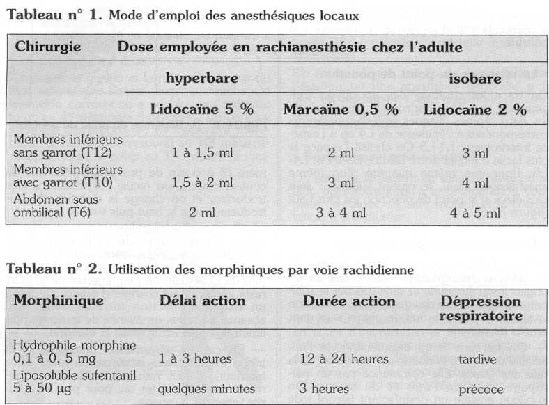
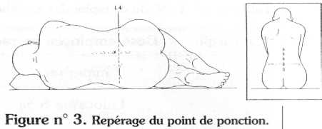
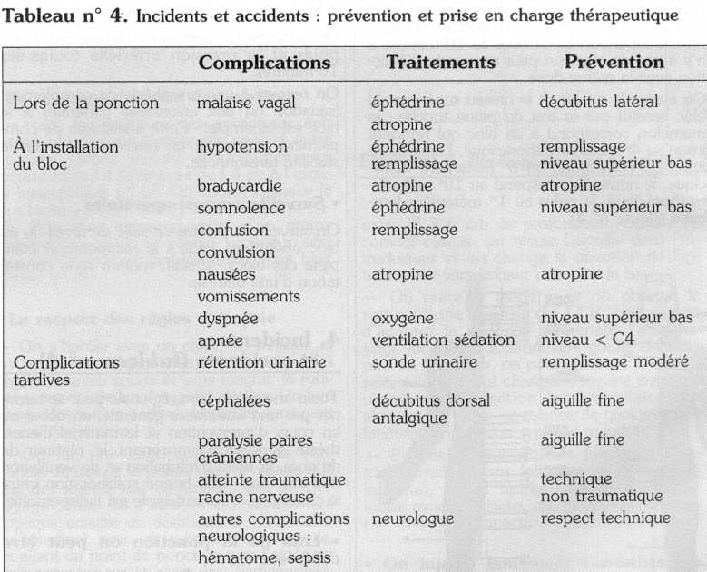

La rachianesthésie est une ponction lombaire avec administration d'un anesthésique local dans le liquide céphalorachidien (LCR). C'est une technique d'anesthésie simple et fiable particulièrement indiquée dans des conditions précaires, en l'absence d'oxygène, situation fréquente dans les centres de santé périphériques en Afrique, par exemple.

La rachianesthésie réalise une section chimique ou bloc des racines rachidiennes motrices, sensitives et sympathiques de la moelle. Le niveau supérieur du bloc, déterminé par la distribution de l'anesthésique local dans le LCR, avant sa fixation sur les racines, dépend de la technique d'injection (niveau de ponction, vitesse d'injection, position du patient), de la solution injectée (volume, gravité), du patient (âge, taille, poids). Le bloc sympathique, plus étendu que le bloc sensitivo-moteur, entraîne une vasodilatation constante et peut avoir un retentissement cardiaque, respiratoire, neurologique et digestif, s'il est trop étendu.

Sur le plan anatomique, les vertèbres et les ligaments vertébraux avec, de la profondeur à la superficie, le ligament jaune, le ligament interépineux, et le ligament susépineux, forment le canal ostéoligamentaire du rachis qui contient le sac dural, limité par les méninges. L'espace sous-arachnoïdien, entre l'arachnoïde et la pie-mère en continuité avec les ventricules cérébraux, se termine en cul-de-sac au niveau de S2. Il contient le LCR et des structures nerveuses avec la moelle jusqu'à L2, puis la queue de cheval et le filum terminale d'où naissent les racines rachidiennes qui quittent le sac dural par les trous de conjugaison *(figure n° 1).*

## I. Indications

### 1. Chirurgie

- **La chirurgie des membres inférieurs** (orthopédique et vasculaire)

- **La chirurgie abdominale sous-ombilicale**

Les indications les plus fréquentes sont :

- la chirurgie de paroi (cure de hernie et d'éventration) et la chirurgie colique (colostomie) ;
- la chirurgie obstétricale (césarienne et GEU non rompue) et gynécologique (hystérectomie, salpingectomie, kystes de l'ovaire) ;
- la chirurgie urologique (prostatectomie voies haute et basse) ;
- la chirurgie proctologique (fissure anale et cure d'hémorroïdes) ;
- **exceptionnellement, la chirurgie abdominale sus-ombilicale,** où elle doit être associée à une anesthésie générale légère.

### 2. Terrain

Ce sont les opérés présentant une contre-indication à l'anesthésie générale ou des facteurs de risques : antécédents cardiaques, respiratoires, hépatiques, rénaux, métaboliques (diabète).

En pratique, le bénéfice escompté du maintien de la vigilance et la plus grande sécurité pendant l'intervention et en postopératoire immédiat autorisent à élargir l'indication à tous les patients, lors d'une anesthésie dans des conditions précaires.

## II. Contre-indications

### 1. Les contre-indications absolues sont

- l'hypovolémie non corrigée,
- les troubles de la coagulation,
- le sepsis au point de ponction,
- le refus du patient.

### 2. Les contre-indications relatives sont

- un déficit neurologique, un terrain migraineux et les maladies médullaires,
- un syndrome fébrile,
- les sujets jeunes car les céphalées post-ponction sont plus fréquentes si l'on ne dispose pas d'aiguilles fines (25G) à biseau de type pointe crayon ou à orifice latéral (*figure* *n° 2).* À défaut d'aiguilles fines, on préconise un décubitus dorsal strict de 24 heures en postopératoire,
- les malformations rachidiennes, les antécédents de sciatique ou de lombalgie.

## III. Technique

### 1. Préparation à l'anesthésie

#### a. Consultation pré anesthésique

Au décours de la consultation il faut poser l'indication, en fonction du terrain et de la chirurgie en éliminant les contre-indications. On examine l'état cutané. Il faut informer le patient des risques et des bénéfices de la technique et obtenir son consentement, ce qui est médicolégal en France, en tenant compte du contexte socioculturel pour ne pas effrayer le patient.

#### b. Prémédication

L'association atropine-diazépam est habituelle. L'administration d'atropine (1/2 mg chez l'adulte) est systématique en l'absence de scope pour prévenir un malaise vagal. Elle peut être faite sur table en intraveineux direct.

#### c. Préparation du matériel

Le matériel stérile nécessaire à la rachianesthésie comprend :

- une aiguille à rachianesthésie : de 1ère intention on utilise une aiguille fine d'un diamètre de 25 gauges (0,5 mm) à biseau de type pointe de crayon pour prévenir les céphalées post-ponction. Une aiguille de 22 G (0,8 mm) est parfois nécessaire et on peut la proposer à ceux qui débutent ou qui pratiquent la technique de façon occasionnel_le (figure n° 2),\_
- un introducteur est nécessaire si on utilise une aiguille de 25 G,
- deux seringues de 5 ml, et deux aiguilles sous-cutanées pour prélever les produits et faire l'anesthésie locale cutanée,
- un champ de table, des compresses, une cupule pour l'antiseptique et une paire de gants,
- un pansement occlusif.

#### d. La préparation des médicaments anesthésiques et de réanimation

*Un anesthésique local, pour la rachianesthésie,* le plus souvent de la lidocaïne 5 % hyperbare, ou de la bupivacaïne 0,5 % hyperbare. On peut utiliser de la lidocaïne 2 % ou de la bupivacaïne 0,5 % isobare rendu hyperbare par l'adjonction de glucose à la concentration de 5 à 10 %. Une solution hyperbare permet de mieux contrôler le niveau supérieur d'anesthésie en jouant sur la position de l'opéré. Il existe une relative imprévisibilité du niveau sensitif supérieur avec les solutions isobares.

Le choix de l'anesthésique local est guidé par la durée d'action, la lidocaïne pour des actes d'une durée inférieure à 1 heure trente et la bupivacaïne pour des actes d'une durée de 2 à 4 heures.

Le choix du volume d'anesthésique local est conditionné par le niveau d'anesthésie souhaité. Il est, selon que l'on souhaite une anesthésie des membres inférieurs ou abdominale sous-ombilicale, de 1,5 à 2 ml pour la lidocaïne à 5 % ou de 2 à 4 ml pour la bupivacaïne à 0,5 %. Les facteurs liés au patient sont l'âge, la taille et le poids. En pratique on diminue le volume de 25 % chez l'obèse et la parturiente ; chez l'enfant on se base sur la taille et le poids *(tableau n° 1).*

La quantité de produit administré qui dépend de la concentration et du volume conditionne la durée du bloc. L'administration de 5 ml de lidocaïne à 2 % isobare aura une durée d'action équivalente à l'administration de 2 ml de lidocaïne à 5 % hyperbare.

*Un adjuvant peut être injecté avec l'anesthésique local pour améliorer* *la qualité du bloc.*

- La morphine sans conservateur à la dose de 0,1 à 0,2 mg, a un délai d'action de 30 à 90 minutes et donne une analgésie de 12 à 24 heures mais il existe un risque de dépression respiratoire, de prurit et de globe vésical. D'autres morphiniques, le fentanyl - 10 à 50 microgrammes - et le sufentanil - 1 à 5 microgrammes - peuvent être utilisés. Ils ont un délai (quelques minutes) et une durée d'action (3 à 6 heures) plus brefs pendant lesquels peuvent survenir les mêmes effets secondaires *(tableau n° 2).*
- L'adrénaline à la dose de 0,2 mg (1 à 5 microgrammes/kg) augmente la durée du bloc sensitif de 50 %.

*Un anesthésique local (lidocaïne à* 1 ou *2 %) pour l'anesthésie cutanée.*

*Les médicaments - atropine, éphédrine ou* *adrénaline* - et le matériel nécessaire (produits anesthésiques et plateau d'intubation) pour une réanimation en urgence.

L'éphédrine si on en dispose ou l'adrénaline parfois plus facile à trouver peuvent être administrées à visée préventive par voie sous-cutané (30 mg éphédrine), ou à visée curative par vole intraveineuse en bolus itératifs de 6 mg pour l'éphédrine et de 0,1 mg pour l'adrénaline.

#### e. La préparation de l'opéré

On prend un pouls et une tension artérielle initiale et si on en dispose on installe un scope et un oxymètre de pouls. On met en place une voie veineuse de bon calibre (cathlon de 18G) et on fait un remplissage par 500 à 1 000 ml de cristalloïdes (sérum physiologique ou ringer lactate).

Il est important de travailler dans une ambiance calme et sereine en expliquant les gestes que l'on fait et en gardant un contact verbal avec le patient.

### 2. Réalisation de la rachianesthésie

#### a. L'installation du patient le "dos rond" avec un aide

- soit assis, les avant-bras fléchis en appui sur les cuisses,
- soit en décubitus latéral couché sur le côté à opérer, la tête et les genoux ramenés sur la poitrine.

#### b. Le repérage du point de ponction

On trace les contours des apophyses épineuses et une ligne horizontale passant entre les deux épines iliaques antéro-supérieures correspondant à l'épineuse de L4 ou à l'espace interépineux L4-L5 On choisit l'espace le plus facile à piquer entre L2-L3, L3-L4 et L4-L5. Pour une même quantité d'un même anesthésique local, le niveau supérieur sera plus élevé si le point de ponction est plus haut *(figure n° 3).*

#### c. Le respect des règles d'asepsie

- On s'habille avec un calot, un masque et on se lave chirurgicalement les mains et les ongles jusqu'au coude et sans toucher le robinet avant de mettre des gants stériles. Un bon lavage des mains permet de piquer sans gant en cas de pénurie.
- On fait une large désinfection de l'ensemble du dos de la pointe des omoplates à la raie des fesses. Elle commence par un nettoyage avec de l'eau et du savon. On applique ensuite un désinfectant (alcool iodé ou bétadine), avec un mouvement en spirale, en allant du point de ponction vers l'extérieur sans repasser sur la zone déjà badigeonnée, que l'on prend le temps de laisser sécher ou que l'on essuie avant ponction.
- On met en place un champ stérile sur l'ensemble du dos, si on en dispose.
- L'anesthésie locale par un bouton intradermique avec 1 ml d'anesthésique local au milieu de l'espace choisi puis en injectant la lidocaïne à 2 % sur une profondeur de 2,5 à 3 cm. L'anesthésie locale est préconisée car elle permet de réaliser une ponction indolore.

#### d. La ponction lombaire

La ponction lombaire se fait sur la ligne médiane, au ras du bord inférieur de l'épineuse supérieure en deux temps :

- On met en place l'introducteur perpendiculaire au plan cutané sans dépasser une profondeur de 2-3 cm. En cas de contact osseux, on dirige l'introducteur vers le haut (contact en profondeur avec l'épine sous-jacente) puis vers le bas (contact superficiel avec l'épineuse sus-jacente).
- On introduit l'aiguille à rachianesthésie dans l'introducteur et on progresse jusqu'à rencontrer une résistance qui correspond à la traversée du ligament jaune ou de la dure-mère (3 à 6 cm de profondeur). En cas de contact osseux, on recule l'aiguille dans l'introducteur et on change la direction de l'introducteur vers le haut puis vers le bas.
- On retire le mandrin et on observe le reflux d'une goutte de LCR clair avant d'adapter la seringue contenant l'anesthésique local. S'il apparaît une goutte de sang puis du LCR clair, on peut injecter ; si le LCR reste teinté, il faut changer d'espace car il y a un risque d'injection intravasculaire. En absence de reflux on avance de quelques millimètres, après avoir remis le mandrin.

En cas de paresthésies (décharge électrique irradiant vers la cuisse ou le membre inférieur), il faut retirer l'aiguille d'un millimètre avant d'injecter ou, pour plus de sécurité, changer d'espace.

**On injecte lentement l'anesthésique local** (1 ml toutes les 3 secondes)

Pendant l'injection, l'aiguille doit être immobilisée par une main en appui sur le dos.

On peut vérifier la bonne position de l'aiguille en aspirant du LCR avant et en cours d'injection.

**On installe le patient en décubitus dorsal avec la tête surélevée**

### 3. Surveillance per- et postopératoire du patient

Elle permet de prévenir, détecter et corriger précocement les incidents et accidents liés à l'anesthésie rachidienne. Elle est notée sur la feuille d'anesthésie.

#### a. Surveillance de l'installation du bloc

Le malade ressent une impression de chaleur dès l'injection, puis le bloc sympathique, sensitif et moteur s'installe. Pendant les 10 premières minutes, la position proclive (tête en haut) ou déclive (tête en bas) de la table d'opération permet de moduler le niveau supérieur du bloc s'il s'agit d'une solution hyperbare. La position proclive limite l'extension alors que la position déclive élève le niveau supérieur. Si au bout de 10 minutes il n'y a pas de bloc, on peut renouveler l'injection avec la même dose.

On évalue la qualité et le niveau supérieur du bloc sensitif par le test du pique-touche :

- le mamelon correspond à un bloc qui remonte jusqu'au 4è métamère thoracique, l'appendice xiphoïde correspond au 6è métamère thoracique, le nombril correspond au 10è métamère thoracique, le pubis au 1er métamère lombaire *(figure n° 4).*

*On évalue le bloc moteur par la flexion des genoux et des orteils (tableau n° 3).*

*On surveille la conscience, la respiration, le pouls et la pression artérielle toutes les 3 minutes pendant l'installation du bloc (au moins 10 minutes) puis toutes les 10 minutes.*

#### b. Surveillance per-opératoire

On surveille la conscience, la respiration, le pouls et la pression artérielle toutes les 10 minutes.

On recourt à une anesthésie de complément (sédation ou une anesthésie générale) si le bloc est incomplet. Cette anesthésie de complément peut avoir un retentissement sur la stabilité tensionnelle.

#### c. Surveillance postopératoire

On surveille le patient en salle de réveil ou au bloc opératoire jusqu'à la récupération complète des blocs, sensitif, moteur et la constatation d'une diurèse.

### 4. Incidents et accidents (tableau *n° 4)*

Toute anesthésie loco-régionale peut se terminer par une anesthésie générale, en début ou en cours d'intervention et le matériel d'anesthésie générale comprenant le plateau de drogues, la boîte d'intubation et de ventilation doit être prêt. Une bonne collaboration entre le chirurgien et l'anesthésiste est indispensable.

#### a. Lors de la ponction, on peut être confronté à

- un échec de la ponction,

- une absence de bloc moteur et de bloc sensitif 10 minutes après l'injection. Cet échec peut être en rapport avec une dose insuffisante ou un produit inactif ce qui se produit parfois avec la lidocaïne,

- une ponction d'un vaisseau,

- un malaise vagal.

#### b. Lors de l'installation du bloc

En cas de bloc trop étendu, on peut observer un retentissement cardio-respiratoire, neurologique et digestif. Les effets secondaires les plus fréquents sont :

- Une hypotension parfois associée à une bradycardie est la complication la plus fréquente. Elle est liée à un bloc sympathique étendu quand le niveau est supérieur au 10è métamère dorsal, et doit être traitée par les vasopresseurs de façon titrée (éphédrine 6 mg/6 mg) et le remplissage. Le contrôle de la pression artérielle fait plus appel aux vasopresseurs qu'au remplissage dont l'excès peut être nuisible. En cas de bradycardie associée à l'hypotension on utilise l'atropine en 2e intention après les vasopresseurs. On distingue l'hypotension modérée facilement contrôlable et bénéfique pour la chirurgie, de l'hypotension sévère, souvent incontrôlée et dangereuse, qui peut se manifester par des troubles de la conscience (une somnolence, une agitation, ou des convulsions), des nausées et des vomissements.
- Un retentissement respiratoire avec une gêne à la toux quand le niveau est supérieur au 10è métamère dorsal, une dyspnée, voire une apnée associée à un collapsus en cas de rachianesthésie totale quand le niveau est supérieur au 4è métamère cervical. La rachianesthésie totale nécessite une ventilation assistée et un traitement par les vasopresseurs de l'hypotension.

#### c. Complications tardives, dominées par

La **rétention d'urine**, avec le globe vésical que l'on évacue par un sondage aller-retour en respectant impérativement les règles d'asepsie.

Les complications **neurologiques** avec les **céphalées** et les **déficits sensitivo-moteurs.**

- Les céphalées sont secondaires à la fuite de LCR par une brèche dure-mérienne qui peut entraîner exceptionnellement une paralysie des paires crâniennes (oculo-motrices et auditives). Des aiguilles fines constituent le meilleur moyen de prévention des céphalées. Leur fréquence et leur intensité diminuent chez les sujets âgés. Leur traitement repose sur le décubitus dorsal strict qui soulage la céphalée, les antalgiques (paracétamol et anti-inflammatoires non stéroïdiens) et les neuroleptiques et, en dernier recours, le *blood* *patch* (injection dans l'espace péridural de 20 ml de sang immédiatement après l'avoir prélevé au pli du coude du patient), technique très efficace qui sera faite par un médecin anesthésiste si la céphalée est persistante.
- Les déficits sensitivo-moteurs sont secondaires au traumatisme direct d'une racine par l'aiguille. L'évolution est spontanément favorable mais peut durer plusieurs semaines.

Les complications **infectieuses** : méningite et septicémie.

## IV. Quelques repères pour l'anesthésie médullaire

### 1. Quelle différence entre rachianesthésie (RA)

et anesthésie péridurale (APD)?

Dans la RA, l'injection doit se faire en dessous de la 2è vertèbre lombaire pour éviter tout contact de l'aiguille avec la moelle épinière qui s'arrête en L2.

Dans l'APD, l'injection se fait dans l'espace péridural entre la dure-mère, méninge adhérente à la vertèbre et le ligament jaune. Il n'y a jamais de contact avec la moelle épinière ce qui explique qu'une péridurale puisse se faire tout le long de la colonne vertébrale.

### 2. Pourquoi choisir une rachianesthésie plutôt qu'une péridurale ?

La **rachianesthésie** est une technique peu coûteuse et d'apprentissage aisé, qui a plusieurs avantages sur l'anesthésie péridurale :

- elle est plus facile à pratiquer, avec un taux de réussite plus important,
- le délai d'installation est plus court,
- le bloc sensitivo-moteur est plus important,
- la dose d'anesthésique local moins importante ce qui diminue le risque toxique des anesthésiques locaux.

L'**anesthésie péridurale** est une technique où la montée d'un cathéter péridural permet de faire des réinjections per-opératoires et d'assurer une analgésie de bonne qualité pendant les premiers jours postopératoires. Les indications de l'analgésie péridurale se limitent à la chirurgie thoracique et abdominale haute où elle permet une mobilisation précoce chez les patients à risque et nécessitant par exemple une kinésithérapie. Il existe des complications liées à la montée d'un cathéter (infection, mobilisation secondaire).

*Développement et Santé, n° 134*
