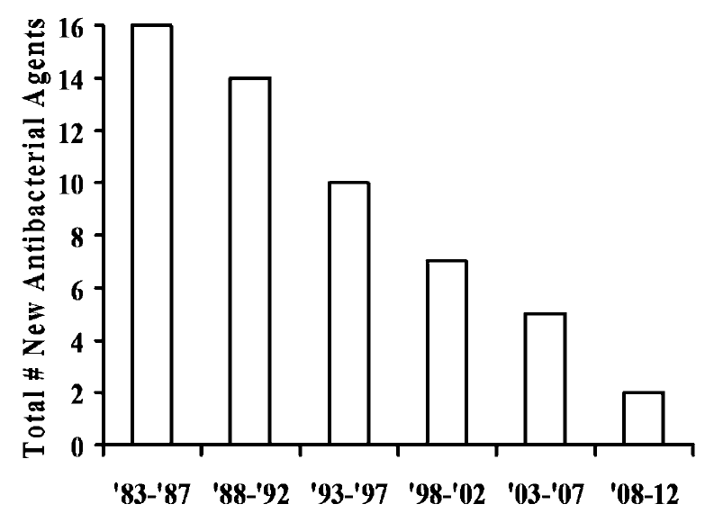
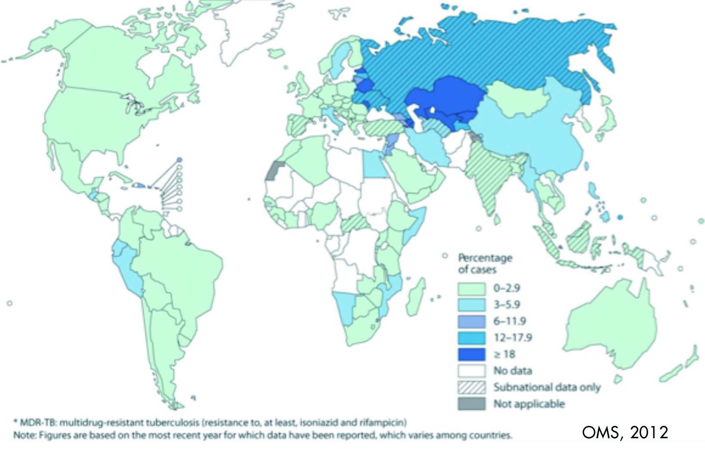
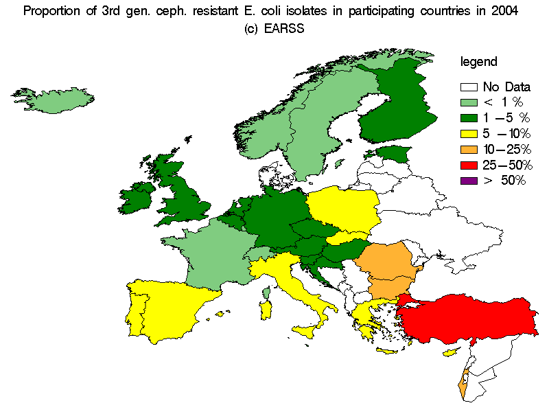
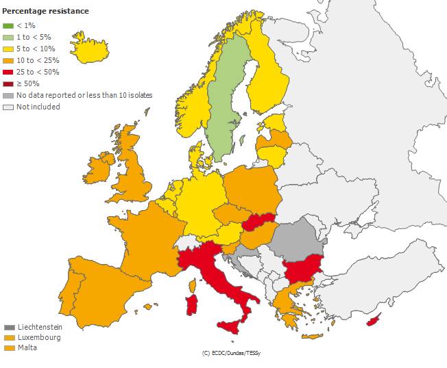
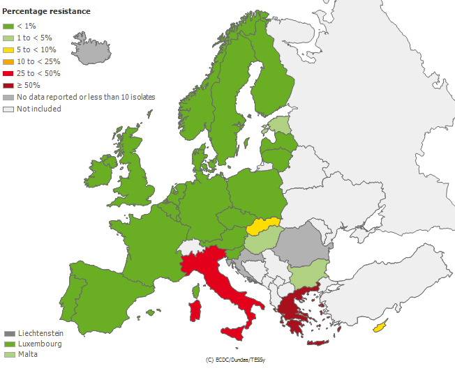

## Introduction

Les antibiotiques, qui ont sauvé tant de vies humaines et amélioré l’espérance de vie, risquent de devenir inefficaces en raison d’une inquiétante augmentation de la résistance des bactéries.

Ainsi, des échecs thérapeutiques surviennent déjà pour des infections pourtant banales, mais causées par des bactéries multirésistantes aux antibiotiques (BMR), voire résistantes à tous les antibiotiques. Ces échecs vont se multiplier, avec un risque de décès. Les antibiotiques sont des médicaments uniques car leurs cibles (les bactéries) sont des êtres vivants, capables de s’adapter en acquérant des mécanismes de résistance aux antibiotiques (mutations, acquisition de gènes de résistance). 

Malgré cette particularité unique en thérapie humaine, la prescription des antibiotiques reste totalement banalisée chez l’homme comme chez l’animal.

Il est ainsi urgent de protéger les antibiotiques (et les médicaments anti-infectieux de manière générale) de façon volontariste, comme on le ferait pour sauver des espèces en voie de disparition, dans l’état d’esprit d’un développement durable. Les antibiotiques sont des médicaments "à part" et doivent faire l’objet de prescriptions justifiées. Chaque prescription d’antibiotique doit être réfléchie,  en mettant en balance les effets bénéfiques pour le patient (qui restent bien sûr prioritaires s’il est bien atteint d’une infection bactérienne) et les effets néfastes à court terme : manifestations d’intolérance, d’allergies inacceptables si l’antibiotique n’est pas justifié ; à moyen terme sur l’écologie bactérienne par la sélection de BMR qui seront les bactéries responsables des infections du futur, y compris pour le malade traité.

Cette situation est rendue d’autant plus inquiétante que les nouveaux antibiotiques sont de plus en plus rares : entre 1983 et 1987, 16 molécules antibiotiques ont été mises à disposition, entre 1998 et 2002 seulement 7, et 2 entre 2008 et 2011 (figure 1).

**Figure 1. Evolution du nombre de nouveaux antibiotiques mis sur le marché.**

L’antibiorésistance existe également dans les pays en développement, même si l’ampleur du phénomène est moins bien connue faute de surveillance microbiologique.

La résistance aux antibiotiques constitue un défi majeur et permanent au niveau mondial, comme le souligne l’OMS.

## I. Mécanismes de la résistance

La pression exercée par une antibiothérapie adaptée, ou parfois inadéquate ou inutile, sur une population bactérienne peut induire la sélection de mutants et/ou révéler une population de bactéries déjà mutées et résistantes.

L’apparition de clones résistants est favorisée par des concentrations (posologies) trop faibles d’antibiotiques ou des durées de traitement trop courtes. Le mauvais usage des antibiotiques et le défaut de lutte contre les infections (hygiène…) favorisent la propagation de la résistance.

Le risque de sélection de résistance est plus fréquent pour certains antibiotiques : fluoroquinolones, rifampicine…

On distingue **2 types principaux de résistance** bactérienne : 

- La résistance d’origine chromosomique, qui résulte d’une mutation spontanée et reste en général limitée à une famille d’antibiotiques.
- La résistance d’origine extra-chromosomique qui correspond à l’acquisition de gènes de résistances transférables entre bactéries et codant souvent pour des résistances multiples.

Les différents mécanismes de résistance sont décrits dans l’[article sur les antibiotiques](http://devsante.org/base-documentaire/traitements-vaccins/antibiotiques-modes-daction-mecanismes-de-la-resistance) ([Antibiotiques : modes d'action, mécanismes de la résistance](http://devsante.org/base-documentaire/traitements-vaccins/antibiotiques-modes-daction-mecanismes-de-la-resistance)).

## II. Facteurs favorisant la résistance aux antibiotiques

### 1. Mauvais usage des antibiotiques dans les pays en développement

Les problèmes d’identifications bactériennes dus à l’équipement insuffisant des laboratoires rendent le diagnostic précis difficile face à une situation infectieuse. 

Beaucoup de traitements antibiotiques prescrits de façon empirique face à une infection virale ou parasitaire (paludisme) sont inadaptés et inutiles.

Les antibiotiques sont souvent utilisés pour une durée trop courte et/ou à une dose trop faible, parfois  pour des raisons économiques (problème du coût).

La qualité des antibiotiques est inégale : contrefaçons fréquentes ou utilisation de médicaments achetés « dans la rue » parfois à l’unité.

L’usage des antibiotiques est parfois mal contrôlé avec beaucoup d’automédications.

L’ensemble de ces phénomènes conduit à une augmentation des résistances qui est préoccupante.

### 2. Dissémination des bactéries résistantes

Elle se fait essentiellement par les contacts interhumains.

Ceux-ci sont favorisés par l’urbanisation croissante des pays en développement qui favorise la promiscuité, avec des conditions d’hygiène insuffisantes (manque d’accès à l’eau, défaut de système d’égout et d’hygiène fécale…) 

Les lieux de soins jouent également un rôle crucial. L’association de patients fragiles, d’une utilisation intensive et prolongée d’antimicrobiens avec des règles d’hygiène souvent déficientes favorise l’émergence et la dissémination de bactéries résistantes ou ultrarésistantes. Celles-ci sont responsables « d’infections nosocomiales » ou liées aux soins, difficiles à traiter ou à prévenir. Ces infections peuvent également devenir communautaires avec des germes résistants

La lutte contre ces infections nécessite une vigilance importante et surtout une implication de tous. 

Beaucoup de bactéries sont transmises par un défaut d’hygiène des mains. Certains gestes sont effectués avec une asepsie insuffisante ou avec du matériel mal stérilisé.

Certains malades porteurs de bactéries multirésistantes ou de tuberculose ne sont pas isolés.  

### 3. Usage des antibiotiques chez les animaux

L’augmentation des besoins alimentaires pour une population mondiale de plus en plus nombreuse a conduit à utiliser en routine dans les élevages des antibiotiques comme activateurs de croissance et agents de prévention.

En Amérique du nord et en Europe, on estime que 50 % des quantités d’antimicrobiens produites sont destinés aux animaux d’élevage et aux volailles. Ces pratiques ont contribué à l’augmentation de la présence de micro-organismes résistants qui peuvent se transmettre de l’animal à l’homme, comme les salmonelles.

### 4. Pression de sélection exercée par les antimicrobiens

La flore présente chez une personne normale comprend des  milliards de souches microbiennes, parmi lesquelles certaines sont sensibles et d’autres résistantes. L’utilisation d’antimicrobiens pour traiter une infection agit non seulement sur l’agent pathogène spécifique responsable de la maladie, mais décime également des populations d’organismes sensibles dans l’ensemble du corps (tube digestif en particulier). Les souches résistantes prospèrent et se répandent, augmentant le risque, pour le patient, de contracter dans l’avenir une infection résistante. 

## III. Impact de la résistance aux antibiotiques

### 1. La résistance aux antimicrobiens tue

Il n’est pas rare que des infections provoquées par des micro-organismes résistants ne répondent plus au traitement classique, ce qui se traduit par une maladie prolongée et un risque accru de mortalité. Le taux de mortalité des patients hospitalisés pour des infections graves est près de deux fois plus élevé que celui des patients souffrant d’infections dues à des bactéries non résistantes. Cette surmortalité a été démontrée dans des études en Europe. Elle est encore plus importante dans la tuberculose.

### 2. La résistance compromet la lutte contre les maladies infectieuses

Elle diminue l’efficacité du traitement et les patients restent contagieux plus longtemps, risquant ainsi de propager des micro-organismes résistants à d’autres personnes. De plus, cette résistance est souvent méconnue et ne sera évoquée que tardivement devant l’échec d’un premier traitement.

### 3. On redoute un retour à la période où les antibiotiques n'existaient pas 

De nombreuses maladies infectieuses risquent de ne plus pouvoir être maîtrisées et traitées, ce qui pourrait compromettre les progrès accomplis. L’absence de traitements antibiotiques efficaces rend la situation inquiétante, d’autant plus inquiétante que peu de nouveaux antibiotiques seront mis à disposition dans les années à venir.

### 4. La résistance accroît le coût des soins de santé

Lorsque les infections deviennent résistantes aux médicaments de première intention, des traitements plus coûteux doivent être utilisés. Une plus longue durée de la maladie et du traitement, souvent dans le cadre d’une hospitalisation, accroît également les dépenses de santé et la charge financière pour les familles et la société. Le coût du traitement d’une tuberculose résistante peut ainsi être multiplié par 100.

### 5. La résistance compromet les acquis de la société en matière de soins de santé 

Les progrès de la médecine moderne sont menacés par la résistance aux antimicrobiens. Faute de médicaments efficaces pour le traitement et la prévention des infections, les taux de succès des traitements tels que les greffes d’organes, la chimiothérapie anticancéreuse et les interventions chirurgicales majeures pourraient être en danger.

### 6. La résistance compromet la sécurité sanitaire et nuit à l’économie

Le développement des échanges et des voyages au niveau mondial, qui sont de plus en plus nombreux, permet aux micro-organismes résistants de se propager rapidement vers des pays et continents éloignés via l’homme ou les aliments.

## IV. Quelles actions pour lutter contre la résistance ?

### 1. Alerter et agir

Face à ce problème planétaire, aux conséquences potentiellement dévastatrices, il faut apporter des solutions mondiales et prendre des mesures d’urgence. L’OMS a lancé, en septembre 2011, une première stratégie mondiale visant à endiguer l’émergence et la propagation des résistances.

D’autres initiatives du type « sauvons les antibiotiques » ont vu le jour.

Une sensibilisation de tous est indispensable, du prescripteur au consommateur.

### 2. Améliorer les modalités diagnostiques et l’utilisation des antibiotiques

Il est important d’améliorer le diagnostic des maladies bactériennes pour :

- Confirmer qu’il s’agit d’une infection bactérienne et non virale grâce aux tests de diagnostic rapide (voir l’article « Tests de diagnostic rapide » <http://devsante.org/base-documentaire/examens-complementaires/tests-de-diagnostic-rapide-en-pathologie-infectieuse-interet>) à un laboratoire permettant l’isolement des bactéries et si possible leur antibiogramme. Beaucoup d’antibiotiques sont encore prescrits de façon inutile ou inadaptée.
- Les antibiotiques doivent être préservés. Le choix de l’antibiotique est donc fondamental.

### 3. Renforcer l’hygiène

La transmission des bactéries résistantes se fait souvent dans les lieux de soins au contact d’autres malades porteurs, symptomatiques ou non. Un respect des conditions d’hygiène est donc fondamental via le lavage des mains et les soins avec du matériel à usage unique ou stérilisé.

Concernant la tuberculose, l’isolement respiratoire est à appliquer dès que le diagnostic est suspecté ou posé. 

### 4. Développer les mesures préventives et les nouvelles stratégies thérapeutiques

Le développement de la vaccination reste une mesure préventive efficace. De nouveaux vaccins doivent être mis au point pour mieux prévenir les infections bactériennes (diarrhée, infections respiratoires…).

Il faut intensifier la recherche pour mettre au point de nouveaux antibiotiques ou de nouvelles modalités thérapeutiques (par exemple phagothérapie…).

## En conclusion

La progression de la résistance aux antibiotiques est une préoccupation urgente qui touche l’ensemble des pays de la planète.

Une sensibilisation de tous est nécessaire pour un meilleur usage des antibiotiques associé  à des mesures de prévention.

V. Réalité de l’antibiorésistance

Le phénomène de résistance aux anti-infectieux est très répandu et en progression au niveau mondial : paludisme, VIH, infections à staphylocoque…

### 1. La tuberculose

La tuberculose multirésistante (MDR), qui correspond à une résistance à l’isoniazide et à la rifampicine, est désormais très répandue au niveau mondial. Selon l’OMS, en 2011, sur les 12 millions de cas de tuberculose, on a dénombré 630 000 nouveaux cas de tuberculose MDR dont près de 10 % étaient des tuberculoses extrêmement résistantes XDR (résistance à de multiples antibiotiques). Ces cas surviennent en majorité dans des zones pauvres, avec souvent un traitement conduit de façon inappropriée ou incomplète. Le risque de mortalité est beaucoup plus élevé et le coût du traitement multiplié par 100.

**Figure 2. Nouveaux cas de tuberculose multirésistante (pourcentages) dans le monde **

### 2. Les salmonelloses

Avec 20 millions de cas et plus de 200 000 décès chaque année, la fièvre typhoïde reste un problème majeur de santé publique.  
Les résistances aux antibiotiques classiques de première intention (aminopénicilline, chloramphenicol, cotrimoxazole) ont rapidement progressé. Plus de 80 % des souches sont multirésistantes en Asie (Vietnam). La progression de la résistance aux fluoroquinolones est rapidement apparue depuis leur utilisation dans les années 1980, atteignant parfois plus de 50 %.  
La transmission de la résistance  est favorisée par le portage de certaines souches chez des patients guéris.  
Cette résistance est également en progression pour les autres salmonelles et pour les shigelles.

### 3. Les infections sexuellement transmissibles

L’infection à_Neisseria gonorrhoae,\_ très fréquente dans les pays en développement, est également concernée par la résistance. La résistance à la pénicilline varie de 35 % à 90 % selon les pays. Il en va de même pour les cyclines. La résistance aux quinolones est également en progression rapide.  
Seules les céphalosporines de 3ème génération restent majoritairement actives.

### 4. Les infections communautaires à entérobactéries

productrices de bêtalactamases à spectre étendu (BLSE)

*Escherichia coli* et d’autres entérobactéries comptent, depuis le début des années 2000, des BLSE d’un nouveau type (CTX-M) résistantes à toutes les céphalosporines de 3ème génération. En règle générale, ces bactéries sont également résistantes aux autres familles d’antibiotiques (fluoroquinolones, cotrimoxazole). Seule la famille des carbapenèmes reste efficace.

La pandémie de ces souches est mondiale et en progression rapide, en milieu aussi bien hospitalier que communautaire. Ces souches ont un haut pouvoir de transmission, tant en milieu de soins qu’en intrafamilial. Les études récentes retrouvent un taux de portage au niveau digestif de plus en plus important, y compris dans les pays en développement (jusqu’à 25 % dans une récente étude menée au Cameroun). L’utilisation antérieure d’antibiotiques (bêtalactamines, fluoroquinolones) est un facteur de risque. La localisation la plus fréquente des infections est urinaire, mais le portage est le plus souvent asymptomatique.

**Figure 3. Entérobactéries sécrétrices de BLSE**

**En 2004**

**En 2012**

Plus récemment sont apparues des souches hautement résistantes avec présence de carbapenemases, rendant les possibilités thérapeutiques extrêmement limitées. Ces souches sont en progression au niveau mondial. Les données épidémiologiques sont encore rares en Afrique subsaharienne mais ces souches sont présentes en Afrique du nord.

**Figure 4. Pourcentages de souches de** ***Klebsiella pneumoniae*** **résistantes aux carbapénèmes en 2012**  

