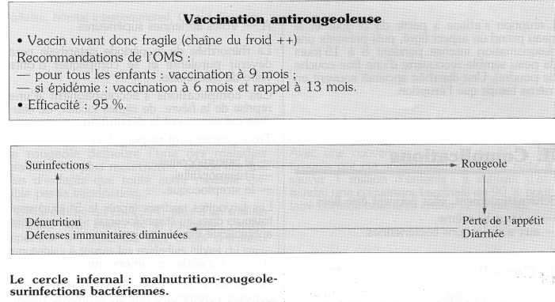
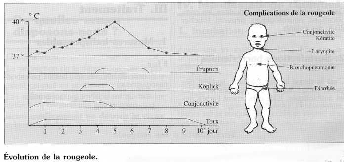

La rougeole demeure l'une des maladies infantiles les plus meurtrières, puisqu'elle tue plus d'enfants que toute autre maladie évitable par la vaccination. 
L'OMS estime qu'en 1994, plus d'un million d'enfants sont morts de la rougeole, chiffre supérieur à l'ensemble des décès d'enfants imputables à toutes les maladies cibles du programme élargi de vaccination (PEV). 
La maladie est responsable de plus de 10 % des décès chez les enfants âgés de moins de 5 ans, la moitié se produisant chez ceux ayant moins de 1 an. 
La maladie tue par ses complications : pneumonie, diarrhée, malnutrition, elle peut aussi laisser des séquelles définitives : cécité, surdité, convulsions, retard mental.

Sur les 40 millions de cas annuels, la majorité survient dans les villes, et en particulier dans les quartiers défavorisés (zones où la couverture vaccinale est faible).

## I. De quelles armes disposons-nous ?

- La vaccination.
- La prévention de la dénutrition, car la plupart des évolutions mortelles surviennent chez l'enfant carencé en protéines.
- Les antibiotiques, qui n'agissent que sur les surinfections bactériennes secondaires.

**Aucun médicament ne détruit le virus** **de la rougeole**

## II. Évolution de la rougeole depuis 30 ans

Avant le lancement du PEV en 1974, il y avait 130 millions de cas par an et 8 millions de morts.

Avec une couverture vaccinale de 80 %, les progrès ont été spectaculaires. Mais il reste à sauver 1 million d'enfants : il suffirait d'atteindre une couverture vaccinale de 90 % pour faire considérablement chuter la mortalité.

## III. Quelques points fondamentaux

- Le virus de la rougeole n'est présent que chez l'homme et se transmet par la salive.
- Bien que facilement détruit par la chaleur, il est extrêmement contagieux.
- Il entraîne l'apparition d'anticorps qui vont protéger le sujet toute sa vie.

## IV. Manifestations cliniques

### 1. Incubation

Après une incubation de 10 à 12 jours, la fièvre apparaît progressivement accompagnée de :

- rhinite,
- conjonctivite,
- toux.

Survient le signe de Köplick : petits points blancs sur la muqueuse buccale en regard des molaires (mais pouvant toucher toute la bouche). Ce signe inconstant permet d'affirmer le diagnostic avant l'éruption.

### 2. Éruption

Elle apparaît à la face puis aux thorax et à tout le corps en 3 jours.

Faite de maculo-papules pouvant confluer, elle est difficile à voir sur une peau noire qui prend du relief au niveau des papules.

L'éruption s'efface à partir du 5e jour et la peau prend un aspect tigré, puis présente une desquamation intense pendant 8 à 15jours (la peau semble recouverte d'une fine couche de poudre). Une diarrhée apparaît souvent en même temps que l'éruption.

## V. Complications

Schématiquement, elles peuvent être liées :

- au virus lui-même,
- aux surinfections bactériennes.

### 1. Complications liées au virus

Le virus peut toucher les **voies aériennes:** laryngite aiguë précoce, striduleuse, rarement grave, bronchite et pneumopathies.

Chez le jeune enfant malnutri, il faut craindre la pneumonie interstitielle avec fièvre élevée et asphyxie : elle se rencontre dans le sida. Son évolution est en général très sévère.

Le virus peut atteindre également le système nerveux :

- convulsions,
- troubles de la conscience,
- déficit moteur,
- encéphalite

Dans certaines épidémies africaines, les complications neurologiques peuvent toucher 20 % des enfants.

### 2. Surinfections bactériennes

C'est le risque le plus fréquent, souvent très grave, contre lequel nous pouvons lutter par les antibiotiques. Elles concernent l'arbre respiratoire.

#### a. Voies aériennes supérieures

La rhinorrhée de la période catarrhale peut devenir purulente et se compliquer d'otite voire de mastoïdite.

Ces complications s'accompagnent d'une reprise de la fièvre, de signes locaux, de diarrhée qui aggravent la dénutrition.

Trois germes sont responsables :

- le pneumocoque,
- l'*haemophilus*,
- le streptocoque.

Les laryngites tardives (après le 5e jour) sont toujours dues au staphylocoque le traitement antibiotique est ici une urgence.

#### b. Voies aériennes inférieures

Les broncho-pneumonies avec fièvre, toux, détresse respiratoire ont un pronostic redoutable sans une antibiothérapie précoce.

C - Les complications oculaires

Elles sont fréquentes et représentent un tiers des cécités. Il s'agit de conjonctivites et de kératites pouvant aboutir à un ulcère perforant de la cornée conduisant à la fonte purulente de l'oeil.

## VI. Traitement

### 1. Mesures indispensables

Il faut :

- nourrir et hydrater (au besoin par sonde nasogastrique) ;
- lutter contre la fièvre (paracétamol)
- désinfecter le nez ;
- appliquer un collyre antibiotique deux fois par jour ;
- poursuivre le traitement anti-paludéen qui doit être entrepris systématiquement dès l'apparition de la fièvre ;
- donner de la vitamine A : 400 000 Ul par voie intramusculaire (pour renforcer les défenses immunitaires).

<table>

<thead>

<tr>

<th scope="col">Surveillance d'une rougeole</th>

</tr>

</thead>

<tbody>

<tr>

<td><ul><li>Pesée fréquente (au moins une fois par semaine)</li><li>Mesure de la température chaque jour</li><li>Dans tous les cas, il faut apprendre à la mère à surveiller :<ul>*   la respiration (dyspnée, cornage)*   la toux, l'extinction de voix*   les yeux*   à détecter une déshydratation (recherche d'un pli cutané)</ul></li><li>Veiller à la reprise d'une alimentation ennrichie (intérêt des centres de renutrition)</li></ul></td>

</tr>

</tbody>

</table>

### 2. Formes compliquées

Dès la moindre suspicion de surinfection bactérienne, une antibiothérapie doit être débutée :

- *per os* : cotrimoxazole ou amoxicilline-acide clavulanique ;
- parentérale si troubles digestifs.

*Développement et Santé, n°149, octobre 2000*
