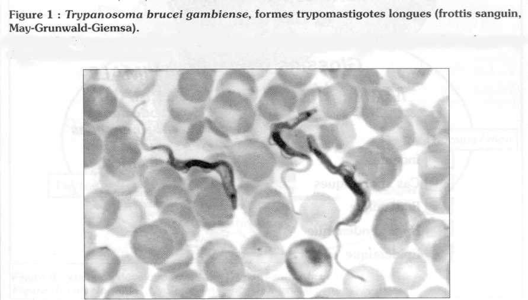
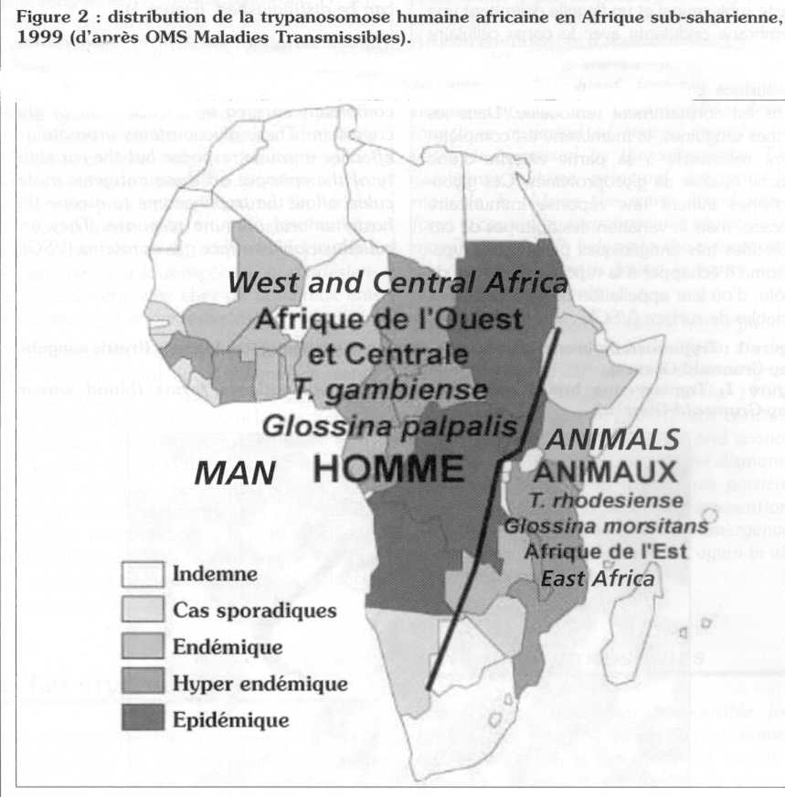
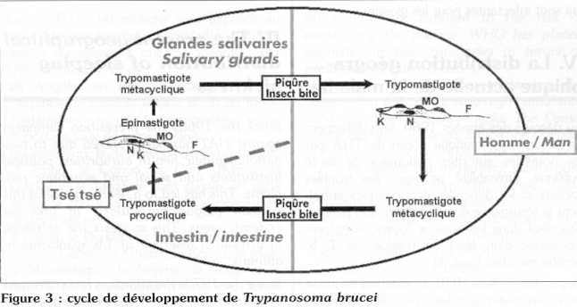
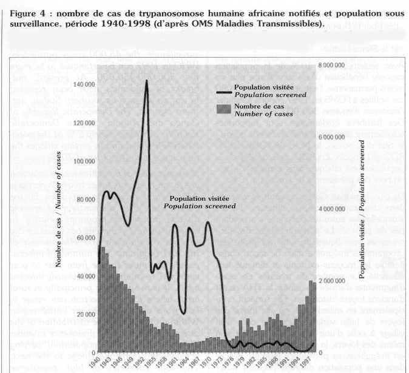
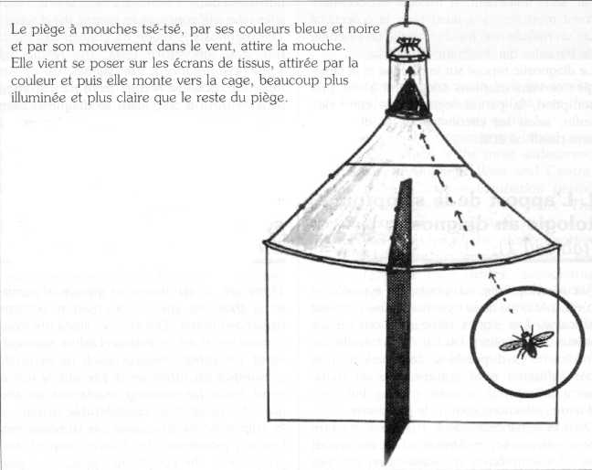

Au début du XXème siècle, la THA a été reconnue comme étant le problème de santé publique majeur en Afrique sub-saharienne. A la suite d'une intense activité de lutte, la transmission de la THA fut contrôlée dans les années 1950-1960. Par la suite, les troubles politiques, économiques et sociaux ont démembré les infrastructures sanitaires, en particulier celles dédiées à la lutte spécifique, entraînant la ré-émergence de cette maladie qui connaît à nouveau de fortes prévalences dans tous les anciens foyers.

## I. Les trypanosomes

Les protozoaires flagellés agents de la THA appartiennent au genre _Trypanosoma, espèce brucei._ Plusieurs sous-espèces de _Trypano soma brucei_ sont décrites : parmi elles _T_._b. brucei_ qui par définition n'est pas pathogène pour l'homme mais qui coexiste dans les réservoirs animaux et chez la glossine avec les deux autres sous-espèces pathogènes pour l'hom_me, T.b. gambiense_ et _T_._b. rhodesiense._ Les sous-espèces de _T brucei_ sont morphologiquement identiques ; leur différenciation fait appel à des techniques biologiques, biochimiques et de biologie moléculaire.

La forme sanguine de _T_._brucei_ est représentée par un parasite flagellé extracellulaire (trypomastigote). Dans les liquides biologiques les trypanosomes sont aisément reconnaissables en raison des mouvements ondulatoires constants de leur flagelle. Sur les frottis colorés, on distingue un noyau central, un kinétoplaste subterminal et un flagelle délimitant une membrane ondulante avec le corps cellulaire sur son parcours _(Figure 1)._

La surface cellulaire des trypanosomes africains est constamment remodelée. Dans les formes sanguines, la membrane est complètement recouverte à sa partie externe d'une couche épaisse de glycoprotéines. Ces glycoprotéines initient une réponse immunitaire efficace, mais la variation des épitopes de ces molécules très antigéniques permet au trypanosome d'échapper à la réponse humorale de l'hôte, d'où leur appellation de glycoprotéines variables de surface (VSG).

## II. Les glossines ou mouches tsé tsé

La distribution géograhique de la THA est dépendante de celle de son vecteur, la mouche tsé-tsé. Les mouches tsé-tsé appartiennent au genre _Glossina_ qui est habituellement divisé en trois groupes d'espèces. Le groupe _fusca_ inclut des vecteurs transmettant des trypanosomes responsables de maladies animales. Les deux autres groupes ont une importance en médecine humaine : les espèces du groupe _palpalis_ transmettent _T. gambiense_ en Afrique de l'Ouest et en Afrique centrale, celles du groupe _morsitans_ _T. rhodesiense_ en Afrique de l'Est _(Figure 2)._

Les glossines sont des mouches de grande taille, 6 à 15 mm de longueur. Durant le repas de sang, les parties buccales sont abaissées à 90° par rapport à l'axe du corps de l'insecte. Les mouches mâles et femelles se nourrissent exclusivement du sang de vertébrés.

L'habitat des espèces du groupe _palpalis est_ constitué par les rives des lacs et les berges des rivières en zone forestière ou anciennement forestière. Certaines espèces de ce groupe se sont adaptées au changement d'environnement lié aux activités humaines, en particulier agricoles (plantations de caféiers, de cacaoyers). Ce groupe comprend _G._ _palpalis, G. tachinoides_ et _G. fuscipes._ L'homme constitue le réservoir principal de parasites, bien que certaines espèces animales, en particulier domestiques (cochons, moutons), puissent jouer un rôle dans le cycle dans quelques foyers de transmission.

L'habitat des espèces du groupe _morsitans_ est constitué par les grandes étendues de savane arborée. Ce groupe comprend les espèces _G._ _morsitans,_ _G. pallidipes et G. swynnertoni_. L'infection humaine est sporadique _chez des_ sujets qui font des incursions dans la savane à l'occasion d'activités de chasse ou de cueillette.

## III. Le cycle de développement des trypanosomes _(Figure 3)_

Au moment de la piqûre, les trypanosomes présents dans les glandes salivaires de la glossine sont injectés dans les tissus de l'hôte. Ils peuvent alors se multiplier localement, entraînant une réaction inflammatoire et la formation d'une ulcération non suppurative, le chancre. A partir du chancre, les trypanosomes sont acheminés par la lymphe dans les ganglions lymphatiques et par le sang à tout l'organisme. Les trypanosomes se divisent sous forme de trypomastigotes longs et fins qui sont recouverts d'une glycoprotéine qui porte un type antigénique variable (VAT). Des anticorps sont formés contre ce VAT et les parasites qui portent ce VAT sont détruits. Cependant, quelques trypanosomes expriment un VAT différent sur leur VSG. Ils survivent à cette réaction d'immunité humorale de l'hôte et donnent une nouvelle vague de parasitémie jusqu'à ce qu'ils soient détruits à leur tour par de nouveaux anticorps. L'infection évolue ainsi par vagues parasitémiques successives comportant des trypanosomes porteurs de VAT différents. Le nombre de VAT exprimables est très important ; le parasite peut ainsi échapper à la réaction immunitaire de son hôte. Après un certain temps d'évolution non connu, certains trypanosomes traversent la barrière hémato-encéphalique pour envahir le système nerveux central. Parallèlement quelques trypanosomes se transforment en formes trypomastigotes courtes et trapues qui ne se divisent plus chez l'hôte vertébré mais qui sont infectantes pour les glossines.

## IV. La distribution géographique actuelle de la maladie

Au décours des années 1960, le relâchement de la lutte systématique contre la THA par les nouvelles autorités nationales de santé publique, l'instabilité politique, les troubles sociaux et les difficultés économiques entraînent la résurgence de ce fléau africain particulièrement dans les anciens foyers, suggérant l'existence d'un réservoir résiduel de _T._ _b. gambiense_ chez l'animal.

Depuis les années 1970, la situation ne cesse de se détériorer. Sur les 400 millions d'habitants qui vivent dans les 36 pays endémiques pour la THA, 60 millions sont exposés au risque de contracter la maladie. Quatre niveaux d'endémicité ont été identifiés par l'OMS _(Figures 2 et 4) :_

*   en Angola, en RDC, au Soudan _et en_ Ouganda, la maladie évolue selon un mode épidémique avec une forte prévalence et un important taux de transmission ;
*   le Cameroun, la République de Centrafrique, le Tchad, le Congo, la Côte d'Ivoire, la Guinée et la Tanzanie sont classés en zone de haute endémicité où la prévalence est en augmentation ;
*   le Bénin, le Burkina-Faso, la Guinée équatoriale, le Gabon, le Ghana, le Kenya, le Mali, le Mozambique, le Nigeria, le Togo et la Zambie sont considérés comme des zones de faible endémicité ;
*   la situation épidémiologique de certains pays de faible endémicité est mal connue. C'est le cas pour le Burundi, le Botswana, l'Ethiopie, le Libéria, la Namibie, le Rwanda, le Sénégal et la Sierra Leone.

Avec seulement 5 à 10 % de la population exposée bénéficiant d'une surveillance plus ou moins permanente, l'extrapolation des 45 000 cas notifiés à l'OMS en 1997 conduit à estimer l'existence d'environ 300 000 à 450 000 cas. Des flambées épidémiques sont rapportées actuellement dans les régions en état de guerre : le Sud du Soudan, le Nord de l'Ouganda, la RDC et l'Angola. En RDC, près de 2 % de la population est atteinte, dans certains villages, on note des prévalences de l'ordre de 70 %.

De plus, la plupart des foyers actifs se trouvent dans des zones reculées, difficiles d'accès auxquelles les autorités politiques n'accordent pas de priorité. Le démantèlement des programmes spécifiques de lutte au profit des programmes intégrés a dilué de façon considérable les moyens existants et diminué leur efficacité. Le nombre de malades ne cesse d'augmenter d'année en année, la THA renaît d'anciens foyers historiques. Elle survient principalement en milieu rural, où elle forme des foyers de taille variable allant de celle d'un village à celle d'une région entière. Au sein même des foyers, la répartition de la maladie est irrégulière, sa prévalence (nombre de cas dans une population donnée) pouvant varier considérablement d'un village à un autre. Les quatre pays à forte prévalence (Angola, Ouganda, RDC, Soudan) regroupent à eux seuls plus de 90 % des cas notifiés, essentiellement à _T. b_. _gambiense._

## V. Conclusion

Devant l'ampleur que prend l'extension de la résurgence de la maladie du sommeil, devant les difficultés de la lutte, du diagnostic et du traitement, la majorité des pays africains concernés semble impuissante à (re)mettre en place des mesures de lutte efficaces dont les principes sont connus depuis longtemps et ont fait leur preuve. Malgré les progrès réalisés dans la connaissance du trypanosome, il existe encore pour cette maladie, d'importants problèmes relatifs à son dépistage, son diagnostic et son traitement. Cependant, l'implication croissante de sources de financement publiques et privées, sous l'impulsion de l'OMS, permet de voir une lueur d'espoir. Les équipes mobiles sont remises sur pied et recommencent leurs " prospections " à la recherche des malades dans les villages et les campements reculés des foyers traditionnels de la maladie.

WHO (1998) Control and surveillance of African trypanosiomasis. Report of a WHO Expert committee. Technical report series n° 881. Geneva . Switzerland,114 p

_Développement et Santé, n°171, juin 2004_