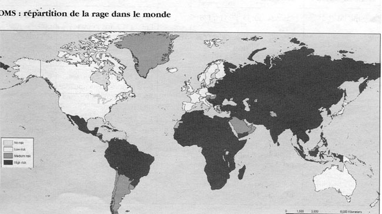
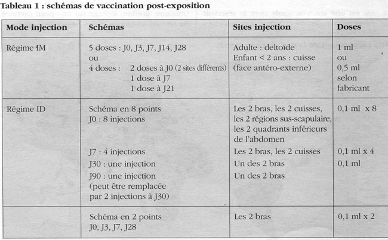

La vaccination contre la rage, mise au point après l'inoculation de la vaccine par Jenner, est l'oeuvre de Pasteur. 
Le traitement antirabique administré après exposition profite de l'incubation longue de la maladie pour immuniser le patient contre le virus qui lui a été inoculé.

## I. Agent pathogène

Le virus de la rage appartient au genre lyssavirus de la famille des rhabdovirus. Il en existe 7 sérotypes, le typel est l'agent pathogène de la rage.  
Le virus inoculé est transporté par les nerfs périphériques vers le système nerveux central où il se réplique. Il se dissémine alors via le système nerveux vers tous les tissus, y compris les glandes salivaires. Présent dans tout l'organisme dès le début de la phase clinique, le virus n'entraîne pas de réponse immunitaire décelable, d'où l'importance du traitement post-exposition de tout cas suspect.

## II. Épidémiologie

La rage est une zoonose virale dont le reservoir naturel est principalement constitué des carnivores et des chauves-souris. En l'absence de traitement, la maladie est mortelle dès l'apparition des signes cliniques. Les chiens sont à l'origine de 99 % des décès dus à la rage. Plus de 3,3 milliards de personnes vivent en zone d'endémie rabique, 35 000 décès annuels sont dus à cette maladie (OMS 2007), principalement en Asie et en Afrique. **L'enfant est particulièrement exposé**. Chaque année, plus de 10 millions de personnes sont traitées en post-exposition (surtout en Asie).

## III. Transmission de la maladie

La maladie est transmise à l'homme par un animal, lorsque celui-ci est en phase d'excrétion salivaire (morsure, griffure, léchage sur une peau excoriée ou sur une muqueuse).

## IV. Clinique

L'incubation est longue, généralement de 1 à 3 mois, mais peut dans certains cas durer jusqu'à 6 ans. Elle est totalement silencieuse (phase de migration du virus dans le système nerveux périphérique).  
Elle est suivie d'une courte phase prodromique (l'évolution est alors déjà inéluctable) marquée par des paresthésies et un prurit dans la région de pénétration du virus.  
Puis apparaît la phase d'encéphalo-myélite avec deux évolutions possibles :

- rage furieuse : agitation, hydrophobie et/ou aérophobie, évolution rapide vers le coma et la mort ;
- rage paralytique ou muette : paralysie ascendante, évocatrice de syndrome de Guillain-Barré, l'évolution vers la mort est plus lente.

**Une fois les symptômes déclarés, l'évolution est toujours mortelle, d'où l'importance de débuter un traitement post-exposition dès le contact avec un animal supposé enragé.**

## V. Prévention de la rage

La prévention repose sur une intervention à plusieurs niveaux qui doit être mise en place dans toutes les zones infestées :

- lutte contre les réservoirs animaux, notamment contre la rage des "rues" en Afrique, due aux chiens errants qui mordent le plus souvent des enfants ;
- prophylaxie post-exposition dans le cas de sujets potentiellement exposés ;
- vaccination avant exposition des personnes exposées à un risque fréquent.

### 1. Les vaccins antirabiques recommandés par l’OMS

Ces vaccins de référence sont constitués de virus inactivés après multiplication sur cultures cellu¬laires (lignée continue Vero ou fibroblastes d'em¬bryons de poulet). Ils induisent une réponse rapide en anticorps neutralisants. Ils sont administrés par voie IM ou ID selon les protocoles de l'OMS *(voir tableau 1*).

#### a) Schémas de vaccination post-exposition (voir tableau ci-dessous)

#### b) Modes d'injection (voir tableau 1)

Ces vaccins peuvent être injectés selon la voie IM clas¬sique en 5 doses (régime d'Essen) à J0, J3, J7, j14 et J28, ou en 3 fois avec 2 doses à JO (une de chaque côté), une dose à J7 et à J21 (régime Zagreb).  
La voie intradermique, qui réduit de 60 % la dose nécessaire, est recommandée par l'OMS à condition de satisfaire aux critères OMS d'efficacité et d'inno¬cuité (mentions légales).  
Il est également nécessaire de s'assurer de la formation du personnel à la pratique des injections intradermiques, du stockage correct du vaccin et de l'utilisation de seringues à 1ml et d'aiguilles courtes appropriées. En cas d'injection sous-cutanée ou intramusculaire par inadvertance, une nouvelle dose sera injectée en ID.

#### c) Effets indésirables

Des réactions locales bénignes ont été décrites (rougeur, douleur, tuméfaction), ainsi que des fièvres ou des céphalées.  
Les réactions d'hypersensibilité systémiques sont devenues très rares.

#### d) Contre-indications

En cas d'exposition à haut risque, il n'y a aucune contre-indication étant donnée la gravité potentielle, y compris pour les nourrissons et les femmes enceintes ou allaitant.  
En cas de vaccination préventive, une réaction antérieure sévère à l'un des composants des vaccins est une contre-indication.

### 2.Les immunoglobulines antirabiques (IGR)

Les vaccins peuvent être associés à des immunoglobulines spécifiques en fonction du risque potentiel encouru par le sujet exposé (*voir tableau 2*).

**Tableau 2 : recommandations selon l'exposition.**

<table>

<tbody>

<tr>

<td style="width: 59px;">Catégorie</td>

<td style="width: 236px;">Type d'exposition</td>

<td>Recommandations</td>

</tr>

<tr>

<td class="rtecenter" style="width: 59px;">I</td>

<td style="width: 236px;">

Morsures ou griffures transdermiques uniques ou multiples  
Léchage sur peau érodée  
Contamination des muqueuses par la salive (léchage)

</td>

<td>Lavage minutieux des plaies pendant 15 mn  
IGR + vaccin immédiats</td>

</tr>

<tr>

<td class="rtecenter" style="width: 59px;">II</td>

<td style="width: 236px;">

Griffures bénignes ou excoriations sans saignement, peau mordillée

Si immunodéprimé (VIH/SIDA)

</td>

<td>

Lavage des plaies  
Vaccin seul immédiat

IGR + vaccin immédiats

</td>

</tr>

<tr>

<td class="rtecenter" style="width: 59px;">III</td>

<td style="width: 236px;">

Léchage de la peau  
Contact ou alimentation de l'animal

</td>

<td>Pas de traitement</td>

</tr>

</tbody>

</table>

Au mieux, on utilise les immunoglobulines humaines à la dose de 20 UI/kg. Si cela est impossible, on administre des immunoglobulines équines purifiées à la dose de 40 UI /kg. Le risque d'hypersensibilité est actuellement très réduit, les préparations étant hautement purifiées.

**Mode d'injection**  
La quantité maximale possible d'IGR doit être injectée à l'endroit ou autour de la plaie, le reste par voie IM à distance du point d'administration du vaccin. Si la dose calculée est insuffisante pour infiltrer les plaies, on pourra la diluer dans une solution saline avant de réaliser l'infiltration.  
Les IGR ne doivent pas être injectées plus de 7 jours après le début de la vaccination post-exposition.

## VI. Recommandations

### 1. Après exposition

Le traitement antirabique après exposition est une urgence, il doit être institué le plus rapidement possible.  
L'appréciation du risque de transmission de la maladie tiendra compte de la nature de la contamination *(voir tableau 2*).  
Le traitement doit être appliqué même si le contact date de plusieurs mois.

#### a) Le traitement local des plaies doit être immédiat

- Lavage minutieux des plaies à l'eau savonneuse et rinçage abondant.
- Désinfection avec un produit ayant une action rabicide : éthanol 700ml/l, dérivés iodés.
- Rapprochement des berges des plaies sans suture.
- Traitement antibiotique.
- Protection antitétanique.

#### b) Le traitement antirabique

Il dépend de la catégorie de l'exposition (*voir tableau 2*).

#### c) Cas particuliers

En cas d'immunodépression (VIH/SIDA), on pratiquera une vaccination complète en par voie IM. Une évaluation de la réponse anticorps, réalisée 2 à 4 semaines plus tard, permettra de déterminer si une dose supplémentaire est nécessaire. De plus, on administrera des IGR même en cas d'exposition de catégorie II.  
En cas d'administration de chloroquine, les injections doivent se faire en IM, la réponse à la vaccination risquant d'être diminuée.  
Pour les personnes antérieurement vaccinées, une dose sera injectée à JO et J3, soit en IM (O,5ml ou 1ml selon le fabricant), soit en ID (0,1ml). Pas d'injection d'IGR.  
Cependant, si le traitement antérieur a été fait avec un vaccin d'efficacité non démontrée (carnet de vaccination) ou si le titre d'anticorps neutralisants est faible, on réalisera un traitement complet.

### 2. Vaccination préventive avant exposition

La recommandation concerne les personnes à haut risque d'exposition :

- personnel de laboratoire, vétérinaires, personnes manipulant des animaux ou en contact professionnel avec des animaux sauvages,
- nourrissons et enfants vivant en zone de haute endémicité, en fonction des possibilités.

La vaccination comporte 3 doses à J0, J7 et j28.  
Elle peut se faire par voie IM (préférable en cas de traitement antipaludique) : 0,5 ou 1ml, ou en ID : 0,1ml.

#### Rappels

Un contrôle sérologique sera pratiqué tous les 6 mois chez les personnes travaillant avec le virus de la rage, tous les ans chez les personnes à risque permanent.  
Une injection de rappel sera réalisée si le taux d'anticorps est inférieur à 0,5 UI/ml.

*Développement et Santé, n°195/196, 2009*
