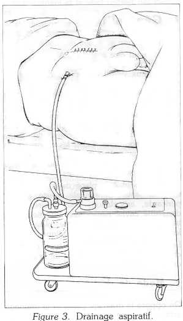
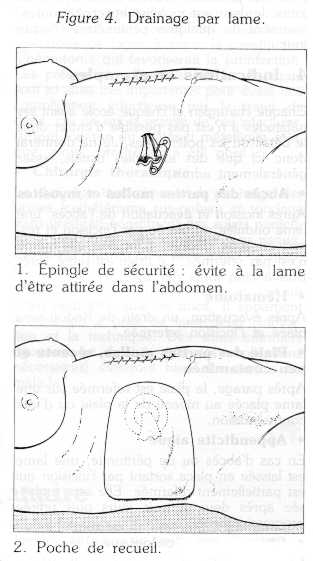
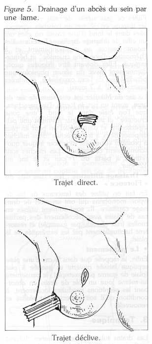

## I. Généralités

Drainer veut dire assécher. Ainsi le paysan qui dispose d'un champ trop humide ou marécageux va-t-il placer des drains destinés à recueillir et évacuer les eaux stagnantes, en utilisant la pente naturelle du sol (ou déclivité).

En chirurgie, le drainage cherche à faciliter temporairement l'évacuation d'un liquide vers l'extérieur ou à éviter la (reconstitution d'une collection anormale. Selon les circonstances ce liquide peut être du sang, du pus, des sérosités, de l'urine, de la bile ou encore du liquide digestif ou des selles.

Le drain peut être placé dans une cavité naturelle (cavité péritonéale, vessie, plèvre, péricarde, articulation, voie biliaire ... ) ou dans une cavité néoformée, infectieuse ou traumatique (abcès, hématome, plaie, décollement chirurgical ou traumatique ... ).

Le mode de drainage et le type de drain choisi dépendent étroitement de la cavité à drainer.

### **1.** Mode de drainage

On oppose le drainage passif et le drainage actif.

#### Le drainage passif

Il se contente d'utiliser les différences de pression existant entre la cavité concernée et l'extérieur. Notre paysan qui utilise la déclivité naturelle du sol effectue un drainage passif. De même le drain placé dans la cavité abdominale est soumis à l'hyperpression intra-abdominale et les liquides vont avoir tendance à s'évacuer par le drain vers l'extérieur où règne la pression atmosphérique normale.

#### Le drainage actif

A l'opposé, le **drainage actif** fait intervenir un système d'aspiration extérieur. Pour le paysan, il s'agit d'une pompe avec laquelle il vide les poches d'eau qui ne s'évacuent pas d'elles-même. En médecine, on utilise la dépression fournie par une source de vide (aspiration centrale avec une prise murale ou système de pompe électrique, indépendante et mobile). Par exemple, un drainage thoracique (de la plèvre) pourra être aspiratif pour compenser la dépression de la cavité pleurale lors de l'inspiration.

Lorsque l'on utilise ce type de drainage aspiratif, il faut pouvoir contrôler et moduler la dépression (mesurée en cm d'eau) pour ne pas créer de lésion tissulaire par une aspiration trop brutale.

### 2. Différents drains

Les drains les plus utilisés sont les drains tubulaires, les lames, les drains aspiratifs et les mèches. D'autres systèmes sont parfois utilisés : faisceau de crins, système d'irrigation et aspiration ou sac de Mikulicz.

  

C'est un simple tube de calibre variant de 2 à 10 mm. Il était souvent en caoutchouc mais ce matériau est irritant pour les tissus au contact et provoque une réaction inflammatoire et adhérentielle pas toujours souhaitée. Mais c'est un matériau que l'on trouve partout, peu onéreux, et qui peut rendre service. Actuellement le caoutchouc est remplacé par des plastiques silicones plus souples, inertes, mieux tolérés, et de plus transparents. Il y a toujours intérêt à choisir un tube de bon calibre qui n'aura pas tendance à se boucher (n° 30 ch. par exemple, pour un drain abdominal, calibre 6 à 10 mm).

La plus répandue est la lame de caoutchouc ondulée, très bon marché et encore très utilisée ; c'est un drain exclusivement passif.

Il existe aussi des lames multitubulaires, siliconées, qui sont formées de tubes juxtaposés très fins apportant en plus un effet de

capillarité (un peu comme un papier buvard), chaque petit tube agissant comme un tube capillaire, plus efficaces mais plus chères !

#### Le drain aspiratif simple

Le plus connu est le drain de Jost-Redon, petit drain en plastique siliconé, multiperforé à une extrémité, relié à l'autre extrémité à une tubulure et un bocal où le vide est renouvelé régulièrement. Ce drain est très utile pour affaisser les espaces morts (zones de décollement chirurgical par exemple).

#### Les drains aspiratifs avec prise d'air

De très nombreux modèles sont décrits. Ils comportent en général une tubulure d'aspiration centrale et une tubulure externe ou latérale avec prise d'air pour éviter les phénomènes de succion des viscères abdominaux notamment. Certains ont en plus une tubulure d'irrigation et permettent d'aspirer et de laver en continu (en cas de péritonite ou de fistule par exemple) _(fig. 3)._

#### Les mèches

Faites de gaze stérile, de taille variable, on les dispose en général en couches superposées dans le fond d'une cavité où elles ont un effet de drainage capillaire. En outre elles aident parfois au tamponnement et à l'hémostase d'une zone cruentée* et hémorragique. (* Cruentée : saignant à vif dépourvue de revêtement cutané.)

Elles doivent être irriguées quotidiennement (avec du sérum physiologique bétadiné, ou de l'eau oxygénée), et retirées assez vite (2 à 7 jours).

Le sac de Mikulicz est une sorte de sac de gaze, ayant un peu la forme d'un parachute, que l'on étale dans le fond d'une zone cruentée* et infectée (par exemple une pelvipéritonite) et dans lequel on peut en plus disposer deux à trois mèches (dites mèches à prostate) et un petit tube pour irriguer quotidiennement ce système. Les mèches sont retirées à partir du 7e jour et le sac au 12e jour.

#### Drainage filiforme : les crins dits de **" Florence "**

En fait on utilise des faisceaux de fils de nylon monobrins qui ont un effet de drainage capillaire. Ils sont souvent utilisés en cas de plaies avec décollement des parties molles (cuir chevelu par exemple) et ressortent habituellement par les extrémités de la plaie.

#### Le pansement

Enfin, je rappelle que dans le cas d'une plaie septique laissée ouverte et pansée à plat (plaie de guerre par exemple), le pansement lui-même joue un rôle de drain en absorbant les sécrétions produites localement, à condition qu'il soit correctement réalisé et renouvelé.

### 3. Technique

Les drains tubulaires et les lames doivent sortir par des contre-incisions et être disposés de telle façon que le trajet soit aussi court et direct que possible tout en étant déclive.

Il faut éviter de placer le drain au contact direct d'une suture digestive. En le plaçant, on doit éviter de blesser des structures importantes (vaisseau, nerf).

Les drains doivent être parfaitement fixés à la paroi de façon à ne pas pouvoir être

mobilisés intempestivement (solide fil de nylon fixé à la peau). Ce drain ne pourra donc pas être arraché par erreur mais il faut aussi éviter qu'il se déplace vers l'intérieur de la cavité abdominale. Pour cela, il est habituel de l'entraver avec une épingle à nourrice placée en travers _(fig. 4)._

Les soins infirmiers autour de l'orifice du drain doivent être rigoureux :

*   asepsie stricte pour éviter les surinfections exogènes. L'extrémité du drain sera raccordée à une poche _(fig. 4)_ (poche à urine par exemple) que l'on peut vider sans toucher au drain. Sinon l'extrémité du drain ou de la lame est placée dans une poche de recueil collée à la peau. Enfin si ces différents matériaux ne sont pas disponibles, l'extrémité du drain sera placée dans un pansement absorbant (ouaté) régulièrement changé ;
*   noter sur la pancarte la quantité et l'aspect du liquide recueilli quotidiennement ;
*   informer le chirurgien en cas de modification d'aspect ou de quantité.

Un drain qui ne donne rien ne doit pas être laissé en place inutilement. Il devient alors une cause d'infection potentielle. Dès qu'il n'est plus productif, souvent après un à deux jours, le drain est mobilisé et retiré progressivement de quelques centimètres chaque jour.

### 4. Indications et exemples

Chaque chirurgien et chaque école ayant ses habitudes il n'est pas possible d'entrer dans le détail ou les polémiques. Je ne donnerai donc ici que des exemples usuels, assez généralement admis.

#### Abcès des parties molles et myosites

Après incision et évacuation de l'abcès, une lame ondulée est placée par l'incision et ressort en zone déclive. L'incision elle-même n'est pas refermée. Le drain est retiré après trois à cinq jours _(fig. 5)._

#### Hématome

Après évacuation, un drain de Redon sera placé et l'incision refermée.

#### Plaie des parties molles, récente et **peu contaminée**

Après parage, la plaie est refermée sur une lame placée au niveau de la plaie ou d'une contre-incision.

#### Appendicite aiguë

En cas d'abcès ou de péritonite, une lame est laissée en place sortant par l'incision qui est partiellement refermée. Elle sera mobilisée après deux à trois jours puis retirée progressivement.

#### Chirurgie gynécologique

Chirurgie réglée et non septique (hystérectomie simple, kyste de l'ovaire, grossesse extra-utérine simple) : le drainage est souvent inutile. Si on y tient, un Redon est suffisant.

#### Chirurgie plus complexe

Notamment septique (pelvi-péritonites), le drainage efficace est nécessaire : lame et drain tubulaire dans le cul-de-sac de Douglas et sortant par une contre-incision au niveau de la fosse iliaque, drainage aspiratif ou encore sac de Mikulicz dans les formes sévères.

#### Chirurgie du côlon et du rectum

Ici le drainage vise à éviter la constitution d'un hématome pelvien souvent surinfecté qui, au contact de l'anastomose, serait un facteur de désunion et de fistule. Le drain permet de surveiller de façon précise l'évolution pendant les premiers jours. Si un lâchage anastomotique partiel survenait, le diagnostic en serait facilité (sur l'aspect du liquide de drainage) et le pronostic meilleur du fait de l'évacuation par le drain du produit de la fistule. Mais dans ce domaine chaque chirurgien a ses idées et utilisera selon les cas un système aspiratif ou une lame et un drain. La tendance est plutôt à drainer les espaces de décollement, souvent par des Redons ou un drain aspiratif.

#### Chirurgie biliaire

Après une cholécystectomie simple, un drain de Redon est suffisant et sera retiré après un à deux jours. S'il s'agit d'une cholécystite suppurée ou gangrenée avec d'importants remaniements inflammatoires locaux, on drainera volontiers par une lame multitubulée, par exemple, sortant par une contre-incision déclive du flanc droit.

En cas de lithiase du cholédoque un drain de Kehr, en T, est placé dans la voie biliaire principale. Ce drain est le plus souvent en caoutchouc et il doit être parfaitement fixé pour éviter à tout prix une mobilisation intempestive les premiers jours. Le chirurgien devra donner des consignes précises concernant l'installation et la surveillance de ce drain. Une cholangiographie de contrôle sera réalisée vers le huitième jour pour vérifier la liberté de la voie biliaire et l'absence de calcul résiduel.

#### Perforation d'ulcère

Avant tout, le lavage de la cavité péritonéale doit être complet et parfait. Après quoi il est habituel de drainer l'étage sus-mésocolique par un drainage aspiratif ou une lame et un drain sortant par une contre-incision du flanc droit.

#### Péritonites généralisées

Après le traitement de la cause et le lavage méticuleux de toute la cavité péritonéale, on s'efforcera de drainer les zones de stagnation habituelles (sous les coupoles diaphragmatiques, le cul-de-sac de Douglas) et les loges cruentées et abcédées. Dans ce dernier cas, les drains seront retirés très progressivement de façon à permettre l'affaissement et l'assèchement complet de cette cavité.

#### Chirurgie orthopédique et traumatologique

En fin d'intervention, un ou plusieurs drains aspiratifs de Redon seront laissés dans le site opératoire de façon à éviter la constitution d'hématome qui favoriserait la surinfection. Les précautions d'asepsie autour du drain sont ici aussi très importantes pour éviter une complication infectieuse par le trajet du drain, car on sait la gravité de ces infections, surtout lorsque du matériel métallique (plaque, clous, prothèses) a été posé.

#### Chirurgie thoracique

Le drainage thoracique et le drainage des urines (cathétérisme sus-pubien et sondage trans-uréthral) constituent des sujets particuliers que l'on ne peut simplifier sans risque. Ces sujets devront donc faire l'objet de questions spéciales.

Ainsi donc, selon l'usage qu'on en fait un drain peut être utile ou nocif. Il appartient à celui qui le pose de bien peser l'indication et la technique. Des soins infirmiers rigoureux et éclairés (par les explications nécessaires) éviteront bien des ennuis au malade !

_Développement et Santé, n°101, octobre 1992_