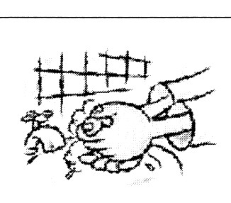
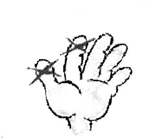
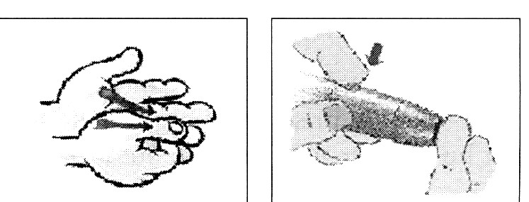
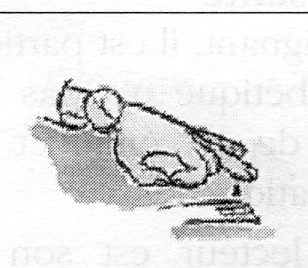

Le lecteur de glycémie est un appareil qui permet de doser instantanément (quelques secondes) la glycémie et peut être utilisé par le patient lui-même.

## I. Utilités du lecteur de glycémie

### 1. Pour le patient

- Tout d'abord, savoir évaluer son diabète par le dosage immédiat de sa glycémie qu'il peut ainsi contrôler à tout moment.
- Connaître la valeur glycémique (appelée index glycémique) d'un aliment en mesurant sa glycé­mie avant et après l'ingestion de cet aliment. Cette information permet ainsi d'adapter sa consommation (quelle quantité de riz, de pain ou de légumes type macabo ou plantain peut être absorbée lors du repas ?).
- Adapter chaque jour l'alimentation en fonction de l'activité physique, donc de la dépense calo­rique, et des résultats des trois mesures quoti­diennes.
- En cas de traitement par insuline, il pourra adap­ter les doses à injecter en fonction de la glycémie (en augmentant ou en réduisant la dose de une ou deux unités).
- Permettre une meilleure implication du patient lui-même dans la prise en charge de sa maladie et ainsi lui donner une certaine autonomie.

### 2. Dans les centres de santé

A la disposition du soignant, il est particulièrement utile si le patient diabétique n'a pas les moyens d'acheter un lecteur de glycémie et le matériel nécessaire à son utilisation.

### 3. Inconvénient

**L'inconvénient** du lecteur est son coût, non négligeable, qui en limite l'accessibilité et l'utilisa­tion à long terme. Il est possible, pour le réduire, de couper les bandelettes en deux dans le sens de la longueur.

Enfin, pour une bonne fiabilité des résultats, ce matériel doit être régulièrement contrôlé et les bandelettes conservées dans de bonnes condi­tions.

Rappelons que la glycémie doit être surveillée chez tout patient traité par insuline.

La majorité des patients n'ont pas les moyens financiers pour acheter cet appareil et le matériel associé (piles, bandelettes et aiguilles) ou qui ne sont pas intéressés.

Il est probable que les centres de santé seront équipés selon la prévalence locale du diabète.

### 4. Rythme et fréquence d'utilisation

De façon ponctuelle, comme cela a été dit plus haut, après un repas trop riche, ou pour connaître la valeur glycémique d'un aliment ou adapter la dose d'insuline quotidienne.

Une fois par semaine ou une fois par mois, on évalue la glycémie à trois reprises dans la même journée :

- le matin à jeûn : on estime ainsi la glycémie de la journée précédente,
- une à deux heures après le déjeuner : pour savoir si la prise des antidiabétiques du matin a régularisé la glycémie en fonction de l'activi­té et du déjeuner,
- avant le dîner : pour connaître le type d'ali­ments que l'on peut manger le soir (rappelons que c'est le moment du repas familial, où l'on a tendance à relâcher son attention) et savoir s'il est nécessaire d'augmenter le traitement du soir.

Malheureusement, soulignons-le encore, le coût rend cette recommandation impossible à appliquer pour beaucoup de patients. C'est pourquoi l'équi­pement de tous les dispensaires permettrait d'as­surer le suivi d'un grand nombre de patients et ainsi de réduire la fréquence et la gravité des com­plications.

## II. Comment utiliser le lecteur de glycémie ?

L'utilisation du lecteur de glycémie ne nécessite que quelques gestes, simples mais nécessaires à une bonne fiabilité des résultats.

### Le matériel

### L'hygiène doit être respectée

Se laver les mains avec de l'eau et du savon, puis les sécher. Il ne faut jamais utiliser d'alcool pour désinfecter, cela risque de fausser les résultats de la glycémie.

### Où et comment piquer ?

On sélectionne la profondeur de piqûre du stylo et on utilise une lancette neuve à chaque examen.

On ne pique pas :

- le pouce ni l'index, doigts les plus fonctionnels,
- la pulpe des doigts, plus sensible.

On pique :  

- après avoir massé le doigt de la base vers la pulpe,
- au bout mais sur le côté du doigt, moins sensible.

### Lecture de la glycémie

La goutte de sang est déposée sur la zone réactive de la bandelette, le résultat s'affiche sur le lecteur. Les résultats sont ensuite notés sur un carnet d'autosurveillance.

Si un résultat paraît aberrant, on recommence l'examen.

### Après l'examen

La lancette et la bandelette doivent être jetées dans un conteneur spécial.

*NB : il existe différents modèles d'appareils, leur mode d'utilisation est comparable.*

*Développement et Santé, n°193, 2009*
