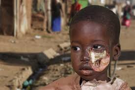
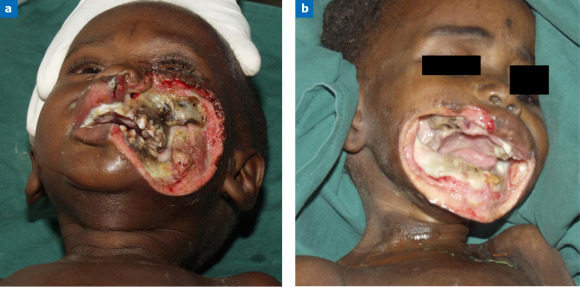
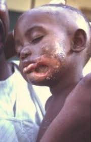
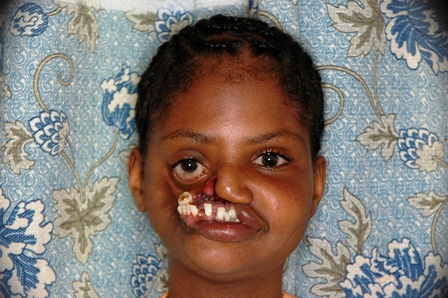
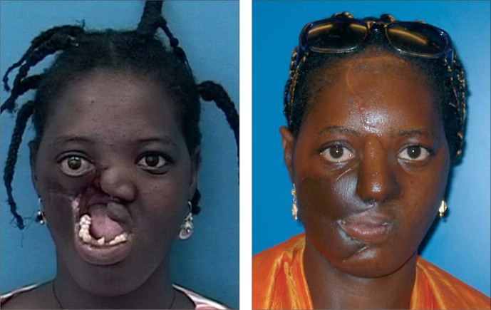

Le noma, ou <em>cancrus oris</em>, est une gangrène oro-faciale survenant essentiellement chez les enfants en mauvais état généra, vivant dans les pays tropicaux défavorisés. Elle est responsable d’une assez lourde mortalité et d’importantes séquelles esthétiques et fonctionnelles chez les enfants qui survivent. 
Le noma, du grec <em>numein </em>= dévorer, était déjà connu d’Hippocrate, sous le nom de <em>sphakelos </em>(gangrène sèche). Cette affection était connue depuis très longtemps en Europe et aux Etats-Unis et dès 1649, cette maladie a été inscrite dans le premier ouvrage sur les maladies négligées. Vers la fin du XIXème, la prévalence du noma a décru avec l’amélioration de l’hygiène générale. L’arrivée de la pénicilline a fait considérablement chuter la mortalité et la chirurgie réparatrice, quand elle est possible, a donné de bons résultats depuis une cinquantaine d’années. Néanmoins, le noma reste encore très présent dans les pays tropicaux.

### Epidémiologie

La maladie atteint surtout les enfants de 2 à 7 ans, en Afrique sub-saharienne, dans les pays défavorisés, où la pauvreté est très répandue et avec un faible taux de vaccination contre la rougeole.  
L’incidence est inconnue, estimée entre 30 000 et 140 000 cas. Mais il est très difficile de disposer de chiffres précis qui sont sous-estimés en raison du manque de moyens de diagnostic et de soins et de la stigmatisation des patients qui se dissimulent.  
Dans les coins très reculés, les enfants meurent sans diagnostic. En effet, la mortalité atteint 85% sans traitement. Cette affection est responsable de 0,5 % à 3% de la mortalité des enfants en Afrique.

### Etiologie multifactorielle

L’origine du noma est multifactorielle, associant la pauvreté et l’absence d’hygiène générale et buccale, responsable de gingivites infectieuses. La multiplication des grossesses chez des femmes souvent malnutries a souvent par conséquence la prématurité et le faible poids de naissance qui sont des facteurs aggravants, de même que la période de sevrage.  
La **comorbidité**avec le paludisme, la rougeole, la varicelle, la tuberculose ou encore l’infection par le VIH accentuent encore le risque d’affaiblissement de l’état général. On a d'ailleurs a pu remarquer que le paludisme et la rougeole précèdent souvent l’apparition du noma (figure 1).

  
**Figure 1. Physiopathologie du noma (d'après J. N. Masipa).**

Une **étiologie bactérienne** a été évoquée depuis longtemps. Des agents pathogènes ont été isolés des prélèvements au niveau des plaies, comme *Borrelia vicentii* ou *Fusiformis fusiformis*, mais ces bactéries sont fréquentes dans la cavité buccale.  
En fait, il s’agit plus vraisemblablement d’un déséquilibre de la flore buccale, avec une diminution de *Capnocytophaga* et de *Fusobacteria* et une augmentation de *Prevotella*. En effet, *Prevotella intermedia* est un agent pathogène retrouvé dans les premières dentitions des enfants et dans les infections péri-odontales des adultes. Mais l’étiologie bactérienne n’est pas démontrée et pourrait plus être la conséquence de l’ulcération buccale que la cause.

### Une nécrose de la face

Le noma se manifeste par une **destruction des tissus de la face**. La maladie débute par des ulcérations buccales et des aphtes, puis par une gingivite aiguë nécrosante avec des ulcérations douloureuses et sanguinolentes des muqueuses buccales, qui sont des affections atteignant 15% à 60% des enfants en Afrique. Sans traitement, la gingivite peut évoluer vers une nécrose des muqueuses de la cavité buccale.  
Puis apparaît un œdème facial avec une stomatite et une halitose. En quelques jours, l’œdème se nécrose rapidement pour former une ulcération donnant issue dans la cavité buccale (figure 2).

  
**Figure 2. Ulcération typique du noma.**

Une **couleur bleue de la peau** est le signe d’une **nécrose sous-jacente** qui va évoluer très vite.  
En fonction de leur état immunitaire, certains enfants sans traitement ne présentent qu’une lésion relativement peu importante, alors que d’autres évoluent vers une ulcération très destructrice malgré le traitement (figure 3).

  
**Figure 3 (a-b). Deux cas de noma très délabrant.**

La nécrose envahit la peau, les muscles et les os de la face (figure 4) et évolue très souvent vers le décès par surinfection, la **mortalité atteignant 85%** des sujets atteints.

  
**Figure 4. Noma : radiographie du massif facial.**

### Des séquelles importantes

Le diagnostic est basé sur le contexte : enfant malnutri, œdème de la face d’apparition récente, avec une haleine très fétide. Le diagnostic différentiel peut alors se poser avec un ulcère de Buruli, un abcès dentaire, une stomatite herpétique voire des oreillons.  
Au stade de l’ulcération, d’autres affections peuvent être envisagées selon les zones géographiques concernées: lèpre, leishmaniose cutanéo-muqueuse, tuberculose cutanée, pian, traumatisme etc…

Un traitement antibiotique par **amoxicilline et métronidazole** doit être entrepris **le plus tôt possible**. En outre, il faut traiter les **comorbidités**(affections pulmonaires ou gastro-intestinales, paludisme…) et entreprendre une réhydratation et une renutrition de l’enfant.

Quand un traitement est mis en route à temps, et que le système immunitaire de l’enfant est en état de répondre, apparaît un tissu de granulations avec une repousse au niveau des bords de la plaie (figure 5).

  
**Figure 5. Noma en voie de cicatrisation.**

Cette cicatrisation peut demander des semaines ou des mois selon l’état général de l’enfant. Malheureusement, les 15% d’enfants qui survivent, vont garder des séquelles importantes, à type d’ulcérations chroniques, de trismus ou d’ankylose de l’articulation temporo-maxillaire (figure 6), entraînant des difficultés pour parler et pour manger, ce qui risque d’aggraver encore leur malnutrition.

  
**Figure 6. Noma : séquelles avec déformation des maxillaires.**

En outre, l’aspect inesthétique de ces cicatrices très délabrantes (figure 7) provoque un certain isolement social de l’enfant. Une fois la cicatrice stable, une intervention chirurgicale réparatrice (greffe de peau) peut être envisagée (figure 8), en fonction des opportunités locales ou plus souvent selon les actions possibles des organisations non gouvernementales.

  
**Figure 7. Noma : cicatrice inesthétique et gênante sur le plan fonctionnel.**

  
**Figure 8. Noma cicatriciel, avant et après chirurgie.**

### En conclusion

Le noma est une affection non contagieuse, d’étiologie inconnue, mais qui est un témoin indirecte de la pauvreté et de la malnutrition. La prévention consiste essentiellement à réduire ces deux fléaux, mais cela est compliqué dans certaines zones tropicales défavorisées.

**Bibliographie**

- Ashok N, Tarakji B, Darwish S, Rodrigues JC, Altamimi MA. A Review on Noma: A Recent Update. Glob J Health Sci. 2015 Jul 30;8(4):53-9.
- Feller L, Altini M, Chandran R, Khammissa RA, Masipa JN, Mohamed A et al.Noma (cancrum oris) in the South African context J Oral Pathol Med. 2014 Jan;43(1):1-6. doi: 10.1111/jop.12079..
- García-Moro M, García-Merino E, Martín-Del-Rey A et al. Noma/Cancrum oris: a neglected disease.  
  Rev Esp Quimioter. 2015 Oct;28(5):225-34.
- Masipa JN, Baloyi AM, Khammissa RA, Altini M, Lemmer J, Feller L Noma (cancrum oris): a report of a case in a young AIDS patient with a review of the pathogenesis. Head Neck Pathol. 2013 Jun;7(2):188-92.
- Tonna JE, Lewin MR, Mensh B. A case and review of noma. PLoS Negl Trop Dis2010; 4: 869
