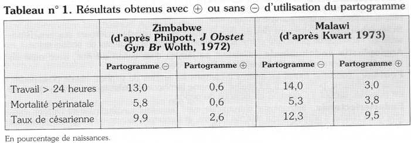
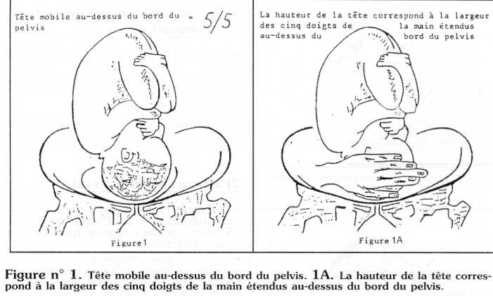
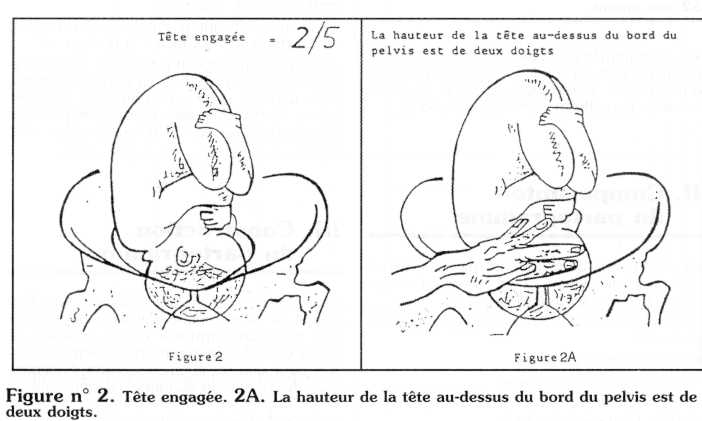
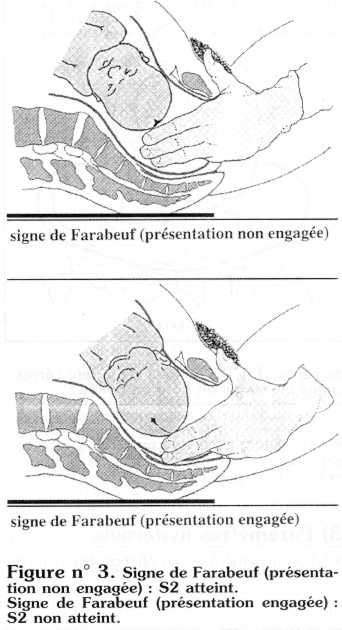

Environ un demi-million de femmes meurent chaque année des complications liées à la grossesse, dont plus de 80 % ont lieu pendant le travail.

Le partogramme permet un enregistrement graphique, méthodique et synthétique des progrès du travail et des principales données sur l'état de la mère et du foetus. Il sert de "système d'alarme précoce" pour toute anomalie dans la progression du travail autorisant la mise en oeuvre de mesures de prévention, de transfert de la patiente ou d'accélération ou de terminaison du travail. Il permet de réduire sensiblement le risque de dystocie, de souffrance foetale, de rupture utérine et les risques ultérieurs d'hémorragie de la délivrance et de septicémie.

Outil exclusivement destiné à la surveillance et à la conduite du travail, il ne permet pas d'identifier les autres facteurs de risque qui pourraient avoir été présents avant le début du travail. On ne peut recourir au partogramme qu'après avoir vérifié qu'il n y a pas eu au cours de la grossesse de complication qui exige une intervention immédiate.

Le *tableau n°1* montre les résultats que l'on peut obtenir en utilisant ce partogramme.

## I. Principes

Mis en oeuvre dans les pays développés, il est promu par l'OMS à la suite d'un séminaire de l'Unité de Santé Maternelle et Infantile tenu à Genève du 06 au 08 avril 1988. Le modèle de partogramme repose sur plusieurs principes :

### 1. Paramètres obstétricaux

- La phase de latence (dilatation de 0 à 3 cm) ne devrait pas durer plus de 8 heures.

- La phase active du travail commence lorsque la dilatation du col atteint 3 cm.

- Pendant la phase active, le rythme de dilatation du col ne devrait pas être inférieur à 1 cm/heure.

- Il vaut mieux éviter de multiplier les touchers vaginaux (entre un et quatre par heure).

- La descente du mobile foetal doit être régulière et mesurée par la palpation abdominale (nombre de doigts au-dessus du rebord symphysaire (*figures n°* *1 et n° 2*). L'engagement peut être estimé par le signe de Farabeuf *(figure n° 3).*

- Les contractions utérines doivent être régulières en fréquence et efficaces en intensité.

- Les pertes sanguines ne doivent pas dépasser 500 cc (1/2 litre).

### 2. Paramètres fœtaux

- Le rythme cardiaque foetal est constant entre 120 et 160 battements par minute. L'auscultation doit se pratiquer toutes les quinze minutes et juste après une contraction.

- Le liquide amniotique, reflet indirect du bien-être foetal, s'écoule clair.

- Le mobile foetal doit s'adapter à la filière osseuse : le pôle céphalique après un engagement en oblique (le plus grand diamètre) se saggitalise pour permettre une expulsion en occipito-pubien. Les fontanelles permettent une certaine compliance des diamètres céphaliques grâce à un chevauchement modéré des os du crâne.

- Une déformation du crâne qui s'accentue sans que la tête descende est signe de disproportion foeto-pelvienne.

### 3. Paramètres maternels

- L'accouchement est un phénomène naturel.

- Les paramètres maternels doivent rester normaux tout au long du travail en dehors d'une légère accélération du pouls et d'une modeste hyperthermie (inférieure à 38°).

## II. Composante du partogramme

Représentation graphique des diverses étapes du travail par rapport au temps passé (en abscisse), il comprend trois éléments

- la surveillance obstétricale de la progression du travail,
- la surveillance du foetus,
- la surveillance de la mère.

que l'on notera ainsi en ordonnées par rapport au temps (en abscisse).

### 1. La surveillance obstétricale du travail

- le degré de dilatation cervicale de 0 à 10 cm,

- la qualité du col : consistance, raccourcissement, effacement,

- la descente du mobile foetal,

- les contractions utérines : le nombre de contractions par période de 10 minutes et la durée des contractions mesurées en secondes.

### 2. La surveillance foetale

- Le rythme cardiaque foetal : une auscultation (stéthoscope de Pinard) toutes les 15 minutes pendant et juste après l'arrivée d'une contraction utérine

- La présentation : estimer, toutes les heures, la variété, le degré de flexion ainsi que l'apparition d'un chevauchement important des os du crâne ou d'une bosse séro-sanguine.

- La poche des eaux intacte ou rompue. Si la poche est rompue, la qualité du liquide: couleur, consistance, présence de vernix. Une rupture artificielle des membranes est signalée par une flèche.

### 3. La surveillance maternelle

#### Toutes les heures

- pouls, tension artérielle, température, urines (volume, couleur),
- événements intercurrents : métrorragies, comportement, tolérance à la douleur....
- rubrique thérapeutique : toute administration de drogue *per os* ou en perfusion est inscrite, datée et signée. En particulier une perfusion d'ocytocine est représentée par une ligne horizontale qui en indique le début et la durée.

## III. Construction du partogramme

Pour être un outil, et pas seulement une illustration, le partogramme doit être construit sur une grille pré-imprimée où les échelles de temps et de dilatation sont soigneusement choisies pour que les anomalies soient évidentes, donc diagnostiquées et traitées en temps utile. Il existe deux types de partogramme : le partogramme de Friedman (*figure* *n° 4*), plus volontiers utilisé dans les pays occidentaux et le partogramme de l'OMS (*figure* *n° 5*), prévu préférentiellement pour les pays en voie de développement. Ce dernier plus difficilement lisible présente l'avantage de comporter des limites ou bornes : ligne d'alerte, ligne d'action. Les limites sont corrélées aux résultats périnataux : la ligne d'alerte permet le dépistage des dystocies et la ligne d'action impose un geste thérapeutique.

Dans les deux partogrammes, déjà pré-imprimés, la construction est similaire ; elle repose sur plusieurs temps.

### 1. Haut de page

- Le temps 0 correspond à l'heure d'entrée de la parturiente en salle de naissance.
- Identification de la maternité.
- Identification de la patiente (nom, prénom, date de naissance, parité).
- Date et heure d'admission en salle de travail.
- Nom du responsable en charge de la surveillance du travail.

### 2. Milieu de page

- Diagramme dilatation cervicale et descente foetale : en ordonnées sur la ligne verticale à gauche du graphique, les subdivisions notées de 0 à 10 représentent chacune un centimètre de dilatation. En abscisse, la ligne horizontale, en bas du graphique, numérotée de 0 à 24 représente les heures, chaque intervalle correspond à une heure.
- La dilatation, mesurée en centimètres est reportée sur le diagramme en cochant par un "x " l'endroit d'intersection, heure de l'examen et degré de dilatation.
- La descente du mobile foetal (mesurée par la palpation abdominale ou par le toucher vaginal) est de la même façon cochée par un " o " au niveau de l'intersection, heure de l'examen et niveau de descente foetale.

### 3. Bas de page

Les différentes cases à remplir heure après heure correspondent aux paramètres vus au chapitre Il permettant d'affiner le diagramme. Le recueil des données (notamment : contractions utérines, RCF, présentation, qualité du col) doit se remplir de façon plus rapprochée (toutes les 15 ou 30 minutes) en fin de phase active.

De même, les médicaments et injections administrés doivent être notés dans la colonne appropriée du cadre réservé " thérapeutique " en regard de l'heure d'administration. Une mention particulière doit être précisée pour la perfusion d'ocytocine : celle-ci doit être " tracée " par un début (flèche : début de perfusion) puis une ligne continue (perfusion en cours) précisant le débit et la dose et une nouvelle flèche en cas d'arrêt.

En cas d'analgésie loco-régionale, il faut inscrire l'heure de la pose, le mode d'analgésie, sa durée, son début et ses effets secondaires éventuels.

### 4. Le diagramme se conclut par 4 événements

#### L'accouchement proprement dit

Une grande flèche verticale signale l'expulsion et donc l'arrêt des courbes de dilatation cervicale et de descente foetale.

Il doit être noté en clair sur ce partogramme :

- l'heure de naissance du nouveau-né,

- le mode : céphalique ou podalique, spontané ou extraction instrumentale (et pourquoi dans ce cas), ou césarienne avec son motif,

- la température à l'accouchement,

- le nouveau-né : poids, aspect, terme clinique, score Apgar.

#### La délivrance

Une nouvelle flèche marquera la délivrance naturelle complète (aspect et poids du placenta) ou incomplète suivie ou non d'un geste (délivrance artificielle, révision utérine ... ).

#### Le bilan

Le bilan cervico-vagino-périnéal (déchirure, épisiotomie ... ) et leur réparation.  
La sortie de salle de naissance avec un contrôle écrit des paramètres (sur le recto de la feuille de partogramme par exemple) : température, tension artérielle, état général, métrorragies (quantité estimée), globe utérin.

## Conclusion

Véritable outil pédagogique, prévisionnel et décisionnel, le partogramme est conçu de manière à pouvoir être utilisé en tous lieux. Il est d'apprentissage simple et doit pouvoir être utilisé extensivement. Cependant sa fonction diffère selon le niveau de soins. Dans un centre de soins périphérique, l'essentiel est d'avoir une alerte la plus précoce possible afin de pouvoir transporter la patiente à l'hôpital-recours. Dans le cadre hospitalier, l'évaluation méthodique et permanente permet une vigilance accrue et donc une décisionaction appropriée, aussi bien sur le versant foetal que le versant maternel.

*Développement et Santé, n° 148, août 2000*
