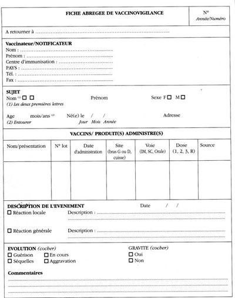

Dans de nombreux pays ou dans certaines circonstances, les infirmiers peuvent pratiquer des vaccinations. Ils doivent pour cela disposer d'une bonne connaissance des vaccins, de leur composition, de leur utilisation et de leurs contre-indications.

Ils peuvent aussi jouer un rôle important en vaccinovigilance en collectant et en rapportant l'information dont ils auront eu connaissance.

## I. Qu'est ce que la vaccinovigilance ?

Le groupe de travail du CIOMS/OMS a donné en 2007 la définition suivante :  
"La vaccinovigilance est la science et les activités de **détection, évaluation, compréhension et prévention** des effets indésirables ou de tout autre problème possiblement relié à un vaccin ou à la vaccination".

## II. Pourquoi la vaccinovigilance ?

Les essais cliniques conduits avant la mise sur le marché ne sont pas réalisés dans toutes les populations ni dans tous les pays, et les sujets qui participent aux essais sont sélectionnés par des critères d'inclusion et d'exclusion stricts.

Une surveillance après la mise sur le marché est nécessaire afin de prendre des mesures immédiates en cas de problème grave (par exemple : retrait d'un lot trop réactogène, nouvelle contre-indication, nouvelle réaction indésirable).  
La vaccinovigilance est une pharmacovigilance adaptée aux vaccins, qui sont des médicaments immunologiques ayant des particularités dans leur fabrication, leur distribution et leur administration. Elle permet de mieux connaitre le profil de tolérance des vaccins dans les différentes populations, de détecter les effets indésirables reliés aux produits afin non seulement de les prévenir mais aussi de mieux prescrire les vaccins en mettant à jour les notices.

## III. Qu’est ce qu’un événement indésirable ?

Un événement indésirable est un événement médical (maux de tête, éruption cutanée) ou une pathologie (syndrome de Guillain-Barré) qui peut survenir après toute prise médicamenteuse.

Certains événements vont pouvoir être reliés à la vaccination et on parlera d'**effet ou réaction indésirable post-vaccinal(e) ou MAPI (Manifestation indésirable Post-Immunisation)**, d'autres sont seulement une coïncidence et auraient pu survenir sans administration du produit.

## IV. Comment est organisée la  
vaccinovigilance/pharmacovigilance ?

Dans la majorité des pays, il existe des structures de pharmacovigilance (PV) mises en place par le Ministère de la Santé.

Les professionnels de santé, dont les infirmiers, doivent rapporter les événements indésirables dont ils ont connaissance aux centres ou unités de PV mises en place.  
Les laboratoires pharmaceutiques sont aussi obligés de disposer d'une structure de pharmacovigilance et d'informer régulièrement les autorités de santé. Des lois, des décrets ou des bonnes pratiques de pharmacovigilance décrivent la façon de rapporter les événements indésirables : quels types d'événements, sous quel format, dans quels délais.

Dans la plupart des pays, les **événements graves**, c'est-à-dire "les événements qui peuvent provoquer un **décès**, sont susceptibles de mettre la **vie en danger**, ou peuvent entraîner une invalidité ou **une incapacité importante ou durable**, ou provoquer ou prolonger une **hospitalisation**, ou se manifester par une **anomalie ou une malformation congénitale**" doivent être rapportés immédiatement, au plus tard sous 15 jours calendaires.

Les événements sont analysés avec des méthodes et par des experts appropriés et le résultat communiqué dans des rapports périodiques.  
A la suite de l'analyse, une surveillance particulière d'un événement ou la mise à jour des notices peut être effectuée : par exemple, une nouvelle précaution d'emploi ou une contre-indication est ajoutée, un nouveau MAPI est mentionné.

## V. Quel est le rôle des infirmiers ?

En tant qu'acteur de santé, l'infirmier peut collecter les données médicales sur l'événement indésirable à l'aide de fiches qu'il communiquera aux structures existantes dans chaque pays.

## VI. Quelles informations doivent être recueillies ?

Un minimum de données doit être collecté sur une fiche spéciale qui devrait être présente dans les centres de santé.

### 1. Données sur le(s) vaccin(s) et les éventuels autres médicaments pris avant le début de l'événement

Pour chaque produit, il faut indiquer :

#### Pour les vaccins

*   Nom du vaccin - présentation (mono/multi dose),
*   Numéro de lot - date d'administration, primo-injection ou rappel, provenance du vaccin.

#### Pour les autres médicaments

*   Nom du produit, numéro de lot et présentation.

### 2. Données sur la vaccination

Qui a vacciné (nom de la personne), où (centre de vaccination), comment (voie et lieu d'injection).

### 3. Données sur le vacciné

Initiales, âge, sexe, adresse.  
Maladies éventuelles au moment de la vaccination. Allergies connues.

### 4. Données sur l'événement indésirable

Description des signes cliniques avec dates de début et de fin, en séparant les réactions locales au point d'injection des réactions générales, ainsi que leur évolution et leur gravité.

## Conclusion

La vaccinovigilance est nécessaire pour fournir des indications sur le profil de tolérance des vaccins dans chaque population.  
Les infirmiers ont un rôle important à jouer en rapportant les événements indésirables dont ils ont connaissance aux structures mises en place dans chaque pays.

_Développement et Santé,n°195/196, 2009_