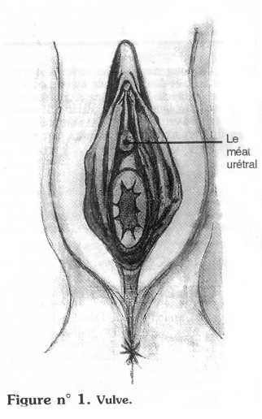
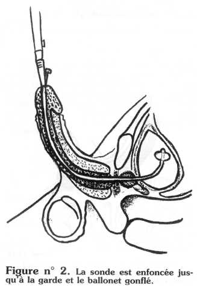
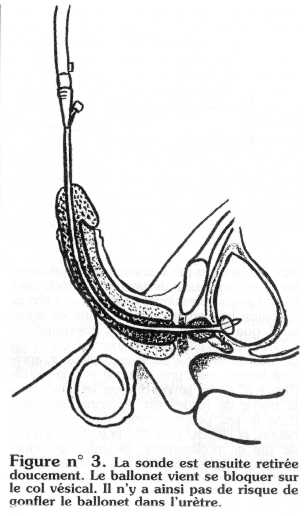
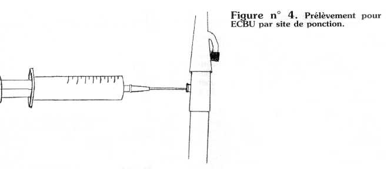
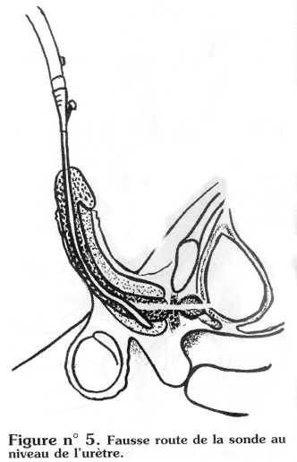
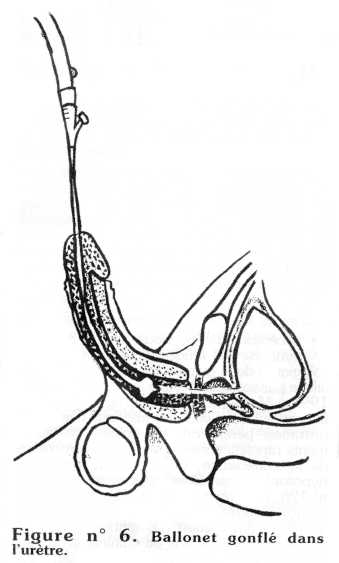

La sonde vésicale à demeure est indiquée en cas d'incontinence urinaire ou de rétention permanente (paraplégique, malade inopérable) lorsqu'aucune autre alternative n'est envisageable. 
Dans tous les cas, ce geste doit être atraumatique, indolore, stérile

## I. Matériel

*Les sondes.* Il existe différents modèles de sondes, mais dans le cas d'un sondage à demeure, on utilise une sonde à ballonnet, de Charrière 16 ou 18, 100 % silicone, car mieux tolérée.

*La poche de recueil*. Elle doit être stérile, vidangeable, munie d'une valve antiretour, avec un tuyau de bon calibre, semi-rigide, comportant un site de prélèvement à urine.

## II. Technique

Elle se décompose en plusieurs étapes :

- installation,
- hygiène,
- anesthésie locale (pour l'homme),
- sondage.

### 1. Installation

- Chez l'homme : installé sur le dos, les jambes légèrement écartées.
- Chez la femme : pour un meilleur repérape du méat urétral, la patiente doit être installée en position gynécologique, au besoin prévoir une aide et de la lumière.

### 2. Soins d'hygiène

Après une toilette à l'eau et au savon :

- Chez l'homme : décalotter et désinfecter avec un antiseptique (chlorexidine, dakin ... ). Laisser le gland entre 2 compresses imbibées d'antiseptique.
- Chez la femme : écarter les petites lèvres, repérer la situation du méat urétral (*figure n° 1*), et désinfecter avec un antiseptique.

### 3. Anesthésie locale

Uniquement chez l'homme. Elle permet d'anesthésier l'urètre jusqu'à la prostate, et d'augmenter la lubrification, en injectant dans l'urètre un gel de xylocaïne en conditionnement stérile. Poser un clamp pénien ou pincer. le gland entre les doigts, attendre 10 mn.

### 4. Le sondage vésical

#### Chez l'homme

Le temps que l'anesthésiant agisse, préparer une table stérile comprenant : des compresses stériles, un champ troué stérile, une cupule remplie d'huile stérile, une seringue remplie d'eau stérile (le volume d'eau à injecter pour remplir le ballonnet est indiqué sur la sonde), la sonde raccordée à la poche de recueil (système clos :  la sonde est connectée stérilement au sac collecteur d'urine avant le sondage, et grâce au robinet de vidange, ce système n'est jamais déconnecté, ce qui permet de réduire de façon importante les infections nosocomiales).

Après la toilette antiseptique, placer le champ troué, lubrifier la sonde sur toute sa longueur et l'introduire doucement en tenant la verge au zénith. Pousser la sonde jusqu'à la garde, gonfler le ballonnet et tirer sur la sonde jusqu'à ce qu'elle se bloque sur le col vésical. Cette manoeuvre empêche de gonfler le ballonnet dans l'urètre *(figures n° 2 et 3).*  
*Ne pas oublier de recalotter le patient (risque de paraphimosis).*

#### Chez la femme

Le matériel est identique, la seule difficulté est le repérage du méat, qui peut se trouver dans une position anatomique différente (position intravaginale), d'où l'importance d'une bonne installation (*figure n° 1).*

### 5. Conseils aux patients

- Boire au moins 1,5 l par 24 h, la diurèse doit être abondante afin d'éviter l'obstruction de la sonde.
- Avoir une hygiène rigoureuse, faire une toilette antiseptique du gland au moins 2 fois par jour.
- Vérifier le bon écoulement des urines.
- Ne déconnecter la sonde du sac collecteur qu'en cas d'urgence et de manière aseptique.
- Respecter les dates de changement de sonde (toutes les 6 semaines).
- Vider régulièrement le sac collecteur à l'aide du robinet de vidange. Il peut rester en place 15 à 20 jours.

Tout patient porteur d'une sonde à demeure voit ses urines infectées au bout de 3 jours si la règle du système clos n'a pas été respectée. Seules les infections urinaires symptomatiques (fièvre, douleurs, frissons, épididymite ... ) doivent être traitées par une antibiothérapie adaptée. Il est donc utile de faire un examen cytobactériologique des urines régulièrement afin de connaître les germes présents dans les urines ainsi que l'antibiogramme correspondant. L'ECBU doit s'effectuer uniquement par le site de prélèvement situé sur le sac collecteur, après désinfection, avec une seringue et une aiguille *(figure n° 4).* Ne jamais prélever les urines dans la poche de recueil car les urines présentes dans le sac peuvent avoir stagné plusieurs heures, et l'ECBU peut être faux. S'il n'y a pas de site de prélèvement, recueillir les urines directement à la sortie de la sonde, en déconnectant la sonde du sac, de façon aseptique.

## III. Incidents en cours de sondage

- *La sonde bute.* La lubrification est insuffisante. Dans ce cas, il faut relubrifier la sonde sur toute sa longueur, et refaire une tentative. Si le sondage reste impossible, prévenir le médecin.
- Il peut exister une sténose de l'urètre, ou une courbure anatomique plus marquée. Dans ce cas, il faut utiliser une sonde béquillée (type Dufour) ou mettre un cathéter sus-pubien.
- *La fausse route.* C'est la perforation de l'urètre par la sonde, elle se traduit par des douleurs, des urétrorragies, des difficultés à gonfler le ballonnet et il n'y a pas de retour d'urine franc (*figure n° 5*). Dans ce cas, il faut prévenir le médecin qui choisira de placer un cathéter sus-pubien, ou une sonde sous contrôle endoscopique.

- *Le ballonnet gonflé* dans l'urètre. La sonde n'a pas été poussée jusqu'à la garde. C'est une erreur technique qui se traduit par des urétrorraqies, des douleurs, des difficultés à gonfler le ballonnet, il n'y a pas de mouvement de va-et-vient de la sonde, il n'y a pas d'urine (*figure* *n° 6).* Dans ce cas, il faut dégonfler le ballonnet, enfoncer la sonde jusqu'à la garde, et regonfler le ballonnet.  
  **Attention aux comateux et paraplégiques qui ne ressentent pas la douleur.**

- *Pas de retour d'urine.* La vessie est vide, ou bien il s'agit d'une faute technique (fausse route ou ballonnet gonflé dans l'urètre). Il faut faire boire le patient et surveiller sa diurèse. Si le sac collecteur reste vide, il faut changer la sonde. Si malgré cela, il n'y a toujours pas d'urine, pensez à l'anurie et prévenez le médecin.

## IV. Incidents à distance

- *Peu ou pas d'urine dans la poche de recueil*. Plusieurs cas de figures sont possibles. Soit la sonde est bouchée par des caillots ou des incrustations calcaires, soit la sonde est déplacée, soit le patient n'a pas assez bu.
- *La sonde est bouchée.* Le patient se plaint de douleurs pelviennes, et il y a des fuites autour de la sonde. Dans ce cas, il faut faire des lavages de vessie à la seringue et augmenter les boissons. Si la sonde ne peut être débouchée, il faut la remplacer.
- *La sonde est déplacée.* La longueur visible de la sonde est anormalement longue, le patient se plaint de douleurs, et il y a aussi des fuites autour de la sonde. Dans ce cas, la sonde doit être changée.
- *La sonde* *arrachée*. Ceci provoque une urétrorragie importante, il faut remettre une sonde en place et la mettre en traction si le saignement persiste. Mise en traction : tirer sur la sonde et nouer une compresse sur la sonde au contact du méat urétral. Cette traction ne doit pas être maintenue plus d'une heure, car il y a risque d'escarre du méat.
- *Fuites autour de la sonde*. La sonde est bouchée ou déplacée. Il faut vérifier la perméabilité de la sonde, et la changer si nécessaire.  
  Il peut s'agir de contractions involontaires de la vessie. Après avoir vérifié la perméabilité de la sonde, le médecin prescrira des antispasmodiques (oxybutynine ..).
- *Hématurie*. Elle peut être due à une inflammation chronique de la vessie (due elle-même à la présence de la sonde), ou à une pathologie (tumeur de vessie, calcul ... ). Dans ce cas, il faut pratiquer des lavages de vessie à la seringue et augmenter les boissons. Si l'hématurie persiste, il faut prévenir le médecin.

Même si les malades porteurs de sonde à demeure sont de plus en plus nombreux, il faut toujours se demander s'il n'existe pas une meilleure solution. L'indication du sondage à demeure peut être remis en question en fonction de l'évolution de la situation d'un patient. Il ne faut donc pas considérer le sondage à demeure comme une fatalité, mais il faut savoir qu'il est toujours préférable à la couche.

*Développement et Santé, n°146, avril 2000*
