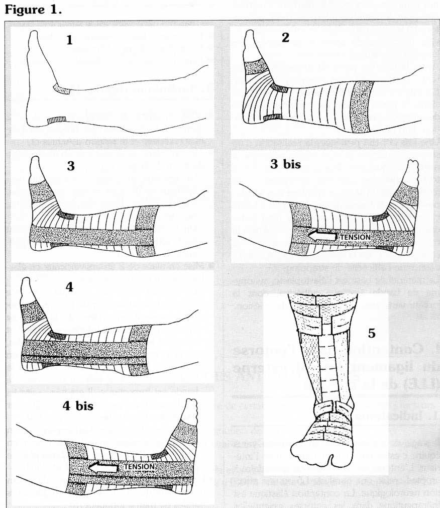
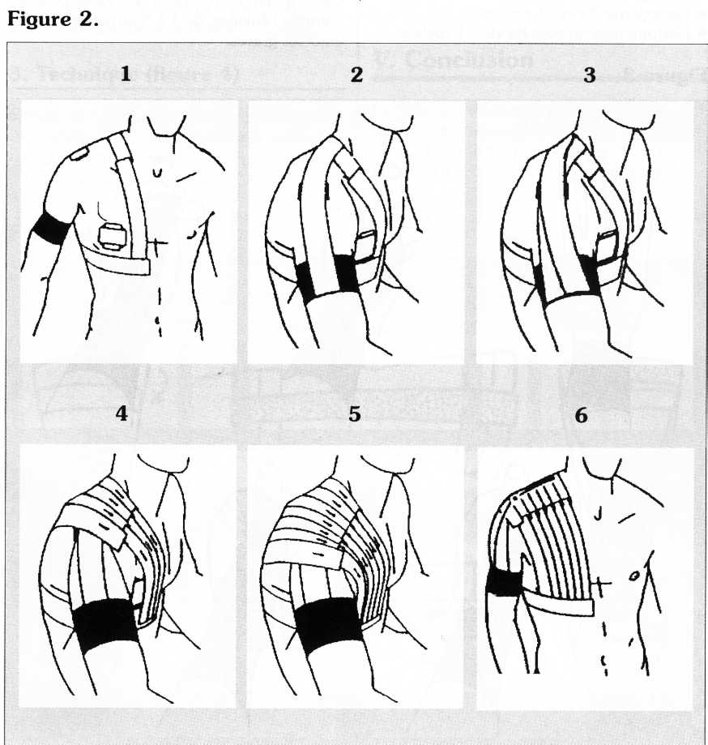
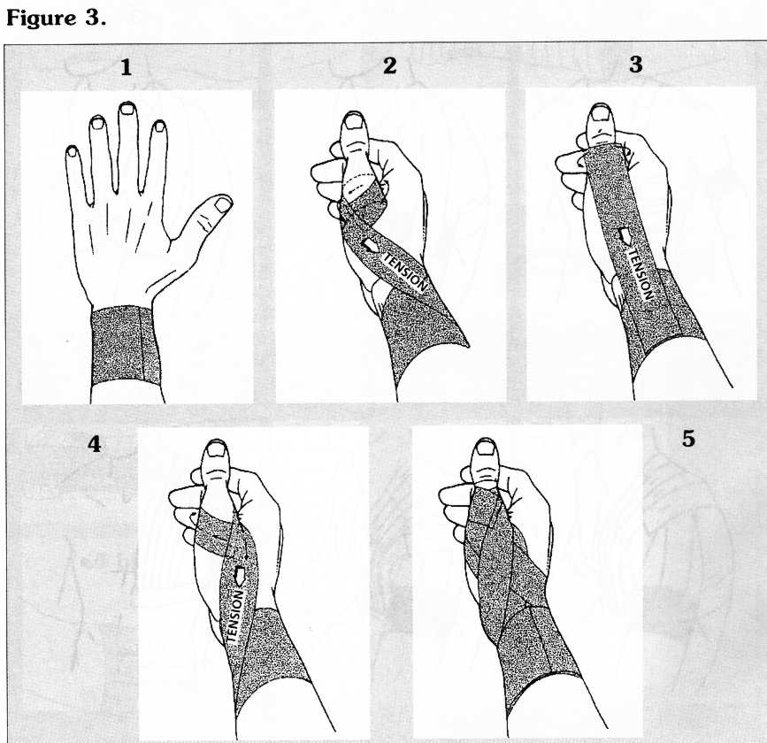
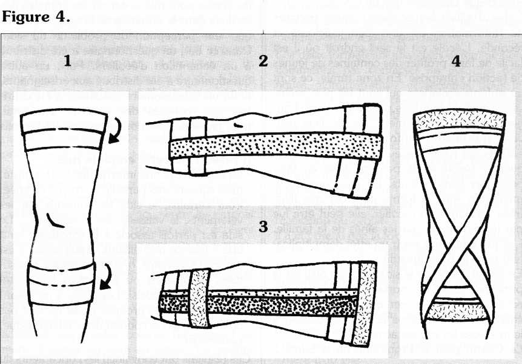

Avant la mise en place du strapping, on doit tenir compte de son support, la peau. L'existence de lésions cutanées à type d'érosions, de plaies ou de phlyctènes implique une désinfection préalable et, si besoin, la réalisation d'un pansement.

Une fois la peau protégée, la réalisation d'un strapping efficace et confortable nécessite le respect de quelques règles, quelle que soit la topographie : les embases ou ancrages sont indispensables à la mise en place des bandes posées sous la forme de circulaires ou d'hémi-circulaires, sans tension excessive pour éviter une compression et "un effet garrot". Après la mise en place de l'ancrage, les bandes actives sont posées. C'est la tension de ces bandes qui détermine l'efficacité du strapping.

Le matériel de base est l'élastoplaste, synonyme de bande élastique adhésive, dont la largeur varie avec la topographie de la lésion.

## I. Contention dans l'entorse du ligament  
latéral externe (LLE) de la cheville

### **1. Indications**

Il s'agit de traumatismes en inversion varus équin, c'est-à-dire le pied tourné vers l'intérieur. L'entorse est essentielle ou secondaire à un pied creux, une paralysie L5 ou une affection neurologique. La contention élastique est thérapeutique dans les entorses essentielles et adjuvante dans les autres cas.

### **2. Matériel**

Le matériel nécessaire est le suivant :

*   Elastoplaste largeur 6 cm : 2 rouleaux.
*   Elastoplaste 3 cm : 1 rouleau.
*   Elastomousse ou sous bande : 1 rouleau.

### **3. Technique (figure 1)**

*   Mise en place de l'élastomousse et de 2 compresses protégeant le tendon du jambier antérieur et le tendon d'Achille _(1)._

*   Mise en place de 2 ancrages en élastoplaste de 6 cm de largeur _(2)_ _:_
    *   Un ancrage supérieur, à l'union du tiers inférieur et du tiers moyen de la jambe, sous la forme d'une circulaire appliquée sans tension.
    *   Un ancrage inférieur, au niveau de l'avant pied, sous la forme d'une circulaire appliquée sans tension.
*   Mise en place de 2 étriers verticaux en élastoplaste de 6 cm de largeur :
    *   Le premier étrier est appliqué à la face interne de la jambe, depuis l'ancrage supérieur, passant en arrière de la malléole interne, puis à la face inférieure du talon et revenant sur la face externe de la jambe, jusqu'à l'ancrage supérieur, en passant en arrière de la malléole externe. C'est sur la face externe que la tension mise dans la bande est importante. Il est nécessaire ici de bien étirer la bande pour éliminer partiellement son élasticité _(3 et 3bis)._
    *   Le second étrier vertical est appliqué selon le même principe, mais il doit passer en avant des 2 malléoles et chevauche le premier en tuile, de moitié _(4 et 4bis)._
*   Fermeture avec de l'élastoplaste de 3 cm de largeur que l'on découpe en plusieurs bandes de même longueur _(5)_ _:_
    *   Fermeture inférieure : on applique la première bande à la face plantaire, au niveau de l'ancrage inférieur, en rabattant les deux chefs latéraux sur le dessus du pied, sans tension. On procède de la même manière avec les autres bandes en les faisant chevaucher en tuile à demi, jusqu'à ce que l'on atteigne le devant de la jambe.
    *   Fermeture supérieure : on applique la première bande à la face postérieure de la jambe, en rabattant les deux chefs latéraux sur le devant de la jambe, depuis l'ancrage supérieur, jusqu'au niveau des malléoles. Les bandes successives doivent se chevaucher en tuile et être posées sans tension.

### **4. Durée d'immobilisation**

Elle est de 15 jours pour les entorses bénignes et de 5 semaines pour les entorses graves.

Il faut souligner la gravité et l'importance du diagnostic de variété.

## **II. Contention de l'épaule**

### 1. Indications

Ce sont les disjonctions ou luxations acromio-claviculaires et les fractures de la clavicule peu ou pas déplacées.

Dans les disjonctions acromio-claviculaires, comme pour les entorses de chevilles, on doit être vigilant et éliminer tout ce qui n'est pas justifiable de la méthode qui sera réservée aux formes sans déplacement ou de déplacement inférieur à 5 mm (stades 0 et 1).

### 2. Technique (figure 2)

*   Protection du mamelon _(1)._
*   Ancrage thoracique et brachial _(1)._
*   Demi-circulaire de thorax _(1)._
*   Jeu d'attelles allant de l'ancrage thoracique à l'ancrage brachial _(2 et 3)._
*   Demi-étriers postérieurs et antérieurs pour réaliser le verrouillage du thorax en abaissant la clavicule _(4 et 5)._
*   Demi-circulaire de thorax (6).

### 3. Durée de port

4 semaines

  

## **III. Contention du pouce**

### 1. Indication

C'est l'entorse du ligament latéral ulnaire de la métacarpo-phalangienne du pouce, pour stabiliser la prise pouce-index sur son versant externe. Le traitement de l'entorse grave peut être chirurgical.

### 2. Matériel

Le matériel nécessaire est le suivant :

*   Elastoplaste largeur 6 cm : 1 rouleau.
*   Elastoplaste 3 cm : 1 rouleau.
*   Elastomousse ou sous-bande : 1 rouleau.

### 3. Technique (figure 3)

*   Ancrage en élastoplaste de 6 cm au niveau poignet _(1)._

- Attelle de limitation du valgus et de la rotation interne en élastoplaste de 3cm _(2)._

*   Attelle de limitation de la flexion de la métacarpo-phalangienne en élastoplaste de 3 cm _(3)._
*   Attelle de limitation du varus et de la rotation externe en élastoplaste de 3cm _(4)._
*   Ancrage en élastoplaste _(5)._

### 4. Durée de port

Cette durée va de 12 à 15 jours pour les entorses bénignes, de 4 à 5 semaines pour les entorses graves.

  

## **IV. Contention du genou**

### **1.** Indication

C'est l'entorse bénigne du ligament latéral interne (LLI). Les autres lésions doivent être éliminées par l'examen clinique et les radios. L'entorse grave du LLI isolée peut-être traitée par cette méthode.

### 2. Matériel

Le matériel nécessaire est le suivant :

*   Elastoplaste largeur 6 cm : 2 rouleaux,
*   Elastoplaste largeur 3 cm : 1 rouleau,
*   Elastomousse ou sous-bande : 2 rouleaux.

### 3. Technique (figure 4)

*   Mise en place de 2 bandes d'élastoplaste d'ancrage 10-15 cm, au-dessus et au-dessous du genou, ouvertes en arrière pour ne pas comprimer les vaisseaux _(1)._

*   Mise en place de 2 étriers verticaux en élastoplaste de 6 cm de largeur _(2)_ _:_
    *   Le premier est appliqué à la face interne de la jambe, depuis l'ancrage supérieur jusqu'à l'ancrage inférieur.
    *   Le deuxième étrier vertical est appliqué à la face externe de la jambe _(3)._
*   Alternance des circulaires et étriers. Enfin croisements antérieurs _(4)._

### 4. Durée de port

Cette durée va de 12 à 15 jours pour les entorses bénignes, de 4 à 5 semaines pour les entorses graves.

## V. Conclusion

La technique du strapping pour les lésions évoquées donne d'excellents résultats. Ces bons résultats sont largement fonction de la rigueur apportée à la confection de l'appareillage.

_Santé et développement, n° 154, août 2001_