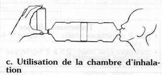
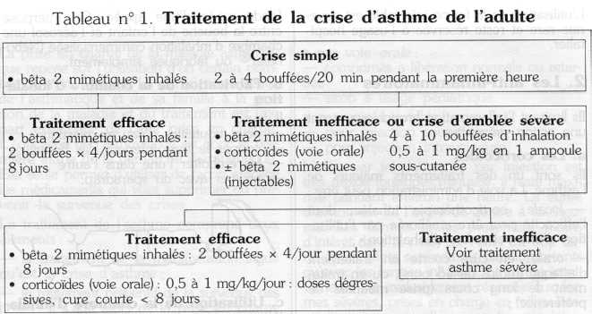
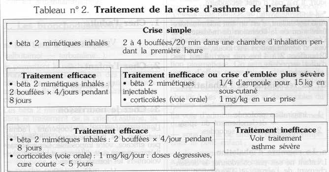
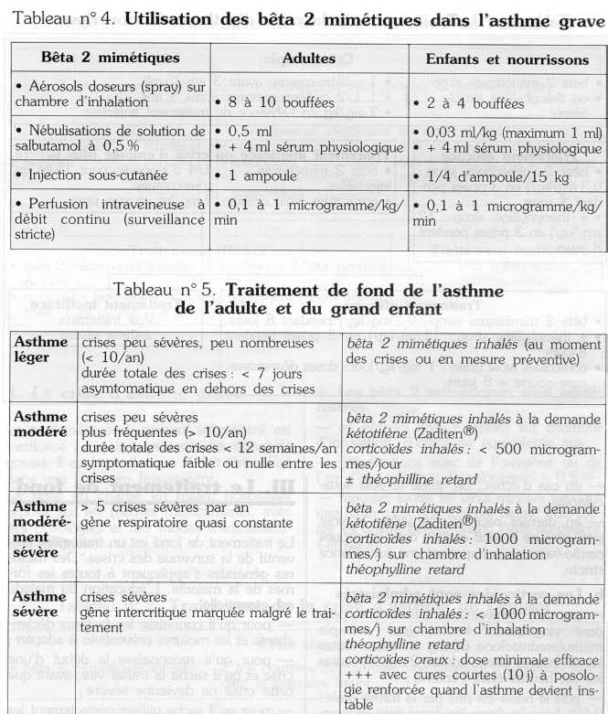
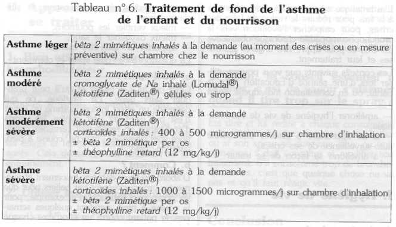

La prise en charge de la maladie asthmatique repose sur l'utilisation d'un certain nombre de médicaments. La participation active de l'asthmatique et de sa famille à la gestion de la maladie et du traitement est une part essentielle de cette prise en charge. L'éducation de l'asthmatique est donc la première étape de la démarche thérapeutique. Elle seule permet d'utiliser de façon efficace les médicaments qui vont supprimer ou prévenir la survenue des crises.

Le traitement de l'asthme comprend deux éléments :

- le traitement de la manifestation aiguë qu'est la crise d'asthme ;

- le traitement préventif de la survenue des crises : il s'agit alors de la prise en charge d'une maladie chronique pour laquelle la stratégie thérapeutique est élaborée en fonction de la sévérité de la maladie.

## **I. Les médicaments** **de l'asthme**

Les médicaments de la crise d'asthme doivent être actifs sur :

- l'obstruction bronchique : ce sont les bronchodilatateurs,

- l'inflammation des voies aériennes: ce sont les anti-inflammatoires.

### **1. Les bronchodilatateurs**

**a. Les bêta 2 mimétiques**

(salbutamol - terbutaline ... ).

Ils permettent le relâchement du muscle lisse bronchique (par stimulation des récepteurs bêta 2). Ils n'ont pas d'effet anti-inflammatoire, mais ils augmentent la clairance mucociliaire.

Les bêta 2 mimétiques sont les plus utilisés dans le traitement de la crise d'asthme. Ils existent sous diverses formes permettant l'administration :

*   par voie _locale._

- aérosol doseur pressurisé (spray)

- solutions pour nébulisation

- poudre pour inhalation.

*   par voie _orale:_

- comprimés à libération normale ou retardée

- sirop à usage pédiatrique.

*   par voie _injectable_

- pour injection sous-cutanée

- pour injection intraveineuse.

L'effet par inhalation ou par injection est très rapide (quelques minutes), il reste maximal pendant environ une heure. La durée d'action est de l'ordre de quatre à six heures. Les formes orales présentent moins d'intérêt dans la crise, car l'effet est trop tardif et les effets secondaires plus importants qu'avec les formes inhalées. La forme intraveineuse est exclusivement réservée aux formes sévères, prises en charge en milieu hospitalier, avec surveillance cardio-vasculaire. Les bêta 2 mimétiques s'administrent alors en injection intraveineuse à débit continu.

Les contre-indications absolues des bêta 2 mimétiques sont rares: troubles du rythme cardiaque non contrôlés, insuffisance cardiaque décompensée.

**b. La théophylline**

C'est le plus ancien médicament de l'asthme. Bronchodilatateur, moins efficace que les bêta 2 mimétiques, il agit également en augmentant la clairance mucociliaire et en améliorant la contraction des muscles striés (diaphragme).

L'utilisation de la théophylline est limitée par le risque de toxicité: en effet, les concentrations toxiques sont proches des concentrations thérapeutiques. Le métabolisme de la théophylline varie selon les sujets, leur âge (plus rapide chez les enfants), certains médicaments associés (macrolides en particulier). Le traitement est difficile à ajuster si on ne peut réaliser des dosages de la concentration plasmatique. On sera alerté par la survenue d'effets secondaires, dépendants de la dose: nausées, vomissements, tremblements, tachycardie. Un surdosage peut aboutir à des convulsions et des troubles du rythme cardiaque.

La voie d'administration est essentiellement orale :

- sous forme de sirop, d'utilisation simple chez le petit enfant ;

- de comprimés, en particulier les formes à libération prolongée intéressantes dans le traitement de long cours.

L'utilisation de la forme injectable est devenue rare et reste réservée à l'usage hospitalier.

### **2. Les anti-inflammatoires**

Ils limitent l'inflammation bronchique et ont une action préventive.

**a. Les corticoïdes**

Ils sont un des traitements majeurs de l'asthme. La voie d'administration peut être:

_- locale_: corticothérapie inhalée, dont l'efficacité peut être améliorée par l'utilisation d'une "chambre d'inhalation " ;

_- orale:_ en cure courte en traitement d'attaque (moins de 15jours), ou en traitement de long cours (prise matinale de préférence) ;

_- intraveineuse:_ réservée au traitement d'urgence.

Les effets secondaires sont nombreux, dépendant de la posologie et de la durée du traitement. Aussi, leur utilisation par voie intraveineuse ou orale ne doit s'envisager qu'après échec des traitements par bêta 2 mimétiques bien conduits.

**b. Les antiallergiques**

Ils ne sont actifs que dans le cadre d'un traitement préventif.

*   _Le kétotifène (Zaditen®)_

Il a une action antihistaminique et antidégranulante. Actif essentiellement chez l'enfant, il s'administre par voie orale (2 prises par jour). Il n'a pas d'effet secondaire.

*   _Le cromoglycate de sodium (Lomudal®)_

Antidégranulant, c'est un anti-inflammatoire (inhibition de la libération de médiateurs à l'origine de la réaction inflammatoire). La voie d'administration est locale, en spray (2 bouffées 2 à 4 fois par jour). Il n'a pas d'effet secondaire.

### **3. La technique de l'inhalation**

1 - inspiration profonde  
=> déclenchement du spray  
2 - apnée de quelques secondes

**a. La chambre d'inhalation**

L'enfant ne sait pas coordonner le déclenchement de l'aérosol et l'inspiration profonde suivie d'une apnée. On interpose entre la bouche de l'enfant et l'aérosol une chambre d'inhalation commercialisée (Nébuhaler_®_ ) ou fabriquée simplement.

**b. Fabrication de la chambre d'inhalation**

Il faut :

*   deux bouteilles d'eau en plastique
*   couper le tiers inférieur des bouteilles
*   les emboîter l'une dans l'autre
*   arrimer avec du sparadrap.

**c. Utilisation de la chambre d'inhalation**

L'enfant place sa bouche à une extrémité de la chambre, on ajuste l'aérosol doseur à l'autre extrémité. Après avoir pulvérisé trois doses de l'aérosol dans la chambre, on laisse l'enfant respirer une dizaine de fois, dans la chambre, le nez pincé. Cette technique peut être utilisée chez l'enfant à partir de deux ans.

On peut l'utiliser pour l'administration des bêta 2 mimétiques, des corticoïdes inhalés.

## **II. Le traitement de la crise** **d'asthme**

### **1. Chez l'adulte**

### **2. Chez l'enfant**

### **3. Chez le nourrisson**

Le jeune enfant est peu coopérant: l'administration des thérapeutiques inhalées est peu efficace, voire impossible. Les schémas thérapeutiques sont différents et utilisent plus volontiers les formes orales.

### **4. La crise d'asthme grave**

Le traitement correctement administré est inefficace. Le malade présente des signes de gravité. Il est hypoxémique. Il doit être référé dans une structure hospitalière.

La prise en charge en milieu hospitalier repose sur les mêmes médicaments, avec des posologies et des modes d'administration différents.

**a. Les bêta 2 mimétiques sont administrés**

- en aérosol doseur (spray) sur chambre d'inhalation, d'efficacité équivalente aux

- nébulisations avec de l'oxygène ou de l'air d'une solution de salbutamol à 0,5%;

- répétées toutes les vingt minutes pendant une heure puis une fois par heure, puis toutes les quatre heures quand l'état du patient s'améliore ;

- en cas d'échec, on utilise la voie souscutanée ;

- en dernier recours, on utilise la voie intraveineuse à débit continu dont les risques cardio-vasculaires imposent une surveillance stricte.

**b. Les corticoïdes sont administrés**

- par voie intraveineuse à forte dose pendant vingt-quatre heures (par exemple méthylprednisolone 60 mg en bolus toutes les six heures chez l'adulte, 2 mg/kg toutes les six heures chez l'enfant);

- puis le relais est pris par la forme orale: 0,5 à 1 mg/kg/jour, les doses sont progressivement diminuées en une semaine.

**c. La théophylline orale** est poursuivie chez les patients qui étaient traités avant la crise par théophylline. L'utilisation de la forme injectable est devenue exceptionnelle, les risques de toxicité sont importants.

**d. Une antibiothérapie** est prescrite s'il existe des signes d'infection des voies respiratoires. Les antibiotiques sont plus facilement prescrits chez les enfants (attention au risque d'allergie).

## **III. Le traitement de fond**

Le traitement de fond est un traitement préventif de la survenue des crises. Des mesures générales s'appliquent à toutes les formes de la maladie. L'éducation du malade est essentielle :

- pour qu'il connaisse les facteurs déclenchants et les mesures préventives à adopter ;

- pour qu'il reconnaisse le début d'une crise et qu'il sache la traiter vite, avant que cette crise ne devienne sévère ;

- pour qu'il sache utiliser correctement les traitements dont il dispose : utilisation des sprays à bon escient et de façon efficace.

Le traitement de fond dépend de la sévérité de l'asthme. La stratégie thérapeutique est résumée dans les tableaux 5 et 6 chez l'adulte et chez l'enfant.

_L'asthme à dyspnée continue_ (forme modérément sévère ou sévère) est difficile à traiter. Le traitement de fond repose sur les corticoïdes inhalés et la théophylline retard, mais bien souvent, des cures de corticoïdes par voie orale sont nécessaires: la posologie minimale efficace doit être administrée, ce qui peut imposer de fréquents changements thérapeutiques. Les effets secondaires de cette corticothérapie doivent être prévenus et surveillés. Des cures courtes à posologie renforcée (0,5 à 1 mg/kg/j) sont prescrites quand l'asthme devient instable. La posologie totale des corticoïdes oraux ne doit pas dépasser trois grammes par an.

**Conclusion**

Le traitement bronchodilatateur par bêta 2 mimétiques inhalés est le traitement de première intention de la crise d'asthme: son but est de lever l'obstruction bronchique. L'association de corticoïdes n'est systématique qu'en l'absence d'amélioration rapide et durable.

L'absence de réponse au traitement conduit à l'utilisation de posologies plus élevées et de formes d'administration différentes (formes orales ou injectables). Malgré le traitement précoce et bien conduit d'une crise d'asthme, ilexiste des formes graves. Leur prise en charge nécessite une structure hospitalière où les soins seront poursuivis sous surveillance cardio-respiratoire.

Le traitement de fond doit être expliqué au malade: indications des traitements, manipulation des sprays, importance de la poursuite du traitement. Le patient sera ainsi capable de prévenir ou de limiter la survenue des crises sévères.

La surveillance de long cours est essentielle, en particulier chez les enfants, afin d'évaluer le profil évolutif de la maladie, d'adapter la prise en charge thérapeutique et de préserver le devenir respiratoire.

_Développement et Santé, n°114, décembre 1994_