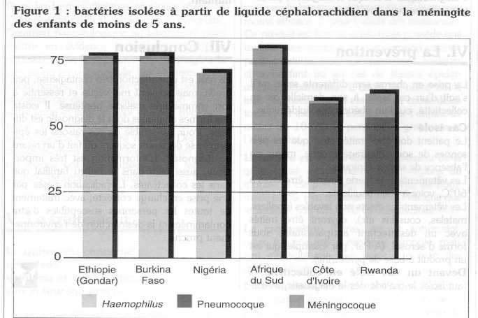
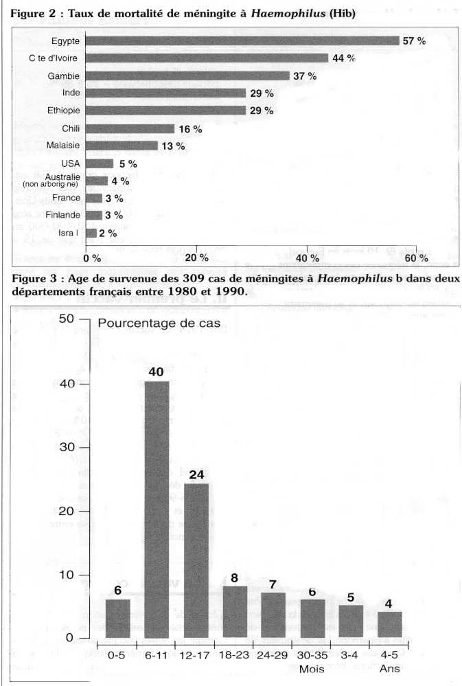
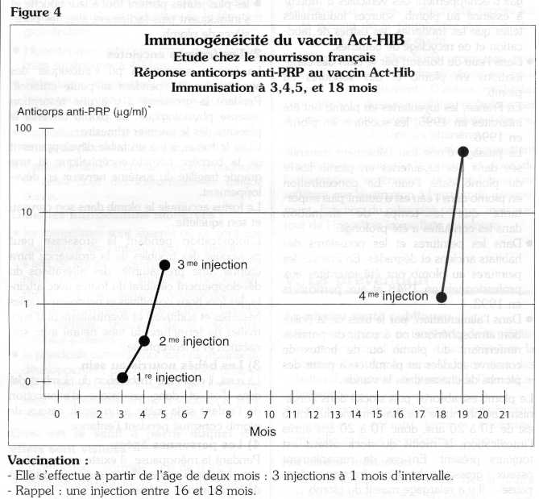

Toutes les études épidémiologiques effectuées dans les pays industrialisés ont montré qu'_Haemophilus_ était responsable de :

*   30 à 45 % des méningites purulentes,
*   100 % des épiglottites et d'un grand nombre de cellulites bactériennes, de bactériémies, d'arthrites et d'ethmoïdites.

Mais ce germe est aussi la cause de nombreuses pneumonies. Malheureusement, aucun examen complémentaire à ce jour n'est suffisamment fiable pour attribuer, de façon certaine, un germe à une pneumonie.

D'autre part, nous avons vu augmenter la résistance de l'Haemophilus à l'amoxicilline. Heureusement, l'arrivée du vaccin anti-Haemophilus conjugué a constitué une véritable révolution : en effet, remarquablement toléré, efficace dès le premier trimestre de la vie, il protège à près de 90 % après 2 doses et à 98 % après 3 doses, contre toutes les infections invasives.

C'est la raison pour laquelle ce vaccin est entré dans le calendrier vaccinal des pays de la C.E.E. et d'Amérique du Nord.

**Qu'en est-il _d'Haemophilus_ b dans le** **reste du monde ? _(figure 1)_**

Plusieurs études épidémiologiques effectuées en Gambie, en Côte d'Ivoire, en Egypte, en Afrique du Sud et en Asie ont abouti aux mêmes conclusions avec trois différences :

*   l'incidence d'_Haemophilus_ b est **10** **fois** **supérieure** à celle de l'Europe (quatre fois supérieure aux U.S.A.) ;

*   l'âge moyen de survenue des méningites est de **6 mois** (9, 10 mois en Europe),
*   enfin, la fréquence des complications graves (mort ou séquelles neurologiques) varie de 26 à 57 %, s'expliquant le plus souvent par le retard au diagnostic et au traitement.

Quant aux infections pulmonaires, l'étude faite en Gambie (1997) montrant que le vaccin entraînait une diminution de 20 % des hospitalisations pour pneumonies vient confirmer le rôle important d'_Haemophilus_ b dans cette pathologie.

En pratique, il est donc évident que les jeunes enfants de toute la planète doivent bénéficier du vaccin anti-_Haemophilus_ b dès le 2e mois, en l'associant au vaccin DTCP (Diphtérie - tétanos - coqueluche - polio) pour en diminuer le coût. Rappelons que dès la première dose de vaccin PRP-T (ou PRP-OMC) la protection obtenue est comprise entre 20 et 60%.

## 1. Epidémiologie

On oppose les souches entourées d'une capsule polyosidique, dont la plupart, pathogènes, sont de type b responsables d'infections graves avant cinq ans, à la souche non capsulée, hôte de la sphère ORL à tous les âges de la vie : bien que peu pathogène, elle est responsable de 90% des otites à _Haemophilus_, de sinusites, de bronchites. C'est elle également qui provoque certaines surinfections bronchiques dans la mucoviscidose (_tableau_ _1)._

L'incidence des infections graves à Hib est, pour une raison inconnue, très variable d'un pays à l'autre : ainsi aux Etats-Unis, elle se situe entre 19/100 000/an entre zéro et quatre ans ; elle atteint 400/100 000 en Alaska ; en France, elle n'est que de 15 à 20/100 _000 (Figure 2)._

## II. Le premier vaccin

Dès 1974, un vaccin contenant le polyoside de _l'Haemophilus_ b (PRP) fut étudié chez l'enfant par Peltola et Makela. Dans ce premier travail, un taux supérieur ou égal à 1 microgramme/mI, trois semaines après la vaccination, ne fut obtenu que chez 45 % des enfants âgés de douze à dix-sept mois, 75 % des enfants de dix-huit à vingt-trois mois et 90 % après vingt-quatre mois.

Sachant que l'âge moyen de la méningite à _Haemophilus_ est de dix mois _(figure 3),_ on comprend que l'efficacité clinique d'un tel vaccin fut décevante. En effet, si le vaccin PRP protège à 90 % les enfants entre dix-neuf et soixante et onze mois, il ne modifie guère l'incidence des infections graves entre trois et dix-sept mois.

## III. Le vaccin conjugué

L'échec de ce premier vaccin est attribué à l'antigénicité particulière des polysaccharides. Comme les autres vaccins polysaccharidiques (pneumocoque, méningocoque), le vaccin PRP est incapable d'utiliser la coopération lymphocytaire.

Malheureusement, chez l'enfant, le système lymphoïde B dépendant n'est mature qu'après dix-huit mois.

Le but des immunologistes fut donc de modifier l'antigène PRP pour en faire un antigène thymo-dépendant utilisant la coopération T et B.

C'est en couplant une protéine T dépendante que le résultat fut obtenu. Cette conjugaison est réalisée avec l'antigène tétanique, diphtérique ou la protéine de la membrane externe du méningocoque B.

Ainsi, en France, une réponse sérologique est observée chez le nourrisson dès le troisième mois avec le vaccin PRP tétanos. Un effet rappel-franc est noté après les deuxième et troisième injections effectuées au quatrième et cinquième mois _(figure 4)._ La tolérance du vaccin est celle des autres vaccins, polyosidiques, c'est-à-dire bonne : 5 % de réactions fébriles (température supérieure à 38°5 C) et 20 % d'érythème local sans lendemain.

Il reste à prouver l'efficacité clinique des vaccins conjugués : en Finlande, le PRP diphtérie a entraîné une protection de 90 %. En Alaska, les taux ont été franchement plus faibles. Depuis janvier 1990, tous les enfants de Finlande sont vaccinés avec le vaccin anti-_Haemophilus_ PRP tétanos et seulement deux cas d'infections graves ont été notifiés ; la protection est de l'ordre de 99 %. En France (Val-de-Marne), en vaccinant 60 % des enfants, nous avons obtenu 90 % de protection.

  

_Développement et Santé, n°160, Août 2002_