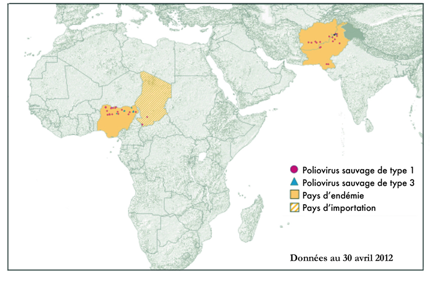
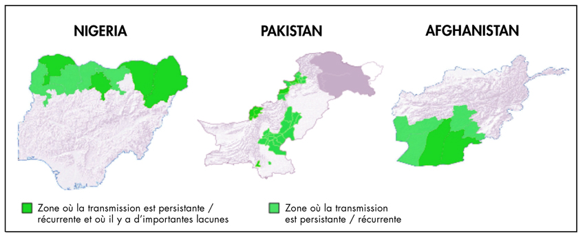
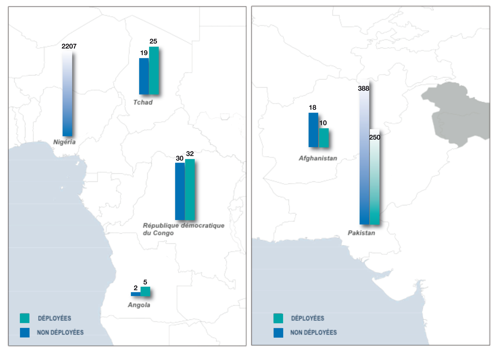
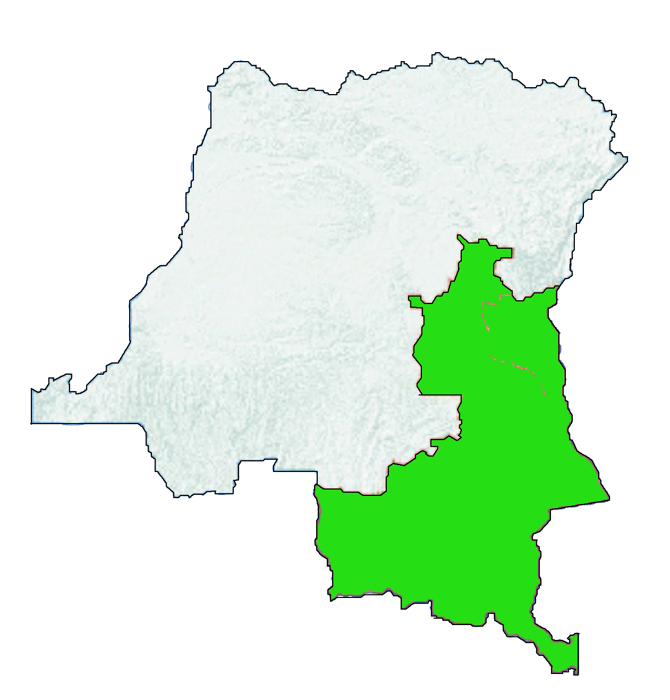
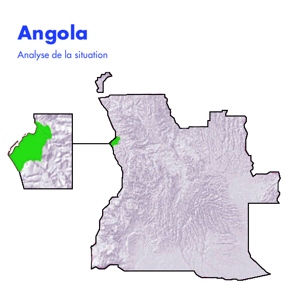

## I. De quelle maladie s’agit-il ?

### 1. Le poliovirus

C’est un virus appartenant à la famille des Entérovirus, responsable d'une maladie très contagieuse. La maladie peut être causée par 3 types de souches sauvages, les poliovirus de types 1, 2 et 3.

Dans la très grande majorité des cas, l’infection (par contamination oro- fécale) est intestinale et inapparente, entraînant tout au plus un syndrome grippal ou une diarrhée fébrile modérée.  
En revanche, dans un cas sur 200, le virus atteint le système nerveux : il crée des lésions neurologiques dans la corne antérieure de la moelle.

### 2. Clinique de la maladie 

Le tableau clinique se constitue quelques heures après la contamination, avec apparition initiale d’une fièvre, d'une asthénie, de céphalées, de vomissements, puis d'une raideur de la nuque et de myalgies intenses, notamment au niveau des membres. Très rapidement, en quelques heures, le tableau se complique de paralysie flasque, avec le plus souvent une atteinte des membres, et parfois également des muscles respiratoires, pouvant alors conduire au décès.

Ce virus est pathogène principalement chez l’enfant de moins de 5 ans, mais peut également atteindre des enfant plus âgés voire des adultes si ceux-ci ne sont pas immunisés.

### 3. Conséquences

Dans 1 cas sur 200, lors de l’infection, il persiste une paralysie irréversible, pouvant conduire au décès dans 1,5 % à 10 % des cas en cas d'atteinte des muscles respiratoires.

Il n’existe pas de traitement pour cette maladie, seules les conséquences pourront éventuellement prises en charge (rééducation surtout, matériel orthopédique…).

Le seul moyen de se défendre contre ce virus est donc la prévention par la vaccination qui confère une immunité à vie si elle est correctement réalisée.

## II. De quels vaccins dispose-t-on ?

### OPV trivalent, vaccin vivant

Vaccin protégeant à la fois contre les 3 souches de virus sauvages, conférant une immunité active et passive limitant la propagation des 3 virus.

### OPV bivalent, vaccin vivant

Vaccin protégeant contre les souches 1 et 3 de virus sauvages, conférant une immunité active et passive limitant la propagation des virus de types 1 et 3.

### IPV, vaccin tué injectable

Protégeant contre les 3 souches de virus sauvages, les sujets vaccinés mais pas leur entourage : les vaccinés peuvent être porteurs de virus sauvage dans leur tube digestif et peuvent donc éventuellement  contaminer leur entourage. 

<table>
<caption>Tableau I. Les différents vaccins polio</caption>

<thead>

<tr>

<th scope="col" style="width: 49px;">Vaccins</th>

<th scope="col" style="width: 49px;">Type 1</th>

<th scope="col" style="width: 40px;">Type 2</th>

<th scope="col" style="width: 42px;">Type 3</th>

<th scope="col" style="width: 52px;">Immunité  
active</th>

<th scope="col" style="width: 53px;">Immunité  
passive</th>

<th scope="col" style="width: 71px;">Coût</th>

</tr>

</thead>

<tbody>

<tr>

<td style="width: 53px;">OPV  
trivalent</td>

<td class="rtecenter" style="width: 53px;">+</td>

<td class="rtecenter" style="width: 44px;">+</td>

<td class="rtecenter" style="width: 46px;">+</td>

<td class="rtecenter" style="width: 56px;">+</td>

<td class="rtecenter" style="width: 57px;">+</td>

<td class="rtecenter" style="width: 75px;">Faible</td>

</tr>

<tr>

<td style="width: 53px;">OPV   
bivalent</td>

<td class="rtecenter" style="width: 53px;">+</td>

<td class="rtecenter" style="width: 44px;"> </td>

<td class="rtecenter" style="width: 46px;">+</td>

<td class="rtecenter" style="width: 56px;">+</td>

<td class="rtecenter" style="width: 57px;">+</td>

<td class="rtecenter" style="width: 75px;">Faible</td>

</tr>

<tr>

<td style="width: 53px;">IPV actuel</td>

<td class="rtecenter" style="width: 53px;">+</td>

<td class="rtecenter" style="width: 44px;">+</td>

<td class="rtecenter" style="width: 46px;">+</td>

<td class="rtecenter" style="width: 56px;">-</td>

<td class="rtecenter" style="width: 57px;">+</td>

<td class="rtecenter" style="width: 75px;">Elevé (pas éelvé si associé à DTCoq, HiB, HBS)</td>

</tr>

<tr>

<td style="width: 53px;">IPV intra-dermique</td>

<td class="rtecenter" style="width: 53px;">+</td>

<td class="rtecenter" style="width: 44px;">+</td>

<td class="rtecenter" style="width: 46px;">+</td>

<td class="rtecenter" style="width: 56px;">-</td>

<td class="rtecenter" style="width: 57px;">+</td>

<td class="rtecenter" style="width: 75px;">Faible  
(étude en cours)</td>

</tr>

</tbody>

</table>

<table>
<caption>Tableau II. Comparaison bénéfices/risques du vaccin oral et injectable</caption>

<thead>

<tr>

<th class="rteleft" scope="row" style="">Vaccin</th>

<th scope="col">Avantages</th>

<th scope="col">Inconvénients</th>

<th scope="col">Contre-indications</th>

</tr>

</thead>

<tbody>

<tr>

<th scope="row">

OPV

</th>

<td>

Administration facile

Efficace dès la naissance

Coût faible

Immunisation digestive précoce

Immunisation de l’entourage par contamination digestive

</td>

<td>

Fragile (chaîne du froid)

Inhibition si virose digestive associée

Réactivation de souche vaccinale pathogène (type2 +++)  ou

recombinaison avec un autre  virus pathogène

Donc risque de paralysie post-vaccinale </td>

<td>

Déficits immunitaires congénitaux ou acquis

VIH

Déficit immunitaire de l’entourage

Grossesse

Leucémie, lymphome, chimiothérapie

Allergie à la néomycine, à la streptomycine, à la polymixine

</td>

</tr>

<tr>

<th scope="row">

IPV

</th>

<td>

Efficace

Excellente tolérance

Possibilité de vaccins combinés (D,T, Coq, HiB, HVB)

</td>

<td>

Immunisation digestive tardive

Immunogène à partir de 2 mois

Excellente tolérance

</td>

<td>

Aucune

</td>

</tr>

</tbody>

</table>

## III. Conséquences de la vaccination  
sur l'épidémiologie de la poliomyélite

### Une première période de régression 

A partir de 1962 : mise en place d’une vaccination par voie orale avec le vaccin trivalent Sabin  
En 1988 : projet d’éradication de la poliomyélite lors de la 41ème Assemblée Mondiale de Santé avec mise en place de l’IMEP (initiative mondiale pour l’éradication de la poliomyélite). Rôle important de l’OMS, du CDC (Center for Disease Control and prévention, USA), de l’UNICEF et du Rotary International, partenaires entre autres de la fondation Bill et Melinda Gates. Le modèle utilisé est celui de l’éradication de la variole, finalisé en 1980.

A noter :  les campagnes "coups de poing ", qui ne concernent qu’un vaccin, risquent d’entraîner une chute de la couverture vaccinale contre les autres maladies. 

<table>
<caption>Tableau III. Evolution de l'épidémiologie de la poliomyélite</caption>

<thead>

<tr>

<th scope="row" style="width: 56px;">Année</th>

<th scope="col" style="width: 141px;">Nombre de cas  
de poliomyélite</th>

<th scope="col" style="width: 228px;">Pays concernés</th>

</tr>

</thead>

<tbody>

<tr>

<th scope="row" style="width: 60px;">1988</th>

<td style="width: 145px;">350 000</td>

<td style="width: 232px;">125</td>

</tr>

<tr>

<th scope="row" style="width: 60px;">1994</th>

<td style="width: 145px;">Eradication</td>

<td style="width: 232px;">Amériques</td>

</tr>

<tr>

<th scope="row" style="width: 60px;">1999</th>

<td style="width: 145px;">700</td>

<td style="width: 232px;"> </td>

</tr>

<tr>

<th scope="row" style="width: 60px;">2000</th>

<td style="width: 145px;">Eradication</td>

<td style="width: 232px;">Pacifique occidental</td>

</tr>

<tr>

<th scope="row" style="width: 60px;">2002</th>

<td style="width: 145px;">Eradication</td>

<td style="width: 232px;">Région européenne de l'OMS</td>

</tr>

<tr>

<th scope="row" style="width: 60px;">2003</th>

<td style="width: 145px;">800</td>

<td style="width: 232px;">Nigéria, Pakistan, Afghanistan, Indonésie : 225 cas</td>

</tr>

<tr>

<th scope="row" style="width: 60px;">2011</th>

<td style="width: 145px;">650</td>

<td style="width: 232px;">3 pays : Nigéria, Pakistan, Afghanistan</td>

</tr>

</tbody>

</table>

Depuis le début de la vaccination contre la poliomyélite jusqu’en 2011, on estime que 10 millions de personnes n’ont pas été atteintes de paralysies dues à la poliomyélite grâce à la vaccination et que, grâce à la vaccination couplée à l’administration de vitamine A, 1,5 millions de décès ont été évités.

En 2011, l’Inde réussit à éradiquer la maladie malgré les grandes difficultés territoriales, grâce à une stratégie efficace et bien suivie dans tout le territoire. Néanmoins, certains pays restent des foyers endémiques de poliomyélite et sont à l’origine de flambées de la maladie, surtout dans les pays limitrophes.  

**Figure 1. Nombre mondial de cas dus au virus polio sauvage, 2012**

**Figure 2. Districts où les activités d'éradication ont obtenu les moins bons résultats (dans les trois pays d'endémie restants)**

### 2. Causes de l'échec, les résistances  
à la vaccination et leurs conséquences

En 2003, en Indonésie, après la publication du nombre de cas, le 29/08/2005, 24 millions de doses ont été distribuées en une journée, en 2006, il n’y a plus eu de nouveau cas de poliomyélite  
Au Nigéria, la couverture vaccinale a diminué du fait de la mise en doute d’une participation de la vaccination à l’épidémie de SIDA ainsi que de la crainte de rendre stérile la population vaccinée.

#### Plan d’action mondial 2012-2013 OMS 

Un plan d’action mondial a été mis en place par l’OMS avec la participation des différents gouvernements. Débuté en 2010, il est actuellement dans sa seconde phase et a pour objectif l’éradication de la poliomyélite en 2018.  Ce plan vise à accélérer et intensifier le soutien au  Nigéria, au Pakistan et en Afghanistan pour atteindre fin 2012 la couverture vaccinale nécessaire pour éviter la transmission de tous les poliovirus. En effet, on note des flambées d’importation en Angola, en RDC et au Tchad. Il convient donc de mettre en application l’IMEP (dans un travail de sensibilisation et de coordination et avec des financements) dans les pays concernés afin ad'tteindre l’objectif souhaité en 2018.

Le modèle préconisé a permis de juguler une flambée de la maladie au Mali :en plus de la vaccination à la naissance telle qu’elle est pratiquée, il est mis en place une extension de la vaccination à des tranches d’âge supérieures, au moins jusqu’à 15 ans, voire plus selon les cas. Puis l’incidence de la maladie est réévaluée 6 mois après afin de juger de l’efficacité des mesures prises. En cas d’échec, une vaccination plus étendue sera pratiquée. Les résultats de telles mesures permettent l’arrêt de la flambée et ce modèle a été repris en RDC et en République Centrafricaine.

**Figure 3. Déploiement des ressources humaines par l'OMS et l'UNICEF (personnels nationaux et internationaux), 2012-2013**

## IV. Comment les professionnels de santé locaux  
peuvent-ils s'investir dans ce plan mondial ?

### Tchad

<table>

<tbody>

<tr>

<td>Cas de poliomyélite en 2011</td>

<td style="width: 129px;">122 cas (129 dus au PVS1, 3 au PVS3)</td>

<td rowspan="2" style="width: 186px;">Diminution de 75 % des cas au second semestre 2011 par rapport au premier</td>

</tr>

<tr>

<td>Zones ayant de mauvais résultats en 2011</td>

<td style="width: 129px;">Voir carte ci-dessous</td>

</tr>

</tbody>

</table>

<table>

<tbody>

<tr>

<td>

Le Tchad a notifié 132 cas en 2011, 129 dus au PVS1 et 3 dus au PVS3, le plus grand nombre de cas parmi tous les pays où la transmission est rétablie et le deuxième plus grand nombre après le Pakistan. Après une transmission intense au premier semestre 2011, la situation épidémiologique s’est améliorée aux 3ème et 4ème trimestres au Tchad, le nombre de cas baissant de 75 % au second semestre. La transmission s’est alors beaucoup plus limitée à des foyers après une série d’AVS au 4ème trimestre 2011 et au 1er trimestre 2012. Les principales raisons pour lesquelles des enfants ne sont pas vaccinés au Tchad sont surtout d’ordre opérationnel, bien que des aspects au niveau social et à celui de la communication soient également importants, en particulier dans les principales zones à haut risque. Les communautés nomades et les populations isolées courent un risque relativement plus élevé de ne pas bénéficier de la vaccination que l’ensemble de la communauté.

</td>

<td>

</td>

</tr>

</tbody>

</table>

### République Démocratique du Congo

<table>

<tbody>

<tr>

<td>Cas de poliomyélite en 2011</td>

<td>93 cas (PVS1)</td>

<td rowspan="2">Diminution de 70 % des cas au second semestre 2011 par rapport au premier</td>

</tr>

<tr>

<td>Zones ayant de mauvais résultats en 2011</td>

<td>Katanga, Maniema et sud Kivu</td>

</tr>

</tbody>

</table>

<table>

<tbody>

<tr>

<td>

La RDC a notifié en 2011 93 cas dus au poliovirus sauvage, tous de type 1. Comme au Tcahd, la transmission a été plus intense pendant le 1er semestre, avec une baisse sensible aux 3ème et 4ème trimestres, la RDC signalant une diminution de 70 % au second semestre par rapport au premier. En plus de cette baisse, la transmission s’est beaucoup concentrée sur des foyers et, fin 2011, la dernière zone de transmission active semblait être dans le sud-est du pays, au Katanga et dans les zones voisines du Maniema. Une flambée de PVDVc2 au Katanga fin 2011 atteste du statut vaccinal insuffisant de la population.

</td>

<td>

</td>

</tr>

</tbody>

</table>

### Angola

<table>

<tbody>

<tr>

<td>

L’Angola n’a notifié en 2011 que cinq cas dus au poliovirus sauvage, soit une baisse sensible par rapport aux 33 cas de 2010. Au premier trimestre, la transmission du PVS1, rétablie dans le sud-est du pays, a donné quatre cas mais cette lignée particulière n’a plus été détectée depuis mars 2011. En juillet, un cas unique a été notifié dans la province d’Uige, au nord du pays, à la frontière de la zone de transmission alors active du Bandundu et du Bas Congo en RDC, ce qui signifie une réintroduction du PVS1 à partir de cette zone.

</td>

<td>

</td>

</tr>

</tbody>

</table>

<table>

<tbody>

<tr>

<td>Cas de poliomyélite en 2011</td>

<td>5 cas (PVS1)</td>

<td rowspan="2">Diminution de 85 % du nombre des cas par rapport à 2010</td>

</tr>

<tr>

<td>Zone ayant de mauvais résultats en 2011</td>

<td>Luanda</td>

</tr>

</tbody>

</table>

Dans tous ces pays et lors de flambée épidémique, il faut le renforcement d’une volonté politique d’action efficace appuyée sur une aide internationale.

### L’analyse de la mise en échec montre :

*   La faiblesse des systèmes : en effet, ceux-ci nécessitent l’implication de tous les acteurs de santé, même non directement impliqués dans le programme OMS, car ce sont ces acteurs de terrain qui sont au plus près des populations et peuvent être les plus réactifs dans la participation des populations.  
*   La difficulté d’accès géographique de certaines zones, d’où l’importance du relai joué par les officiers de santé de terrain.  
*   L’insécurité dans certaines zones.  
*   Les migrations de populations qui échappent alors aux campagnes menées localement et restent donc des contaminateurs potentiels.  
*   La corruption.  
*   Les changements politiques.

### Le rôle essentiel des officiers de santé

En premier lieu, il est fondamental que tous les programmes d’accès à une vaccination systématique à la naissance soient bien compris par les populations et donc bien appliqués : l’éducation de la population en amont est fondamentale et peut être assurée par les officiers de santé, surtout pour lutter contre les fausses idées qui peuvent circuler à propos de la vaccination.

Ceux-ci sont également plus à même de repérer les groupes non vaccinés, notamment les populations migrantes .  
Il est donc fondamental que ces officiers de santé aient accès à une formation médicale sur laquelle ils puissent s’appuyer pour promouvoir la vaccination

L’auxiliaire de santé peut ainsi agir en complément des moyens mis en œuvre par l’OMS en faisant remonter les informations suivantes :

*   se manifester si, dans son secteur, une zone de couverture vaccinale minimale n’est pas atteinte
*   déclencher les alertes en cas de suspicion de flambée de la maladie pour une extension à d’autres tranches d’âge de la vaccination par OPV
*   améliorer la couverture systématique en informant les familles

Pour exemple, au Nigéria en 2011, l’augmentation du nombre de cas de la maladie chez les enfants a montré que moins de 65 % des enfants avaient reçu les 4 doses, ce qui explique qu’un tiers des cas était dû à des enfants non vaccinés, dont 50% en raison du refus de vaccination de la part des parents.

#### Il est donc fondamental :

*   d'agir sur la vaccination des enfants laissés régulièrement de côté (éducation des familles) : action de communication pour lutter contre les rumeurs autour de la vaccination ;
*   de renforcer la vaccination systématique à la naissance.

## V. Quel futur pour la vaccination contre la poliomyélite ?

Comme nous l’avons dit précédemment, le vaccin oral trivalent permet une protection au niveau de l’individu avec une immunité précoce, l’arrêt de la transmission de la maladie dans les populations vaccinées ainsi qu’une vaccination de l’entourage par dissémination de la souche vaccinale dans l’entourage (contamination oro-fécale). Ce vaccin se montre donc bien supérieur au vaccin injectable lorsqu’il est important de prévenir l’extension de la maladie. Par contre, il peut parfois poser quelques problèmes et une nouvelle politique vaccinale se met en place.

En effet, il était connu que chez certains sujets, dans de très rares cas, on pouvait voir apparaître une paralysie post-vaccinale due au fait que le virus vaccinal redevenait pathogène.  
En 2000, il semblait que l’éradication du poliovirus de type 2 était acquise mais sur l’île Hispaniola (Caraïbes), un premier enfant a été atteint d’une poliomyélite due au virus vaccinal de type 2, et celui-ci a été à l’origine d’une flambée.  Vingt et un enfants ont été atteints en république dominicaine et en Haïti et deux d’entre eux sont décédés. On a observé alors des épisodes analogues dans 16 autres pays. Néanmoins, ces faits restent rares par rapport au nombre de doses administrées (10 milliards de doses distribuées, ayant permis de vacciner 2,5 milliards d’enfants)

### Au total

il est estimé que le risque de paralysie post-vaccinale est de 1/790 000 lors de la première dose d’OPV. Il a été noté que, dans 80 % de ces complications, il s’agissait du poliovirus de type 2, aussi étudie-t-on actuellement de nouvelles stratégies vaccinales.

Un vaccin bivalent incluant les types 1 et 3 provoquerait moins de complications et n’exposerait pas particulièrement à des flambées puisque, actuellement, ce sont surtout les types 1 et 3 qui sont concernés dans les épidémies répertoriées.  
Une étude a été faite en Inde chez 900 nouveau-nés qui ont reçu soit un vaccin trivalent 1-2-3, soit un bivalent 1-3, soit un monovalent 1 ou 2 ou 3. Les résultats ont été les suivants (sérologie à J 30 et J60) :

<table>

<thead>

<tr>

<th scope="col" style="width: 87px;">Type de  
vaccin oral</th>

<th scope="col" style="width: 184px;">Pourcentage  
de séroconversion   
globale</th>

<th scope="col" style="width: 69px;">

Type 2

</th>

<th scope="col" style="width: 71px;">

Type 3

</th>

</tr>

</thead>

<tbody>

<tr>

<td class="rtecenter" style="width: 91px;">1-3</td>

<td class="rtecenter" style="width: 188px;">86</td>

<td class="rtecenter" style="width: 73px;"> </td>

<td class="rtecenter" style="width: 75px;">74 %</td>

</tr>

<tr>

<td class="rtecenter" style="width: 91px;">1-2-3</td>

<td class="rtecenter" style="width: 188px;">63</td>

<td class="rtecenter" style="width: 73px;">63 %</td>

<td class="rtecenter" style="width: 75px;">52 %</td>

</tr>

<tr>

<td class="rtecenter" style="width: 91px;">1</td>

<td class="rtecenter" style="width: 188px;">90</td>

<td class="rtecenter" style="width: 73px;"> </td>

<td class="rtecenter" style="width: 75px;"> </td>

</tr>

<tr>

<td class="rtecenter" style="width: 91px;">2</td>

<td class="rtecenter" style="width: 188px;">90</td>

<td class="rtecenter" style="width: 73px;">63 %</td>

<td class="rtecenter" style="width: 75px;"> </td>

</tr>

<tr>

<td class="rtecenter" style="width: 91px;">3</td>

<td class="rtecenter" style="width: 188px;">90</td>

<td style="width: 73px;"> </td>

<td class="rtecenter" style="width: 75px;">84 %</td>

</tr>

</tbody>

</table>

Ces résultats plaident donc en faveur du développement d’une vaccination par un vaccin bivalent de type 1-3, n’exposant pas aux mêmes risques que le trivalent, avec une séroconversion meilleure.

Le nouveau modèle de vaccination qui se profile serait donc une vaccination par le vaccin OPV bivalent compété d’une vaccination par IPV (2 doses à 4 mois d’intervalle pour une immunité équivalente avec un coût moindre). Pour diminuer le coût de ce vaccin injectable, une vaccin contenant 1/5ème de la dose administré par voie intradermique permettrait une immunité équivalente avec un coût très faible. Ainsi pourrait être généralisée une vaccination contre la poliomyélite efficace, envisageable même dans les pays les plus pauvres et assurant une sécurité optimale des populations vaccinées.