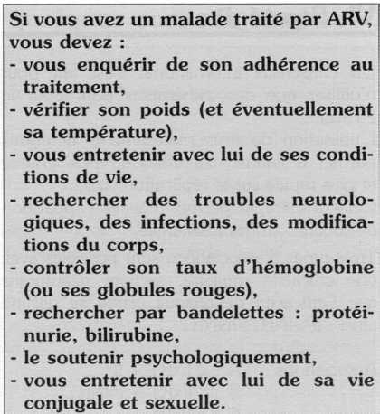
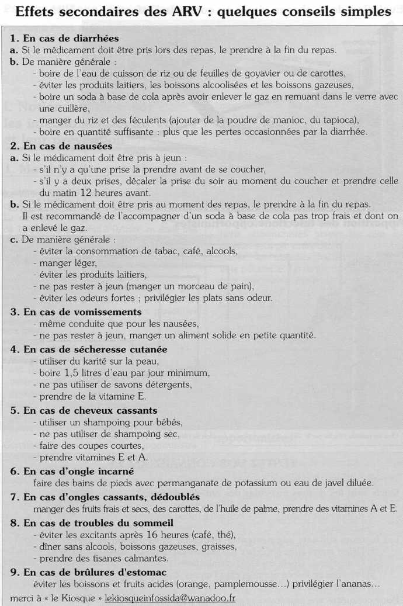

Comme tous les virus, le VIH possède un cycle de vie qui lui permet de se reproduire en parasitant une cellule ; cette phase du cycle s'appelle la réplication (ou multiplication virale).

Les anti rétroviraux (ARV) sont des médicaments qui bloquent le cycle du virus à différentes étapes essentielles de sa réplication.

## I. Rappel physiopathologique

Le virus, pour parasiter une cellule, doit reconnaître des récepteurs spécifiques qui sont situés au niveau de la membrane externe des cellules. Ce sont essentiellement le récepteur CD4, secondairement CD25 et autres.

Ces récepteurs sont présents sur les lymphocytes T, sous-classe T4, ils sont également retrouvés dans les macrophages, et dans plusieurs cellules des ganglions, du cerveau et de certaines muqueuses.

Les lymphocytes T4 constituent la base du système de défense de l'organisme, ce sont eux qui reconnaissent les agents pathogènes, les phagocytent, les détruisent et transfèrent l'information aux lymphocytes B qui fabriquent ensuite des anticorps.

Ce sont les lymphocytes T qui sont la base de l'immunité cellulaire spécifique et non spécifique. Leur infection par le VIH se fait progressivement et le nombre de cellules infectées augmente à chaque cycle de réplication virale. Cette multiplication provoque la formation d'anticorps non protecteurs et met des années pour se manifester.

Quand le nombre de lymphocytes T4 passe au dessous d'un certain seuil, apparaissent les infections opportunistes ou les infections associées. Selon le seuil, le type d'infections opportunistes diffère; en dessous de 350 T4, la tuberculose peut apparaître, en dessous de 200 les pneumonies banales et salmonelloses mineures; en dessous de 100, les mycobactéries atypiques ou la cryptococcose.

## II. Mécanismes d'action des ARV

Les ARV ne détruisent pas le virus, mais bloquent sa réplication en arrêtant l'activité des enzymes virales RT (Reverse Transcriptase) et P (Protéase) et bientôt, la fusion du VIH à la membrane cellulaire.

Ils ne sont pas "virucides".

Les ARV peuvent bloquer la réplication virale dans tous (ou presque) les lymphocytes circulants mais ne peuvent pas atteindre toutes les autres cellules infectées. C'est pourquoi, à ce jour, il n'est pas possible d'envisager l'arrêt du traitement. Même les interruptions temporaires programmées qui avaient été envisagées sont remises en question.

### 1. Les inhibiteurs de la RT

- Inhibiteurs nucléosidiques : un acide aminé (= nucléoside) de l'ARN viral est remplacé (comme pour les anticancéreux) par un autre apporté par le médicament => INRT
- Inhibiteurs nucléotidiques : un nucléoside phosphate est remplacé.
- Inhibiteurs non nucléosidiques : la RT est bloquée par un autre mécanisme => INNRT

### 2. Les autres médicaments

- Blocage de la protéase : la fabrication du virus est incomplète => IP
- Blocage de la fusion : le médicament empêche le virus de pénétrer dans la cellule.

**ACTUELLEMENT, TRAITEMENT A VIE**

## III. Observance

Tous les essais thérapeutiques montrent que, pour assurer une efficacité correcte sur l'évolution de la maladie, il faut que les malades suivent les prescriptions avec un taux d'observance supérieur à 90 %. C'est-à-dire que plus de 95 % des doses prescrites doivent être absorbées aux horaires prévus.

Les mêmes études montrent qu'avec une observance insuffisante, le risque d'apparition de résistances croit rapidement.

**Cette observance est l'enjeu majeur des traitements ARV.**

## IV. Suivi

Les effets du traitement s'apprécient d'abord par la clinique. La première amélioration perçue par le malade et par les personnes qui le soignent est la prise de poids. Le contrôle du poids est l'examen le plus important du suivi des malades traités par ARV.

Les autres indicateurs de réussite du traitement sont la reprise des activités :

- physiques (travail, marche, sports) ce qui se résume par l'amélioration de la qualité de vie;
- sexuelles, intellectuelles, la reprise de l'alimentation...

Il faut aussi noter la disparition des signes généraux éventuels ou des infections associées et opportunistes.

Le traitement peut être suivi par des examens biologiques de deux types :

- soit un contrôle de l'état immunitaire,
- soit un contrôle du nombre de virus.

L'état immunitaire est contrôlé par le taux de CD4 (en nombre absolu ou en % par rapport au total de lymphocites). Il est bien corrélé avec le nombre total de lymphocytes. Un seul examen par an suffit. Il n'est pas indispensable.

Le suivi de la réplication virale se fait par l'évaluation du nombre de virus par des techniques PCR dans le plasma (ce nombre étant considéré comme le reflet du nombre total de virus). Plusieurs techniques existent. Elles demandent, pour l'instant, un environnement spécifique. Ce suivi n'est pas considéré par l'OMS comme essentiel.

Le suivi du traitement comporte aussi la surveillance de la tolérance médicamenteuse aux plans hématologique, hépatique, pancréatique et rénal.

## V. Effets secondaires

- Tous les ARV provoquent de nombreux effets secondaires ; ils sont souvent pénibles à supporter, mais rarement graves.
- Un seul ARV peut avoir un effet secondaire grave (vital), c'est **l'abacavir,** avec le risque de réaction cutanée pouvant être mortelle.
- Les effets secondaires sont fréquents le premier mois, mais la plupart s'estompent dès la troisième semaine de traitement, un suivi doit se faire tous les 15 jours au début du traitement.
- Pour éviter les conséquences de ces effets, il faut adapter soigneusement les horaires de prise, en fonction des habitudes de vie du patient. Par exemple, **l'efavirenz** qui provoque des vertiges et des étourdissements, doit être pris au moment de se coucher. Si le malade travaille la nuit, il prend son **efavirenz** à 6 heures du matin avant d'aller au lit. Cela nécessite un dialogue sincère et empathique entre soignant et malade.

## VI. Stratégies

Un consensus international s'est fait pour n'utiliser que des trithérapies (sauf pour la PTME).

L'utilisation de trois médicaments différents permet d'obtenir une efficacité plus grande et plus rapide sur la réplication virale.  
Cette trithérapie permet d'éviter l'apparition de souches virales résistantes.

Trois types d'associations sont possibles avec une efficacité similaire, sachant néanmoins que l'efficacité de chaque classe se décline ainsi : IP > INRT > INNRT

- Associations A 2 INRT + IP

- B 2 INRT + INNRT

- C 3 INRT

Ces trois associations possibles correspondent à la première ligne, c'est-à-dire le traitement initial d'un patient jamais traité auparavant. Le choix entre les trois associations se fait en fonction de leur disponibilité, de leur coût et de leurs inconvénients éventuels (horaires, conservation, effets secondaires).

Des études récentes réalisées dans des conditions idéales de suivi ont montré que l'association C était un peu moins efficace, mais compte tenu de sa facilité d'emploi, elle reste globalement efficace.

### Cas particuliers

- VIH2 et variant 0 : INNRT inefficaces.

- Femmes enceintes : abacavir et efavirenz interdits ritonavir et indinavir contre indiqués.

- Tuberculose : La rifampicine étant contre indiquée avec la plupart des IP et INNRT, la stratégie recommandée est de traiter d'abord la tuberculose (ou d'interrompre la trithérapie) durant les deux mois pendant lesquels la rifampicine est nécessaire.

- Anémie : ne pas associer AZT + 3TC; donner de l'acide folique.

### Changement de régime

#### Quand ?

A. Si échec de la première ligne :

- détérioration clinique (amaigrissement infections répétées),
- persistance d'un taux bas de CD4,
- persistance ou réapparition d'une charge virale élevée.

B. Si intolérance.

#### Comment ?

Dans les deux cas précités, comme lors de rupture de médicaments ou de mauvaise observance, la décision doit être prise par le service proscripteur.

*Merci à Agnès Certain*  
*Pharmacien - Hôpital Bichat, Paris, France*

*Développement et santé, n°168, décembre 2003*
