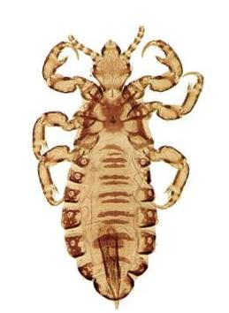
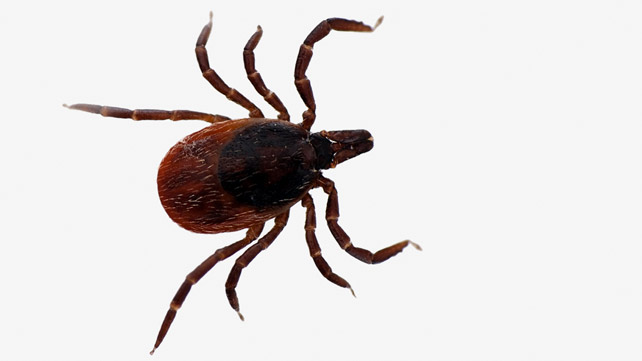
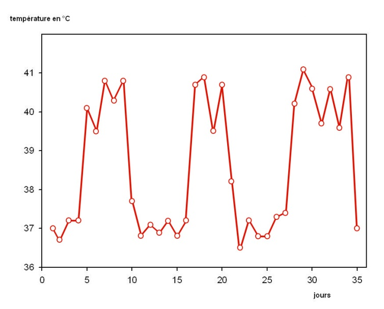

Les fièvres récurrentes, ou borrélioses, sont  des anthropozoonoses, dues à des <em>Borrelia</em>,  bactéries de la famille des <em>Spirochaetacea</em>. Outre la maladie de Lyme, les fièvres récurrentes sont dues à différents spirochètes transmis par des arthropodes.

## 1. Les fièvres récurrentes à poux

Les fièvres récurrentes à poux sont cosmopolites et surviennent par épidémie dans un contexte de mauvaises conditions d’hygiène et de promiscuité. Les fièvres récurrentes à tiques sont régionales, dont la répartition suit celle des tiques molles ou ornithodores (tableau I).

<table>
  <tr>
    <th colspan="4"><b>Tableau I. Les principales fièvres récurrentes (R : rongeurs ; H : Homme)</th>
  </tr>
  <tr>
    <td>Géographie</td>
    <td><i>B. = Borrelia</td>
    <td>Vecteur :  O : ornithodore</td>
    <td>Hôte</td>
  </tr>
  <tr>
    <td>Europe, Maghreb</td>
    <td><i>B. hispanica</td>
    <td><i>O. erraticus</td>
    <td>R</td>
  </tr>
  <tr>
    <td>Maghreb, Afr. ouest</td>
    <td><i>B. crocidurae</td>
    <td><i>O. sonrai</td>
    <td>R</td>
  </tr>
  <tr>
    <td>Caucase, Moyen-Orient</td>
    <td><i>B. caucasica</td>
    <td><i>O. verrucosus</td>
    <td>R</td>
  </tr>
  <tr>
    <td>USA (ouest)</td>
    <td><i>B. hermsii, B. parkeri</td>
    <td><i>O. hermsi, O. parkeri</td>
    <td>R</td>
  </tr>
  <tr>
    <td>USA, Canada, Bolivie</td>
    <td><i>B. turicatae</td>
    <td><i>O. turicata</td>
    <td>R</td>
  </tr>
  <tr>
    <td>Chine, Moyen-Orient, ex-URSS,</td>
    <td><i>B. persica</td>
    <td><i>O. tholozani</td>
    <td>R, H</td>
  </tr>
  <tr>
    <td>Amérique centrale et du sud Asie</td>
    <td><i>B. venezeluensis</td>
    <td><i>O. rudis</td>
    <td>R, H</td>
  </tr>
  <tr>
    <td>Afrique (centre et est) </td>
    <td><i>B. latyschewii</td>
    <td><i>O. tartakowski</td>
    <td>R</td>
  </tr>
  <tr>
    <td>Afrique (est)</td>
    <td><i>B. duttoni B. graingeri</td>
    <td><i>O. moubata O. graingeri</td>
    <td>H R</td>
  </tr>
  <tr>
    <td>Afrique de l'ouest</td>
    <td><i>B. recurrentis</td>
    <td><i>Pediculus humanus</i></td>
    <td>H</td>
  </tr>
</table>

Les fièvres récurrentes à poux, strictement humaines, dues à *Borrelia recurrentis*, sont transmises par l’écrasement du pou de corps, *Pediculus humanus* (figure 1).

  
En effet, les *Borrelia* ne sont pas situées dans la salive mais dans le tube digestif et sont éliminées dans les excréments. Des épidémies sont survenues pendant les guerres mondiales et les guerres de la péninsule indochinoise, et apparaissent régulièrement dans les camps de réfugiés de différentes régions d’Afrique de l’est.

## 2. Les fièvres récurrentes à tiques

Les fièvres récurrentes à tiques sont des affections géographiquement limitées à la présence de tiques qui les transmettent, les réservoirs des différentes\* Borrelia\* étant les rongeurs. La transmission est effectuée lors de la morsure de la tique, ainsi que par les sécrétions coxales. Les ornithodores (figure 2) vivant dans les terriers sont responsables des épidémies chez les bergers, les agriculteurs et les randonneurs, alors que les tiques vivant dans les habitations sont responsables de l’endémie. En outre, il y a une transmission intra-ovarienne des *Borrelia*.

  
Les *Borrelia* sont des spirochètes extra-cellulaires, mobiles, comprenant de 5 à 10 spires, mesurant de 10 à 30 microns x 0,3 microns, rendues facilement visibles par les colorations de Fontana-Tribondeau et de Giemsa (figure 3).

  
Les différentes *Borrelia* sont identiques morphologiquement au microscope optique et ne sont différentiables qu’au microscope électronique et par étude en biologie moléculaire des gènes codant le 16S sRNA et la flagelline.  
L’aspect des récurrences varie selon les sérotypes de *Borrelia*, déterminés par des anticorps monoclonaux.

## 3. Des récurrences fébriles espacées d’une semaine

Les symptômes apparaissent après une incubation moyenne d’une semaine (variant de 3 à 20 jours), avec un frisson et une fièvre atteignant 40°C, des céphalées intenses, des myalgies, de arthralgies, des douleurs abdominales, des nausées, des vomissements et souvent une éruption maculo-papuleuse ou pétéchiale.  
**L’examen clinique** constate un ictère, une langue saburrale ainsi qu’une hépato-splénomégalie. L’épisode fébrile dure environ 3 jours (variant de 1 à 14 jours) puis régresse avec une crise sudorale et urinaire. Ensuite une période d’apyrexie survient pendant une semaine (de 5 à 14 jours).  
Sans traitement, peuvent survenir plusieurs récurrences (1 à 15), dont l’intensité décroit souvent progressivement (figure 4).

Outre les symptômes déjà signalés, peuvent survenir des **complications** hémorragiques (pétéchies, épistaxis), neurologiques (méningite, myélite, hémiplégie, paralysie des nerfs crâniens), hépatiques (ictère), pulmonaires (pneumonie, oédème pulmonaire), cardio-vasculaires (extrasystoles), oculaires (uvéite, iridocyclite, névrite rétrobulbaire), voire psychiatriques (prostration ou agitation).  
La mortalité variant de 2 à 5%, essentiellement chez les enfants et les femmes enceintes, est due à un collapsus cardio-vasculaire, une insuffisance hépatique ou une complication obstétricale (avortement, accouchement prématuré).

**Différents aspects des fièvres récurrentes** sont possibles, selon la *Borrelia* en cause.

- Avec *Borrelia recurrentis*, il n’y a que 2 ou 3 récurrences, la mortalité atteint 40% sans traitement mais reste encore à 5% sous traitement et des récurrences sont possibles dans 2% des cas.  
  Les fièvres récurrentes à tiques peuvent se manifester par plusieurs récurrences. Pendant la phase de rémission, les *Borrelia* sont séquestrées dans les organes profonds et les rechutes fébriles sont dues à l’émergence de variants antigéniques résistant aux anticorps formés lors des épisodes fébriles précédents.
- La fièvre récurrente à *B. crocidurae*, en Afrique de l’ouest, est bénigne, alors que la fièvre récurrente due à *B. duttoni*, fréquente chez les enfants en Afrique de l’est, a un mauvais pronostic.

## 4. Diagnostic difficile sur lame

Le diagnostic est difficile à évoquer devant l’absence de symptôme évocateur, en dehors d’accès de fièvre à répétition, d’autant plus qu’il peut y avoir une association avec d’autres affections fébriles comme un paludisme, une typhoïde, une dengue, une leptospirose ou une hépatite par exemple. Il est souvent établi de façon fortuite, lors d’un bilan sanguin demandé pour la recherche étiologique d’un syndrome fébrile et, en zone tropicale, les étiologies des fièvres sont nombreuses. Les premiers éléments biologiques perturbés sont une hématurie et une protéinurie ainsi qu’une thrombopénie qui n’ont rien de spécifique.  
Le diagnostic et affirmé sur la mise en évidence des *Borrelia*, souvent peu nombreuses sur le frottis sanguin ou la goutte épaisse, ce qui nécessite un examen particulièrement attentif des lames. Par ailleurs, les *Borreli* peuvent être inoculées à la souris ou mises en culture sur des milieux spéciaux à 37°C et examinées quotidiennement pendant un mois.  
Les différentes **techniques sérologiques** (Elisa, immunofluorescence, western-blot) sont **peu fiables** et sont avantageusement remplacées par la **PCR** qui **permet une identification de l’espèce** en cause.

## 5. Antibiothérapie

Le traitement est basé sur les antibiotiques en prise unique (doxycycline 200mg ; minocycline 200mg ; tétracycline 500mg) pendant 5 à 10 jours.  
Chez les **enfants** et les **femmes enceintes**, les **cyclines, contre-indiquées**, sont remplacées par l’érythromycine 500mg ou la pénicilline-procaïne 1M unités ou encore le chloramphénicol 500mg (per os ou IV).  
**En cas de formes neurologiques**, où les rechutes sont fréquentes, le traitement doit être prolongé pendant deux semaines.  
Parmi les **effets secondaires des traitements**, il y a un risque d’exacerbation des symptômes dans les heures qui suivent la prise de l’antibiotique : frissons, fièvre à 40°C, tachycardie, hypotension (réaction de Jarish-Herxheimer). Cette réaction est assez fréquente (80% dans les fièvres récurrentes à poux), mais sa physiopathologie et son traitements sont mal connus et son évolution est parfois fatale.

**La prévention** consiste surtout à lutter contre les poux (hygiène et insecticides) et les tiques (vêtements longs, produits répulsifs, pulvérisations intra-domiciliaires des produits répulsifs rémanents, moustiquaires, lits situés à distance des murs de l’habitation).

**Bibliographie**

- Antinori S, Mediannikov O, Corbellino M, Raoult D. Louse-borne relapsing fever among East African refugees in Europe. Travel Med Infect Dis. 2016 Mar-Apr;14(2):110-4.
- Boulanger N, Boyer P, Talagrand-Reboul E, Hansmann Y. Ticks and tick-borne diseases. Med Mal Inf 2019; 49 (2) : 87-97.
- Bourée P, Ensaf A. La fièvre récurrente mondiale revient en Europe. Option-Bio 2016 ; 549 : 27-28.
- Cutler SJ. Relapsing fever borreliae. A global Review. Clin Lab Med 2015; 35:847-65.
- Dantas-Torres F, Chomel BB, Otranto D. Ticks and tick-borne diseases: a one health perspective. Trends Parasitol, 28 (2012). 437-446.
- Elbir H, Raoult D, Drancourt M. Relapsing fever borreliae in Africa. Am J Trop Med Hyg. 2013 Aug;89(2):288-92.
- Wilting KR, Stienstra Y, Sinha B, Braks M, Cornish D, Grundmann H. Louse-borne relapsing fever (Borrelia recurrentis) in asylum seekers from Eritrea, the Netherlands, July 2015. Euro Surveill. 2015;20(30):pii=21196.

Pour accéder au quiz sur les borrélioses tropicales ou fièvres tropicales, cliquer ici : <a href="https://docs.google.com/forms/d/e/1FAIpQLScfAWfcAdMyCEE3IoyWmDUp5zMLlPgiazlvRJBbXD9QPHxeZQ/viewform" target="_blank" rel="noopener">Quiz borrélioses tropicales ou fièvres récurrentes</a>
