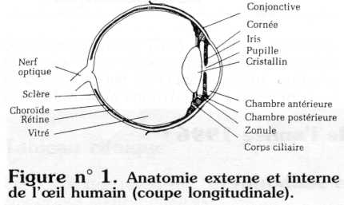
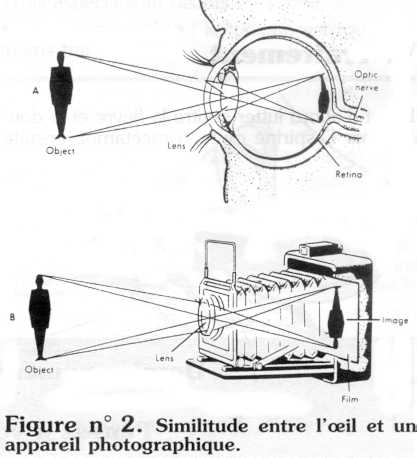
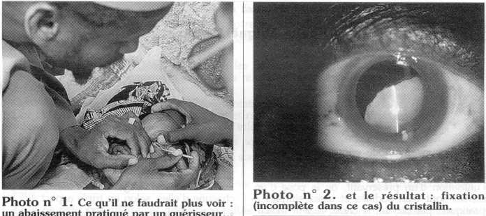

La cataracte est une opacification progressive du cristallin entraînant une baisse de l'acuité visuelle, puis à un stade plus avancé, une cécité curable par un traitement chirurgical adapté.

Dans le tiers-monde, les cataractes présentent une spécificité étiologique, diagnostique et thérapeutique justifiant le terme de " cataracte tropicale " consacré par l'usage.

D'après les données de l'Organisation mondiale de la santé, on estime à seize millions le nombre de cataractes non opérées par manque de structure sanitaire et de personnel qualifié. Il s'agit d'un problème de santé publique majeur, d'autant plus grave qu'il concerne une tranche d'âge relativement jeune, potentiellement active et souvent réduite à la mendicité.

## **I. Rappel anatomophysiologique**

Schématiquement, l'oeil peut être comparé à un appareil photographique.

- La rétine est l'équivalent d'une pellicule photosensible qui transmet les images perçues au cortex cérébral par l'intermédiaire du nerf optique et des voies optiques intracérébrales.

- Le cristallin joue le rôle d'objectif assurant la mise au point de l'image sur la rétine.

- L'iris permet de diaphragmer la quantité de lumière impressionnant la rétine.

L'image d'un objet situé à l'infini se projette normalement en un point situé sur la rétine.

L'opacification du cristallin entraîne dans un premier temps une myopisation par augmentation de l'indice de réfraction du cristallin : l'image ne se projette plus sur la rétine mais en avant de celle-ci. Ultérieurement, lorsque la cataracte progresse, la cécité devient totale avec toutefois une conservation des perceptions lumineuses.

## **II. Étiologie-épidémiologie**

Les cataractes dites " séniles " constituent de loin l'étiologie la plus fréquente. En zone tropicale elles surviennent plus précocement que dans les pays industrialisés, vers l'âge de 45 ans au lieu de 70 ans au Nord. On évoque, pour expliquer ce décalage " Nord-Sud ", le rôle de la malnutrition et de l'ensoleillement.

Les autres étiologies sont beaucoup plus rares, mais il faut évoquer leur diagnostic par l'interrogatoire et éventuellement des examens complémentaires simples :

- cataractes congénitales souvent associées à un syndrome malformatif (trisomie 21),

- cataractes traumatiques,

- cataractes secondaires à une autre affection oculaire souvent ancienne et méconnue : uvéite, décollement de rétine, tumeur choriorétinienne (rétinoblastome de l'enfant ou mélanome malin de la choroïde chez l'adulte),

- cataractes secondaires à une affection générale souvent endocrinienne : diabète, hyper ou hypoparathyroïdie,

- cataractes iatrogènes : corticothérapie prolongée par voie générale ou en collyres.

## **III. Diagnostic**

### **1. Au début**

Les signes fonctionnels d'appel sont dominés par :

- la baisse de l'acuité visuelle prédominant de loin et améliorée, au début, par la prescription de verres de myopie. La vision de près est souvent bien conservée, ce qui permet au sujet de lire sans lunettes ;

- la photophobie, très gênante dans la journée, mais aussi le soir pour la conduite automobile nocturne ;

- la perturbation de la vision colorée.

La mesure de l'acuité visuelle est, bien entendu, un temps fondamental de l'examen.

On attachera également beaucoup d'importance à l'étude des perceptions lumineuses. Normalement, la lumière doit être perçue dans les quatre quadrants du champ visuel, même en cas de cataracte très avancée.

Le résultat est noté de la façon suivante sur la feuille d'observation :

++

AV OD 2/10 PL ++

++

OG 1/10 PL ++

AV = acuité visuelle  
OD = oeil droit  
OG = oeil gauche  
PL = perception lumineuse

Une mauvaise perception lumineuse dans un secteur doit faire soupçonner une pathologie associée à la cataracte, principalement un glaucome ou un décollement de rétine.

+-  
Exemple: AV OD 1/10 PL +- Une perception lumineuse uniquement dans le secteur temporal doit faire évoquer la possibilité d'un glaucome associé.

On notera également le réflexe photomoteur. Normalement la pupille est réactive à la lumière, même dans les cataractes avancées. Un réflexe pupillaire absent ou paresseux doit faire évoquer une pathologie associée, essentiellement un glaucome.

Le diagnostic à ce stade peut être fait par l'examen de l'oeil grâce à un éclairage latéral, avec un ophtalmoscope ou même une lampe de poche, montrant une opalescence de la pupille qui a perdu son reflet noir habituel.

L'examen de la lueur pupillaire consiste à illuminer l'oeil, non plus latéralement, mais de façon coaxiale, grâce à un ophtalmoscope. La pupille normale observée à travers l'ophtalmoscope réglé à + 20 apparaît uniformément rose. En cas de cataracte débutante, on pourra observer des opacités sous forme de silhouette se détachant sur le fond, par ailleurs uniformément rose.

L'examen à la lampe à fente réalise une véritable coupe anatomique du cristallin permettant de localiser l'opacification cristallinienne en profondeur.

La mesure du tonus oculaire soit par simple palpation, soit au tonomètre permet de dépister un éventuel glaucome chronique associé à la cataracte.

L'examen du fond d'oeil, lorsqu'il est encore éclairable, permet de dépister une pathologie rétinienne associée (décollement de rétine, rétinopathie diabétique, dégénérescence maculaire liée à l'âge, etc.).

### **2. État**

C'est le stade de cécité totale avec toutefois une persistance des perceptions lumineuses. Si ces dernières sont de mauvaise qualité, ou inexistantes, il faudra suspecter une pathologie rétinienne ou un glaucome associé.

- La pupille est blanche avec une disparition complète de la lueur pupillaire.

- Le fond d'oeil n'est plus éclairable.

- On mesurera le tonus oculaire afin de dépister un glaucome associé.

### **3. Complications**

Une cataracte hypermûre non opérée peut être à l'origine de complications.  
Le cristallin peut :

- se lyser, les substances d'origine cristallinienne passent dans l'humeur aqueuse de l'oeil et vont être à l'origine soit d'une réaction inflammatoire (uvéite phakoanaphylactique), soit d'un glaucome phakolytique ;

- au contraire se gonfler, bomber vers l'avant dans la chambre antérieure, entraînant un blocage pupillaire et un glaucome par intumescence du cristallin.

Dans les deux cas, le diagnostic de ces complications est évoqué chez un malade porteur d'une " vieille cataracte " et dont l'oeil devient subitement rouge et douloureux avec une augmentation du tonus oculaire.

Beaucoup plus rarement, une cataracte hypermûre peut se luxer, soit dans la chambre antérieure de l'oeil, soit dans le vitré, entraînant des complications inflammatoires et hypertoniques.

## **IV. Bilan préopératoire**

- Bilan sanguin standard préopératoire.

- Traitement des infections : une éventuelle infection de la conjonctive ou des voies lacrymales devra être traitée préalablement à l'opération (instillation d'un collyre antibiotique huit jours avant l'opération).

- Échographie : c'est une exploration ultrasonique de l'oeil permettant de mesurer la longueur axiale du globe normalement aux alentours de 22 mm.

Grâce à un logiciel adapté, on pourra ainsi déterminer la puissance dioptique du cristallin artificiel qui sera implanté au cours de l'opération.

## **V. Traitement**

Le traitement de la cataracte est exclusivement chirurgical.

La technique la plus ancienne, connue depuis l'antiquité et pratiquée encore jusqu'au XIXe siècle en Europe, consistait à luxer le cristallin dans le vitré grâce à un stylet introduit dans l'oeil au niveau de la sclère. Cette technique d'abaissement du cristallin, peu fiable, est encore largement pratiquée par les guérisseurs africains connus sous le nom de sidibés (_photos_ _n° 1 et n° 2)._

Les techniques modernes introduites par Jacques Daviel en 1745 consistent en une extraction du cristallin, rétablissant ainsi la transparence des milieux.

L'oeil privé du cristallin est dit aphake et perd une très grande partie de sa puissance réfractive. L'image d'un objet situé à l'infini se trouvera donc complètement défocalisée. Pour voir net, un aphake devra donc porter des verres correcteurs positifs très puissants, en général + 12 dioptries.

**Les différentes techniques d'extraction** **du cristallin**

### **1. La chirurgie intracapsulaire**

Est une ablation complète du cristallin avec son enveloppe.

_Avantage_ : technique relativement simple pouvant être pratiquée même sans microscope opératoire.

_Inconvénient_ : ne permet qu'une implantation en chambre antérieure plus risquée à long terme pour la cornée (risque de dystrophie cornéenne tardive).

### **2. La chirurgie extracapsulaire**

Consiste à vider le contenu du sac cristallinien par aspiration en s'aidant éventuellement d'un appareil à ultrasons (phakoémulsification) :

_Avantage_ : permet de mettre en place un implant de chambre postérieure beaucoup mieux supporté à long terme (pas de risque de dystrophie cornéenne).

_Inconvénient_ : technique plus sophistiquée nécessitant un apprentissage plus difficile et ne pouvant être réalisée que sous microscope opératoire ; opacification secondaire fréquente de la capsule postérieure nécessitant une réinvention : ouverture de la capsule postérieure soit au laser YAG, soit à l'aiguille.

Malheureusement ces verres sont à l'origine de très importantes aberrations optiques :

- agrandissement excessif de l'image,

- rétrécissement du champ visuel périphérique.

Certes, le sujet n'est plus aveugle mais il reste tout de même un handicapé visuel.

Les lentilles de contact souples ou dures, beaucoup plus satisfaisantes d'un point de vue optique, nécessitent un entretien et une hygiène rigoureuse. Leur généralisation est difficilement envisageable en Afrique noire en raison de leur prix et aussi des conditions climatiques qui font qu'elles sont souvent mal supportées.

Depuis le début des années 1980, la correction de l'aphakie par implantation de cristallin artificiel s'est généralisée.

## **VI. Quelle chirurgie pour l'Afrique ?**

Le problème est loin d'être résolu. Une certitude : l'abaissement du cristallin pratiqué par les guérisseurs dans des conditions d'hygiène déplorable doit être proscrit.

La chirurgie intracapsulaire, facile à réaliser même sans microscope opératoire, semblait a priori être la technique de choix pour un traitement de masse de la cataracte. Mais l'aphakie (absence de cristallin) résultant de cette opération constitue tout de même un handicap et ne permet pas une réhabilitation totale des patients.

La chirurgie intracapsulaire suivie d'une implantation en chambre antérieure est réalisable également sans microscope avec des lunettes loupes et ne nécessite donc pas non plus d'équipement sophistiqué. Mais à long terme, un implant situé dans la chambre antérieure de l'oeil peut entraîner des complications cornéennes encore plus redoutables dans les pays du tiers-monde où, pour des raisons à la fois technologiques et culturelles, il est difficile d'effectuer des- greffes de cornée.

La chirurgie extracapsulaire avec implantation en chambre postérieure est la technique de référence largement plébiscitée dans les pays industrialisés. Malheureusement, elle n'est pas toujours réalisable en Afrique par manque de personnel qualifié et d'équipement (microscope opératoire et éventuellement laser YAG pour traiter les cataractes secondaires très fréquentes).

### **Conclusion**

Depuis une dizaine d'années, la chirurgie de la cataracte a considérablement progressé et est devenue extrêmement fiable, permettant une réhabilitation totale de la vue des patients avec un risque de complications postopératoires minime. Les progrès décisifs n'ont pas encore atteint pleinement les pays du tiers-monde et le problème majeur de santé publique posé par la cataracte ne pourra être valablement abordé que dans le cadre général d'une véritable politique d'aide et de développement des pays d'Afrique.

_Développement et Santé, n° 126, décembre 1996_