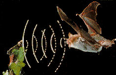
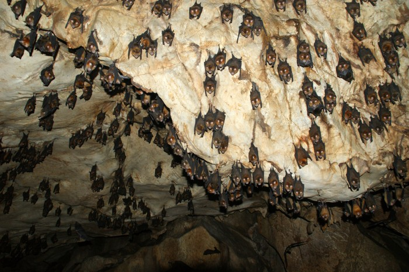
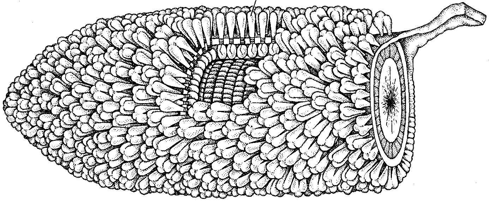
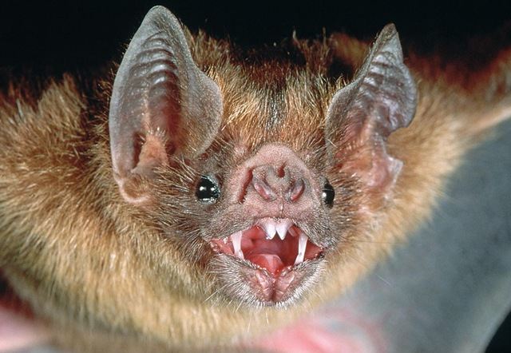
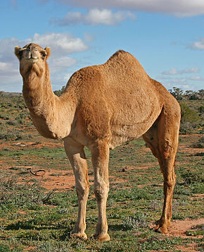
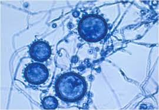

Les chauves-souris sont des animaux mal connus et souvent craints en raison de leur aspect étrange et de leur activité nocturne. Certaines populations les considèrent comme des animaux sacrés alors que d’autres les chassent et les clouent sur les portes pour chasser les mauvais esprits. Aussi n’est-il pas inutile de faire un rappel de l’activité de ces mammifères volants, répandus sur tous les continents, en dehors des régions polaires. Elles appartiennent à l’ordre des chiroptères, deuxième ordre des mammifères, après celui des rongeurs et comprennent plus de 1200 espèces, réparties en 18 familles.

## I. L’écholocation, un phénomène particulier

On distingue deux sous-ordres. Les microchiroptères (ou Yangochiroptères) (figure 1) regroupant 800 espèces de petite taille, sont insectivores, ont une activité nocturne et ont une faculté d’écholocation. Les mégachiroptères (ou Yinptérochiroptères) (ou « roussettes ») (figure 2), de grande taille (pouvant atteindre 2 mètres d’envergure), sont frugivores (fleurs, pollens, légumes) et ont une activité crépusculaire.

***Figure 1. Chauve-souris***

***Figure 2. Roussette***

Le phénomène de l’écholocation des microchiroptères a été démontré en 1791 par Lazzaro Spallanzani : des chiroptères rendus aveugles continuent à voler normalement, alors que ces mêmes animaux rendus sourds ne peuvent plus se déplacer. Cette écholocation est due à une protéine de l’oreille interne, la prestine. Les microchiroptères, actifs la nuit, se dirigent dans l’obscurité en émettant, par la contraction des muscles laryngés, des ultra-sons par la bouche et le nez, dont elles captent le retour par les oreilles (principe du sonar) (figure 3). Ceci leur permet de localiser leurs proies et d’éviter les obstacles. Ils peuvent détecter un fil de 0,1mm de diamètre à 10 mètres de distance ! Les mégachiroptères se dirigent plus à la vue et à l’odorat. En outre, ces mammifères s’orientent grâce au champ magnétique terrestre. Ces animaux communiquent dans un spectre d’ultra-sons (de 10kHz à 120 kHz) non accessible à l’homme (dont le spectre d’audition va de 20Hz à 20kHz), ces sons étant propres à chaque espèce.

***Figure 3. Echolocation***

Les chiroptères se reposent environ 20 heures par jour en se suspendant, la tête en bas,  aux aspérités par les griffes de leurs orteils (figure 4). Ils ne se posent qu’exceptionnellement sur le sol. L’aile des chiroptères est formée d’un tissu qui est le tissu du règne animal qui se régénère le plus vite du règne animal. Sa grande vascularisation permet la régulation thermique de l’animal. Par ailleurs, le vol des chiroptères est plus efficace et plus économe en énergie que celui des oiseaux de même taille. Ils peuvent vivre plusieurs dizaines d’années. Les distances de vol sont de quelques kilomètres par nuit pour la recherche de nourriture mais peuvent atteindre plusieurs milliers de kilomètres pour les espèces migratrices. 

***Figure 4. Chauves-souris au repos***

## II. Respecter l’hibernation

Ces animaux atteignent la maturité sexuelle en un à trois mois. Après l’accouplement, la naissance des petits s’effectue en position de repos, la tête en bas. Les petits, naissant nus et aveugles, doivent s’accrocher à la mère, sinon ils risquent une chute mortelle. Les petits sont élevés sans les mâles, dans des colonies de femelles qui les gardent pendant que les mères partent chercher la nourriture. Les jeunes microchiroptères deviennent autonomes vers 8 semaines et les mégachiroptères vers 4 mois.

En Europe, les microchiroptères sont très actifs l’été, quand les insectes pullulent, puis ils hibernent l’hiver, dans des endroits sombres et calmes (grottes, caves, greniers, tunnels), avec une température et une hygrométrie stables, leur température passant de 38°C à 17°C et la fréquence cardiaque s’abaissant à moins d’un battement par minute. Réveiller des chauves-souris pendant leur hibernation entraîne brusquement une très grosse consommation d’énergie qui peut leur être fatale.

## III. Rôle utile dans la nature

Ces animaux ont peu de prédateurs. Cependant, en Europe, ils peuvent être la proie des hiboux, des chouettes, des faucons, des rats, des chats et parfois des serpents. En pays tropical, les roussettes représentent un gibier très apprécié par l’homme. Mais surtout, les ailes bien vascularisées des chiroptères sont des lieux de repas sanguins pour les insectes hématophages comme les puces, les tiques ou les punaises. Ces arthropodes peuvent transmettre des virus entre chauves-souris, mais étant très inféodées aux chiroptères, ils n’ont aucun rôle dans la transmission vers l’espèce humaine.

 Les microchiroptères, insectivores, sont d’excellents prédateurs d’insectes nuisibles dont ils avalent plusieurs millions chaque année, et ont donc un rôle important dans la régulation des populations d’insectes. Les mégachiroptères, frugivores, sont utiles comme pollinisateurs et disséminateurs de graines par leurs déjections en vol. Certains arbres, comme les  baobabs (figure 5) ou les cactus colonnaires ont des fleurs qui s’épanouissent la nuit, favorisant le travail des pollinisateurs nocturnes (figure 6).

  
              

\_**Figure 5. Baobabs** \_                                                             ***Figure 6. Pollinisation nocturne des cactus***

## IV. Rôle pathogène

Les chiroptères, comme beaucoup d’animaux sauvages, peuvent héberger des agents pathogènes, et plus d’une centaine de virus ont été décelés dans le sang, les organes et les excréments des chauves-souris. La relation entre les chauves-souris et les virus est très ancienne si l’on considère que les fossiles de chiroptères remontent à environ 50 millions d’années, correspondant à l’émergence des premiers *Lyssavirus*. 

### 1. Les *Rhabdoviridae*

Le genre *Lyssavirus*, dont il existe au moins douze génotypes, est très répandu chez les chauves-souris. Le génotype 1, ou virus de la rage (figure 7), est cosmopolite, mais retrouvé uniquement chez les chauves-souris d’Amérique du sud. Ce virus n’a pas été retrouvé chez les chauves-souris de l’Ancien Monde.

***Figure 7. Virus de la rage***

Le génotype 2, ou virus Lagos bat, est répandu chez les mégachiroptères dans toute l’Afrique sub-saharienne, mais n’a pas encore été isolé chez l’homme. Le génotype 4, ou virus Duvenhage, a été retrouvé chez des microchiroptères d’Afrique de l’est et chez des cas humains, les génotypes 5 (ou European bat virus 1), 6 (ou *European bat virus 2*), et 7 (ou *Australian bat virus*), retrouvés chez les différents chiroptères, peuvent être à l’origine de cas humains. En Europe, les génotypes 5 et  6 ont été détectés chez les chiroptères dès 1954.

En Amérique du sud, le virus de la rage a été constaté chez de nombreux chiroptères insectivores ou hématophages (vampires) (figure 8). Ce virus, bien toléré par les chauves-souris, peut être transmis par morsure, griffure, léchage ou aérosol. La contamination humaine est rare, mais les animaux domestiques constituent une réserve sanguine pour ces vampires, la perte économique due à la mortalité du bétail due à la rage étant estimée à 30 millions de dollars par an. En Asie, le *Lyssavirus* est très rare chez les chauves-souris. Les lyssaviroses humaines dues à des morsures de chiroptères provoquent des symptômes proches de la rage. Ces *Lyssavirus* ayant des génotypes assez différents, le vaccin contre la rage n’est pas efficace contre les génotypes 2 et 3.

***Figure 8. Chauve-souris vampire***

### 2. Les *Paramyxoviridae*

Le genre *Henipavirus* comprend les virus *Nipah* et *Hendra*. Le virus *Nipah*, connu depuis 1998, a provoqué 109 décès (sur 283 cas humains) en Malaisie par encéphalite et pneumopathie et a entrainé l’abattage d’un million de porcs. La contamination des porcs a eu lieu par proximité entre l’élevage de porcs et les arbres fruitiers, lieux fréquents de nourriture pour les chauves-souris frugivores. Ce virus a ensuite été retrouvé chez des chauves-souris en Inde, en Indonésie, en Asie du sud-est, en Chine, en Afrique et à Madagascar. L’homme s’infeste par consommation de jus de palmier non cuit, contaminé par la salive ou les urines de chauves-souris. Le virus *Hendra*, découvert en 1994 lors d’une épizootie de pneumopathies chez les chevaux (et 2 cas humains) en Australie, a été isolé chez les mégachiroptères d’Australie.  
D’autres virus du genre paramyxoviridae ont été trouvés chez les chiroptères : *Rubulavirus*, *Parainfluenzavirus*, *Morbillivirus*, *Pneumovirus*.

### 3. Les *Filoviridae*

Le genre f_ilovirus\_ comprend  les 5  virus *Ebola*, découverts en 1976 en République Démocratique du Congo et responsables de nombreuses épidémies mortelles en Afrique. Le virus *Marburg*, découvert en Allemagne en 1967 chez des singes venant d’Ouganda, a provoqué de petites épidémies chez des sujets ayant visité des grottes contenant des milliers de chauves-souris. Outre la contamination interhumaine, ces épidémies débutent par un contact avec un singe malade ou des chauves-souris infectées, ou encore par ingestion de fruits contaminés par la salive de mégachiroptères, très répandus en Afrique, dans les forêts mais aussi dans les villages. L’épidémie actuelle en Afrique de l’ouest est déjà la cause de 10 300 décès, sur plus de 24 000 cas.

### 4. Les *Coronaviridae*

Le SARS-CoV (ou syndrome  respiratoire aigu sévère du à un bétacoronavirus) a provoqué 900 décès humains (sur 8 400 cas) en Chine en 2003. Le réservoir a été détecté chez les chiroptères, qui étaient porteurs asymptomatiques d’anticorps pour 84% d’entre eux. Puis d’autres anticorps SARS-CoV-like ont été  retrouvés chez les chiroptères sur tous les continents. En 2012, le MERS-CoV (ou *Middle -East Respiratory syndrome*) est apparu en Arabie Saoudite, avec plus de 439 décès (sur 1100 cas). L’hôte habituel retenu a été le dromadaire (figure 9), et malgré les recherches, le virus n’a pas été retrouvé chez les chauves-souris locales.

***Figure 9. Le dromadaire***

### 5. Autres virus

Par ailleurs, un grand nombre d’autres virus, dont la pathogénicité est discutée, appartenant à différents genres, a été retrouvé chez les chauves-souris. Ces virus, qui peuvent rester longtemps chez l’animal, pendant l’hibernation, pourront peut-être se révéler pathogènes dans l’avenir.     

### 6. *Histoplasma*

Les spores d’*Histoplasma* (champignon dimorphique) sont dans la nature et se développent particulièrement bien dans un sol riche en guano de chauves-souris ou en fientes de pigeons. L’homme s’infeste par inhalation des poussières contenant les spores d’histoplasme (maladie des spéléologues) (figure 10). Chez les sujets immuno-compétents, l’infestation passe le plus souvent inaperçue. Chez les sujets immuno-déficients, la maladie se manifeste par des troubles pulmonaires (forme américaine) ou par des troubles cutanés, osseux et ganglionnaires (forme africaine).   

***Figure 10. Chlamydospores d'histoplasme***

## V. Le déclin de l’espèce

Les scientifiques ont constaté que, dans les zones habitées et dans les terrains d’agriculture intensive, les populations de chauves-souris sont en déclin. Les causes sont nombreuses, dont les principales sont l’usage de pesticides sur les cultures, l’emploi de plus en plus fréquent de divers polluants et produits chimiques dans la nature, la déforestation, une fréquentation humaine accrue des grottes et cavernes, ce qui dérange les lieux de repos et de reproduction des chiroptères, l’extension des zones d’éclairage nocturne.

Ainsi, il apparait que les chauves-souris aient un rôle utile dans la pollinisation des plantes et la régulation des populations d’insectes et un rôle nuisible dans le portage de nombreux virus dont certains sont très dangereux pour l’homme. Par ailleurs, les perturbations humaines de la nature par des agents physiques ou chimiques perturbent la vie et la reproduction de ces mammifères. Aussi, de nombreux pays ont-ils signé la Convention de Bonn en 1991 vis-à-vis des chiroptères, en les considérant comme espèce protégée. En France, par un arrêté de 1991 confirmé en 2007,  il est interdit de les chasser, de les capturer et d’en faire un commerce.

<table>

<thead>

<tr>

<th scope="col">Quelques erreurs à rectifier concernant les chauves-souris </th>

</tr>

</thead>

<tbody>

<tr>

<td><ul><li>Les chauves-souris ne sont pas agressives, mais se défendent si on les manipule</li><li>Les chauves-souris ne sucent pas le sang humain, mais celui des animaux</li><li>Les attaques de vampires, en Amérique du sud sont très exceptionnelles</li><li>Les chauves-souris ne sont pas aveugles, mais sont perturbées par la lumière</li><li>Les chauves-souris ne s’agrippent pas dans les cheveux</li><li>Les chauves souris ne construisent pas de nid mais se réfugient dans des gîtes naturels</li><li>Les chauves-souris n’attaquent pas les boiseries</li></ul></td>

</tr>

<tr>

<td>

Mais attention : 

<ul><li>Il faut éviter le contact cahuve-souris/humain</li><li>Il ne faut pas consommer de chauve-souris</li></ul></td>

</tr>

</tbody>

</table>
