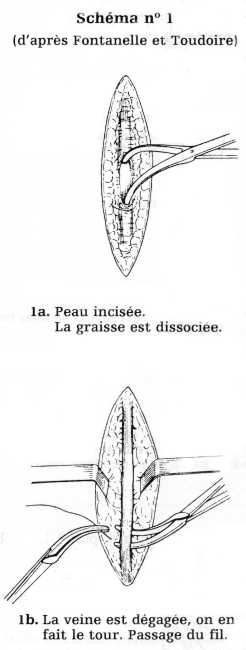
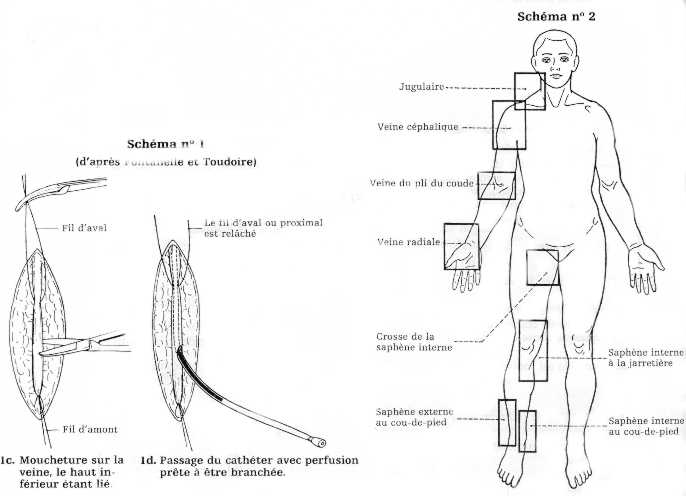
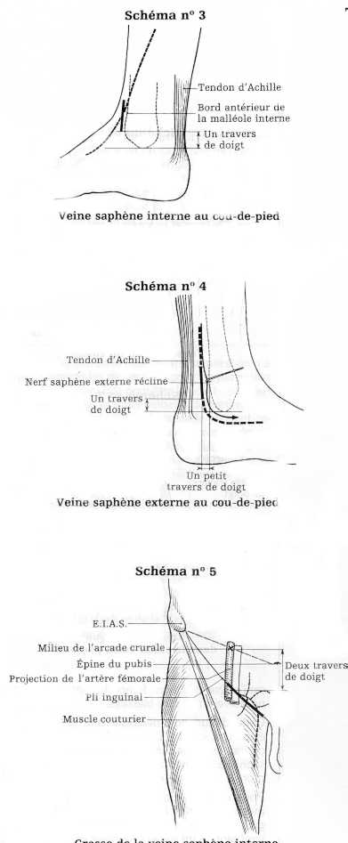
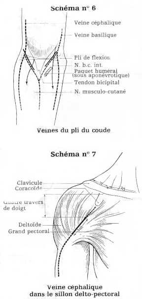

La perfusion par dénudation veineuse est devenue plus rarement employée depuis que l'on dispose de matériel simple et efficace permettant un abord veineux rapide pour des perfusions à grand débit et prolongées dans le temps: aiguilles de gros calibre, cathéter de calibre et de longueur variable monté sur aiguille.

Mais la dénudation veineuse se justifie cependant toujours:

*   si on ne dispose pas de ce matériel et que l'on désire perfuser un malade en urgence (déshydratation, hémorragie), et
*   pour une longue durée (déshydratation, brûlures...)

Si on dispose du matériel, la dénudation peut être cependant utile chez certains malades piqués à plusieurs reprises et chez qui on ne découvre plus de veine facilement accessible par ponction à travers la peau.

## **Principes généraux**

La dénudation veineuse consiste, après avoir incisé la peau, à découvrir une veine afin d'y introduire un cathéter directement sous contrôle de la vue.

Il s'agit donc d'une petite intervention chirurgicale, avec des règles d'asepsie stricte qui nécessite un minimum de matériel et comporte quelques dangers.

**Le matériel nécessaire**

Une boîte spéciale sera réservée à cet usage, il faut:

**1. de quoi faire une anesthésie locale**

- seringue

- aiguille fine s'y adaptant

- xylocaïne à 0,5, 1 ou 2 % sans Adrénaline

**2. de quoi dénuder la veine**

- un bistouri (qui coupe!)

- une pince fine type Halstedt ou Leriche

**et si possible**

- une pince à disséquer

- une paire de ciseaux fins

- deux écarteurs de Farabeuf

- une sonde canelée

- des pinces type Halstedt

**3.** **de quoi opérer proprement**

- gants stériles

- un champ troué

- des compresses

- un antiseptique pour nettoyer la peau du malade

- un bon éclairage

**4. de quoi perfuser le malade**

- un cathéter stérile

- un flacon du liquide que l'on désire perfuser (glucosé, sérum physiologique, grosses molécules) déjà installé sur le pied à perfusion avec sa tubulure purgée prête à fonctionner

**5. de quoi suturer**

- une bobine de catgut 00

- un fil pour la peau

Tout ce matériel doit être prêt et à "portée de main" avant de commencer. Mais j'allais oublier quelque chose d'important:

**6.** ... un aide est souvent très utile!

## **Technique** (_schéma n° 1_)

Elle est simple. On choisit le lieu de la dénudation avec soin.

**1.** Désinfection de la peau. Mise en place du champ troué

**2.** Anesthésie locale de la région que l'on va inciser

**3.** Incision de la peau au bistouri,

soit dans le sens de la veine, ce qui permet de la dégager sur une plus grande longueur mais nécessite une précision plus grande dans son repérage car, si l'on incise trop loin de cette veine, il sera difficile de la rechercher (_schéma 1a_),

soit perpendiculairement à son trajet, ce qui permet de retrouver la veine avec plus de facilité.

**4.** A l'aide de la pince, on dissocie la graisse sous-cutanée dans le sens de la veine _(schéma 1b)._ Une fois la veine repérée, on en fait doucement le tour grâce à la pince en restant à son contact. On passe la pince sous la veine et on glisse ainsi un bout de catgut qui servira à la tendre pour continuer à la disséquer sur quelques centimètres, puis à lier le bout inférieur.

Ce fil est lié le plus bas possible.

On passe alors sous la veine un deuxième catgut _(schéma. 1c)._

**5.** Le cathéter est alors préparé avec une perfusion, avec tubulure purgée prête à être branchée. La veine est tendue entre les deux fils.

Près du fil noué, on pratique une moucheture sur la veine, on la sectionne sur la moitié de sa circonférence au moyen des ciseaux ou du bistouri. Le fil d'aval est alors relâché, le sang revient par le trou pratiqué dans la veine. On introduit alors le cathéter et on le monte dans la veine sur plusieurs centimètres.

**6.** On s'assure qu'il est alors bien en place dans la veine:

en branchant la perfusion à grand débit, le liquide doit passer facilement;

en faisant une épreuve de reflux, la bouteille de perfusion est placée en dessous du niveau de la veine, le sang doit alors refluer dans le cathéter.

**7.** Fixation du cathéter: le fil d'aval est alors noué sur la veine et le cathéter, en ne le serrant cependant pas trop pour ne pas l'écraser. On peut se servir du fil d'amont pour nouer une deuxième fois le cathéter.

**8.** Fermeture de la peau: le cathéter peut ressortir par la plaie, ou mieux, à distance par une petite moucheture pratiquée dans la peau. Il est fixé à la peau par un fil.

La plaie et les premiers centimètres du cathéter sont mis sous des compresses stériles en évitant de couder à angle aigu le cathéter.

### **Choix de la veine à dénuder**

Ce choix dépend avant tout de l'habitude de l'opérateur, la veine saphène interne au cou-de-pied est la plus souvent utilisée, cependant il est utile de connaître d'autres lieux de dénudation possible en cas de problème.

## **I. Découverte de la veine saphène Interne au cou-de-pied**

_(schéma n°_ _3)_

La veine saphène interne au niveau de la cheville, passe en avant de la malléole interne, c'est-à-dire à un travers de doigt environ devant la saillie osseuse palpable à la face interne de la cheville. L'incision sera horizontale en avant de la malléole, la veine est très superficielle, de bon calibre, facilement accessible.

crosse de la veine saphène interne

## **II - Découverte de la veine saphène externe au cou-de-pied**

_(schéma n°_ _4)_

Plus difficile car la position à donner au pied est moins aisée et la veine est accompagnée d'un petit nerf que l'on peut confondre, ou blesser, ce qui entraînerait des douleurs et des troubles de la sensibilité du pied.

La veine passe en arrière de la malléole externe. Elle est assez profonde, le nerf qui l'accompagne est plus superficiel et c'est celui que l'on rencontrera en premier.

Si on ne trouve pas facilement, le risque est de s'égarer en arrière vers le tendon d'achille, alors qu'elle se trouve le plus souvent en avant et en dedans.

L'incision horizontale permet de la découvrir plus facilement mais le nerf est plus exposé aux blessures.

## **III. Découverte de la crosse de la saphène interne**

_(schéma n° 5)_

Cette voie est excellente, la veine y est toujours de bon calibre, même chez le petit enfant. Mais les risques d'infection sont plus grands en raison de la promiscuité des organes génitaux, et sa dénudation demande une grande pratique car l'artère et la veine fémorale sont proches et ne doivent pas être blessées.

Cette dénudation nécessite une aide et des écarteurs, elle sera, si possible, faite au bloc opératoire par le chirurgien lui-même. La veine saphène interne va se jeter dans la veine fémorale au niveau du pli inguinal.

Pour repérer sa position, il faut sentir les battements de l'artère fémorale au milieu du pli inguinal. Les veines fémorale et saphène se trouvent alors à un travers de doigt en dedans de l'artère, incision de quelques centimètres, horizontale, centrée sur ce repère.

La veine est découverte sous la graisse, au milieu de l'incision, parfois assez profonde chez l'obèse, mais en tout cas, on ne trouvera jamais de plan solide pour la découvrir. S'arrêter si on a l'impression d'avoir traversé une aponévrose.

La veine reçoit des branches à ce niveau, c'est un bon signe distinctif avec la veine fémorale. Les noeuds seront particulièrement bien faits car le débit sanguin est important à ce niveau. Les règles d'aseptie seront strictes car le cathéter monte dans la veine fémorale puis la veine cave. Cette voie d'abord doit être réservée à un opérateur entraîné.

## **IV - Veine du pli du coude**

Autre voie très utilisée, mais souvent, c'est à ce niveau qu'ont eu lieu les essais de perfusion et les veines sont souvent en mauvais état. Le danger est de blesser l'artère humérale. Il est évité si l'on reste superficiel, dans la graisse, sans aller chercher sous l'aponévrose (tissu solide, tendineux, blanc nacré).

Les veines seront trouvées de part et d'autre de la saillie du biceps. L'incision sera horizontale dans le pli du coude en dedans ou en dehors du tendon du biceps, ou oblique comme sur le schéma. Les veines sont superficielles, facilement accessibles.

## **V - Veine céphalique**

au niveau du sillon delto-pectoral

Voie moins connue, la veine est un peu plus profonde mais sa découverte sans danger.

Le sillon delto-pectoral est facilement palpé à la face antérieure de l'épaule. Il sépare le muscle deltoïde qui donne la rondeur de l'épaule, du muscle grand pectoral dont on sent très bien le tendon quand le bras est écarté du corps.

La peau est incisée sur ce sillon. La veine assez profonde, située entre ces deux muscles, elle est parfois recouverte d'un tissu solide. Le seul risque est de ne pas le trouver et de se perdre dans le muscle si l'on n'est pas juste dans le sillon. Mais aucun élément dangereux ne se trouve à ce niveau.

### **Cas particulier:**

chez le nourrisson

Les veines sont petites, mais peuvent être dilatées une fois ouvertes par une pince dont on écarte les branches. La graisse est parfois plus importante qu'on ne l'imagine. Ne pas pousser le cathéter trop loin car il monte très vite jusqu'au coeur et risque de le perforer!

## **Incidents et accidents**

**1. Si on ne trouve pas la veine:** bien reprendre ses points de repère:

est-ce bien en avant ou en arrière de la malléole ?

à sa face interne ou externe?

Ne pas hésiter à agrandir la plaie, chercher, mais toujours rester dans la graisse sans s'engager sous les aponévroses.

Ne pas s'acharner, changer de lieu de dénudation ou appeler quelqu'un de plus habitué.

**2.** La veine peut être **thrombosée,** bouchée à cause de manoeuvres antérieures; aucune goutte de sang à son ouverture, elle est blanche, rigide. Elle est inutilisable. C'est souvent le cas au pli du coude chez les malades déjà perfusés.

**3.** Si l'on **coupe** la veine totalement au lieu de faire une moucheture, comprimer pour arrêter le sang. Reprendre avec la pince le bout d'aval sectionné et recommander une moucheture plus haut.

**4.** Le cathéter doit être introduit dans la veine une fois que l'on a vu du sang revenir, car on peut faire fausse route en l'engageant non dans la lumière de la veine, mais entre les différentes tuniques de sa paroi. Le cathéter remonte mal et la perfusion ne coule plus.

Le cathéter peut perforer la veine si on le pousse sans délicatesse et surtout si on coupe son extrémité en biseau. La perfusion passe alors à côté de la veine, le reflux n'a pas lieu, et le membre gonfle.

### **Complications**

**1.** L'infection de la plaie est fréquente si on n'a pas respecté les règles d'asepsie, en particulier au pli de l'aine. Elle peut être le point de départ de septicémie, le trajet veineux devient rouge, douloureux (phlébite), le malade devient fébrile. Cet accident est fréquent après quelques jours de perfusion si les règles d'hygiène ne sont pas respectées. L'ablation du cathéter et les antibiotiques sont alors nécessaires.

**2.** Il est rare que la plaie saigne à l'ablation du cathéter, comprimer alors un moment.

La dénudation veineuse n'est donc plus souvent utilisée grâce au matériel moderne de perfusion. Mais ce matériel n'est pas toujours disponible et dans certains cas particuliers, la dénudation peut rendre de grands services. Il s'agit d'une intervention chirurgicale et nécessite donc des soins et de la propreté sous peine de provoquer des infections graves.

_Développement et Santé, n°33, juin 1981_