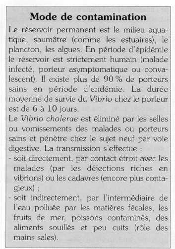
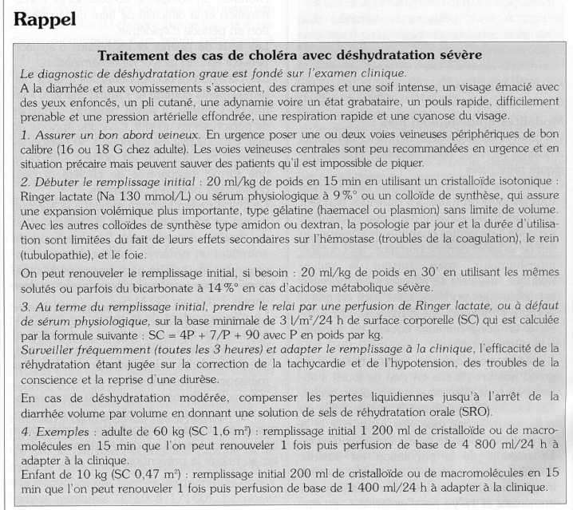
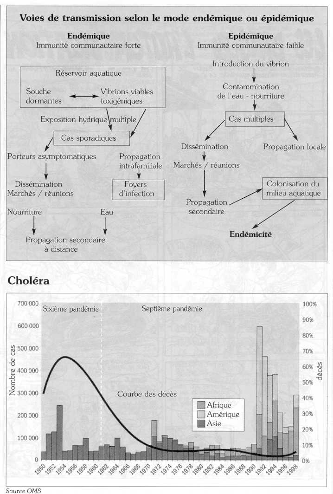

Dans le cadre des épidémies de choléra, les déterminants sont tous les facteurs influençant favorablement ou défavorablement l'évolution d'une épidémie. Avant une épidémie, l'analyse des déterminants peut permettre de prévoir l'émergence ou la réémergence d'une épidémie dans un pays ou une région.

Au début d'une épidémie, lors du diagnostic de la situation initiale, cette analyse est primordiale : elle va permettre de mettre en évidence les facteurs de risques importants, qu'il faudra évaluer, hiérarchiser et sur lesquels il faudra agir en priorité.

Cette analyse des déterminants à été réalisée grâce aux données bibliographiques et aux données d'expérience du terrain lors de plusieurs missions exploratoires de Médecins du Monde.
## I. Déterminants économiques

Les grandes épidémies de choléra arrivent toujours dans les pays pauvres du monde. Des études ont montré une corrélation, d'une part entre le nombre élevé de cas cumulés de choléra dans les 'pays d'Amérique latine et l'I.D.H.(1), d'autre part entre le taux important de mortalité par choléra et le faible revenu annuel par habitant (inférieur à 600 dollars). Les épidémies de choléra surviennent surtout dans les zones pauvres de ces pays, cumulant plusieurs facteurs de risque : densité de la population, promiscuité, dégradation des conditions d'hygiène, problèmes d'assainissement et d'accès à l'eau potable.

## Il. Déterminants démographiques et sociologiques

Ils sont favorisés par l'activité et le comportement humains :

*   _L'augmentation de la_ population, surtout dans les grandes villes, associée à une paupérisation et une urbanisation sauvage, est un facteur essentiel dans l'apparition présente et future des épidémies de choléra : le nombre d'habitants de la planète vivant dans les villes est passé de 33 % en 1970 à 50 % en 2000.
*   _Les mouvements de population_ : déplacements de population à la suite de guerres, de catastrophes naturelles, de famine : les épidémies de choléra peuvent réapparaître en zone d'endémie (la malnutrition, le stress, l'épuisement, la promiscuité favorisent la contamination). Des épidémies de choléra ont été favorisées par des déplacements de personnes au cours de la transhumance (par exemple, le cheminement du choléra au Sahel de 1970 à 1980), ou au cours de migrations liées au déplacement des travailleurs saisonniers : un exemple significatif est la dissémination de l'épidémie en Equateur, en 1991, par les pêcheurs rentrant chez eux et essaimant ainsi le choléra dans presque tout le pays.
*   _Les grands rassemblements_ (pèlerinages, fêtes, rites, coutumes) favorisant la promiscuité et le manque d'hygiène, sont des déterminants habituels et connus d'une flambée épidémique. Il suffit d'un cas importé par avion et l'épidémie se propage vite. Les axes de communication de l'épidémie de choléra sont toujours terrestres, maritimes, fluviaux mais de plus en plus aériens (l'accélération des moyens de communication favorise la diffusion rapide du vibrion cholérique parmi des populations sensibles très éloignées).

## **III.** Déterminants géographiques, écologiques

### Le climat

On retrouve le plus souvent les épidémies de choléra en zone humide, intertropicale, pendant la saison des pluies ; par exemple, la région des Grands Lacs en Afrique SubSaharienne et le delta du Gange sont des régions endémiques bien connues. Mais on peut voir aussi des épidémies de choléra en région semi-désertique pendant la saison sèche ; par exemple, les épidémies dans le Sahel, en Afrique, de 1970 à 1980, puis en 1983.

### La pluviométrie

L'arrivée de la saison des pluies ou de cyclones peut favoriser l'émergence ou la recrudescence d'une épidémie de choléra en région endémique humide ; un exemple récent : la côte Est de Madagascar. Ce n'est pas toujours le cas : après le cyclone Mitch en 1998, il n'y pas eu de vraies épidémies de choléra en Amérique Centrale. Toutefois, en région sèche ou semi-désertique, l'arrivée de la pluie peut arrêter l'épidémie de choléra en dispersant la population, jusque là concentrée sur les rares points d'eau et en permettant une meilleure hygiène.

### La température de l'eau

Comme nous l'avons vu, le vibrion se développe bien dans les eaux saumâtres plutôt chaudes, mais survit aussi des années dans les eaux profondes. Colwell R.R a observé, au Bangladesh, que la recrudescence du choléra endémique est corrélée à l'augmentation saisonnière de la température des eaux de surface.

### La température de l'air

Le vibrion cholérique est plus fragile à l'air ambiant que dans son milieu aquatique habituel. Il peut toutefois survivre quelques jours à la surface des fruits, légumes, poissons et crustacés contaminés.

### La topographie

Les épidémies de choléra débutent habituellement par les zones côtières des pays, parfois autour des lacs. Les estuaires, les deltas, les marigots et les mangroves, avec la présence d'eau saumâtre et de végétation aquatique, sont les principales zones à risques. A partir de ces zones, les épidémies diffusent vers tous les terrains : plaines, plateaux (à Antananarivo), en zone montagneuse (Afghanistan), et même en haute altitude dans la Sierra, en Equateur, à des hauteurs de 2000 à 4000 mètres.

### La nature du sol

Le terrain argileux toujours humide est un facteur aggravant : l'eau stagne, les latrines débordent. Paradoxalement, un sol volcanique constitué de lave, comme la Grande Comore, qui favorise le ruissellement et l'infiltration dans les nappes souterraines, peut être un facteur aggravant ; en effet, il peut y avoir contamination de la nappe, donc des puits, en cas d'épidémie de choléra.

**Conclusion :** Il n'existe pas de profil type climatique ou géographique pour une épidémie de choléra. On peut voir des épidémies de choléra sous de nombreux types de climats, en montagne ou en zone désertique, etc.

### L'écologie - l'environnement

Le changement des écosystèmes dû au réchauffement de la planète, la pollution atmosphérique, la déforestation entraînant des inondations, les sécheresses ou autres catastrophes climatiques (telles que _El Nino)_ pourraient être à l'origine de la recrudescence épidémique du choléra. Ces facteurs environnementaux pourraient aussi favoriser l'émergence de nouvelles souches de _vibrio cholerae._

## IV. Déterminants sanitaires

Ils sont liés :

*   au manque de ressources sanitaires du pays insuffisance de structures de santé, de personnel soignant bien formé et de financement,
*   à la désorganisation des services de santé et d'accès aux soins en cas d'épidémie de choléra,
*   au manque de politique de santé bien définie,
*   à l'état de santé précaire de certaines populations.

Le niveau sanitaire d'un pays est un déterminant essentiel dans le contrôle d'une épidémie de choléra et dans son extension. Elle est très facilement stoppée dans les pays développés où les ressources sanitaires sont suffisantes.

## V. Déterminants historiques

Depuis le début de l'histoire du choléra, on note un phénomène d'adaptation de _Vibrio_ _cholerae_ à l'homme, donnant un caractère épidémique à certaines souches non pathogènes jusqu'ici. Ce phénomène d'adaptation aurait été accéléré par la croissance démographique récente et les facteurs environnementaux. L'histoire du choléra illustre bien la dynamique d'adaptation d'un agent pathogène à son hôte en fonction de l'environnement, de la résistance naturelle et du comportement des populations qu'il infecte.

_Le groupe Choléra de Médecins du Monde_ _précise_ : au début d'une épidémie de choléra dans une région ou un pays, il est important de connaître l'histoire des précédentes épidémies de choléra, car elle permettra de comprendre plus vite les modalités épidémiques, le cheminement de l'épidémie et le comportement dés populations.

## VI. Déterminants biologiques

### Sensibilité génétique

L'âge, le sexe n'interviennent qu'indirectement en fonction du milieu social et des activités. Mais il existerait une sensibilité génétique au choléra : un facteur génétique dont le support pourrait être l'équipement d'un individu en gangliosides intestinaux intervient certainement.

### Facteurs biologiques favorisants

La sensibilité individuelle au choléra est attestée par le fait que l'expression clinique de la maladie reste habituellement rare par rapport à la fréquence des formes inapparentes et des formes mineures (1/10 à 1/100). Le pourcentage des formes inapparentes ou porteurs sains varie suivant le biotype ; avec le biotype EL TOR responsable de la 7ème pandémie, on constate 10 fois plus de porteurs sains par rapport aux malades qu'avec le biotype classique (50 à 100 porteurs sains pour un malade en phase d'endémie avec le biotype EL TOR). Mais la sensibilité individuelle à contracter la maladie dépend aussi de la physiopathologie et du mode de contamination. En effet, pour être pathogène, le vibrion doit passer la barrière de l'estomac (l'acidité gastrique le détruit au fur et à mesure).

Deux conditions lui permettront d'atteindre le jéjunum où il deviendra pathogène :

*   une forte dose infectante (108 à 1011 vibrions/ml)
*   un pH gastrique alcalin (chez les malades présentant une hypochloridrie, les gastrectomisés, ... )

Ces fortes doses infectantes se retrouvent lors d'ingestion de grandes quantités de nourriture contaminée où les vibrions sont protégés de l'acidité gastrique, lors de d'ingestion d'eau infectée massivement par les selles d'un malade, ou par la stagnation de cette eau dans des récipients ou des containers.

Pour être contaminé par l'eau douce courante où le vibrion est habituellement en faible quantité et ne se multiplie pas, il faut que le sujet présente une hypochlorhydrie gastrique ou des conditions de dénutrition, ou encore de stress qui diminuent ses défenses.

## VII. Facteurs épidémiologiques

Les épidémies de choléra touchent des Communautés à immunité faible ou nulle. Dans un pays vierge de choléra, la première vague épidémique touche l'ensemble de la population, tous âges confondus, en fonction surtout de ses activités.

Dans un pays ou une région d'endémie de choléra (par exemple, le delta du Gange) où les vagues épidémiques se succèdent, la population restante s'immunise plus ou moins et les réémergences saisonnières ne concernent que les jeunes non immunisés et les personnes ayant perdu leur immunité acquise. Il semble que le biotype EL TOR confère à la population une protection plus faible et plus transitoire que le biotype classique responsable des 6 premières pandémies.

### Modalités épidémiologiques

On observe classiquement, depuis les épidémies africaines récentes, deux modalités épidémiologiques principales

*   _L'épidémie traînante_ (quelques cas observés tous les jours ou toutes les semaines pendant plusieurs mois) survient dans une population exposée à de petites quantités de vibrions, du fait de la faible densité humaine; les contacts inter-humains, mais surtout le milieu hydrique, assurent sa diffusion. La mortalité est faible ; les porteurs sains sont en grand nombre et disséminent la maladie. Elle s'observe en zone humide, côtière ou fluviale, à la saison des pluies.
*   _L'épidémie explosive_ (apparition brutale d'un grand nombre de cas en peu de jours) s'observe en zone désertique ou en saison sèche. Elle touche des individus à immunité faible ou nulle. Le milieu ne joue plus aucun rôle et la transmission est surtout inter-humaine directe. La majorité de la population est atteinte (formes graves, formes mineures, formes inapparentes). La population restante est immunisée et il n'y a pas d'endémie. C'est surtout dans les camps de réfugiés que l'on observe ces épidémies explosives. A Goma, en République Démocratique du Congo, 30 000 cas environ sont survenus entre le 14 juillet et le 15 août 1994.

## VIII. Déterminants anthropologiques

Comme nous l'avons vu précédemment, les grands rassemblements favorisant la promiscuité et le manque d'hygiène sont des déterminants importants d'une flambée épidémique :

*   Les rites funéraires lors des enterrements chez les musulmans en Indonésie. Aux Comores, par exemple, on vide les intestins du défunt avant de l'enterrer. Dans la mesure où le vibrion survit longtemps dans l'intestin de l'homme, on comprend les sources de contamination et la difficulté de faire de la prévention en période d'épidémie.
*   Les lieux de prières et les bassins d'ablution peuvent être un facteur de dissémination.
*   Les cérémonies occasionnant les grands rassemblements comme le " grand mariage " en grande Comore. Il réunit plusieurs centaines de personnes en un jour. Chacune apporte un plat. Chaque plat est distribué à 50 personnes environ. Si quelqu'un est porteur sain ou a une forme inapparente de choléra, il peut contaminer plusieurs personnes.
*   Le grand rassemblement annuel à la Mecque a joué un rôle majeur dans la dissémination du choléra. Actuellement, l'Arabie Saoudite entretient un système sanitaire de surveillance qui est un modèle pour ce genre de situation : aucun cas de choléra n'a été déclaré depuis 1986 par l'O.M.S.
*   Le rôle important de la médecine traditionnelle est un facteur favorisant la diffusion et l'extension de l'épidémie en retardant l'arrivée des malades et en diminuant l'impact des messages de prévention.

L'approche ethnosociologique, la connaissance des pratiques culturelles, les comportements et attitudes devront être étudiés pour comprendre l'évolution de l'épidémie et adapter au mieux la prévention.

## IX. Déterminants politiques

Un climat d'instabilité politique, les guerres chroniques engendrent des conditions de vie et d'hygiène désastreuses, un appauvrissement du pays, une destruction des ressources sanitaires et parfois un déplacement de la population. Tous ces facteurs peuvent favoriser les épidémies de choléra.

## X. Conclusion

L'émergence des épidémies de choléra dans un pays ou une région donnée est donc le résultat de l'interaction de facteurs complexes liés :

*   à la virulence ou aux modifications de virulence du vibrion cholérique,
*   aux particularités de l'environnement (climatiques, écologiques, etc.),
*   au comportement humain (surpopulation, promiscuité, déplacement de population, rassemblement humain ... ),
*   au degré d'immunité de la population,
*   aux conditions de vie et d'hygiène liées à la pauvreté, à la promiscuité, aux problèmes d'eau potable, associées à la dégradation des ressources de santé (structures, personnels, accès aux soins) et à l'absence de réactivité immédiate des politiques de santé du pays concerné par l'épidémie.

(1) _IDH : l'indicateur de développement humain est un indicateur composite qui prend en compte trois éléments du développement humain affectés d'une pondération égale (niveau de santé, d'éducation et de revenu atteint dans le pays concerné). Il est exprimé sur une échelle de 0 à 1 et tend à remplacer le PNB/habitant._

_Développement et Santé, n° 152, avril 2001_