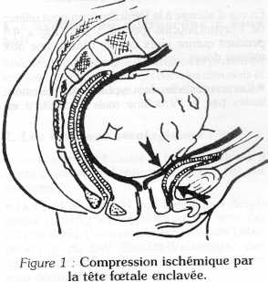
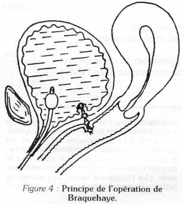

## Définition

Une fistule vésico-vaginale (FVV)  
est une communication anormale entre la vessie et le vagin.  
Il s'agit en fait d'une brèche sur la paroi postéro-inférieure de la vessie, et parfois de l'urètre, par laquelle les urines s'écoulent en permanence vers le vagin, sans possibilité de contrôle.  
A la perte des urines s'ajoute la stérilité et l'on comprend que cette affection retentisse sur toute la vie sociale, familiale et gynéco-obstétricale, de façon d'autant plus pénible qu'il s'agit très souvent d'une jeune femme primipare.

Cette complication des accouchements difficiles est encore malheureusement très fréquente dans certaines régions rurales et isolées d'Afrique insuffisamment équipées en maternités.

Il est important de connaître cette affection pour savoir la prévenir lors d'un accouchement difficile, ou la dépister ultérieurement devant une "incontinence" souvent cachée par la patiente elle-même.

Quand on a fait le diagnostic, ce qui est assez simple, il faut rassurer ces patientes, parvenir à les convaincre de se faire traiter et ne pas hésiter à les adresser à l'hôpital car il existe des procédés de chirurgie qui permettent le plus souvent la fermeture de la fistule mais aussi qui rendent parfois possibles des grossesses ultérieures.

## Etiologie et Epidémiologie

Dans la grande majorité des cas, en Afrique, la cause des FVV est obstétricale (les fistules survenant après une opération ou un traitement par la radiothérapie sont bien plus rares et posent d'autres problèmes).

Les FVV surviennent au cours d'un accouchement dystocique (c'est-à-dire un accouchement difficile quelque soit la cause de l'obstacle) par manque de surveillance et de traitement approprié.

On pense que, dans ces conditions, la tête du foetus peut se bloquer dans le petit bassin et comprimer *(fig. 1)* pendant plusieurs heures ou plusieurs jours la paroi vésicale contre la symphyse pubienne en avant. Après un certain délai (plus de 24 heures) cette compression entraîne une nécrose de la paroi vésicale par ischémie. L'accouchement finit par se produire (l'enfant est le plus souvent mort) et, quelques jours après, la fistule apparaît (chute de l'escarre).

Toutes les causes de dystocie peuvent entraîner ces accouchements trop prolongés. Lors d'une dystocie osseuse, le bassin de la mère est trop étroit pour le passage de la tête du foetus, qui ne pourra donc pas descendre pendant le travail. Lors d'une dystocie dynamique il y a un défaut de contraction de l'utérus ou de l'ouverture du col. Enfin c'est parfois une présentation défavorable (épaule) qui empêche l'accouchement.

Si des manoeuvres telles que césarienne ou forceps sont rendues nécessaires par l'évolution de l'accouchement, elles n'empêchent pas toujours la fistule d'apparaître si elles sont appliquées tardivement (il ne faut pas dans ce cas les tenir pour responsables de la fistule!).

Les FVV se voient surtout chez les femmes jeunes, en âge de procréer, et dans plus de la moitié des cas, primipares.

Parmi les causes favorisantes, il y a des facteurs ethniques, liés à la morphologie (femmes petites au bassin étroit) ou à la culture (excision et cicatrices vulvaires rétractiles). Mais c'est surtout le sous-équipement et le manque de maternités et de sages-femmes dans les zones rurales qui sont en cause, ainsi que les difficultés d'évacuation vers un hôpital.

## I.Description des lésions

*(fig. 2)*

**La vessie :** le plancher vésical est plus ou moins détruit, la fistule pouvant mesurer quelques millimètres à quelques centimètres et concerner le bas-fond vésical, le trigone ou le col, c'est-à-dire le méat urétral et la zone sphinctérienne. La vessie elle-même a une capacité réduite par la sclérose.

**L'urètre :** la fistule peut s'étendre au-delà du col, vers l'avant, détruisant une partie plus ou moins importante de l'urètre.

Les orifices urétéraux sont parfois sur les berges mêmes de la fistule, lorsque celle-ci concerne le trigone vésical.

**L'utérus :** la fistule, si elle est haute, peut aussi concerner l'isthme et le col utérin.

**Le vagin :** il est souvent étroit, car autour des fistules anciennes il peut se développer une sclérose et une rétraction des parois vaginales.

**Le rectum :** dans quelques cas, les plus sévères, il existe une fistule recto-vaginale associée, formant ce qu'on appelle un cloaque, infirmité très invalidante.

L'infection est presque constante, à la fois locale et urinaire.

## II. Examen clinique diagnostic

L'examen doit se faire sur une table d'examen gynécologique, avec des valves (assez étroites) pour présenter la paroi vaginale, un spéculum, une petite sonde ou une canule pour mettre en évidence la fistule, avec un bon éclairage.

Il est rare que le diagnostic soit fait précocement. Dans ce cas, lors de la surveillance des suites de couches, l'incontinence urinaire et l'hématurie attirent l'attention et il faut un examen gynécologique soigneux pour faire la différence entre une incontinence vraie du post-partum (par traumatisme du périnée), qui régressera, et une fistule. Celle-ci est parfois seulement mise en évidence par une épreuve au bleu de méthylène (200 cc de sérum et une ampoule de bleu de méthylène injectés dans la vessie). Il y a tout intérêt à dépister précocement ces fistules car le traitement en est beaucoup plus simple à ce stade précoce.

Lorsque la fistule est plus ancienne, le diagnostic est plus simple. La patiente souffre d'une fuite permanente des urines depuis son dernier accouchement dont on apprend qu'il fut long et difficile. En position gynécologique, on découvre des lésions cutanées et vulvaires provoquées par les urines. La mise en place d'une valve permet de voir, en avant, sur la paroi antérieure du vagin, la fistule par laquelle les urines coulent dans le vagin. La fistule est bordée de muqueuse vésicale, rosée, et un cathéter introduit par l'urètre ressort par la fistule *(fig. 3).*

Le chirurgien fait alors un bilan complet des lésions pour choisir un mode de traitement. Il précise la taille de la fistule, son siège exact, l'état du col vésical, de la zone sphinctérienne, de l'urètre, l'emplacement des orifices urétéraux, la taille de la vessie, le degré de sclérose et d'infection, l'état du col utérin et du sphincter anal. Tous ces éléments sont à considérer lorsqu'on envisage d'opérer ces fistules.

Par ailleurs il faut apprécier le rentissement sur l'état général de la femme, son désir de grossesses ultérieures, son environnement familial.

Après ce bilan la femme doit être adressée dans un hôpital où l'on opère ce type d'affection, sachant que le traitement est parfois long (quelques semaines à quelques mois).

### III. Traitement

Le traitement de cette affection est chirurgical.

Avant d'opérer il est utile de prévoir une ou deux semaines de préparation; traitement d'une anémie, d'une parasitose, d'une infection urinaire; la pose d'une sonde à demeure permet de diminuer le débit de la fistule et de traiter, au moins partiellement, les lésions loco-régionales, (toilette vaginale antiseptique, assèchement des lésions cutanées).

**Les procédés chirurgicaux**

Ils sont trop nombreux pour être présentés en détail, chaque chirurgien choisissant un procédé en fonction des lésions observées et de ses habitudes.

### a. Les interventions curatrices

Elles ont pour objectif de restaurer une anatomie normale, c'est-à-dire de rendre la vessie à la fois étanche et continente. Cela suppose de fermer la fistule et de restaurer l'appareil sphinctérien s'il était lésé.

La voie d'abord peut être haute (voie abdominale, trans-vésicale ou trans-péritonéo-vésicale), basse (vaginale) ou mixte, à la fois abdominale et vaginale.

Dans les cas les plus simples, heureusement assez fréquents, l'opération comprend schématiquement les temps suivants :

- position gynécologique, sur table gynéco,
- anesthésie générale ou rachianesthésie,
- abord et exposition des lésions par voie vaginale (voie basse),
- dissection des berges vaginales et vésicales de la fistule,
- réparation en plusieurs plans successifs, par divers procédés,
- drainage,
- sonde à demeure pour dix jours *(fig. 4).*

Lorsque la fistule est plus importante, des procédés plastiques particuliers permettent de refermer la paroi vésicale et de restaurer la continence sphinctérienne. Citons, par exemple, l'utilisation du muscle grand droit de l'abdomen comme lambeau pédiculé pour doubler et renforcer la région de la réparation vésico-urétrale. Citons aussi les plasties réalisées à l'aide d'un lambeau de grande lèvre.

Enfin les très importantes pertes de substance vésico-urétrales seront réparées par divers procédés plastiques, sous couvert d'une dérivation temporaire des urines, par l'intermédiaire d'une anse intestinale par exemple. Ce sont alors des opérations complexes et en plusieurs temps. Dans un premier temps on réalise la dérivation des uretères (dans une anse grêle, par exemple comme dans l'opération de Bricker); puis on opère la fistule "au sec"; enfin, quand la fistule est cicatrisée, on remet la vessie en circuit. Ces opérations complexes sont cependant rarement indiquées.

### b. La chirurgie palliative

Lorsque les lésions sont jugées trop importantes, des procédés palliatifs sont utilisés.

L'implantation des uretères dans le sigmoïde ou le rectum se fait selon divers procédés qui cherchent à éviter le reflux et l'infection ascendante des reins. Mais ces interventions nécessitent une surveillance à long terme pour dépister les complications tardives (sténose, infection, insuffisance rénale, cancérisation). Cette surveillance est rarement possible en Afrique, aussi cherche-t-on à éviter ces procédés chaque fois qu'on le peut.

**Suites opératoires**

Cette chirurgie est donc souvent difficile. Les suites opératoires immédiates sont délicates, et le chirurgien doit surveiller lui-même très attentivement l'évolution locale et donner des consignes précises concernant les sondes urinaires. Des fuites d'urines se produisent parfois, elles sont souvent temporaires. Des ré-interventions peuvent être nécessaires, parfois plusieurs fois, pour obtenir la fermeture complète de la fistule.

Lorsque le résultat final est bon, il est très important d'expliquer très soigneusement à la patiente queue doit impérativement se faire suivre à l'hôpital lors de la prochaine grossesse, si elle survient, pour éviter un nouvel accident. Une césarienne sera en général indiquée. Si la femme ne souhaite plus de grossesse, la ligature des trompes est indiquée.

### Conclusion

En conclusion, il faut dire que le meilleur traitement de cette grave infirmité est la **prévention. C'est le dépistage dans les villages, des accouchements dystociques par des sages-femmes assez nombreuses et compétentes ayant la possibilité de faire des évacuations vers l'hôpital le plus proche à tout moment.** C'est donc le progrès et l'amélioration des structures de santé qui feront disparaître cette pénible affection.

*Développement et Santé, n°86, avril 1990*
