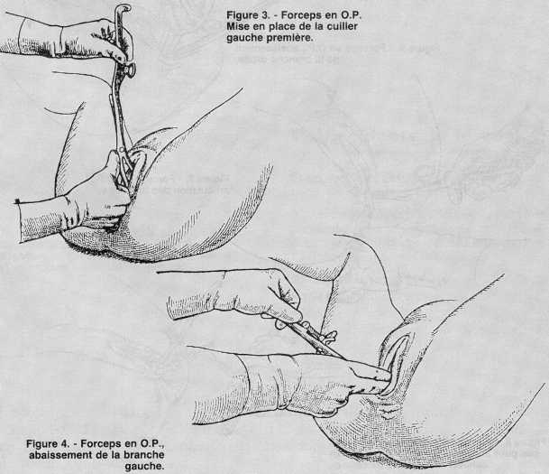
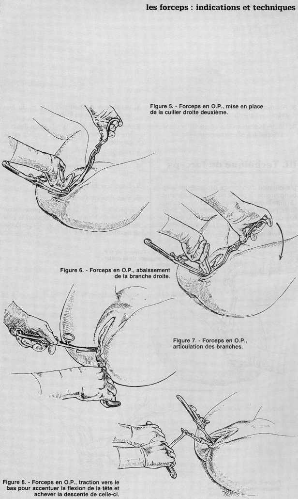
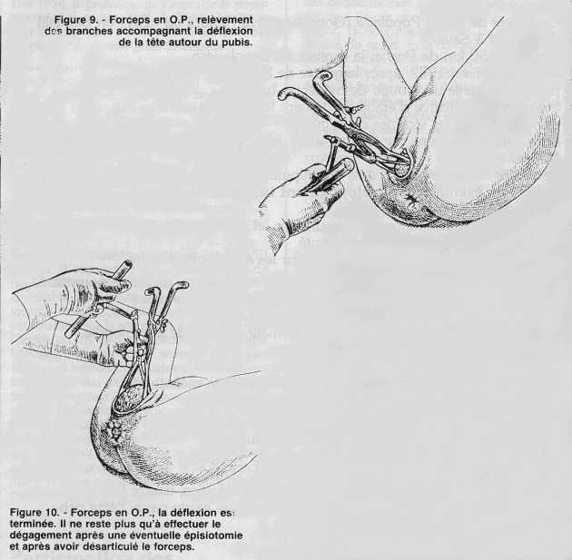

Le forceps est un instrument de préhension, de direction et de traction destiné à saisir la tête foetale et à l'extraire, par les voies génitales ou lors césarienne.

Les deux variétés de forceps utilisés habituellement sont :

*   les forceps croisés dont le modèle est le forceps de Tarnier,
*   les forceps à bandes parallèles type Suzor (ou Demelon)

_(figures: 1 et 2)._

## I. Conditions d'application **du forceps**

Elles sont impératives et doivent toutes être réunies sous peine de voir I'application du forceps se transformer en une manoeuvre difficile et dangereuse pour la mère et l'enfant

1.  L'application du forceps doit s'effectuer sur une **tête,** et uniquement la tête, quelle soit première ou dernière.  
2.  Là tête doit être **engagée** (+++)
3.  Il ne doit pas y avoir de disproportion foeto-pelvienne.  
4.  Les membranes doivent être **rompues.**
5.  La dilatation doit être **complète.**
6.  On doit connaître la variété de position de la tête fœtale.  
7.  La vessie de la patiente doit être vide (sondage).

## II. Indications du forceps

### 1. Indications foetales

**1.** La souffrance fœtale aiguë (+ + +)

**2.** Arrêt de progression de la tête fœtale par :

*   inertie utérine,
*   fatigue maternelle,
*   défaut de rotation,
*   obstacle à la progression au niveau du périnée.

**3.** Foetus de taille excessives (macrosome).

**4.** Petitesse du fœtus (le forceps protège alors la tête fœtale, et la fléchît).

### 2. Indications maternelles

1.  Fatigue maternelle empêchant la mère de pousser.  
2.  Inconscience maternelle : anesthésie générale.  
3.  Absence de poussées maternelles, en particulier sous anesthésie péri anale.  
4.  Contre-indications des efforts de poussée : cardiopathies, affections neurologiques...

## III. Technique du forceps

L'application d'un forceps nécessite une asepsie rigoureuse : le périnée est rasé et badigeonné.

On installe quatre champs stériles ou un champ hotte, puis on réalise l'anesthésie locale, régionale. Enfin, on effectue le sondage de la vessie maternelle. es temps de la technique sont variables:

1.  Vérification du bon montage et du bon fonctionnement du forceps.  
2.  Application simulée dans l'espace des cuillers du forceps (la première cuiller est la gauche).  
3.  Mise en place des cuillers.  
4.  Vérification de la pose : la tête **seule** et **bien** prise.  
5.  Extraction de la tête.  
6.  Sous couvert d'une épisiotomie.

L'application du forceps sur une présentation en occipito-pubienne est l'application la plus simple et la plus courante : en voici le protocole en dessins _(figures 3 à 10_).

## IV. Accidents du forceps

Ils se produisent lorsque les conditions d'application ne sont pas remplies :

### **1.** Accidents maternels

Déchirures vulvaires, périnatales, plus rarement vaginales ou cervicales, exceptionnellement vésicales ou rectales, mais aussi hématomes pelviens.

### 2. Accidents fœtaux

*   plaies et contusions cutanées,
*   lésions de la face,
*   lésions du nerf facial ou du plexus brachial,
*   céphalohématomes.

Le forceps est un excellent instrument d'extraction de la tête foetale, à condition d'en respecter les indications et les règles : on saura renoncer aux extractions difficiles ou acrobatiques au profit d'une césarienne.

_Développement et Santé, n°40, août 1982_