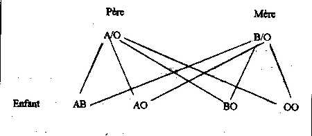
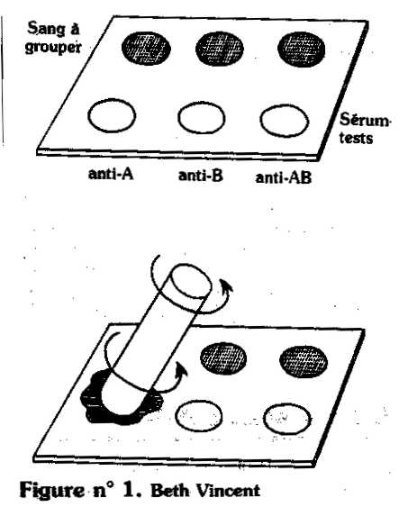
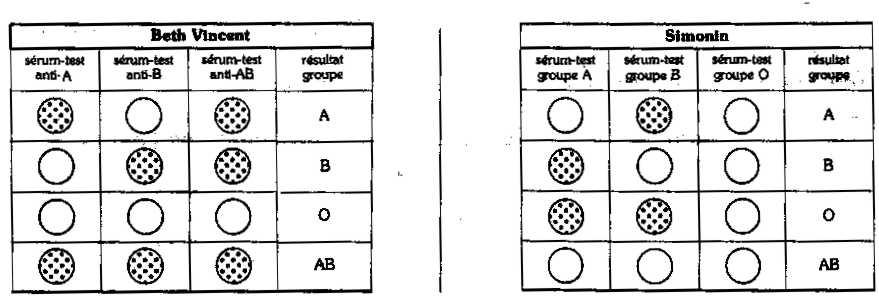
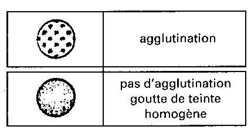
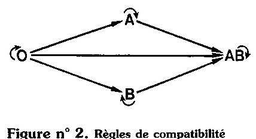

## **I.** **Le système ABO**

Découvert en 1900 par Landsteiner, c'est un groupe tissulaire, car présent sur la plupart des cellules de l'organisme, y compris les globules rouges ou hématies.

### **1. Les antigènes** **du système ABO**

Situés à la surface de la membrane cellulaire, ils sont au nombre de deux :

- l'antigène A (N acétyl galactosamine),

- l'antigène B (D galactose).

Chaque antigène est le sucre final d'une structure polysaccharidique qui est amenée et fixée par l'enzyme correspondante (enzyme A pour l'antigène A, et enzyme B pour l'antigène B) sur la substance H initiale. C'est la présence de l'antigène qui définit le groupe.

Ainsi, selon la présence ou l'absence des antigènes A et B, on définit quatre groupes

Groupe A = présence d'antigène A

Groupe B = présence d'antigène B

Groupe AB = présence d'antigène A et B

Groupe 0 = absence d'antigène.

**Tableau n° 1. Antigènes et anticorps de groupes** sanguins ABO

<table>

<tbody>

<tr>

<td valign="top">Groupe</td>

<td valign="top">Antigène(s)</td>

<td valign="top">Anticorps (sérum)</td>

</tr>

<tr>

<td valign="top">A</td>

<td valign="top">A</td>

<td valign="top">Anti B</td>

</tr>

<tr>

<td valign="top">B</td>

<td valign="top">B</td>

<td valign="top">Anti A</td>

</tr>

<tr>

<td valign="top">AB</td>

<td valign="top">A et B</td>

<td valign="top">Aucun</td>

</tr>

<tr>

<td valign="top">O</td>

<td valign="top">aucun</td>

<td valign="top">Anti A et anti B</td>

</tr>

</tbody>

</table>

### **2. Les anticorps**

Appelés naturels et réguliers, ils sont toujours présents dans le sérum, en dehors des extrêmes de la vie, chez un sujet non immunodéprimé. Les anticorps présents dans le sérum correspondent toujours à l'antigène absent des globules rouges.

Par exemple, un sujet de groupe A possède, à la surface de ses hématies, l'antigène A, et dans son sérum l'anticorps anti B (_tableau n° 1_).

### **3. Génétique et phénotype _(tableau n° 2)_**

La transmission génétique des antigènes A et B est autosomale dominante.

Pour les groupes AB et O, le génotype correspond aux phénotypes A/B et O/O respectivement. Par contre, les sujets de groupe A sont soit A/A soit A/O selon les caractères transmis par leurs parents. Les sujets de groupe B sont soit B/B soit B/O.

**Tableau n° 2.**

<table>

<tbody>

<tr>

<td valign="top">Phénotype</td>

<td valign="top">Génotype</td>

</tr>

<tr>

<td valign="top">AB</td>

<td valign="top">A/B</td>

</tr>

<tr>

<td valign="top">O</td>

<td valign="top">O/O</td>

</tr>

<tr>

<td valign="top">A</td>

<td valign="top">A/A ou A/O</td>

</tr>

<tr>

<td valign="top">B</td>

<td valign="top">B/B ou B/O</td>

</tr>

</tbody>

</table>

Ainsi, un sujet de groupe A marié à une femme de groupe B pourra avoir des enfants de tous les groupes : dans ce cas, les parents sont AO et BO (_tableau n°3)._

**Tableau n° 3**

### **4. Applications**

*   #### **Le groupage sanguin**

_- L'épreuve globulaire ou réaction de Beth Vincent :_

Correspond à la mise en évidence des antigènes globulaires, par agglutination des hématies porteuses d'un antigène, provoquée par l'anticorps (sérum test) correspondant.

L'agglutination est franche, immédiate (moins d'une minute), complète (tous les globules rouges sont agglutinés).

- La contre-épreuve, ou _épreuve sérique_ _ou réaction de Simonin_, confirme la technique précédente en révélant la présence d'anticorps dans le sérum, correspondant à l'antigène absent des globules rouges du sujet.

Par la mise en présence de suspensions d'hématies connues A et B avec le sérum à tester, on observe une agglutination des hématies lorsque l'anticorps correspondant est présent.

_**Pratique du groupage**_

_Matériel :_

- Plaque d'opaline (verre blanc opaque, carré blanc, ou carton laqué blanc),  
- Tubes secs.

**_Réactifs :_**

_- pour le Beth Vincent = sérums tests anti A, anti B, et si possible anti A+B,_

_- pour le Simonin = globules rouges tests de groupes A, B et O._

_Bien surveiller les conditions de conservation des réactifs_

**_Technique :_**

_- Sur plaque d'opaline (figure n° 1)_

_Disposer, toujours dans le même ordre, une goutte de sérum test anti A, anti B, et éventuellement anti A+B ; sur chaque goutte de sérum test, déposer une goutte de suspension globulaire à 10 % = Beth Vincent._

_Disposer 3 fois 1 goutte de sérum du patient , sue chaque goutte, déposer une goutte de suspension globulaire à 10 % d'hématies connues A, B et 0 = Simonin._

**Tableau N° 4. Détermination des groupes sanguins A, B, O et AB sur plaque d'opaline**

Avec le fond d'un tube propre et sec, mélanger les 2 gouttes des zones de réaction une à une, d'un mouvement circulaire pour obtenir un rond d'environ 2 cm de diamètre, en prenant bien soin d'essuyer le fond du tube entre chaque réaction.

Chalouper la plaque d'opaline d'un mouvement circulaire horizontal légèrement oblique, de façon à imprimer un mouvement circulaire au contenu des zones de réaction. Le liquide doit rester dans la zone circulaire de 2 cm délimitée à l'étape précédente.

S'il y a passage d'éléments d'une zone de réaction à une autre, il faut recommencer le test.

_Résultats (tableau n° 4_) _:_

Réaction positive : les hématies agglutinées apparaissent comme des conglomérats rouges espacés de liquide clair et limpide de la couleur du réactif initial ou du sérum du patient.

Réaction négative : le mélange globules rouges/sérum donne une teinte homogène orangée.

Les résultats des deux techniques (Beth Vincent et Simonin) doivent être concordants pour valider le groupage (_tableau n° 5_).

**Tableau n° 5. Interprétation**

**Réactions en tubes**

Disposer autant de tubes que de réactifs de groupage : trois tubes pour les réactions globulaires, trois tubes pour les réactions sériques. Etiqueter, identifier les tubes.

Dans chacun des trois premiers tubes, déposer une goutte de sérum test, respectivement 1 goutte d'anti A, une goutte d'anti B, une goutte d'anti A+B.

Dans chacun des trois tubes suivants, déposer 1 goutte du sérum du patient.

Dans les trois premiers tubes, mettre 1 goutte d'une suspension globulaire, environ à 10 % du sang du patient.

Dans les trois tubes suivants mettre 1 goutte de suspension globulaire à 10 % d'hématies connues, respectivement A, B et O.

Mélanger le contenu.

Centrifuger les tubes 1 minute à vitesse réduite (1 000 tours/minute).

Lire les réactions en décollant le culot.

_Résultats :_

Réaction positive : les hématies sont agglutinées entre elles par l'anticorps présent, on voit le liquide de réaction, limpide, à la surface et entre les agglutinais.

Réaction négative : les hématies se remettent en suspension homogène dans le liquide de réaction.

*   #### **La transfusion**

La règle en transfusion est de toujours respecter l'anticorps du receveur.

En effet, l'introduction d'hématies porteuses de l'antigène correspondant à l'anticorps du sérum, va provoquer leur destruction immédiate, déclenchant une hémolyse intravasculaire brutale (hémoglobinémie, hémoglobinurie, urines couleur porto), gravissime (état de choc) et souvent mortelle.

Le groupage sanguin se caractérise par des réactions simples et rapides, un matériel peu onéreux : plaques d'opaline ou de carton, tubes.

**mais l'erreur n'est pas permise !**

La valeur de la contre-épreuve prend de ce fait toute son importance (valide la réaction globulaire).

L'identification des prélèvements (nom, prénom, âge, ou date de naissance) doit être soigneuse, surtout s'il y a plusieurs patients.

Bannir autant que possible le recopiage (inutile) des résultats.

En dehors de l'urgence vitale, il est préférable de contrôler le groupe sur un nouvel échantillon, avant d'effectuer la transfusion.

En l'absence de sang du groupe du patient, se rappeler le schéma de compatibilité suivant (c'est l'anticorps du receveur qui compte : ne pas lui apporter l'antigène correspondant).

*   #### **La grossesse**

L'incompatibilité ABO du couple mère-enfant très fréquente n'a que très rarement des conséquences cliniques, qui restent très discrètes.

*   #### **La greffe d'organe**

Le système ABO est un groupe tissulaire pouvant être impliqué dans la greffe d'organe.

## **II. Le système Rhésus**

La découverte en 1940 par Landsteiner et Wiener du caractère agglutinant du sérum d'une multipare vis-à-vis de la plupart des échantillons de sang de la population a été à l'origine du décryptage encore très récent, biochimique et génétique, des antigènes de ce système. Des mystères persistent quant à leur fonction, puisqu'ils sont des éléments constitutifs de la membrane du globule rouge.

### **1. Les antigènes**

Situés sur toute la hauteur de la membrane cellulaire, les antigènes principaux du système Rhésus sont au nombre de cinq ; ils sont spécifiques des globules rouges du sang. Par leur présence ou leur absence ils définissent de nombreuses combinaisons.

Les antigènes du système Rhésus sont très immunogènes, c'est-à-dire ont le pouvoir de déclencher une réaction immune (anticorps), lorsqu'ils sont introduits dans un organisme qui ne les possède pas, et pour lequel ils apparaissent comme étranger.

Le plus important, car le plus immunogène, est l'antigène D.

Sa présence définit le caractère Rhésus positif, son absence, le caractère Rhésus négatif.

À côté de D, il existe quatre autres antigènes C, c, E, e.

C est l'allèle de c ; E est l'allèle de e ; D n'a pas d'allèle : il y a D ou rien.

La présence de l'antigène à la surface des hématies, mise en évidence par l'anticorps correspondant, définit, comme dans le système ABO, le groupe sanguin (_tableau n° 6)._

### **2. Les anticorps**

Toujours immuns, ils apparaissent après stimulation par grossesse ou transfusion, chez un sujet dépourvu de l'antigène correspondant.

À chacun des antigènes correspond un anticorps spécifique. Des mélanges d'anticorps ne sont pas rares, en particulier anti D+C chez les sujets Rhésus négatif.

Leur mise en évidence demande des techniques plus complexes que celle des anticorps du système ABO, telle la réaction de Coombs, ou test à l'antiglobuline, utilisée dans la recherche d'agglutinines irrégulières (RAI).

### **3. Génétique et phénotype**

Les antigènes du système Rhésus sont le résultat de l'expression des gènes de ce système.

Ce système est caractérisé par la présence de trois gènes liés (D, Cc, Ee) se transmettant sous forme d'haplotype.

Les possibilités antigéniques sont :

- pour D : gène D ou non D : antigène D ou rien (dd),

- pour Cc gène C ou c antigène C ou c,

- pour Ee gène E ou e antigène E ou e,

- C et E sont souvent liés à D.

Ainsi, un individu de phénotype DCcee est probablement de génotype DCe/dce mais pourrait aussi être de génotype Dce/dCe.

Le phénotype d'un individu ne correspond que rarement à son génotype : homozygotie ddccee: dce/dce.

### **4. Applications**

*   #### Le groupage

La détermination du caractère Rhésus ou présence de l'antigène D, fait partie intégrante de la détermination du groupe sanguin et s'effectue en même temps que le groupage ABO.

**Tableau N°6. Exemple pour l'antigène D : système Rhésus**

<table>

<tbody>

<tr>

<td valign="top">Test avec sérum anti D</td>

<td valign="top">Antigène</td>

<td valign="top">Groupe</td>

<td valign="top">Autre écriture</td>

</tr>

<tr>

<td valign="top">+++</td>

<td valign="top">D</td>

<td valign="top">Rhésus positif</td>

<td valign="top">D+</td>

</tr>

<tr>

<td valign="top">-</td>

<td valign="top">Rien</td>

<td valign="top">Rhésus négatif</td>

<td valign="top">D - ou dd</td>

</tr>

</tbody>

</table>

**Tableau N°7. Règles de transfusion**

<table>

<tbody>

<tr>

<td valign="top">Un sujet de groupe</td>

<td valign="top">Peut recevoir du sang de groupe</td>

<td valign="top">Peut donner aux malades dont le groupe est</td>

</tr>

<tr>

<td valign="top">A</td>

<td valign="top">A ou O</td>

<td valign="top">A ou AB</td>

</tr>

<tr>

<td valign="top">B</td>

<td valign="top">B ou O</td>

<td valign="top">B ou AB</td>

</tr>

<tr>

<td valign="top">AB</td>

<td valign="top">A, B, AB, ou O= receveur universel</td>

<td valign="top">AB</td>

</tr>

<tr>

<td valign="top">O</td>

<td valign="top">O</td>

<td valign="top">A, B, AB, O= donneur universel</td>

</tr>

</tbody>

</table>

Le groupage Rhésus s'effectue seulement par une épreuve globulaire, c'est-à-dire par la recherche de l'antigène à l'aide de sérums tests anti D.

Les techniques, soit sur plaques d'opaline soit en tubes, mettent en relation les globules rouges à tester en suspension à 50 % environ dans leur sérum avec le sérum test anti D.

Selon la nature humaine ou monoclonale des sérums tests utilisés, il faudra ou non utiliser un artifice de réaction (agglutination en milieu albumineux et à 37°C sur rhésuscope pour les sérums tests d'origine humaine).

Les sérums monoclonaux dispensent de ces artifices et s'emploient sur plaque et en tube avec la même facilité que les sérums tests du groupage ABO. Qu'ils soient humains ou monoclonaux, un témoin négatif de la réaction est obligatoire. Seule une réaction dont le témoin négatif est valide peut être interprétée.

En cas de difficulté de réaction, considérer le sujet comme de groupe Rhésus négatif.

*   #### **La transfusion**

Les antigènes du système Rhésus sont très immunogènes . Il est préférable autant que possible de respecter en particulier l'absence d'apport d'antigène D pour les receveurs de Rhésus négatif, et ce d'autant plus qu'il s'agit d'une petite fille ou d'une femme en âge de procréer.

L'immunisation du receveur Rhésus négatif entraîne des accidents d'hémolyse de type ictère retardé, si on poursuit la transfusion de sang de Rhésus positif, parfois un accident d'hémolyse intravasculaire comme l'accident ABO, lorsque l'anticorps est très puissant.

*   #### **La grossesse**

L'immunisation de la femme enceinte Rhésus négatif se fait par le passage d'hématies foetales portant le caractère Rhésus positif, le plus souvent en fin de grossesse et surtout au moment de l'accouchement.

Le premier bébé est indemne. La mère va reconnaître l'antigène D de son enfant comme étranger et va produire des anticorps anti D qui sont des IgG.

Lors des grossesses suivantes, les anticorps anti D de la mère vont passer la barrière placentaire et venir se fixer sur les hématies de l'enfant, si celui-ci est Rhésus positif, entraînant hémolyse et anémie du foetus.

Au cours des grossesses successives, les complications sont de plus en plus graves, liées à l'incompatibilité foeto-maternelle, allant du simple ictère à l'anémie profonde avec anasarque et mort foetale in utero.

C'est la maladie hémolytique du nouveau-né (MHNN).

La MHNN peut survenir à la première grossesse, en cas de grossesse difficile et passage précoce d'hématies foetales dans la circulation maternelle.

Elle est possible également lorsque la mère a été précédemment stimulée par une transfusion antérieure, faite avec du sang Rhésus positif.

Les autres antigènes du système Rhésus peuvent aussi être responsables d'une MHNN.

### **Conclusion**

En vue d'une transfusion sanguine, il est indispensable de déterminer le groupe sanguin du malade et celui du ou des donneurs, La transfusion ne pourra être effectuée que si les groupes sont compatibles (_tableau n° 7_). Dans le cas contraire, la transfusion peut être responsable de la mort du malade.

_Développement et Santé, n° 130, août 1997_