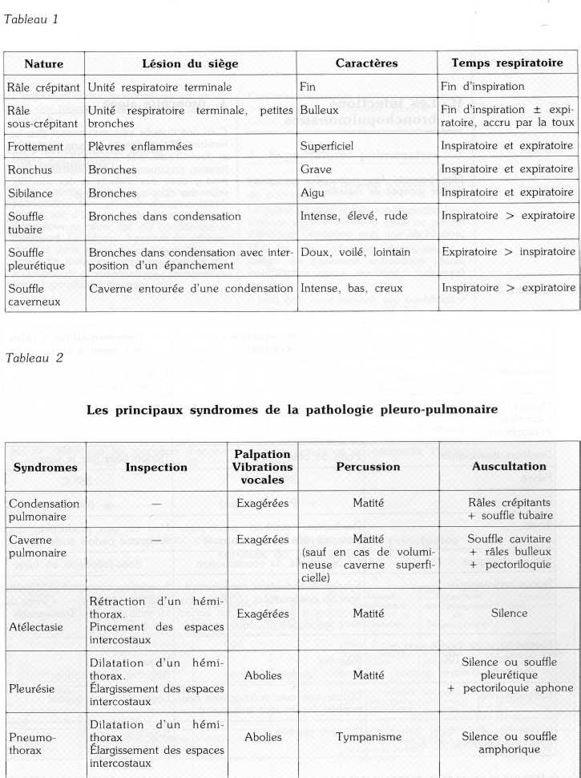
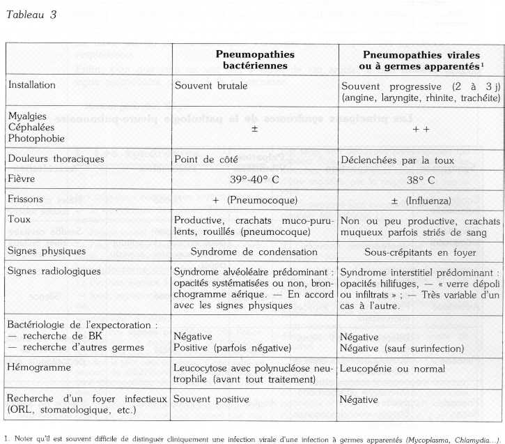
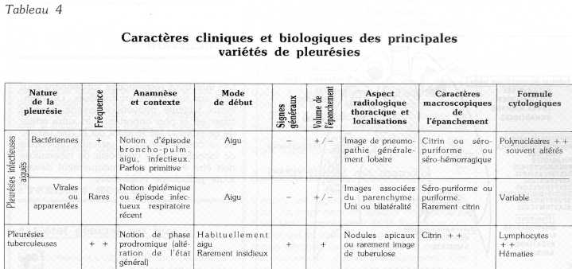
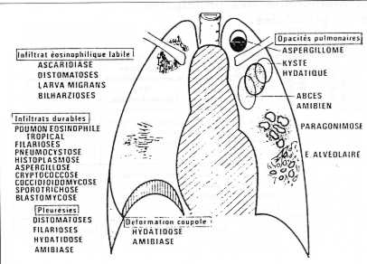

## **I. Les syndromes**

Les infections respiratoires varient selon :

*   la topographie des lésions (bronchiques, parachymateuses, broncho-alvéolaire) ;
*   l'agent causal (virus, bactérie, parasites)
*   l'état antérieur (maladie respiratoire chronique, déficit immunitaire).

**Ces infections s'expriment :**

**1.** Par des **signes fonctionnels** limités :

- toux, expectoration chronique, hémoptysie,

- dyspnée, douleurs.

**2.** Par des **signes physiques** très riches. L'inspection, la palpation et la percussion gardent leur place même si l'auscultation est souvent la plus caractéristique. Cette dernière permet de différencier le murmure vésiculaire des souffles, des râles et des frottements.

Les souffles sont dus à la transmission exagérée du souffle glottique normal par une modification pathologique du parenchyme pulmonaire ou par un épanchement pleural.

Les râles sont des bruits pathologiques qui naissent dans les alvéoles pulmonaires ou les bronches. Leur principale caractéristique est d'être modifiés par la respiration et par la toux.

Les frottements sont éventuellement d'origine pleurale _(cf. tableau 1)._

**3. L'examen pneumologique** doit être complété par :

*   la recherche d'une cyanose (coloration bleue violacée des téguments et des muqueuses) ;
*   la recherche d'un hippocratisme digital (bombement des ongles) ;
*   un examen cardiovasculaire (recherche d'une insuffisance ventriculaire droite ou gauche);
*   un examen neurologique avec l'appréciation de l'état de conscience.

**4.** La **radiographie pulmonaire** standard est, bien sûr, d'un appoint capital dans cette pathologie et fera l'objet d'un article ultérieur.

Au terme de cet examen clinique, il est possible de classer les infections respiratoires en plusieurs grands syndromes _(cf. tableau 2)._

## **II. Les infections bronchopulmonaires**

Elles peuvent être regroupées en quatre grands groupes de maladies.

### **1. Bronchite aiguë**

C'est une maladie fréquente surtout chez les fumeurs. Elle commence par une toux sèche et douloureuse, puis il apparaît une expectoration mucopurulente. A l'auscultation, il peut y avoir des sibilants et des ronchus, voire des râles sous-crépitants.

L'apparition d'une bronchite chronique est une des principales complications de cette infection.

### **2. Pneumopathie aiguë** **(ou pneumonie)**

Cette maladie provoque une condensation pulmonaire. Elle est soit d'origine bactérienne, soit d'origine virale. Il est important d'apprécier sa cause car elle conditionne le traitement. Le _tableau 3_ permet de différencier ces deux types de pneumopathies. Enfin, des maladies parasitaires peuvent être à l'origine de pneumopathies : pneumocystose, aspergillose, filariose.

### **3. Pleurésies**

Il s'agit d'une inflammation de la plèvre aiguë ou chronique avec ou sans épanchement.

L'infection n'est pas la seule cause des pleurésies. Il existe des pleurésies traumatiques, cardiovasculaires et tumorales. Mais les plus fréquentes sont infectieuses et après avoir éliminé une tuberculose, il est là aussi possible de différencier les pleurésies d'origine bactérienne ou virale _(cf. tableau 4)._

Certaines parasitoses peuvent aussi induire une pleurésie : distomatose, filariose, hydatidose, amibes.

### **4. Suppurations pulmonaires**

Le tableau le plus fréquent est celui d'abcès du poumon.

Le début est celui d'une pneumopathie bactérienne aiguë et rien à ce stade ne permet d'évoquer l'évolution vers une abcédation.

Mais les signes cliniques réapparaissent... malgré un traitement antibiotique (durée insuffisante, choix inadapté, traitement tardif).

Il peut également survenir une modification de l'expectoration : vomique, hémoptysie, fétidité de l'expectoration.

Cet abcès apparaît souvent sur un terrain fragilisé (alcoolisme, diabète, déficit immunitaire).

A l'examen clinique, les signes sont de nature variable mais de siège fixe. Il s'agit le plus souvent d'un syndrome de condensation.

Là encore la radiologie et les prélèvements bactériologiques sont d'un appoint important. A noter l'existence exceptionnelle d'abcès amibiens.

**Conclusion**

Les infections respiratoires surviennent souvent sur des poumons fragilisés. De nombreux facteurs peuvent intervenir mais le tabac est le plus important. Un autre article de ce numéro fait le point sur le rôle néfaste de ce comportement. Il est enfin nécessaire de rappeler que le diagnostic de tuberculose doit être évoqué systématiquement devant toute pathologie respiratoire.

_Développement et Santé, n°94, août 1991_