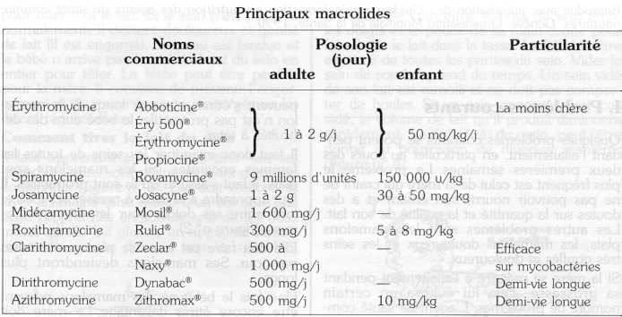

Devant le grand nombre d'antibiotiques disponibles aujourd'hui, il nous a semblé utile d'aborder les grandes familles d'antibiotiques (macrolides, pénicillines, aminosides, céphalosporines, etc.) pour en mieux comprendre les indications, les limites et les inconvénients qui sont en général communs pour une même famille. 
Les premiers macrolides ont été extraits d'une bactérie streptomyces en 1950, ce qui a donné naissance à l'érythromycine toujours utilisée aujourd'hui. 
De nouveaux macrolides ont été inventés : ils ont le même spectre antibactérien mais sont mieux tolérés et ont une demi-vie parfois très longue, ce qui permet un traitement plus court.

## I. Spectre d'activité

L'activité est mesurée au laboratoire par la concentration minimale inhibitrice (CMI) nécessaire et suffisante pour bloquer la multiplication du germe.

Ainsi, une CMI inférieure à 0,01 microgramme signifiera que l'antibiotique est très efficace pour ce germe (les macrolides sont ici efficaces).

**CMI < 1** - Streptocoque A

Exemple :

*   Pneumocoque
*   Staphylocoque doré
*   Gonocoque
*   _Bordetella_ (coqueluche)
*   _Legionella_
*   _Mycoplasma pneumoniae_ _- Branhamella catarrhalis_
*   _Helicobacter pylori_
*   _Mycobacteries_ atypiques

**CMI > 1** (les macrolides ici sont inefficaces)

Exemple :

*   _Hemophilus_ _influenzae_
*   Colibacille
*   Pyocyanique
*   BK

## **II. Pha**r**macocinétique**

Après absorption orale (la voie intraveineuse est exceptionnelle), les macrolides traversent rapidement le tube digestif pour pénétrer dans :

*   les poumons,
*   la peau,
*   les polynucléaires,
*   les muqueuses ORL (amygdales, oreilles).

La demi-vie est de 24 heures pour l'érythromycine et de 48 heures pour l'azithromycine.

## III. Indications cliniques

### 1. Les angines

Avec la pénicilline V, les macrolides sont les antibiotiques de choix dans l'angine. Ils sont indispensables en cas d'allergie à la pénicilline.

Les nouveaux macrolides (azithromycine) permettent un traitement de cinq jours (contre dix pour l'oracilline).

### 2. Les infections pulmonaires

Ils sont efficaces sur la plupart des germes provoquant des bronchites.

En cas de pneumonie sans signe de gravité, ils sont très utiles : devant une forme grave, on préférera un antibiotique injectable.

### 3. Les infections cutanées

Diffusant bien dans la peau, les macrolides agissent rapidement dans l'impétigo et l'érysipèle. Par contre, leur efficacité est inconstante dans les infections à staphylocoque.

### 4. Infections génitales

Dans les uréthrites et les prostatites, les macrolides sont indiqués sans restriction car très efficaces sur _Chlamydia trachomatis,_ _Ureoplasma,_ le gonocoque et le mycoplasme. Ils sont inconstamment efficaces sur le tréponème (syphilis).

Dans les salpingites, ils sont aussi efficaces que les tétracyclines.

### **5. Macrolides et sida**

La clarithromycine est l'antibiotique le plus actif sur le _Mycobacterium avium,_ le principal agent responsable des diarrhées chroniques dans l'infection à VIH. Malheureusement, l'apparition des résistances nécessite une association à l'éthambutol ou la rifabutine.

### 6. **Macrolides et trachome**

Les macrolides sont efficaces sur l'agent du trachome et la plupart des germes responsables de surinfection conjonctivales.

Une gélule par semaine d'azithromycine prévient l'infection (conséquence de l'élimination très lente du produit).

## IV. Tolérance

Les macrolides sont parmi les antibiotiques les mieux tolérés et exceptionnellement responsables d'effets indésirables graves.

#### Manifestations gastro-intestinales

Surtout chez l'enfant (7 à 15 %) : douleurs abdominales, vomissements, diarrhée.

Troubles surtout rencontrés avec l'érythromycine :

*   allergies 0,5 % prurit, érythème, urticaire
*   hépatotoxicité il peut s'agir d'une simple élévation des transaminases, voire d'un ictère survenant les dix premiers jours (1 %). Il impose l'arrêt immédiat du traitement ;
*   ototoxicité (exceptionnelle) : une surdité peut survenir dès les 48 premières heures. Elle régresse dès l'arrêt du traitement.

## V. Interactions avec les aliments

Les aliments gênent l'absorption de l'érythromycine : elle doit donc être absorbée en dehors des repas (1 à 2 h après).

## Conclusions

Antibiotiques de première intention, surtout chez l'enfant, dans les angines et les bronchopneumopathies, les macrolides connaissent un renouveau avec les nouvelles molécules permettant un traitement court.

De plus, de nouvelles indications se profilent diarrhée du sida, traitement des ulcères duodénaux (provoqués par _Helicobacter pylori),_ toxoplasmose cérébrale, et surtout prévention du trachome.

_Développement et Santé, n°124, août 1996_