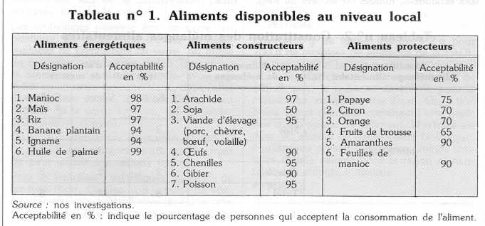
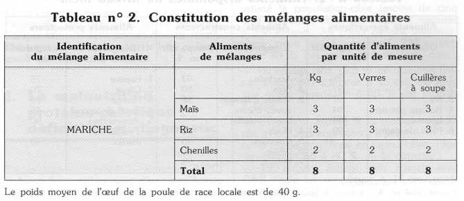
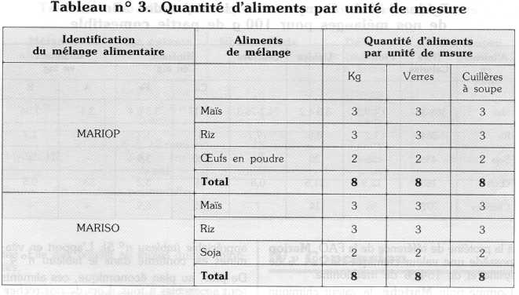
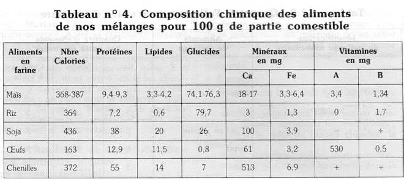

Selon le rapport annuel 1990 de l'UNICEF, plus de 150 millions d'enfants de moins de cinq ans souffrent de malnutrition dans ce monde qui a pourtant les moyens de prévenir ce mal.

La MPC se trouve surtout dans les milieux où prévalent l'ignorance, l'analphabétisme, la pauvreté, le manque d'hygiène, l'absence d'industries de transformation, de production et de conservation des aliments.

Au Zaïre, et plus particulièrement au Centre de santé rurale de Mondongo (zone de Lisala), on rencontre des enfants malnutris bien que vivant dans un environnement riche en aliments nécessaires à la croissance et au développement harmonieux. Nos parents ne savent pas quel est le moment indiqué pour le sevrage, les exigences nutritionnelles de l'enfant sevré, comment conditionner leurs propres aliments, comment les associer en fonction de leur valeur nutritive, comment les préparer et les servir à l'enfant pour prévenir et traiter la malnutrition.

Le revenu du paysan ne lui permet pas l'achat de produits alimentaires importés, compte tenu de leur prix et de leur rareté. **On peut et on doit nourrir nos enfants** **avec les aliments locaux.**

## I. La malnutrition protéino-calorique : définition et diagnostic

La malnutrition protéino-calorique (MPC) présente les manifestations d'une insuffisance protéique et calorique, allant du faible retard de croissance à la maladie grave (y compris le marasme).

Le kwashiorkor, chez les enfants de un à trois ans, est une forme grave de MPC due au manque qualitatif et quantitatif de protéines, souvent accompagné d'un excédent de glucides, d'une déficience de vitamines et de sels minéraux. Le marasme est aussi une forme grave de MPC causée principalement par la famine.

Le diagnostic de la MPC se précise par des indicateurs anthropométriques (poids, taille, cordelette ou circonférence de l'arrière-bras), des indicateurs biologiques et cliniques.

Lors de nos travaux, nous avons utilisé la cordelette (circonférence de l'arrière-bras : CAB) pour les enfants âgés de un à cinq ans (selon J. et R. Brown, Finken) ; la courbe pondérale de D.B. Jeliffe chez les enfants de moins de un an. Dans les deux cas, les signes cliniques ont été notés.

Ainsi, pour 5 902 personnes, nous avons estimé la population-cible (moins de cinq ans) à 1 180 ; et la population à mesurer à 236 enfants.  
Au cours de nos investigations, nous avons enregistré 337 enfants dans 30 % des ménages enquêtés, dont :

*   66 enfants, soit 19,5 % de malnutris graves avec CAB inférieur à 13 cm, ou avec une masse pondérale à 60 % par rapport à l'âge ;
*   81 enfants, soit 24 % de malnutris modérés, avec CAB approchant à peine à 15 cm, où la masse pondérale en rapport avec l'âge représentait 60 à 80 % de la normale ; - 190 enfants étaient bien nourris avec CAB égale ou supérieure à 16 cm, poids supérieur à 80 %.

Le taux de 15 % et plus d'enfants malnutris est considéré comme un problème communautaire ; au Centre de santé rurale, avec un taux de 19,5 % de malnutrition, le traitement devenait curatif.

## II. Quels traitements proposer ?

Bien que plusieurs spécialistes aient prescrit des traitements, le taux de malnutrition à travers le monde était de l'ordre de 46 % en 1990.

### 1. Les aliments locaux : disponibilité et acceptabilité

Le Centre de santé rural de Mondongo est situé en zone équatoriale où le climat chaud et humide entretient un environnement potentiellement généreux pour la cueillette et pour la chasse (champignons, fruits, gibier, insectes, poissons), et également très favorable à l'agriculture et l'élevage (tableau n°1).

De tous les aliments disponibles et acceptés, les plus consommés sont :

*   le manioc, aliment de base consommé sous forme de chikwangue et de fufu
*   le riz, la banane plantain, le maïs
*   l'arachide grignotée entre les repas
*   le soja, encore au stade de vulgarisation et peu accepté (50 %) ;
*   les fruits, tels que l'avocat, la mangue, l'orange, le citron, la papaye et l'ananas, réservés aux enfants ;

*   l'huile de palme utilisée dans presque toutes les préparations ;
*   parmi les légumes, les feuilles de manioc, les amaranthes, les épinards, les tomates et les aubergines.

Quant aux produits d'élevage et contrairement aux observations des Drs Bervoets et Lassange, la viande des poules et les oeufs sont aujourd'hui facilement consommés et, dans chaque ménage, on peut voir deux à cinq poules.

Les chenilles se récoltent en bonne quantité malgré le caractère saisonnier de cette opération. Elles sont fumées et conservées en panier, ce qui permet une disponibilité tout au cours de l'année.

Le gibier, le poisson et les autres produits de cueillettes sont disponibles occasionnellement en petites quantités.

Il n'existe pas de plats spéciaux réservés aux enfants qui, récemment sevrés, consomment le plat familial avec la chikwangue, le fufu ou la banane plantain, pauvres en éléments de croissance.

### 2. Préparation des mélanges alimentaires avec les aliments locaux

En 1984, un groupe de chercheurs de l'ISEA-Mondongo mit au point une formule de mélange alimentaire pour enfants sevrés. Cinq ans plus tard, nos recherches ont révélé que la population s'était désintéressée de ce mélange qui associait mais, riz, soja : **Mariso.** Le soja, peu disponible et moins accepté, a été la contrainte majeure de sa vulgarisation.

Il fallait proposer d'autres mélanges plus appropriés aux réalités locales. Ainsi, à la place du soja, nous avons utilisé les chenilles pour un mélange ma7is, riz, chenilles : **Mariche ;** ou l'oeuf pour le mélange : maïs, riz, oeuf de poule : **Mariop.** Ces deux aliments constructeurs, oeufs et chenilles, sont disponibles et bien acceptés.

### 3. Technologie de transformation des aliments locaux au niveau familial

*   **Le riz :** bien vanné, le faire tremper dans de l'eau pendant dix minutes, le sécher au soleil pendant trois à cinq heures jusqu'à obtenir des grains de riz crayeux). La mouture et le tamisage se réalisent comme pour le maïs.

*   **Le maïs :** faire tremper les grains pendant trente minutes dans de l'eau, les sécher au soleil pendant six à huit heures ; en période moins ensoleillée, l'égoutter à l'air libre, puis le sécher dans la poêle à frire à **feu doux.** Les grains séchés sont moulus ou pilés dans un mortier. La farine obtenue est tamisée pour la débarrasser des pellicules cellulosiques qui risquent de diminuer sa digestibilité et donc sa valeur nutritive.

*   **Le soja :** les graines bien sèches sont vannées, grillées, moulues ou pilées et tamisées de façon à obtenir une farine à mélanger.

*   **Les chenilles :** récoltées fraîches, elles sont échaudées, fumées ou séchées au soleil jusqu'à dessiccation complète, ensuite conservées en paniers ou dans les greniers. Lors de la préparation du mélange, on en retire la quantité à moudre ou à piler. La farine obtenue requiert un tamisage avant d'être mélangée.

*   **L'oeuf**
    *   prendre une boite vide type lait Nido ou Guigoz ;
    *   nettoyer proprement l'intérieur en enlevant la couleur contenant les inscriptions ;
    *   remplir la boite de braises chaudes, la fermer ;
    *   laisser chauffer pendant cinq minutes ;
    *   couler le jaune d'oeuf bien battu dans la boite ;
    *   dès que le jaune d'oeuf est sec, le retirer à la cuiller ou au couteau et le conserver dans un récipient sec et propre.

**4. Mélanges alimentaires pour la préparation de la bouillie** _(tableaux n°2 et 3)_

D'une manière pratique, on utilise la formule venue du Malawi, d'une recette de **Likini** **Phala,** c'est-à-dire la proportion de 75 % de céréales mélangées avec 25 % d'aliments protidiques. Les 75 % contiennent en quantité égale glucides et lipides. Ce qui représente :

*   2/8è d'aliments protidiques
*   3/8è d'aliments glucidiques
*   3/8è d'aliments lipidiques.

L'unité de mesure de référence, à défaut de balance, peut être estimée :

*   1 cuillère à soupe de farine : 20 grammes ;
*   1 verre ordinaire d'eau : 1 décilitre ;

*   1 oeuf de poule race améliorée : 60 grammes ;
*   1 oeuf de poule race locale : 40 grammes ;
*   8 tasses à café d'eau : 1 litre.

### 5. Conservation des mélanges alimentaires locaux

Les mélanges alimentaires peuvent être conservés en emballages ordinaires **en milieu** **sec.** L'adjonction de sucre ou de sel est déconseillée lors de la conservation, mais acceptée lors de la cuisson.

Les emballages peuvent être en verre, en plastique, en métal. Afin d'éviter les désavantages de l'emballage en verre, on utilise les bouteilles teintées car, selon Theophilus et Stamberg, deux heures après avoir mis le lait en bouteille de verre blanc, avec l'effet de la lumière solaire, 35 % de flavine sont détruits ; si le verre est brun, 4,5 % seulement auront disparu.

Quant aux emballages en matière plastique, les sachets transparents sont à rejeter, mais on peut utiliser les sachets opaques.

Pour les emballages métalliques, les boites de lait type Nido, Cérélac.... il importe de vérifier si l'intérieur est étamé avec un **étain très** **pur** où plomb et arsenic n'existent qu'à l'état de trace. Les soudures intérieures, les joints de sertissage doivent être exempts de plomb.

On peut conserver séparément chaque farine et effectuer le mélange lors de la préparation.

### 6. Appréciation de la valeur alimentaire des mélanges  
locaux Mariche et Mariop _(tableau n°4)_

Selon les mélanges et leur composition chimique, on peut estimer leur valeur alimentaire

#### a) Mariche

Environ 6 g de lysine (contre 4,2 g pour 100 g de protéines de référence de la FAO). On trouve ainsi la valeur chimique des protéines du **Mariche** qui est respectivement de 145 % pour la lysine et de 109 % pour la méthionine, ce qui est très élevé. Or, à une haute valeur chimique correspond une haute valeur biologique de l'aliment. **Mariche** est donc un aliment de haute valeur biologique, équilibré au niveau des acides aminés limitants et très valable pour la ration alimentaire des enfants malnutris.

#### b) Mariop

100 g de protéines contiennent 5,24 g de lysine et 3,62 g de méthionine. Comparée à la protéine de référence de la FAO, **Mariop** possède une valeur chimique de 124 % de lysine et de 164 % de méthionine.

Comme pour **Mariche,** la valeur chimique de **Mariop** étant très élevée, sa valeur biologique l'est aussi. **Mariop** est également équilibré en acides aminés critiques et peut être recommandée dans le traitement curatif et préventif de la malnutrition.

### 7. Valeur alimentaire de Mariche et Mariop comparées  
au lait maternel et autres aliments importés (pour 100 g)

Ces mélanges sont aussi riches et même plus que les aliments importés, particulièrement en sels minéraux (Ca, Fe), ce qui est très appréciable (_tableau n° 5_). L'apport en vitamines est confirmé dans le _tableau n°_ 4.

De plus, au plan économique, ces aliments sont accessibles à tous. Lors de nos recherches (fin octobre 89), le prix des aliments importés était en moyenne dix-huit fois plus cher que le prix de nos mélanges.

## III. Mélanges alimentaires locaux  
en traitement curatif et préventif de la MPC

Pour le petit enfant, la consistance semi liquide de la bouillie est parfaitement adaptée. Elle doit bouillir au moins quinze minutes.

### 1. Consommation selon PROALD, mélange Mariche ou Mariop

*   enfants sevrés ou malnutris âgés de 6 à 8 mois : 300 ml de bouillies (1 bol) matin, midi, à 16 h, le soir (4 x jour) ;
*   enfants sevrés ou malnutris âgés de 8 mois et plus : 300 ml de bouillie, matin, à 16 h (2 x jour) ; le plat familial midi et soir ;
*   pour les enfants non sevrés, l'allaitement maternel reste prescrit.

### 2. Délai de récupération

La récupération de la santé est signée lorsque la circonférence du bras égale ou dépasse 16 cm pour les enfants de un à cinq ans et lorsque la masse pondérale s'élève à 80 % et plus pour les enfants de moins de un an, avec disparition des oedè_mes (tableau n° 6)._

Il relève de nos observations que nos mélanges alimentaires sont beaucoup plus efficients lorsque la MPC est attaquée entre six mois et quatre ans. Au-delà de cet âge, le délai de récupération se prolonge de trois semaines. Si l'on s'en tient à la moyenne générale, c'est-à-dire quinze jours pour Mariop et dix-huit jours pour Mariche, il n'y a rien à reprocher à nos mélanges alimentaires locaux, alors qu'en centres de récupération nutritionnelle, le délai est de trois semaines et nécessite des moyens beaucoup plus coûteux. Le Mariop est légèrement plus efficace que le Mariche.

## IV. Conclusion

Dans la majorité des cas, la malnutrition trouve sa source dans la méconnaissance et la mauvaise utilisation des ressources locales. Il n'y a pas si longtemps, beaucoup de mères de notre milieu-cible croyaient que la malnutrition était causée par un empoisonnement ou par l'emprise d'un esprit maléfique, ce qui explique l'attitude de découragement et de fatalisme qu'adoptaient les parents dès l'apparition des premiers symptômes de kwashiorkor chez ]'un de leurs enfants. Cette ignorance entretient encore la triste notion du " ventre plein ", l'essentiel dans leur esprit étant la **quantité** et non la **qualité,** même pour les enfants fraîchement sevrés.

Conséquence d'un sevrage brutal, d'une alimentation mal conduite, la MPC est une maladie carentielle curable et évitable au moindre coût avec les ressources locales disponibles. Il appartient aux plus avertis de sensibiliser, d'informer et de former les parents sur leurs responsabilités quant à la nutrition et à la santé de leurs enfants.  
C'est avec une grande satisfaction qu'ils voient leurs enfants retrouver la santé grâce aux ressources locales, sans avoir à recourir aux produits importés inaccessibles, rares et chers, ni à faire appel au féticheur.

_Développement et Santé, n°103, février 1993_