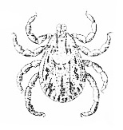
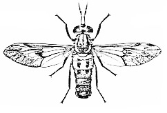

## I. Leurs caractéristiques pathogéniques sont les suivantes

*   Transmission d’un agent pathogène d’un hôte à un autre (par exemple, germes pathogènes transmis à l’homme à partir d’un cadavre d’animal).  
*   Ectoparasites se nourrissant directement chez l’homme de sang et pouvant provoquer une pathologie propre chez l’homme par inoculation d’un germe, d’un parasite ou d’un venin (araignées, scorpions, scolopendres).

Certains vont être responsables de nuisances en se limitant à la peau, d’autres sous la peau.  
Le tableau résume les principaux responsables, mais il existe de nombreux insectes vecteurs de maladies tropicales que nous ne citons pas dans cet article.

<table>

<thead>

<tr>

<th colspan="2" rowspan="1" scope="col">Nuisances sur la peau</th>

<th colspan="2" rowspan="1" scope="col">Nuisances sous la peau</th>

</tr>

</thead>

<tbody>

<tr>

<td>Vecteurs</td>

<td>Pathogénie</td>

<td>Vecteurs</td>

<td>Pathogénie</td>

</tr>

<tr>

<td>Puce homme, rat</td>

<td>Vecteur de la peste</td>

<td>Puce chique</td>

<td>Tungose</td>

</tr>

<tr>

<td>Punaise des lits</td>

<td>Piqûres nocturnes</td>

<td>Sarcoptes scabies</td>

<td>Gale humaine</td>

</tr>

<tr>

<td><em>Triatoma spp.,Rhodmius spp</em></td>

<td>Maladie de Chagas  
(trypanosomose sud-américaine</td>

<td> </td>

<td> </td>

</tr>

<tr>

<td>Pou de corps</td>

<td>

Pédiculose du corps

Typhus exanthématique, fièvre des tranchées, fièvre récurrente (borréliose)</td>

<td> </td>

<td> </td>

</tr>

<tr>

<td>Pou de tête</td>

<td>Pédiculose de la tête</td>

<td> </td>

<td> </td>

</tr>

<tr>

<td>Morpion</td>

<td>Phtirose</td>

<td> </td>

<td> </td>

</tr>

</tbody>

</table>

## II. Nuisances sur la peau

### 1. Les puces 

#### Caractéristiques

*   Insectes cosmopolites sans ailes, de 1 à 5 mm, aplatis latéro-latéralement, 3 paires de pattes, dont la dernière plus longue pour favoriser le saut.  
*   Les 2 sexes sont hématophages.  
*   Reproduction par ponte d’œufs après un repas, sur le sol.  
*   Apparition rapide de larves vermiformes qui vont privilégier les sols humides, les terriers, les litières d’animaux.  
*   Transformation en nymphes immobiles qui donneront 10 jours après des puces adultes.  
*   Possibilité de diapause si le lieu n’est pas favorable à l’éclosion des nymphes et reprise favorisée par des stimuli (ébranlement du sol, vibration, lumière, dégagement de CO2,…) : Ainsi, un lieu inhabité longtemps peut être rapidement infesté de puces.  
*   La puce n’a pas d’hôte défini et s’adaptera aux conditions de vie possibles (passage de l’animal à l’homme et vice-versa)

#### Pathogénie chez l’homme

*   Après piqûre, apparition d’un prurit au point de piqûre, puis de macules ou papulo-vésicules.  
*   Localisation sur les parties couvertes (souvent les membres inférieurs), lésions linéaires regroupées à 3-5 lésions.  
*   La puce de l’homme et du rat peut être responsable de la transmission de la peste, d’autres espèces du typhus murin et de la maladie de la griffe du chat.  
*   Traitement des piqûres : désinfection des lésions et antiprurigineux.

#### Traitement du milieu domestique

Insecticides (dérivés des pyrèthres) sur le sol ou les litières d’animaux, élimination rapide et systématique des cadavres d’animaux, saupoudrage de la fourrure des animaux domestiques par des insecticides, voire port de collier antipuces, traitement percutané des animaux par l’imidaclopride.

### 2. Les poux 

#### Caractéristiques

*   Insectes hémimétaboles, mesurant de 1 à 3 mm, aplatis dorsoventralement.  
*   Hématophages dans les deux sexes.  
*   Spécifiques de l’espèce, l’homme ne peut héberger que des poux humains.  
*   La femelle pond 3 à 10 œufs par jour, appelés lentes, fixés sur les cheveux, les poils ou les fibres des vêtements par un cément. Le stade adulte est atteint en 18 jours
*   Il existe 3 sortes de pédiculose :
    *   corporelle
    *   cuir chevelu
    *   pubis

#### Traitement

Il convient de choisir un produit facile à appliquer, et le moins toxique possible, surtout pour les enfants. La famille et la collectivité doivent toujours être traitées simultanément.

**Les huiles essentielles :**

Elles agissent en étouffant l’insecte.  
Citronnelle, acide acétique, camphre (pas avant 6 ans) : application de 10 à 15 minutes, à renouveler régulièrement tous les 2-3 jours pendant 3 semaines  
Idem pour l’anis, la noix de coco dont l’application est de 15 minutes

**Les agents mécaniques :**

Diméticone 4 %, application pendant 1 heure  
Diméticone 10 %, huile de coco 50 %, vaseline 20 %, cire d’abeille 10 %, application pendant 1 heure

**Les agents chimiques **

Pyréthrine et agents organophosphorés, qui sont plus toxiques et existent en diverses préparations, il faudra respecter les recommandations d’application.  
Dans tous les cas, il est important de passer les cheveux au peigne fin chaque jour pour éliminer les insectes morts et s’assurer qu’il n’y en a pas de vivants.  
En cas de résistance à tous ces traitements, un traitement par ivermectine per os à la dose de 200 à 400 microgrammes/kg peut être utilisé chez l’enfant pour la pédiculose du cuir chevelu.

#### **Spécificité de chaque pédiculose **

**Pédiculose du cuir chevelu **

Fréquente chez l’enfant, bénigne.  
Prurit (régions rétro-auriculaires et occipitales), puis lésions de grattage souvent impétinigisées associées à des adénopathies rétro-auriculaires et occipitales.  
Parfois, lésions eczématiformes «  en pèlerine ».  
Fréquente en milieu scolaire et familial  
Transmission directe « tête à tête » ou indirecte par les vêtements (bonnets), peignes et brosses.  
Le diagnostic est fait sur la découverte de poux se déplaçant sur les cheveux ou le cuir chevelu et de lentes à la racine des cheveux ou à distance si l’infestation dure. A la différence des pellicules, les lentes ne se détachent pas facilement

**La phtirose ou infestation par des poux du pubis, communément appelés les morpions **

Transmission quasi-constante par contact vénérien  
La phtirose est une dermatose de la région pubienne et des autres zones poilues (aisselles, thorax, barbe, cils et sourcils).  
Caractérisée par un prurit associé à des papules centrées par la piqure.  
Souvent blépharite associée (enfant+++).  
Diagnostic fait par la découverte de parasites ou de lentes sur ces zones.

Le traitement ne nécessite pas un rasage obligatoire mais il est utile, il se fait par insecticides chimiques sur les régions concernées.  
Traitement des partenaires sexuels indispensable.  
Décontamination des lits et de la literie.  
Dépistage et traitement d’une IST souvent associée.

**Pou du corps **

Appelée la pédiculose du corps  
Prurit des régions couvertes, surtout les emmanchures, les régions scapulaires, lombaires, les cuisses.  
Macules ou papules centrées par le point de piqure, associées à des lésions de grattage (excoriations linéaires), souvent impétinigisées, ces lésions peuvent poser le problème d’un diagnostic différentiel avec une gale, d’autant qu’elles sont souvent associées.  
Si l’infection est chronique, apparition de leuco-mélanodermie (association de zones cutanées hyper et hypo-pigmentées, souvent sur fond de lichénification cutanée).

Diagnostic fait par la découverte de poux sur les vêtements car la ponte des œufs se fait sur les fibres textiles et les poux ne se déplacent sur la peau que pour le repas.  
Transmission par literie ou vêtements contaminés.

Traitement par lavage des vêtements et de la literie à 90°, sinon par insecticides.  
En cas d’épidémie, il sera pulvérisé un insecticide entre la peau et les vêtements.

### 3. Les autres invertébrés hématophages

En dehors de leur rôle vecteur éventuel de maladies parasitaires souvent graves et largement répandues en zone tropicale, les divers invertébrés hématophages sont responsables, à l’exception des réduves, de prurit local au point de piqûre.

A part les **tiques** (figure), **glossines**, **taons** et **chrysops** (figure) qui piquent pendant la journée, les diverses espèces de moustiques, les phlébotomes, les simulies, les culicoïdes, les réduves et les punaises piquant le soir au crépuscule et la nuit.

<table>

<tbody>

<tr>

<td>

</td>

<td>

</td>

</tr>

<tr>

<td>Figure 1 : Tique</td>

<td>Figure 2 : Chrysops</td>

</tr>

</tbody>

</table>

Les moustiques ont un vol bruyant tandis que les autres invertébrés hématophages s’approchent silencieusement de l’homme pour le piquer. Les culicoïdes sont très agressifs et responsables du « mout mout ». L’abondance des piqûres de phlébotomes entraîne l’apparition d’une dermatite prurigineuse, le « harara ».

Enfin, le taon et les chrysopspiquent surtout aux chevilles.

La **piqûre de tique** est douloureuse, prurigineuse et parfois suivie d’un érythème puis d’une « tache noire » ou escarre d’inoculation de la fièvre boutonneuse méditerranéenne. La tiques peuvent être responsables d’une paralysie radiculaire, d’une méningoradiculite ou d’une paralysie ascendante. Certaines espèces de tiques restent fixées plusieurs jours à la peau avant de s’en détacher pour tomber sur le sol. Des larves de tiques (les rougets ou aoûtats), abondants dans les prairies, s’accrochent surtout au niveau de la ceinture et déterminent une éruption prurigineuse papuleuse ou érythémateuse.

**La piqûre des taons et chrysops** est douloureuse. La piqûre de punaise et de réduve, douloureuse, peut s’accompagner, chez certains sujets sensibles, d’une réaction œdémateuse. En dehors de pommade antiprurigineuse, on pourra utiliser des répulsifs en application sur les parties découvertes (diméthylphtalate).

Une larve de mouche (ver de case) est répandue en Afrique tropicale. Elle se développe sous les nattes et pique durant la nuit. Certaines mouches peuvent pondre leurs œufs sur des plaies, donnant naissance à des larves qui se nourrissent des débris nécrotiques.

Des sangsues vivant dans l’eau ou sur le sol humide des forêts tropicales, voire dans les arbres, se fixent sous la peau pour aspirer le sang. Après extirpation de l’animal, la plaie saigne longtemps et il faudra, après nettoyage, utiliser un pansement compressif. Les répulsifs sont efficaces.

#### Punaises de lit 

En général, ces familles d’insectes parasitent les plantes et les bois. Seules 2 familles sont parasites de l’homme, hématophages.  
Une de ces espèces est vectrice de la trypanosomiase américaine mais les autres n’entrainent que des désagréments locaux : piqures nocturnes indolores mais rapidement prurigineuses, avec une macule ou une papule érythémateuse centrée par le point de piqure, érythémateuse, entourée d’un halo congestif, avec parfois une réaction œdémateuse importante ; les surinfections sont fréquentes. Les lésions siègent principalement aux parties découvertes

**Traitement **:

Destruction des insectes, en fait difficile, par insecticides de contact pulvérisés dans les fentes du sol, des murs des boiseries, destruction des matelas contaminés(en les brûlant si possible).