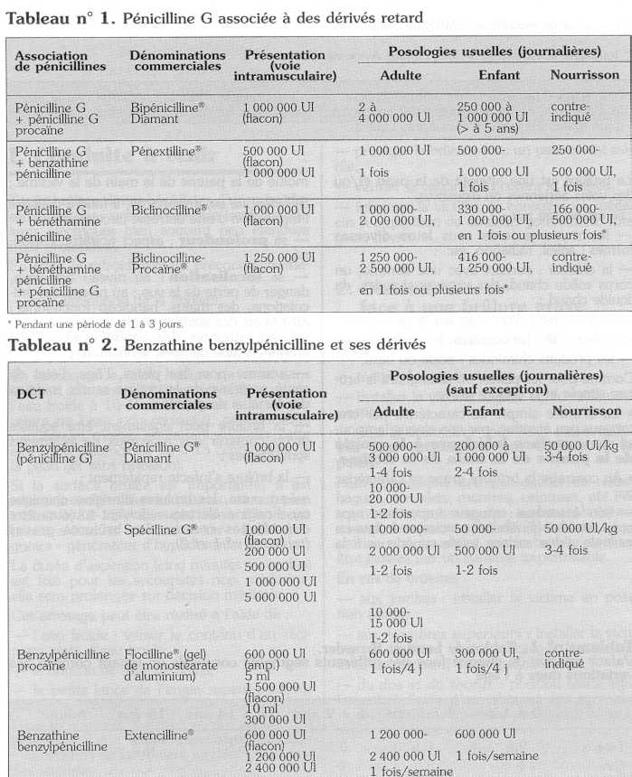

**les pénicillines**

**par Philippe Reinert**

Pédiatre, Hôpital Intercommunal de Créteil.

La découverte de la pénicilline par A. Fleming en 1929 qui remarqua la lyse de colonies de staphylocoques constitue le premier acte de la "Révolution antibiotique ".

Soixante-dix ans plus tard, faut-il dire que la pénicilline est dépassée, en particulier par les antibiotiques (ampicilline, macrolides, aminosides, quinolones) ?

Certainement pas ! En effet, si certains germes savent fabriquer des enzymes destructeurs (les pénicillinases), d'autres sont toujours rapidement détruits par la pénicilline injectable ou orale. C'est pour cela qu'elle figure encore dans la liste des médicaments essentiels de l'OMS.

**Germes sensibles** **à la pénicilline**

La pénicilline reste l'antibiotique de première intention dans le traitement des infections à :

**Pneumocoques**

- Pneumonie

- Otite

Dans les méningites, on lui préférera l'ampicilline qui franchit mieux la barrière méningée.

Depuis les années 1980, de nombreux pneumocoques sont devenus résistants à la pénicilline (France, Espagne, États-Unis ... ). Pour l'instant, cette résistance semble peu concerner le continent africain.

**Streptocoque A**

Responsable d'un tiers des angines de l'enfant, il expose au rhumatisme articulaire aigu (RAA).

La pénicilline est remarquablement efficace sur ce germe, tant pour traiter l'angine (pénicilline orale) que pour prévenir le RAA (pénicilline retard).

**Méningocoque**

L'extrême sensibilité du méningocoque à la pénicilline justifie l'utilisation de cette dernière dans le traitement des méningites (pénicilline en perfusion).

**Tréponème pâle (syphilis)**

La pénicilline d'emblée a été , l'arme absolue ) contre ce mal qui fut la hantise des générations précédentes. Elle demeure le traitement de référence : une injection de benzathine pénicilline G, 2,4 millions d'unités, suffit à guérir une syphilis primaire.

À cette liste, il faut ajouter la listériose, la diphtérie, certains germes anaérobies, *Clostridium perfringens* (complications des avortements), enfin les leptospiroses.

**Formes galéniques**

Abordons les trois formes de pénicilline :

- la pénicilline G injectable,

- la pénicilline V orale,

- les pénicillines retard.

**1.** **La pénicimne G injectable IV** ou IM, est la forme la plus classique. On lui reproche :

- sa durée de vie courte (0,4 à 1 heure), ce qui nécessite 3 IM par jour,

- sa médiocre diffusion : elle atteint mal les méninges et l'os,

- la survenue d'accidents allergiques (exceptionnellement graves).

**2. Les pénicillines V orales (Oracilline®, Ospen®).**

Elles ont le même spectre que la pénicilline G, ont une bonne résorption intestinale (50 à 69 %). Leur durée de vie est courte (0,5 à 0,8 heure) nécessitant donc 3 prises par jour.

**3. Les pénicillines retard** en IM.

Afin de faciliter les traitements curatifs ou préventifs (RAA), de nombreuses formes retard existent. Elles permettent d'effectuer une injection tous les 8, 15, ou 21 jours.

Leur spectre d'activité est identique à celui des formes précédentes.

**Posologie.** Voir tableaux.

**Incidents et accidents**

La toxicité de la pénicilline est faible (on peut administrer plus dé 20 millions d'unités par jour chez l'adulte).

En revanche, la survenue d'accidents allergiques n'est pas rare :

- urticaire généralisé,

- asthme,

- oedème de Quincke,

voire choc anaphylactique.

Ils imposent :

- l'arrêt immédiat du traitement,

- l'administration de corticoïdes et d'antihistaminiques,,,

Au total, la pénicilline dont le prix est bas a parfaitement sa place dans le traitement de nombreuses infections ORL, pulmonaires et systémiques. En antibiothérapie, comme ailleurs, il faut savoir résister aux modes !

*Développement et Santé, n° 134, avril 1998*
