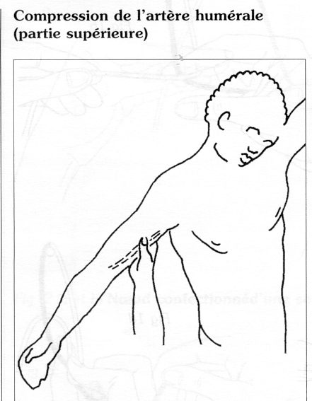
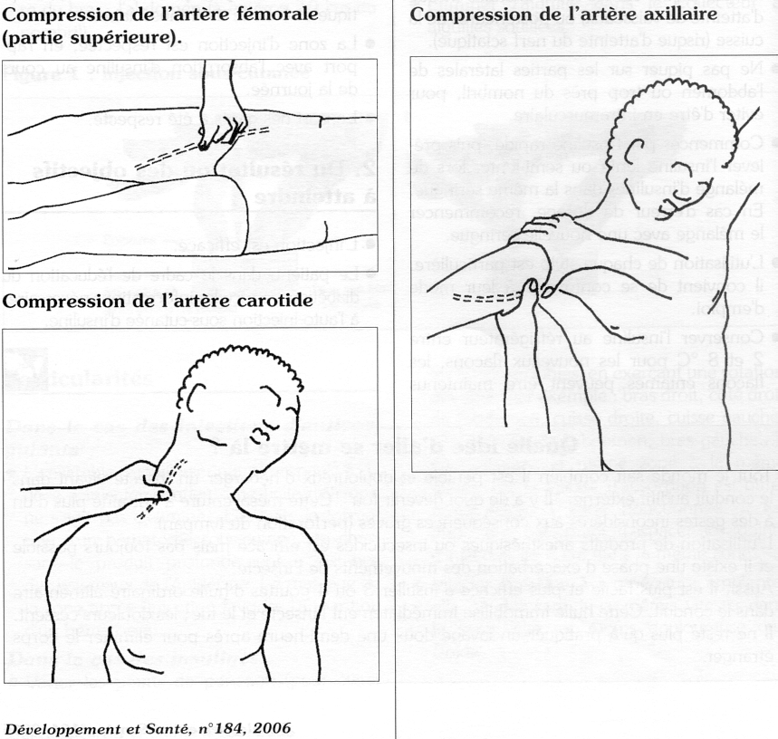

## Quand une artère d'un membre saigne, que faut-il faire ?

Il faut comprimer cette artère en amont de la plaie vasculaire dans une région où elle est accessible à la compression.

Les schémas suivants vous montrent comment faire, en fonction de la localisation de l'hémorragie.

Pour chaque artère, il faut connaître :

*   les points de compression,
*   le type de compression (avec un ou plusieurs doigts ou avec le pouce),

*   la position du blessé.

## Surveillance

*   La compression sera maintenue jusqu'à l'arrivée en milieu chirurgical.
*   Si cela ne suffit pas, comprimez davanta­ge avec les deux pouces ou les deux poings.
*   Ne mettez un garrot qu'après échec de la compression.

_Développement et santé, n°184, 2006_