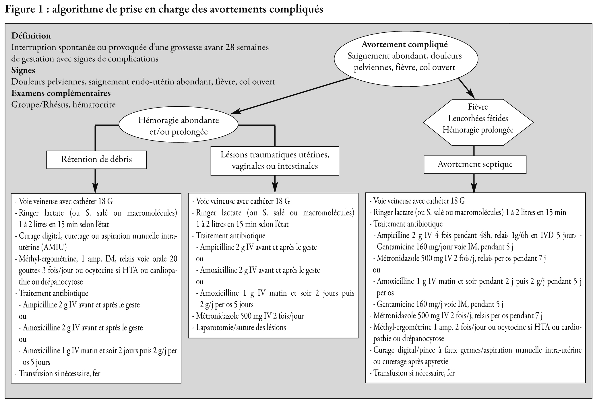
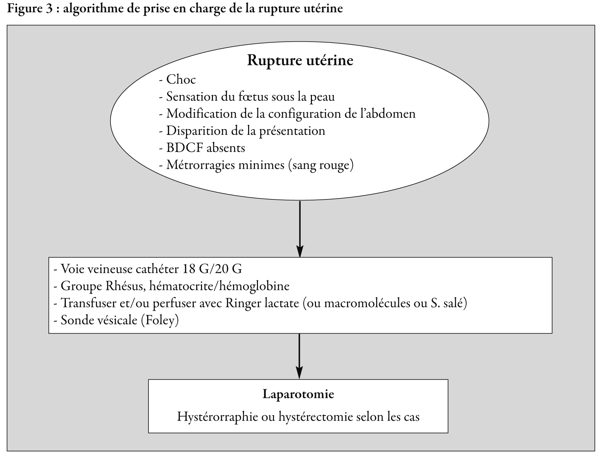
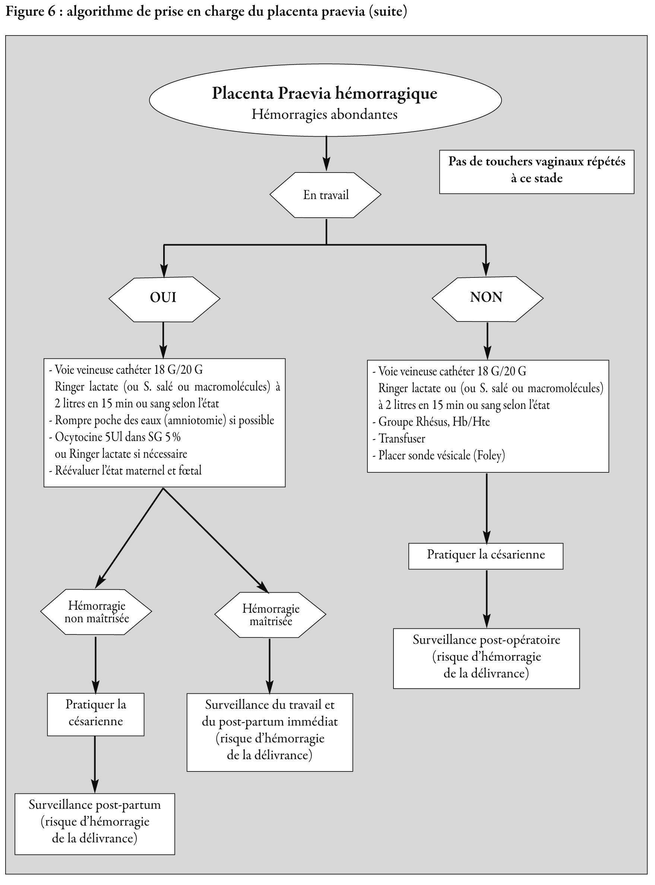
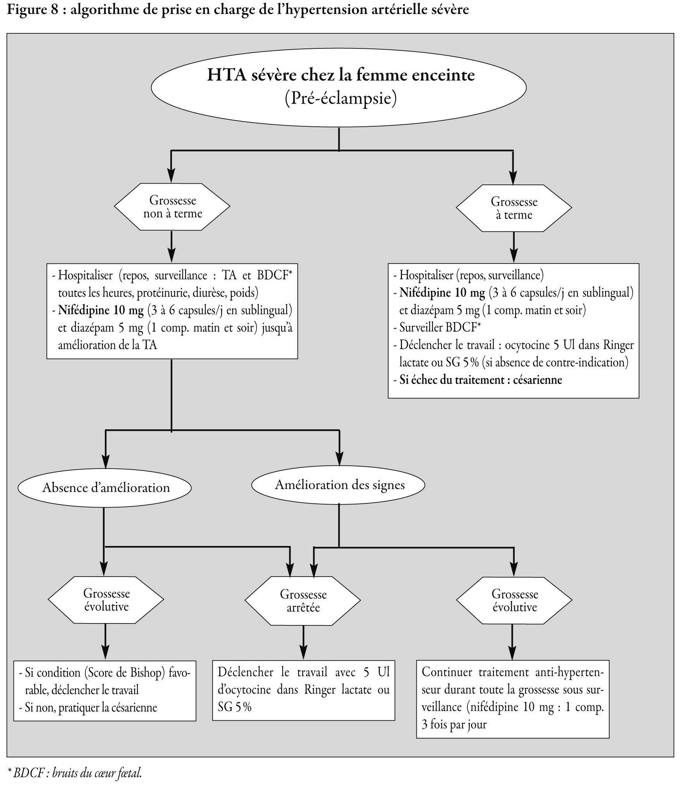

Les urgences gynécologiques et obstétricales, si elles ne sont pas rapidement prises en charge, vont mettre en jeu le pronostic vital maternel et/ou foetal.

**Intérêt du sujet**

Ces urgences sont plus fréquentes dans les pays en voie de développement où elles sont respon­sables d'une mortalité et d'une morbidité foeto-maternelles élevées.

Certaines engagent le pronostic vital maternel et/ou foetal (rupture cataclysmique d'une grossesse extra-utérine, hémorragies au cours de la grossesse), d'autres ne compromettent pas le pronos­tic vital (endométrite, annexite aiguë...).

En Afrique, les urgences gynéco-obstétricales seraient responsables de 30 à 98% de la mortalité maternelle globale, les hémorragies étant la première cause. Il a été démontré que 69 % de ces décès sont évitables grâce aux mesures d'anesthésie et de réanimation efficaces.

Principales urgences gynécologiques et obstétricales *(voir encadrés).*

<table>

<thead>

<tr>

<th class="rtecenter" scope="col" valign="top">Urgences obstétricales</th>

</tr>

</thead>

<tbody>

<tr>

<td valign="top">

Premier trimestre de la grossesse

<ul><li>Urgences hémorragiques : grossesse extra-utérine, avortement spontané ou provoqué</li><li>Vomissements sévères associés à la grossesse</li></ul>

Deuxième trimestre de la grossesse

<ul><li>Urgences hémorragiques : dominées par l'avortement</li><li>Urgences fébriles : infection urinaire, paludisme, menace d'accouchement prématuré et d'avortement tardif</li></ul>

Troisième trimestre de la grossesse

<ul><li>Urgences hémorragiques : hématome rétro-placentaire, rupture utérine, placenta praevia hémorragique</li><li>Syndromes infectieux : infections urinaires (pyélonéphrite, cystite, bactériurie asymptoma­tique), paludisme</li><li>Syndromes hypertensifs : pré-éclampsie, éclampsie</li><li>Dystocies : rencontrées au cours du travail et dues soit bassins rétrécis, à un excès de volume foetal ou à une mauvaise    présentation du foetus (front, face, position transversale...)</li></ul>

Post-partum

<ul><li>Urgences hémorragiques : hémorragie de la délivrance, déchirure des parties molles, troubles de la coagulation</li></ul></td>

</tr>

</tbody>

</table>

<table>

<thead>

<tr>

<th scope="col" valign="top">Urgences gynécologiques</th>

</tr>

</thead>

<tbody>

<tr>

<td valign="top"><ul><li>Urgences hémorragiques</li><li>Cancers du col hémorragiques</li><li>Fibromes hémorragiques</li><li>Pathologies fébriles et/ou douloureuses : fibromes douloureux, torsion de kyste, annexite</li></ul></td>

</tr>

</tbody>

</table>

## I. Diagnostic étiologique des urgences obstétricales

### 1. Urgences au cours du premier trimestre

#### a) Hémorragies

#### *L'avortement*

Il se définit comme l'expulsion du produit de , conception avant 28 semaines d'aménorrhée.  
On distingue :

- La menace d'avortement : les métrorragies sont parfois minimes, parfois abondantes faites de sang rouge, noirâtre ou rosé, surve­nant sur une aménorrhée inférieure ou égale à 14 semaines. Le saignement peut être accompagné de douleurs pelviennes ou lom­baires à type de colique, ou de contractions utérines douloureuses. L'examen au spécu­lum confirme l'origine du saignement. Au toucher vaginal, le col est peu modifié.
- L'avortement en cours : les métrorragies sont importantes, faites de sang rouge avec des caillots, les douleurs à type de contrac­tions ou de coliques expulsives sont de plus en plus intenses. L'examen au spéculum met en évidence des débris ovulaires ou des produits de conception dans le vagin. Au toucher vaginal, le col est court, ouvert aux deux orifices ; le corps utérin, rétracté, a un volume inférieur à l'âge gestationnel.

Les **avortements compliqués** sont redou­tables. **Ils ne concernent que les avorte­ments provoqués.** Certaines complications sont encore mortelles : septicémies à *perfrin­gens* ou bacilles Gram négatifs, infarctus utérin, embolie gazeuse et plus rarement téta­nos. Les séquelles sont fréquentes : douleurs, troubles du cycle, stérilité secondaire, acci­dents obstétricaux divers, troubles psychiques.

#### *La grossesse extra-utérine*

La grossesse extra-utérine (GEU) se définit comme la nidation et le développement de l'oeuf en dehors de la cavité utérine. Deux situations sont possibles : la GEU non rompue et la GEU rompue.  
Les signes sont fonction de la situation clinique.

***GEU rompue***  
La rupture de grossesse extra-utérine réalise, chez une femme ayant des troubles du cycle, une inondation péritonéale qui se manifeste par des douleurs syncopales, des métrorra­gies, une pâleur, un pincement du nez, une baisse de la tension artérielle, un pouls filant et imprenable, des extrémités froides. La conscience est altérée, la patiente a soif. L'abdomen est sensible, météorisé. On peut noter des douleurs scapulaires (++++), et le toucher vaginal est douloureux : c'est le cri du Douglas.

***GEU non rompue***  
Elle se manifeste par des douleurs pelviennes, des métrorragies et des troubles du cycle ; il n'y a pas de choc hypovolémique.

#### b) Vomissements

Les vomissements gravidiques (qui surviennent pendant la grossesse) ne sont pas dus à des causes organiques. Il en existe deux types :

- Les **vomissements gravidiques simples**, qui ne sont pas une urgence le plus souvent.
- **Les vomissements gravidiques graves,** dits incoercibles, mettent en jeu le pronostic vital maternel en raison de leur retentissement sur l'état général de la patiente.

L'examen clinique montre :

- Une intolérance gastrique : c'est le signe essentiel. La malade vomit immédiatement tout ce qu'elle tente d'absorber par la bouche, même les liquides.
- Une altération de l'état général avec des signes de déshydratation : soif, langue sèche, plis cutanés persistants et, dans les formes graves, oligurie, signes de dénutri­tion. Celle-ci apparaît en quelques jours et se caractérise par un amaigrissement, un faciès émacié, des yeux excavés et cernés. Il existe une asthénie extrême.

### 2. Urgences au cours du deuxième trimestre

Elles sont dominées par l'**avortement molaire** lors d'une grossesse *a priori* normale. La grossesse molaire, ou môle hydatiforme, se caractérise par une prolifération anormale des villosités choriales.

#### Signes fonctionnels

- Hémorragie : faite de sang rouge, parfois mêlé de caillots, et d'importance variable. L'abondance et la répétition de ces hémor­ragies vont entraîner une anémie.
- Exagération des signes sympathiques de grossesse : sialorrhée, nausées, vomisse­ments. Ceux-ci sont graves ou incoercibles, ou ils persistent au-delà du troisième mois.
- Atteinte rénale : cedème, oligurie, albuminurie.
- Signes discrets d'atteinte hépatique : subictère.

#### A l'examen physique

- L'état général est souvent altéré.
- L'utérus est mou et, surtout, il est plus gros que ne le voudrait l'âge présumé de la grossesse.
- Il n'y a ni mouvements actifs ni bruit du coeur du foetus.
- L'examen au spéculum permet de noter un col violacé ou, en cas d'avortement molaire, des vésicules.
- Au toucher vaginal : l'utérus est mou et il peut exister des kystes ovariens souvent bilatéraux.
- Les ß HCG (très élevées) et l'échographie (qui montre des images en flocons de neige) permettent de faire le diagnostic.

### 3. Urgences au cours du troisième trimestre

#### a) Hémorragies

#### *Hématome rétroplacentaire*

L'hématome rétroplacentaire, qui correspond au **décollement prématuré d'un placenta** **normalement inséré**, résulte d'une désinser­tion accidentelle de tout ou d'une partie du placenta avant l'accouchement, avec formation d'un hématome plus ou moins volumineux.

Les **signes fonctionnels** sont :

- une **douleur abdominale** constante : elle est brutale, "en coup de poignard", intense, localisée au niveau de l'utérus et, contraire­ment aux contractions utérines doulou­reuses, elle est permanente ;
- une **hémorragie génitale** variable : habi­tuellement peu abondante, constituée de sang noirâtre incoagulable, parfois absente ;
- enfin, un état de choc plus ou moins marqué. L'examen général peut montrer des **signes de choc** débutant avec pâleur et accélération du pouls maternel :
- la tension artérielle peut être variable, soit déjà diminuée dans les formes graves, soit encore élevée en cas d'hypertension artériel­le gravidique connue ;
- les urines sont rares et il existe une protéinu­rie massive.

**L'examen gynécologique :**

- Il révèle une **hypertonie utérine permanente**, l'utérus est dur et douloureux au pal­per. Il existe une véritable contracture.
- **Au toucher vaginal, le segment infé­rieur est dur, tendu**, témoignant de la contracture utérine. Le col est comme cerclé. Les complications sont, pour la mère : les troubles de la coagulation, la nécrose corticale rénale et la mort.

#### *Rupture utérine*

La rupture utérine est une solution de conti­nuité non chirurgicale de la paroi utérine. Elle peut survenir au cours de la grossesse ou du travail.  
Elle est caractérisée cliniquement par une dou­leur intense, syncopale, suivie d'une sensation de bien-être apparent : les contractions uté­rines disparaissent. A la palpation, le foetus est perçu sous la paroi abdominale. Ces ruptures se manifestent par un état de choc progressif, contrastant avec une hémorragie vaginale souvent minime, et une disparition brutale des bruits du coeur foetal.

#### *Le placenta praevia*

Le placenta praevia est défini comme l'inser­tion partielle ou totale du placenta sur le segment inférieur. Cette insertion entraîne des accidents hémorragiques.

Les **signes** sont dominés par l'hémorragie externe, d'apparition brutale, indolore, sou­vent au repos, faite de sang rouge, liquide, au début souvent modérée, mais ayant spontané­ment tendance à récidiver. Les signes généraux dépendent de l'importan­ce des pertes sanguines. L'examen physique montre un utérus souple et bien relâché. Il existe souvent une présenta­tion anormale (transversale, oblique, poda­lique, présentation céphalique anormalement haute et mobile), mal accommodée au détroit supérieur. Les bruits du coeur foetal sont per­çus. L'inspection de la vulve et la mise en place prudente d'un spéculum permettent de confir­mer l'origine endo-utérine du saignement. Le toucher vaginal note un col souvent dévié, une présentation haute, et perçoit parfois la sensation de masse spongieuse correspondant au placenta.  
Les **complications** sont, entre autres, la souf­france fœtale, la mort foetale, l'anémie et les infections du post-partum.

#### b) Infections

#### *Pyélonéphrite*

La pyélonéphrite est la première cause de fièvre chez la femme enceinte. Elle complique 1 % des grossesses. La symptomatologie, le plus souvent bruyante, est marquée par une fièvre, des frissons, des signes fonctionnels urinaires (pollakiurie, brûlures mictionnelles), douleurs lombaires siégeant le plus souvent à droite, avec une douleur provoquée à l'ébran­lement. Mais la symptomatologie peut être fruste et se limiter à une fièvre isolée.

La NFS note une hyperleucocytose et la CRP est élevée. L'échographie peut per­mettre de noter une dilatation des cavités pyélo-calicielles. L'ECBU et l'hémoculture sont importantes pour le diagnostic.

L'infection urinaire peut survenir à toute période de la grossesse et des suites de couches, mais s'observe surtout durant le dernier trimestre.

Les différentes formes cliniques de l'infection urinaire sont la cystite, la pyélonéphrite et la bactériurie asymptomatique, mise en évi­dence par l'examen cytologique et bactério­logique des urines (ECBU).

L'infection urinaire alourdit la morbidité foeto-maternelle et risque de provoquer :

- Pour le foetus : un accouchement prématuré, une hypotrophie ou une mort in utero.
- Pour la mère : un choc septique ou une néphrite interstitielle après l'accouchement.

#### *Paludisme grave*

En Afrique, cette affection accroît la mortalité des femmes en période gravido-puerpérale et celle des nouveau-nés. **Un paludisme pendant la grossesse est considéré comme un paludisme grave** *(voir article Paludisme granve)*.

**Cliniquement, on distingue :**

- Le paludisme simple (voir l'article correspondant)
- L'accès pernicieux ou neuro-paludisme.
- Le paludisme viscéral évolutif : il survient chez les sujets non prémunis, sans prophylaxie. Les signes sont une anémie, avec retentissement cardiaque, une asthénie, une splénomégalie, une élévation thermique à 38° C.
- La fièvre bilieuse hémoglobinurique : son début est brutal, marqué par une lombalgie violente et un état de prostration. Les vomis­sements sont alimentaires puis bilieux, les urines sont rouge-noir, un ictère hémolytique apparaît, avec anémie et oligo-anurie. Le pronostic, qui est lié à la diurèse, est fatal dans 30 % des cas.

**Le diagnostic repose sur :**

- La clinique : des accès épisodiques de fièvre élevée paroxystique avec céphalées et myal­gies constituent les principaux signes.
- La goutte épaisse, qui permet d'identifier le parasite au microscope.
- Le test de diagnostic rapide, qui permet de diagnostiquer *P.falciparum* en quelques minutes et sans microscope.

**Les complications liées au paludisme** :

- *La grossesse favorise la survenue des compli­cations graves de la maladie paludéenne* : accès palustre avec albumine et hyperazoté­mie pouvant évoluer vers la néphrite chro­nique, psychoses diverses, myocardites palustres, rupture de rate paludéenne.
- *Le paludisme complique directement la grossesse, mais aussi indirectement* par l'anémie qu'il engendre, entraînant, au début de la grossesse, une accentuation des phé­nomènes "d'auto-intoxication" avec aggrava­tion de tous les signes sympathiques de la grossesse ; plus tard, il peut provoquer des avortements, des accouchements prématu­rés, des morts *in utero*, et la naissance d'enfants hypotrophiques ayant parfois une hépatosplénomégalie.
- *Le paludisme peut compliquer l'accouche­ment*(aggravation d'une anémie préexistan­te) et les suites de couches (accès palustre, moindre résistance aux infections bacté­riennes).
- Au cours du dernier trimestre, l'impaludation peut aboutir à l'infection du foetus qui naîtra avec un paludisme congénital.

#### c) Dystocies

Les dystocies peuvent être :

- **dynamiques**, par anomalie fonctionnelle de l'activité utérine,
- **mécaniques**, en relation avec un rétrécissement de la filière pelvienne, un obstacle praevia ou une anomalie des parties molles. Elles se manifestent par un travail prolongé, un oedème du col et souvent une souffrance foetale. Dans les cas de présentation cépha­lique, on peut noter une bosse séro-sanguine plus ou moins importante.

#### d) Hypertension artérielle et complications

On désigne par syndromes vasculo-rénaux de la grossesse l'association d'une hypertension artérielle, d'une protéinurie et d'oedèmes sur­venant à partir de la 2ème semaine d'aménor­rhée. On dit qu'une gestante est hypertendue si la pression artérielle systolique est supérieu­re ou égale à 140 mm Hg et/ou la pression diastolique supérieure ou égale à 90 mm Hg. Les complications liées à l'hypertension sont : l'éclampsie, le Hellp syndrome, la mort mater­nelle, la souffrance foetale, la mort foetale... Une bonne surveillance de la grossesse et une prise en charge efficiente permettent d'amé­liorer le pronostic vital de la mère et du foetus.

#### e) Hémorragie du post-partum

**Définition** : on appelle hémorragie du post­partum, toute hémorragie excédant 500 ml et survenant après l'accouchement. Mais l'es­timation de la perte sanguine n'est pas facile et une perte minime peut avoir un retentisse­ment important sur un terrain déjà anémié.

**Clinique** : apparition, après l'accouchement, de saignements abondants ou minimes mais prolongés.

**L'examen clinique** met en évidence un sai­gnement provenant de la filière génitale, un utérus qui est soit mal rétracté, mou et gros (faisant penser à une atonie utérine) soit un utérus bien rétracté (faisant évoquer une déchi­rure des parties molles). Il existe une pâleur des conjonctives et des muqueuses, liée à la quanti­té de sang perdu, des vertiges, une dyspnée. Le pouls puis, secondairement, la tension arté­rielle s'effondrent. En l'absence d'une prise en charge adaptée, le risque est l'évolution vers un état de choc hypovolémique.

#### f) Souffrance foetale aiguë

La souffrance foetale aiguë se définit comme une détresse foetale consécutive à une anoxie ou à une hypoxie au cours du travail.

Les signes cardinaux de la souffrance foetale aiguë sont :

- des modifications du rythme cardiaque foetal
- ralentissement (bradycardie), accélération (tachycardie) - ou rythme irrégulier,
- une coloration verdâtre du liquide amniotique. Cette souffrance fcetale aiguë est due aux dystocies et/ou aux anomalies funiculaires.

## II. Diagnostic étiologique des urgences gynécologiques

### 1. Torsion d'annexe

La torsion d'annexe est une urgence gynéco­logique rare. Son diagnostic est souvent tardif, obligeant à un acte chirurgical irréver­sible : l'annexectomie.

**Cliniquement** : une douleur inopinée et bru­tale amène la patiente à consulter rapidement. La douleur, de siège hypogastrique, évolue par crises de durée variable. Des nausées, voire des vomissements accompagnent la douleur. La palpation abdominale pendant la crise est douloureuse, avec une défense. Au toucher pelvien, on retrouve le plus souvent une masse douloureuse à la pression.

**L'échographie**, demandée en urgence, met en évidence une masse d'échogénicité homo­gène au début, plus tardivement hétérogène avec des zones kystiques correspondant à des zones de nécrose hémorragique. Il existe sou­vent un épanchement dans le cul-de-sac de Douglas. Le diagnostic de torsion est souvent fait au cours d'une laparotomie.

### 2. Fibrome douloureux

La patiente, qui se sait porteuse de fibrome, a une douleur hypogastrique, associée à une torpeur, une agitation, des vomissements et une fébricule.

### 3. Les infections génitales hautes

Ce sont les salpingites, l'endométrite, l'an­nexite. Elles sont fréquentes. Bien traitées, ces infections évoluent vers la guérison. En cas de traitement insuffisant, elles peuvent évoluer vers la péritonite. Leur traitement repose sur l'antibiothérapie à large spectre.

### 4. Cancer du col utérin hémorragique

Il est marqué par des métrorragies provoquées et récidivantes, responsables d'une altération de l'état général. Il existe des leucorrhées souvent fétides et une anémie plus ou moins marquée. L'examen au spéculum permet de voir un col bourgeonnant et hémorragique au contact. Le traitement dépend du stade de la maladie. La transfusion et l'antibiothérapie sont nécessaires en cas d'anémie et de surin­fection.

## III. Prise en charge

### 1. Avortement

Le traitement est étiologique et nécessite le repos en cas de menace d'avortement spontané.

Les anti-spasmodiques et/ou les bêta-mimétiques, les myorelaxants utérins, en perfusion veineuses ou par voie intramusculaire, luttent contre les contractions utérines. Dans les hémorragies importantes engageant le pronostic vital immédiat, l'évacuation rapide par aspiration est indiquée. Les complications les plus graves (toxi-infection à *perfringens*, à germes Gram négatif, tétanos) sont la conséquence d'un curetage hâtif. Il ne faut intervenir qu'après un délai de 24 à 48 heures après un traitement anti-infectieux, la patiente étant apyrétique. A ces mesures s'ajouteront la thérapeutique antitétanique préventive et la prévention de l'iso-immunisa­tion par l'injection de gamma-globuline antiD chez les femmes de groupe sanguin Rhésus négatif.

### 2. La grossesse extra-utérine rompue

C'est une extrême urgence. La patiente est groupée ; elle est perfusée et opérée d'urgence.

#### Conduite à tenir

- Voie veineuse sûre ou **mieux deux, aux membres supérieurs de préférence**. - Remplissage vasculaire avec macromolécules et sérum salé.
- En urgence : groupe et Rhésus, hémoglobine.
- Transfusion en cas d'état de choc ou si le taux d'hémoglobine est < 7g/dl. - Laparotomie et envoi de la pièce opératoire à l'anatomopathologie.
- Surveillance de la tension artérielle, du pouls, de la conscience et de la diurèse dans la période post-opératoire.

### 3. Vomissements gravidiques sévères

Le but du traitement est d'arrêter les vomisse­ments et de corriger les pertes hydro-électro­lytiques.

Il faut hospitaliser la patiente et mettre en place :

- une réanimation : perfusion de sérum gluco­sé (2 à 3 litres) à laquelle on ajoutera des électrolytes,
- un traitement médicamenteux dont le but est d'arrêter les vomissements (anti-émétiques),
- des mesures diététiques : il faut alimenter pro­gressivement la patiente, en commençant par les aliments tièdes. Le volume de perfusion sera progressivement diminué au fur à mesu­re que les vomissements s'amendent.

**Eléments de surveillance**

- Au plan clinique : le degré de déshydratation, l'état de conscience, la présence d'ictère, le pouls, la température, la courbe de poids quotidien, le nombre de vomissements par jour, enfin la courbe de diurèse qui est un élément fondamental de surveillance.
- Au plan biologique : ionogramme sanguin, dosage des protides sanguins, urée sanguine dont l'élévation est un signe de gravité.

Bien traités, l'évolution est favorable. Dans le cas contraire, elle se fera vers les complica­tions : tachycardie, ictère, oligurie et signes nerveux tels que la torpeur, le coma qui peut entraîner la mort.

### 4. La rupture utérine (RU)

Toute rupture utérine reconnue doit être opé­rée. Mais le traitement chirurgical est à lui seul insuffisant et doit être complété par le traite­ment du choc hypovolémique et de l'infection. Les ruptures utérines sont opérées par voie abdominale, ce qui permet d'apprécier l'éten­due des lésions et de décider du type d'inter­vention. On pourra réaliser une hystérectomie ou une hystérorraphie. Le traitement préven­tif repose sur le diagnostic et la prise en charge des dystocies.

### 5. Hématome rétroplacentaire (HRP)

#### a) Traitement curatif

Il a pour but immédiat de restaurer les pertes sanguines et d'assurer l'hémostase.

**Conduite à tenir en urgence**

Le traitement est mis en oeuvre en urgence, en salle de travail.

- Une voie d'abord veineuse est prise.
- Une sonde urinaire est mise en place.
- Le bilan sanguin initial comporte un groupa­ge, une détermination de l'hématocrite et un bilan de la crase sanguine.
- La patiente est déchoquée à l'aide de solutés de remplissage : sang frais, concentrés glo­bulaires, plasma frais congelé.

**Traitement obstétrical**

La césarienne s'impose rapidement si le fœtus est vivant et si l'accouchement n'est pas immi­nent. Si le foetus est mort, elle peut être utile en cas de gravité de l'état maternel.  
L'accouchement par voie basse peut être accepté :

- Quand le foetus est vivant :
- S'il n'y a pas de signe de choc ;
- S'il n'y a pas de signe de souffrance foetale ;
- Si l'accouchement évolue rapidement après rupture des membranes et perfusion d'ocy­tocine.
- Quand le foetus est mort ou non viable.

#### b) Prévention des récidives

Chez les femmes ayant un antécédent d'héma­tome rétroplacentaire ou de complication grave responsable d'une HTA gravidique, prévoir un traitement par acide acétylsalicylique entre la 14ème et la 35ème semaines d'aménorrhée.

### 6. Placenta praevia hémorragique

Comme pour tout syndrome hémorragique, on met en place une réanimation. La conduite à tenir est indiquée sur les figures 5 et 6.

### 7. Hémorragies du post-partum

La prise en charge dépend de l'étiologie et se fera selon la figure ci-dessous. La prévention repose sur l'utilisation du partogramme afin de dépister le travail prolongé, et sur la prescription adaptée des ocytocines.

### 8. Les infections au cours de la grossesse

#### a) Pyélonéphrite gravido-toxique

**Prévention**

- Lutter contre la constipation.
- Faire correctement la toilette vulvaire.
- Boire beaucoup d'eau : 1,5 litre d'eau/j.
- Vider la vessie après les rapports sexuels.

**Traitement**

- La bactériurie asymptomatique  
  Il faut instituer une antibiothérapie par voie orale pendant 10 jours et prescrire des mesures hygiéno-diététiques, contrôler l'ECBU 48 h après l'arrêt du traitement puis tous les mois jusqu'à l'accouchement.
- La pyélonéphrite aiguë :  
  Hospitalisation : repos, pose d'une voie veineuse, apport hydrique abondant (≥ 21/j) et traitement antipyrétique.  
  ECBU et hémoculture.  
  Antibiothérapie à large spectre.  
  Eléments de surveillance : température, pouls, pression artérielle, douleurs, diurèse, NFS, CRP, créatininémie, mouvements actifs du foetus, contactions utérines et enregistrement du rythme cardiaque foetal.

#### b. Paludisme

Le traitement du paludisme est curatif et pré­ventif.

Tout accès palustre chez la femme enceinte doit être traité comme un paludisme grave (voir le numéro précédent et l'article sur le paludisme grave dans ce même numéro).

**Traitement curatif**

Le traitement médical consiste en l'adminis­tration de sels de quinine.  
Au cours des deux premiers trimestres, on peut associer un antipyrétique, un anti-émé­tique, des antispasmodiques ou, en cas de contractions utérines, des bêtamimétiques.

**Traitement préventif**

- Protection contre les piqûres de moustiques par moustiquaires imprégnées.
- Traitement intermittent avec SP deux fois au cours de la grossesse.

### 9. Hypertension artérielle sévère

Le traitement médical actuel de la toxémie gravidique repose sur :

- La mise au repos.
- L'administration de sulfate de magnésie, qui agit sur la fonction neuromusculaire, s'oppo­se à l'oedème cérébral et améliore le flux utéro-placentaire.
- Les médicaments anti-hypertenseurs par voie parentérale.
- L'hospitalisation en cas de complication ou d'hypertension artérielle sévère.

Le traitement de l'**éclampsie** comporte  :

- Traitement médical pour la mère.
- Arrêt des convulsions par le sulfate de magnésium.
- Réduction de l'hypertension artérielle et de l'oedème cérébral par le sulfate de magnésie et la dihydralazine (ou la clonidine).
- Traitement obstétrical : évacuation utérine rapide du foetus et du placenta, générale­ ment par césarienne.

Cependant, un tiers des éclampsies survien­nent dans les suites de couches et près de la moitié des crises se répètent après l'extraction du foetus et du placenta.

*Développement et Santé, n°191/192, 2008*
