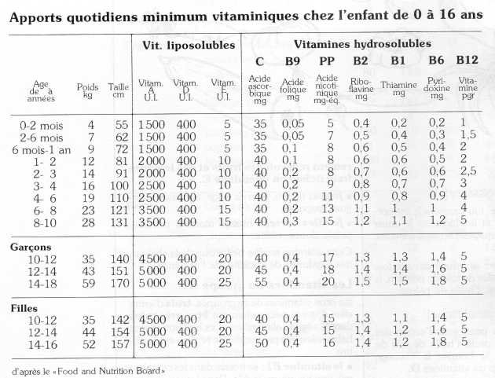
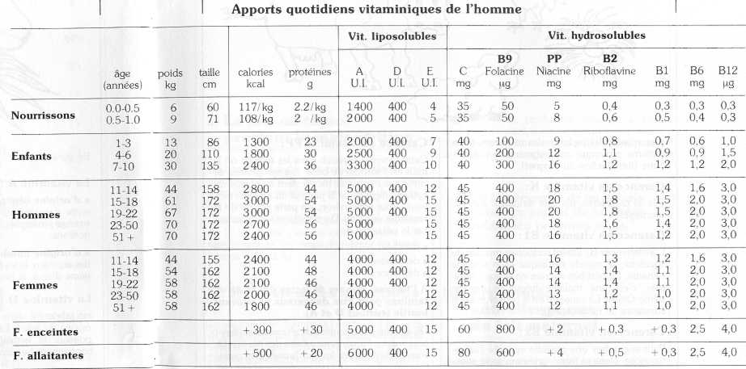

Assurer la croissance et demeurer en bonne santé grâce aux vitamines naturelles.

## I. Définition - Classification et rôle

### A. Définition

Les vitamines ont été définies comme " des substances azotées indispensables à la vie ". Ce sont des combinaisons organiques qui doivent être fournies à l'organisme de façon continue pour permettre la subsistance et la croissance du cytoplasme et le fonctionnement normal des organes.

Ces substances chimiques, notre corps ne peut les fabriquer. Elles doivent donc être apportées par l'alimentation. Elles ne sont utilisées qu'en petites quantités, mais elles sont absolument indispensables au fonctionnement de nos cellules et de nos tissus.

Elles sont différentes les unes des autres, chacune a sa constitution propre, son activité spécifique, et ses sources très variées.

### B. On distingue

les vitamines **liposolubles** (solubles dans les huiles et les graisses) et les vitamines **hydrosolubles** (solubles dans l'eau).

Vitamines liposolubles: **A - D - E - K - F.**

**Vitamine A**  ou rétinol: dite de croissance, améliore le pourpre rétinien, intervient sur la peau, les muqueuses.

**Vitamine D** ou calciférol: antirachitique. Fixe le'calcium, formation osseuse.

**Vitamine E** ou alphatocophérol: anti-oxydant, nerveux, fécondité, grossesse.

**Vitamine K:** favorise la coagulation du sang.

**Vitamine F:** représente un des acides gras essentiel.

Vitamines hydrosolubles: **C - B1 - B2.**

**Vitamine C** ou acide ascorbique: antiscorbutique, stabilité sanguine, sécrétions internes, destruction des toxines.

**Vitamine B1** ou thiamine: assimilation des glucides (sucre, farine, féculents), facteur d'appétit. Equilibre nerveux.

**Vitamine B2** ou riboflavine-lactoflavine: assimilation générale, équilibre nutritif.

Dans ce groupe, on trouve aussi les vitamines:

**PP** (acide nicotinique, antipellagreux)

**B5** (cobalamine, anti-anémique)

**B6  B8  B9** et **B12.**

## II. Où trouver les vitamines?

Dans une alimentation aussi variée que possible; au niveau culinaire, il faudrait consommer autant que possible les vivres à l'état frais et éviter un stockage trop long ou dans de mauvaises conditions, et inclure dans la ration journalière des fruits car consommés crus, ils contiennent encore la presque totalité de leurs vitamines, alors que les légumes et feuilles perdent à la cuisson 30 à 50 % de leurs vitamines.

En général:

**La vitamine A** (croissance):

***d'origine végétale*** (ou carotène): est présente dans les fruits et les légumes à **chair** **orange:** mangues, papayes, carottes, tomates, potirons.

***d'origine animale* :** se trouve dans le foie des animaux et les huiles de foie de poisson, le jaune d'oeuf, le beurre, l'huile de palme.

**La vitamine D** (antirachitique):

est fabriquée dans la peau sous l'action des rayons du soleil. Les oeufs, l'huile de foie de poisson, le kéthiah, le beurre, le fromage contiennent beaucoup de vitamines **D.**

**Les vitamines E et K:**

ne sont pas considérées comme importante dans les régimes alimentaires. Largement répandue dans la nature, la vitamine **K** est aussi synthétisée par certains germes de la flore intestinale.

**La vitamine C** (sera utile en cas d'infection, et antiscorbutique):

Le lait maternel est une bonne source de vitamines **C.** Le bébé nourri au sein n'a pas besoin de jus de fruits jusqu'à l'âge de six mois. **Passé** **cet âge de six mois, l'enfant doit régulièrement recevoir des fruits et des légumes** **frais riches en vitamines C.**

***fruits:*** ditakh, pain de singe, agrumes, mangues, papayes.

***feuilles vertes*:** bissap, manioc, névédie, patate douce, niébé.

Cette vitamine souffre beaucoup de la chaleur, des oxydants, de l'acidité, de l'alcalinité.

**Les vitamines du groupe B:**

sur onze vitamines de ce groupes, **trois** d'entre elles doivent nécessairement **être présentes** dans le régime alimentaire. Les huit autres sont habituellement présentes si le régime est équilibré.

***la vitamine B1*** : se trouve dans les céréales: mil, sorgho, riz, mais, blé. Dans les légumineuses: arachides, niébé. L'oeuf. Elle résiste mal à la chaleur.

***la vitamine B2*:** lait, lait caillé, oeuf, viande, foie. Cette vitamine est détruite par les rayons ultra-violets de la lumière.

**La vitamine PP** (anti-pellagreuse): se trouve dans le poisson frais, séché, fumé. Foie, viande, volaille, oeuf, arachides, niébé.

Enfin **la vitamine B12**: se trouve dans de très nombreux aliments et les besoins sont minimes. A forte dose, par voie IM, elle aurait un rôle antalgique.

## III. Apports nécessaires

En consultant les tableaux suivants, on peut retenir aisément les besoins journaliers nécessaires en vitamines.

## IV. Les avitaminoses

Les maladies constatées par défaut de vitamines sont appelées avitaminoses. Elles peuvent avoir plusieurs origines:

carence d'apport,

défaut d'absorption (par suite d'atteintes gastriques intestinales ou du pancréas),

trouble de l'utilisation (mauvaise "fixation" par les tissus qui s'en servent mal),

accroissement des besoins (croissance, grossesse, allaitement, états pathologiques infectieux par exemple).

Voyons quelles conséquences découlent de la carence en vitamines.

**Carence en vitamine A:**

Elle peut conduire à des troubles oculaires graves allant jusqu'à la cécité, ainsi qu'à des altérations de la peau et des phanères (ces dernières étant constituées par les poils, les cheveux, les ongles et les dents).

**Carence en vitamine D:**

La maladie de carence chez l'enfant est le rachitisme. Ce désordre est dû à un déficit d'apport en vitamine **D** souvent lié à des conditions de logement et de vie qui privent le jeune enfant de l'action bienfaisante des rayons solaires. Dans les grandes capitales africaines, quelques cas sporadiques s'observent dans les familles plutôt aisées dont la mère travaille à l'extérieur.

L'enfant, confié à une domestique, reste enfermé, ne va jamais au soleil et est nourri au lait artificiel. Les zones rurales par contre sont épargnées.

Principaux signes du rachitisme:

retard de la marche chez l'enfant trop mou et souvent trop gros,

un ramollissement de la voûte crânienne au niveau de l'os occipital ou pariétal qui offre une consistance comparable à celle d'une balle en celluloïd,

le signe du "chapelet costal", qui consiste en de petites bosses dures et arrondies alignées de chaque côté du sternum,

au niveau des os longs des membres, le rachitisme provoque une augmentation du volume (tuméfaction du poignet).

**Carence en vitamine K:**

Elle se caractérise par une tendance aux hémorragies.

**Carence en vitamine B1:**

L'avitaminose B1 atteint surtout les muscles du squelette, le muscle cardiaque et le système nerveux. Le béri-béri est rare en Afrique tropicale, c'est une maladie fréquente en Extrême-Orient. La cause en est la consommation constante de riz décortiqué.

**Carence en vitamine B2:**

Peut engendrer une maladie appelée l'ariboflavinose. Dans sa forme primaire, cette affection atteint surtout l'enfant de quatre à six ans, mais elle peut débuter souvent, aussi au cours de la première année et se retrouve jusqu'à l'âge de quinze ans. Les principaux signes sont:

**1. buccaux** stomatite chéilite (inflammation des lèvres)

**2. oculaires** vascularisation cornéenne blépharite angulaire

**3. peau** lésions

**Carence en vitamine PP:**

Cette carence apparaît dans les régions où le maïs est l'aliment de base. Les symptômes de cette avitaminose se manifestent au niveau du système digestif, de la peau et du système nerveux. Pour cette raison, on parle parfois de la "maladie des trois D" car elle est caractérisée par la présence de :

diarrhée, dermatose, démence.

**A l'inverse, donner de fortes doses de vitamines peut être dangereux et souvent** **inutile (surtout D et A).**

*"Si de minimes quantités de vitamines suffisent pour mettre l'organisme à l'abri des manifestations pathologiques les plus graves, des quantités plus élevées sont nécessaires pour entretenir un état véritablement optimal de santé" (Bigwood).*

Les éléments nutritifs et de constitution que sont les protéines, les lipides, les glucides assurent le déroulement des fonctions physiologiques de l'organisme, déroulement qui ne serait pas normal sans l'apport régulier des substances actives que sont les vitamines. Leur apport doit être particulièrement surveillé chez les enfants et les adolescents.

*Développement et Santé, n°34, août 1981*
