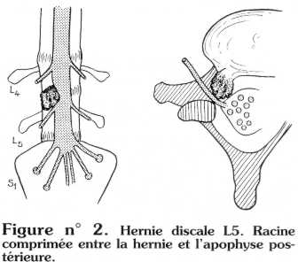
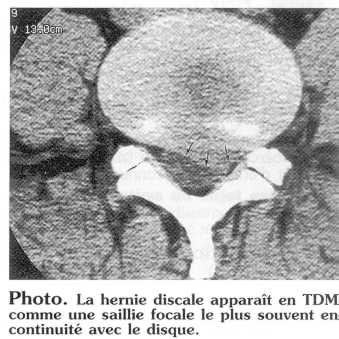
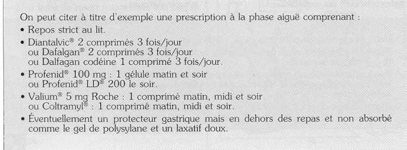

Il s'agit d'une crise douloureuse affectant le trajet du nerf sciatique depuis son origine jusqu'à ses extrémités. Qui dit sciatique dit toujours douleur, empruntant le trajet du nerf du même nom. 
Le nerf sciatique a ses origines dans les racines nerveuses lombaires qui partent de la terminaison de la moelle épinière (queue de cheval) et sortent par les trous de conjugaison en dessous des vertèbres correspondantes. La sciatique résulte d'un conflit entre l'une des racines du nerf sciatique L5 ou S1 et le disque correspondant. Il y a deux racines, à chaque niveau, l'une postérieure sensitive et l'autre antérieure motrice, se rejoignant avant la sortie du canal vertébral, innervant des territoires différents, cutanés, musculaires.

Nous aborderons essentiellement la lombosciatique commune, qui représente la grande majorité des cas, sans oublier cependant les autres causes possibles à évoquer pour les éliminer.

## I. Signes et diagnostic de la lombosciatique commune

Le diagnostic est et reste à l'heure actuelle essentiellement clinique.

### 1. La crise douloureuse **est caractéristique**

#### Par son trajet

Lombaire, para-vertébral, gauche ou droite :

*   en faveur d'une sciatique L5, la douleur suit :
    *   la partie médiane de la fesse,
    *   la partie postérieure et externe de la cuisse,
    *   la face externe de la jambe,
    *   le dos du pied jusqu'au gros orteil et aux 3 orteils médians (_figure n°1_)
*   en faveur d'une sciatique S1, la douleur suit :
    *   la partie médiane de la fesse,
    *   la face postérieure de la cuisse,
    *   la face postérieure de la jambe (mollet),
    *   le talon et la plante du pied.

Le trajet peut être incomplet.

#### Par son début

Souvent aigu à la suite d'un effort ou d'un mouvement, parfois progressivement intense.

#### Par son intensité

La douleur intense est exacerbée par la mobilisation, la toux, la défécation, et diminuée par le repos ou certaines positions. On peut distinguer les lombosciatiques aiguës, subaiguës ou chroniques.

### 2. L'examen clinique est capital

Il se fait en position couchée du patient et/ou si possible en position debout.

*   **La présentation du sujet est particulière** avec un enraidissement douloureux de la région lombaire, une incurvation latérale, une impossibilité parfois de se mobiliser, le patient parle de " paralysie ".  
*   **On apprécie l'attitude du patient,** **et la raideur du rachis lombaire.** Cette dernière se mesure par la distance mains/sol en position debout. On recherche le signe de Lasègue : limitation de la flexion sur le bassin du membre inférieur étendu (mesure de l'angle 90°, 40°, O°), la douleur étant réveillée ou exacerbée.  
*   **Les signes objectifs d'atteinte sensitive font l'objet d'une étude précise**
    *   Existence de fourmillements ou de picotements ou de sensation anormale (paresthésies).  
    *   Hypoesthésie ou anesthésie au tact et au toucher : en faveur d'une sciatique L5, un déficit, face externe de jambe, dos du pied et gros orteil ; en faveur d'une sciatique SI, plante du pied et petit orteil.  
*   **Les signes d'atteinte motrice sont** **aussi importants.** La douleur aiguë peut rendre difficile cette partie de l'examen.  
    *   En faveur d'une sciatique L5, parésie ou paralysie du moyen fessier (diminution de l'abduction contrariée de la cuisse), de l'extenseur du gros orteil et des péroniers latéraux (flexion dorsale et latérale du pied sur la jambe).  
    *   En faveur d'une sciatique S1, déficit du triceps sural (flexion plantaire du pied).

Si la douleur est modérée, cette recherche peut se faire, le patient debout, par la marche sur les talons (L5) et sur la pointe des pieds (S1).

*   **L'examen des réflexes ostéo-tendineux** trouve un achiléen aboli ou franchement diminué d'un côté en cas d'atteinte S1+ (rotulien normal).  
*   **Il** **faut vérifier l'absence de** **troubles sphinctériens** (troubles mictionnels, rétention ou incontinence) et d'atteinte de la sensibilité périnéale et rectale - toucher rectal - témoignant de l'extension des troubles vers les racines sacrées.  
*   **Un examen général est nécessaire** à la recherche de troubles (amaigrissement, fièvre) et d'antécédents connus, et d'atteinte artérielle.

### 3. Diagnostic étiologique et différentiel

L'examen clinique permet donc à lui seul de faire le diagnostic d'une lombosciatique commune dans l'immense majorité des cas.

L'origine disco-radiculaire est la plus fréquente, liée soit à une hernie discale, soit à de l'arthrose vertébrale. L'examen permet de différencier les autres douleurs des membres inférieurs et de dépister une sciatique symptomatique imposant des traitements plus urgents.

#### 1) Dans les causes de sciatiques communes

On est orienté d'emblée vers une hernie discale par un trajet radiculaire typique, un début brutal à l'occasion d'un effort ou d'un mouvement, l'âge du sujet (moins de 40 ans), l'absence de signes généraux ou inflammatoires. Nous verrons plus loin la démarche des examens complémentaires.

#### 2) Il peut s'agir de sciatiques d'origine arthrosique

Elles demanderont les mêmes examens : arthrose interapophysaire postérieure, d'emblée, on peut la suspecter : la douleur dépasse rarement le genou, elle est aggravée par la position assise prolongée.

En cas de canal lombaire étroit, la douleur ou les paresthésies surviennent à la marche et cèdent à l'arrêt. L'examen neurologique est souvent pauvre. L'âge est différent (supérieur à 50 ans).

#### 3) Ce qui n'est ni une hernie discale **ni une arthrose**

Il est capital d'éliminer toute autre cause, de s'en méfier si le tableau clinique s'écarte du tableau classique.

**a) si la douleur est inflammatoire, fébrile**

*   il y a des _antécédents_ de cancer, de lymphome, de leucémie, de maladies infectieuses ou parasitaires ;
*   la douleur est pluriradiculaire (signes plus haut, L1-L3 ou plus bas S1-S3) ou plus diffuse ;
*   la douleur a été précédée d'un geste local, d'un traitement anticoagulant, d'une éruption virale ;

**b) la liste ne peut être exhaustive, il peut s'agir**

*   de méningo-radiculites infectieuses ou parasitaires +++,
*   d'épidurites infectieuses ou métastatiques,
*   de tumeurs malignes osseuses ++ avec extension épidurale,
*   de tumeurs bénignes (neurinome) intra- ou extrarachidienne,
*   pour une sciatique tronculaire, on pensera à une injection intramusculaire mal faite (hématome sous anticoagulant ou une tumeur pelvienne.

Le traitement de telles origines dépasse ici notre objectif, mais les examens complémentaires que nous allons exposer vont confirmer le diagnostic et orienter le traitement.

## III. Investigations et examens complémentaires

Il est de bonne pratique d'attendre une à deux semaines de traitement médical avant de demander un bilan radiologique standard. Le scanner lombaire est un examen très performant (s'il peut être pratiqué) mais il reste de seconde intention.

### 1. Le bilan radio standard

#### a) S'il est possible on demande :

*   un cliché de face dorso-lombo-bifémoral (incidence de Sèze),
*   un cliché de profil de la colonne lombaire,
*   un cliché de face centré sur la charnière lombo-sacrée,

soit trois clichés. Les incidences de trois quarts ne sont pas utiles (en général).

#### b) Les anomalies à rechercher pour **la hernie discale :**

*   un espace intersomatique pincé,
*   la région lombo-pelvienne peut être le siège d'une anomalie transitionnelle lombosacrée, d'une bascule pelvienne, d'une scoliose,
*   l'arthrose interapophysaire postérieure est une constatation banale après 40 ans, aux trois derniers niveaux lombaires.

La radiographie standard permet d'évoquer un conflit disco-radiculaire, par hernie discale ou arthrose interapophysaire postérieure. Elle sert à éliminer une cause de lombo-sciatique symptomatique, tumeur, infection, inflammation avec présentation trompeuse clinique.

### 2. La tomodensitométrie (TDM) de la région lombaire (scanner)

C'est l'examen à réaliser en deuxième intention après la radiographie standard, si elle est de réalisation possible. Elle précise l'existence d'une hernie discale et, naturellement, aussi de toute autre lésion osseuse, discale, articulaire qui pourrait exister.

La hernie discale apparaît en TDM comme une saillie postérieure en continuité avec le disque. Le conflit disco-radiculaire se traduit par l'effacement ou le refoulement de l'image radiculaire par la hernie, la racine homologue controlatérale est normalement repérable _(figure_ _n° 2 et photo)._

###   
3. La sacco-radiculographie (SRG) est rarement indiquée

C'est une radiographie après l'injection par voie lombaire intrarachidienne d'un produit de contraste en incidence de face, de profil et gauche. Les produits récents sont moins neuro-toxiques et les aiguilles actuelles sont ultra-fines. L'usage est d'hospitaliser le patient 24 heures.

Le conflit disco-radiculaire ne peut pas toujours être affirmé ; dans ce cas, pour prendre une décision opératoire, la sacco-radiculographie complémentaire est indispensable. Par ailleurs elle est souvent pratiquée en l'absence de possibilité de tomodensitométrie technique ou médicale.

Cet examen présente les caractères suivants :

*   Il permet l'étude du liquide céphalorachidien nécessaire dans les tableaux atypiques ou douteux.  
*   Il est l'examen de référence pour le diagnostic entre hernie discale et atteinte nerveuse.  
*   Il est facilement lisible.  
*   Il permet de démasquer certaines hernies réduites en position couchée et majorée en position debout.  
*   Il donne une vue d'ensemble du cône terminal et de la moelle dorsale.

Il ne doit être fait que si les conditions de technique et d'asepsie sont parfaites.

### 4. L'IRM (imagerie par résonance **magnétique)**

Elle n'est pas supérieure, pour la visibilité des coupes, au scanner lombaire. Nous n'en parlerons pas ici.

**En conclusion**, il y a des cas difficiles et atypiques pour toutes ces explorations

*   hernies médianes ;
*   hernies exclues, cela signifie la déconnexion entre la hernie discale et le disque ;
*   hernies calcifiées, résultant soit d'un vieillissement de la hernie, soit d'une ostéophitose du plateau vertébral.

C'est l'ensemble des examens qui permet le diagnostic qui conduira ou non à la proposition d'un traitement plus radical chirurgical.

Ajoutons l'intérêt de la **ponction lombaire.** Dans tous les cas où existe un doute sur l'origine infectieuse ou parasitaire, elle permet l'analyse du liquide céphalorachidien cytologique, chimique et bactériologique.

Elle ne peut se faire que dans des conditions particulières de technique.

## III. Traitement des lombosciatiques communes

### 1. Traitement médical des lombosciatiques communes

Il peut être instauré d'emblée la plupart du temps.

#### **a) À** la phase aiguë

Il s'agit de repos, d'antalgiques, d'anti-inflammatoires non stéroïdiens et de myorelaxants. En l'absence de signe de gravité, le traitement de la lombosciatique commune est médical.

_Le repos est capital dans la phase initiale_ _aiguë_

La durée est variable mais il est raisonnable de prévoir 8 à 10 jours dans un premier temps. Il s'agit d'un repos strict, au lit, en position antalgique, soit en chien de fusil (sur le côté, les genoux fléchis à demi, et les cuisses demi-fléchies sur le bassin), soit en décubitus dorsal avec un soutien sous les genoux fléchis.

_Le traitement médicamenteux est très_ _important_

*   _Les antalgiques,_ le paracétamol, seul ou associé à un morphinique faible (dextropropoxyfène ou codéïne) doit être largement employé (4 à 6 comprimés par jour).  
*   _Les anti-inflammatoires_ non stéroïdiens (AINS) peuvent être associés. La voie orale est préférable à la voie intramusculaire ou intraveineuse dont la supériorité n'a pas été démontrée. Tous les AINS paraissent se valoir. La surveillance et les précautions nécessaires sont les mêmes quel que soit le médicament prescrit (durée de traitement court - 5 à 7 jours - en respectant les contre-indications).  
*   _La corticothérapie_ par voie générale peut être proposée, s'il y a contre-indication aux AINS, on peut utiliser la prednisone à la dose de 0,5 mg/kg/jour pendant une période de 5 à 7 jours avec les précautions usuelles.  
*   _Les myorelaxants_ sont fréquemment associés aux précédents, thiocolchicoside (Coltramyl®, MioreI®). Les benzodiazépines, diazepam (Valium® Roche), tetrazepam (Myolastan®) ont une action décontracturante et anxiolytique sédative.  
*   _La vitaminothérapie_ est inutile à la phase aiguë.  
*   _La prévention de la constipation est indispensable._

### 2. La rééducation n'est pas justifiée  
à la phase aiguë et même parfois nocive

#### En l'absence d'amélioration au bout de 15 jours

On peut associer _des infiltrations_ péridurales ou intra-thécales. Deux ou trois fois, espacées de quelques jours, souvent accompagnées d'un lombostat. Il est nécessaire de pratiquer au préalable des radiographies standard et une mesure de la vitesse de sédimentation. Elles ne sont faites que par un médecin compétent habitué à ces techniques. On emploie des dérivés cortisoniques (Soludécadron®, Altim®, Hydrocortancyl®) par exemple.

Le lombostat (ceinture de soutien) : il peut aider à la remise en charge debout et aussi à la reprise du travail. Le lombostat peut être plâtré, en résine, ou en matériau thermoformable. Il est logique de le prescrire 4 à 6 semaines. Certains pensent qu'au-delà de ce délai, il favorise l'amyotrophie (fonte musculaire). Son action agit sur la composante douleur et sécurise le patient.

_La rééducation_ est nécessaire après la disparition ou la franche diminution de la douleur. Ses objectifs sont la recherche d'une action antalgique à court terme, le développement des capacités d'autosédation, le renforcement de la musculature abdomino-lombaire, la rééducation de la mobilité lombaire, la stabilisation des articulations intervertébrales, la modification de la posture lombaire. Il y a de multiples techniques proposées sur lesquelles nous ne nous étendrons pas ici.

### 3. Traitement chirurgical

L'indication d'un traitement radical chirurgical dépendra du résultat des examens, en général après le traitement médical bien conduit pour les lombosciatiques communes liées au conflit disco-radiculaire. Il y a cependant des cas d'urgence vraie :

*   la lombosciatique hyperalgique,
*   la lombosciatique paralysante (déficit moteur important, territoire S1 et L5 (moins fréquente)), l'extension des troubles sensitifs et sphinctériens évoquant le syndrome de la queue de cheval. Les troubles précités peuvent persister même après une intervention.

**En conclusion,** il s'agit d'un syndrome précis, dont le diagnostic reste clinique dans un premier temps, qui nécessite un traitement médical d'emblée mais qui peut être l'objet d'investigations plus importantes, conduisant à un acte chirurgical. L'entourage médical doit garder en mémoire, suivant les circonstances, les possibilités de sciatiques dites symptomatiques.

_Développement et Santé, n° 136, août 1998_