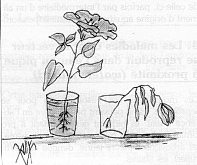
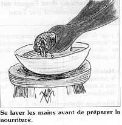
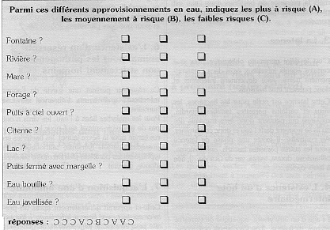

L'eau n'est apparue que tardivement comme pouvant jouer un rôle dans la santé. Elle a été identifiée comme facteur de transmission de maladie seulement en 1854 lors d'une épidémie de choléra à Londres. Progressivement l'accès correct à l'eau potable a permis d'augmenter l'espérance de vie à condition que dans le même temps les conditions d'hygiène s'améliorent. Les maladies liées à l'eau sont très diverses par leur rapport avec celle-ci et le mode de transmision.

En se servant de deux plantes, l'une dans l'eau et l'autre sans eau, les agents de santé communautaires peuvent montrer comment un enfant se déshydrate en l'absence d'eau. Les mères peuvent constater combien la plante sans eau se dessèche vite.

## I. Classification des maladies liées à l'eau (Bradley)

### 1. Les infections dont l'agent est véhiculé passivement par l'eau (water borne)

Il s'agit de maladies transmises directement par l'ingestion d'eau ou d'aliments contaminés par celle-ci. Elles sont donc directement liées à la qualité de l'eau.

*   **Maladies bactériennes :** les infections à Salmonella (typhoïde) ou à entérobactéries (Campylobacter. E. coli), le choléra, les shigelloses.. .
*   **Infections virales :** l'hépatite A (et E), la poliomyélite, les rotavirus responsables de diarrhées, les entérovirus...
*   **Infections parasitaires :** dracunculose, amibiases, giardiase et autres flagellés intestinaux essentiellement.

Ce mode de transmission concerne la plupart des agents étiologiques de diarrhée. La contamination de l'eau se fait par les excreta (péril fécal).

Un traitement simple de l'eau, (chloration, Javel) supprime le risque de contamination.

### 2. Les maladies dont la fréquence diminue quand on augmente les quantités d'eau disponible (water washed)

Ce sont les infections favorisées par le manque d'eau. Il s'agit de :

*   Dermatoses : gales, teignes, pyodermite.
*   Conjonctivite : trachome.
*   Otites.
*   Le Plan et le Bejel.
*   Certaines entérites : diarrhées, oxyures.

Ces différentes infections sont favorisées par un lavage corporel insuffisant, en particulier celui des mains. Le manque d'hygiène provoqué par le peu de disponibilité de l'eau est le plus souvent en cause. Un apport satisfaisant en eau fait disparaître la majeure partie de ces pathologies à condition que conjointement l'hygiène corporelle soit améliorée.

### 3. Les maladies dont l'agent causal a un cycle comportant une phase aquatique obligatoire (water based)

Ce sont des parasitoses pour lesquelles un hôte intermédiaire vivant dans l'eau est nécessaire pour la maturation du parasite.

Cet hôte intermédiaire peut être un mollusque pour la bilharziose, un poisson pour le bothriocéphale ou par un petit crustacé pour le ver de Guinée.

### Maladies liées à l'eau

#### 1. Infection dont l'agent est véhiculé passivement par l'eau, liée à la qualité de l'eau (Water borne)**.**

*   Salmonelles, choléra, amibes, rotavirus, diarrhées.
*   Hépatite A, poliomyélite...

#### 2. Infections dont la fréquence diminue quand augmente la quantité d'eau disponible (Water washed)**.**

*   Conjonctivite, diarrhées, infections cutanées...

#### 3. Maladies dont l'agent causal a un cycle comportant une phase aquatique obligatoire (Water based)**.**

*   Bilharziose, douve, ver de Guinée...

#### 4. Maladies dont le vecteur se reproduit ou pique à proximité de l'eau (Water related).

*   Moustique : paludisme, fièvre jaune...
*   Glossine : trypanosomiase.
*   Simulie : onchocercose.

Ces maladies ne peuvent pas persister en l'absence d'eau. Elles sévissent généralement après un contact avec l'eau ou à proximité de celle-ci, parfois par l'intermédiaire d'un aliment d'origine aquatique contaminé (poisson).

Les moustiques ont besoin d'eau pour se reproduire. Ils ne peuvent pas survivre en l'absence d'eau. Ils piquent généralement à pro ximité de l'eau. Ils transmettent le paludisme, les arboviroses (fièvre jaune, dengue en particulier), les filaires.

Les glossines, vecteur de la trypanosomiase, vivent également à proximité des eaux calmes. Les simulies transmettant l'onchocercose vivent et se reproduisent dans les eaux rapides.

Les maladies reliées indirectement à l'eau sont nombreuses et à l'origine d'une morbidité et mortalité importantes. La lutte contre ces

maladies repose essentiellement sur la lutte contre les gîtes larvaires des moustiques (eau stagnante) et éventuellement les insecticides.

## II. Critères intervenant dans la survenue d'une infection liée à l'eau

L'apparition d'une maladie infectieuse ou parasitaire liée à l'eau et sa transmission sont fonction de certains paramètres. Ceux-ci sont variables selon l'agent infectieux et interviennent sur l'épidémiologie, la fréquence de la maladie.

### 1. La dose infectante

C'est le nombre d'éléments pathogènes capable de provoquer une infection chez la moitié au moins des individus réceptifs.

Plus la dose infectante est faible, plus le risque de transmission est élevé. La dose infectante des infections virales et parasitaires est faible, comprise entre 1 et 100.

Celle des infections bactériennes est plus élevée mais la présence de bactéries dans l'eau est plus fréquente que la présence de virus ou de parasites.

### 2. La latence

C'est le délai minimum obligatoire pour que certains agents infectieux émis dans l'environnement (terre, eau) deviennent infectants et donc puissent être transmis.

Cette latence est nulle pour les bactéries, les virus et certains parasites (amibes, giardia, oxyures) qui peuvent donc être transmis dès qu'ils se trouvent dans l'eau et donc contaminer. Au contraire, il existe une phase de latence pour les autres parasites (ascaris, ankylostome, bilharziose, douve, taenia, ver de Guinée...), liée à leurs cycles.

### 3. L'existence d'un hôte intermédiaire

Il s'agit d'un être vivant, aquatique ou terrestre (animal, mollusque...) où s'accomplit obligatoirement une phase du cycle de l'agent pathogène. Il n'y a pas d'hôte intermédiaire pour les bactéries et les virus, en revanche, pour certains parasites il en existe un :

*   mollusque : bilharzies ;
*   cyclops : ver de Guinée ;
*   boeuf, porc : taenia.

L'existence d'un hôte intermédiaire provoque une phase de latence.  
La lutte contre les hôtes intermédiaires peut faire disparaître une maladie.

### 4. La survie dans l'environnement et la multiplication éventuelle hors de l'organisme humain

La survie dans l'environnement et en particulier dans l'eau est un facteur important pour la santé publique car plus la survie est longue, plus le risque de transmission est prolongé. Cette survie est de l'ordre de sept jours à trois mois pour les bactéries, elle est difficile à préciser pour les virus, elle est souvent longue pour les parasites. Cette survie est influencée par la présence d'un milieu favorable où peut également s'effectuer une multiplication de l'agent infectieux. Celle-ci est assez rare, elle se produit essentiellement pour certaines bactéries : E. coli, salmonelles, campylobacter... et pour quelques parasites : anguillules.

### 5. L'existence d'un réservoir animal pour les pathogènes non strictement humains

Ce réservoir permet une survie de l'agent infectieux, même en l'absence de cas humains.

Pour les maladies liées à l'eau, les virus n'ont pas de réservoir animal sauf pour les arborivirus (singe pour la fièvre jaune), les bactéries en possèdent parfois (yersinia, salmonelles non typhiques), les parasites plus ou moins souvent (douve, giardia).

### 6. L'acquisition d'une immunité

Celle-ci apparaît généralement après un premier contact avec l'agent infectieux. L'immunité peut être locale (digestive) et/ou générale.

Cette immunité est très variable selon les agents infectieux, souvent solide et définitive pour les virus, parfois efficace pour les bactéries mais il existe des sous-types bactériens différents avec peu d'immunité croisée. Enfin pour les parasites, cette immunité n'est souvent que partielle et elle doit être régulièrement réactivée.

## III. Conclusion

Les maladies liées à l'eau sont très diverses et parfois reliées directement à l'eau par l'intermédiaire d'un vecteur ou d'un hôte intermédiaire. De nombreux facteurs interviennent dans la survenue de ces maladies. L'homme interfère également par ses tentatives de développement économique.

La construction d'un barrage, la mise en culture de nouvelles terres par défrichage, l'irrigation, l'urbanisation incontrôlée bouleversent des équilibres précaires et peuvent entraîner des

conséquences néfastes sur l'état sanitaire, en particulier en augmentant la fréquence des maladies liées à l'eau. Un barrage va créer un lac qui constitue un gîte pour les moustiques et pour les mollusque aquatiques, hôtes intermédiaires des douves et bilharzies. Ainsi la fréquence du paludisme, de la bilharziose augmente rapidement. Ceci est d'autant plus grave qu'il existe une concentration humaine importante autour de ces étendues d'eau. L'irrigation pose les mêmes problèmes. Le fleuve en aval du barrage présente souvent un courant rapide qui est un gîte favorable aux simulies, vecteurs de l'onchocercose. L'apparition de bidonvilles ou de zones d'urbanisation incontrôlée dans la périphérie des villes dépourvues de conditions sanitaires satisfaisantes (eau potable, traitement des eaux usées) provoque une augmentation des maladies liées à l'eau, en particulier des diarrhées (amibiase).

Le besoin vital en eau est associé à un ensemble de dangers variés qui doivent être connus pour être mieux contrôlés.

_Développement et Santé, n°177, juin 2005_