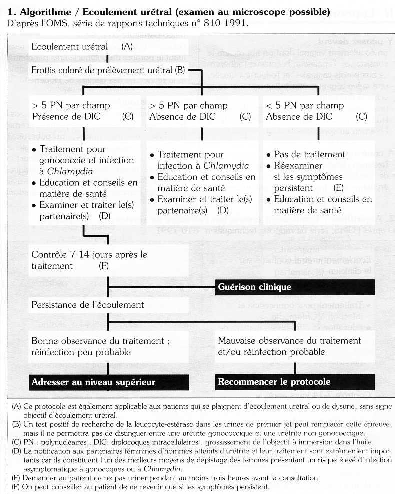
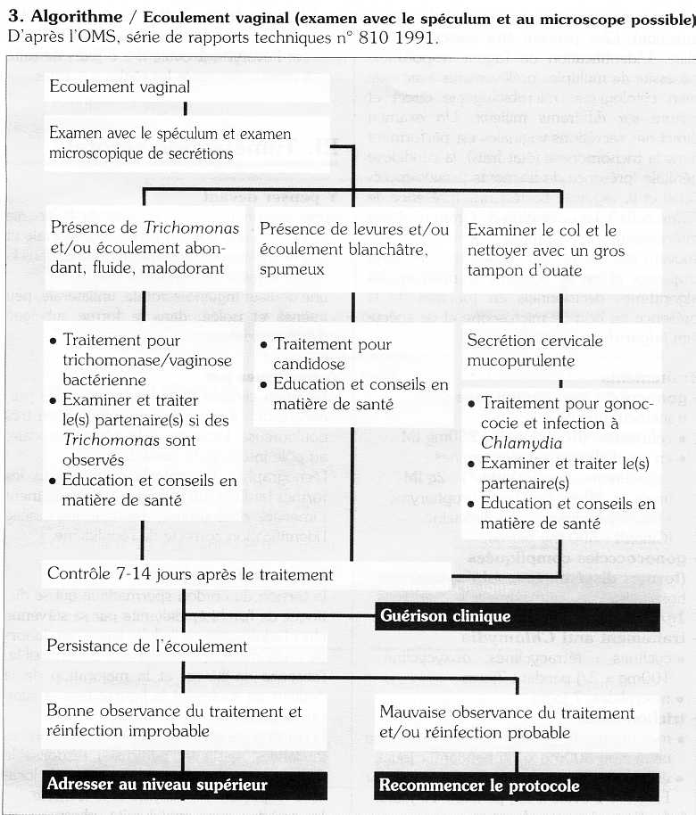
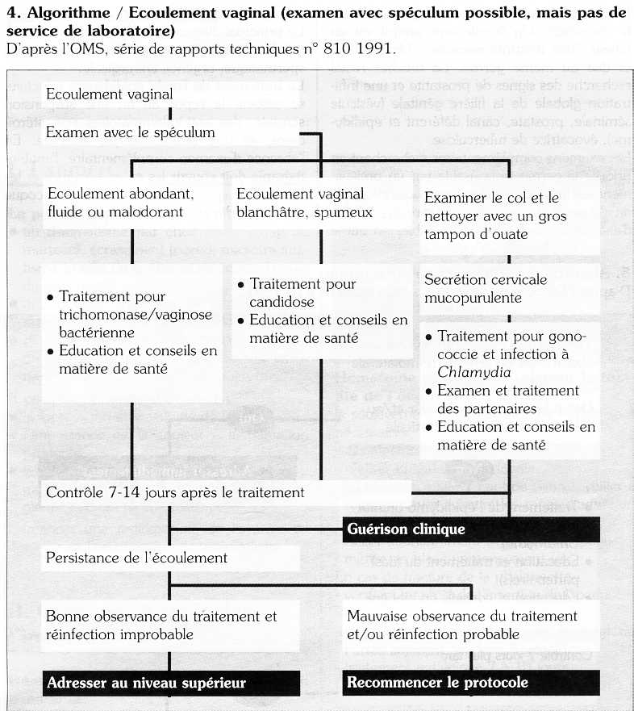

Voir "Maladies sexuellement transmissibles, 1ère partie".

## I. Urétrite

### Y penser devant

*   un écoulement méatique (méat urinaire) spontané survenant en dehors des mictions , très douloureux, associé à des brûlures mictionnelles,
*   une symptomatologie beaucoup moins franche : écoulement uniquement matinal, méat collé, brûlures mictionnelles, prurit canalaire, dysurie.

### A confirmer par

*   le frottis urétral, positif s'il existe plus de 5 polynucléaires neutrophiles par champ (grossissement 1000),
*   l'examen cytobactériologique du premier jet urinaire, positif si l'on observe plus de 10 polynucléaires neutrophiles dans le culot de centrifugation par champ (grossissement 400).

### En rapport avec

*   **_N. gonorrhoeae_ (gonocoque).** Le frottis urétral coloré au Gram (ou au bleu de méthylène) montre la présence de diplocoques Gram négatif intra et extracellulaires. Chez l'homme, sa sensibilité est de 90 % et sa spécificité supérieure à 95 %. Dans le meilleur des cas, le diagnostic est confirmé par la culture.  
*   **_Chlamydia trachomatis._** La culture est difficile et coûteuse. Les tests de diagnostic rapide ont un intérêt croissant mais sont également coûteux. Le sérodiagnostic est inutile du fait d'un manque de sensibilité (en cas d'urétrite non compliquée) et d'un manque de spécificité (présence d'anticorps pouvant être la conséquence d'une infection ancienne ou d'une infection à Chlamydia d'un autre sérotype).  
*   **_Ureaplasma urealyticum._** Sa pathogénicité est discutable et le diagnostic ne peut être retenu que s'il existe en culture des titres supérieurs ou égaux à 104 UCC/mI.  
*   **Mycoplasma genitalium.** La pathogénicité est probablement supérieure à _Ureaplasma urealyticum,_ autre mycoplasme. D'autres bactéries pyogènes (streptocoques, _Haemophilus_ ... ) peuvent être à l'origine d'urétrite bactérienne. Leur pathogénicité est retenue s'il existe une flore monomorphe et une culture supérieure à 104/mI.  
*   **Trichomonas vaginalis.** Le diagnostic repose sur l'examen direct (état frais entre lame et lamelle) de l'écoulement et sur les cultures (sur milieux appropriés) à partir d'un prélèvement urétral et du premier jet d'urine.

### Pour en savoir plus

L'urétrite est une inflammation de l'urètre. Elle peut être considérée comme une urgence thérapeutique du fait de sa contagiosité et de la gravité de ses complications.

Une symptomatologie bruyante fait plutôt évoquer une urétrite à _Neisseria gonorrhoeae_, tandis qu'une symptomatologie plus frustre est plus évocatrice d'infection à _Chlamydia trachomatis._ En fait, cette distinction est artificielle et l'association de ces deux agents pathogènes est fréquente.

La confirmation biologique du diagnostic d'urétrite est facile sous réserve d'un microscope. Le frottis urétral est moins performant que l'étude du premier jet urinaire. Il est positif dans 75 % des urétrites gonococciques et 25 % des urétrites chlamydiennes, et le premier jet urinaire est positif dans 95 % des urétrites gonococciques et 75 % des urétrites chlamydiennes.

Idéalement, le diagnostic étiologique repose sur des examens complémentaires, car les données épidémiologiques et cliniques ne permettent pas de différencier une infection à _Neisseria_ _gonorrhoeae_ d'une infection à _Chlamydia_ _trachomatis._

En pratique, la démarche diagnostique s'appuie sur un algorithme décisionnel (algorithmes _1 et 2). N. gonorrhoeae, C. trachomatis_ et un mycoplasme sont à eux trois responsables de plus de 90 % des urétrites chez l'homme. La répartition de chacun de ces agents pathogènes est variable selon la région.

### Traitement

Le traitement d'une urétrite est double : d'abord traitement antigonococcique minute (en l'absence de complications et de localisations extragénitales), puis traitement anti _Chlamydia._

Le traitement minute antigonococcique par les penicillines doit être abandonné du fait de la résistance du gonocoque aux pénicillines.

Voir ci-après traitement des leucorrhées.

## II. Leucorrhées

### Y penser devant

*   un écoulement vaginal dont on appréciera la consistance, l'épaisseur, la couleur, l'adhérence aux parois vaginales, et l'odeur éventuelle,
*   une vulvo-vaginite, état inflammatoire de la vulve et du vagin,
*   une cervicite, état inflammatoire du col de l'utérus, quand celui-ci est accessible à l'examen au spéculum.

### A confirmer par

*   l'examen clinique et gynécologique, le terme de cervicite étant défini par un col utérin érythémateux, fragile et saignant au contact,
*   l'examen de la glaire pathologique permettant de distinguer une glaire purulente, muco-purulente ou opaque,
*   l'examen cytologique du frottis cervical (évaluant le nombre de polynucléaires par champ au grossissement 1000), et du frottis vaginal (à la recherche des bacilles de Döderlein).

### Ne pas confondre avec

*   Les vulvo-vaginites d'origine non infectieuses hormonales (grossesse, post-partum, préménopause, postménopause, prépuberté ... ), caustiques (cosmétiques, produits d'hygiène, de nettoyage, sous-vêtements, douches vaginales, corps étrangers ... ), allergiques (eczéma de contact au latex des préservatifs ... ), ou correspondant à des localisations génitales de dermatoses (eczéma, psoriasis, lichen plan ... ).  
*   Les cervicites d'origine traumatique, postabortive, hormonale ou caustique partageant les mêmes causes que les vulvo-vaginites non infectieuses.

### Pour en savoir plus

Les **leucorrhées** définissent un écoulement vaginal anormal, symptôme qui peut être la traduction d'une vaginite (souvent associée à une vulvite) ou d'une cervicite, les deux pouvant être associées (cervico-vaginites) et étant d'étiologies souvent communes, L'écoulement vaginal peut être anormal par son odeur, sa couleur ou son abondance. Il peut s'accompagner de prurit, d'oedème, de dysurie ou de douleurs pelviennes.

Les **étiologies infectieuses** des leucorrhées sont nombreuses : gonocoque, _Chlamydia trochomatis_, mycoplasmes, _Gardnarella_ _vaginales, Candida sp., Trichomonas vaginalis et Herpes simplex virus_ (en cas de primo-infection). Elles peuvent être associées entre elles. L'identification de l'agent responsable nécessite de multiples prélèvements avec examen cytologique, microbiologique direct et culture sur différents milieux. Un examen direct des sécrétions vaginales est performant dans la trichomonase (état frais), la candidose génitale (présence de filaments pseudo-mycéliens) et la vaginose bactérienne (présence de _"Clue celis')._ La coloration de Gram n'est pas intéressante. En pratique, on ne dispose souvent pas des moyens voulus dans les pays tropicaux et on se contente d'appliquer des algorithmes décisionnels en fonction de la présence ou non de microscope et de spéculum _(algorithmes 3 et 4)._

### Traitements

#### Gonococcie non compliquée

**Traitement minute :**

*   ceftriaxone (Rocéphine®) : 250mg IM

*   en cas d'allergie aux betalactamines :
    *   - spectinomycine (Trobicine®) : 2g IM (mais ne diffuse pas dans l'oropharynx)
    *   - fluoroquinolones : ciprofloxacine (Ciflox®) : 500 mg _per_ _os._

#### Gonococccies compliquées **(formes disséminées, salpingites)**

Hospitalisations, céfotaxime  1g/8h IV lente pendant 10 jours.

#### Traitement anti _Chlamydia_

*   cyclines : tétracyclines, doxycycline : 100mg x 2/j pendant 7jours

*   macrolides, 7 jours.

#### Trichomonase

*   métronidazole (Flagyl®) : 2g en dose unique ou 500mg x 2/j pendant 7 jours.  
*   en cas de grossesse : traitement local par Flagyl® : 1 ovule x 2/j pendant 10 jours.

#### Infections à mycoplasmes

*   _Ureaplasma urealiticum_ : traitement identique à celui des _Chlamydia_

*   _Mycoplasma genitalium_ : non codifié, sensibilité aux cyclines et macrolides.

#### **Mycose (candidose) vaginale**

*   port de vêtements amples et de sous-vêtements en coton bien rincés

*   changement éventuel de stérilet

*   toilette sans savon ou avec une solution alcaline

*   associer un imidazole local :

*   éconazole (Pévaryl® crème) : sur la vulve matin et soir pendant 3 semaines
*   et Pévaryl® : 1 ovule 3 à 6 jours de suite à renouveler après les règles suivantes.

## III. Tuméfaction scrotale

### Y penser devant

*   une augmentation de volume de la bourse associée à une douleur scrotale unilatérale et une fièvre élevée d'apparition brutale, dans la forme aiguë d'orchi-épididymite,
*   une douleur inguino-scrotale, unilatérale, peu intense et isolée, dans la forme subaiguë d'orchi-épididymite.

### A confirmer par

*   l'examen clinique dans les formes vues précocement : il retrouve une tuméfaction très douloureuse localisée à la région caudale, au pôle inférieur du testicule,
*   l'échographie du contenu scrotal, dans les formes tardives, où la bourse est globalement tuméfiée, douloureuse, rendant impossible l'identification correcte de l'épididyme.

### Ne pas confondre avec

*   la torsion du cordon spermatique qui se distingue de l'orchi-épididymite par sa survenue chez l'adolescent ou l'adulte jeune, en dehors de toute maladie sexuellement transmissible, l'absence de fièvre, et la majoration de la douleur en soulevant la bourse vers la symphyse pubienne,
*   la torsion isolée des annexes testiculaires (hydatides sessile et pédiculée) responsable d'une tuméfaction douloureuse mais très localisée respectant l'épididyme et le testicule,
*   les orchites, sans épididymite, observées au cours des maladies infectieuses comme les oreillons,
*   les tumeurs de l'épididyme ou du testicule compliquées d'hémorragie aiguë intratumorale,
*   les traumatismes de la zone épididymo-testiculaire.

### En rapport avec

*   une bactérie sexuellement transmissible, gonocoque plutôt à l'origine de formes aiguës, ou Chlamydia trachomatis, plutôt responsable de formes subaiguës de la maladie ; le diagnostic de ces formes étiologiques bénéficie d'un prélèvement urétral. une bactérie d'origine entérique (Escherichia coli ... ), plutôt à l'origine de formes aiguës de la maladie et dont le diagnostic pourra s'appuyer sur les résultats de l'examen cytobactériologique des urines,
*   Mycobacterium tuberculosis, d'évolution plutôt subaiguë, l'examen clinique pouvant retrouver une tuméfaction globale de l'épididyme qui coiffe le testicule en "cimier de casque",
*   d'autres bactéries ou des parasites à l'origine de maladies systémiques à localisation épididymaire possible : brucellose, bilharziose, filariose lymphatique.

### Pour en savoir plus

Une tuméfaction du scrotum peut être due à une épididymite (le testicule adjacent étant souvent atteint, on parle d'orchi-épididymite), une orchite, une tumeur, un traumatisme, ou une torsion du testicule. Quelle que soit la cause, le pronostic fonctionnel est en jeu.

L'examen clinique est essentiel pour orienter le diagnostic. Un écoulement urétral est en faveur d'une uréthrite associée à l'épididymite et due au même germe. Le toucher rectal recherche des signes de prostatite et une infiltration globale de la filière génitale (vésicule séminale, prostate, canal déférent et épididyme), évocatrice de tuberculose.

Les examens complémentaires recherchent en priorité le germe responsable par un prélèvement urétral, un examen cytobactériologique du début et du milieu du jet urinaire. Faute d'examen complémentaire possible, on utilise un algorithme décisionnel _(Algorithme 5)._

Le principal diagnostic différentiel de l'orchi-épididymite infectieuse est la torsion du cordon spermatique, urgence chirurgicale.

Le traitement de l'orchi-épididymite infectieuse associe le repos au lit, une suspension scrotale, des anti-inflammatoires non stéroïdiens, et une antibiothérapie adaptée. En l'absence d'examen complémentaire, l'antibiothérapie doit couvrir les entérobactéries et les bactéries responsables d'urétrite : gonocoque et _Chlamydia trachomatis._

_Développement et Santé, n°156, décembre 2001_