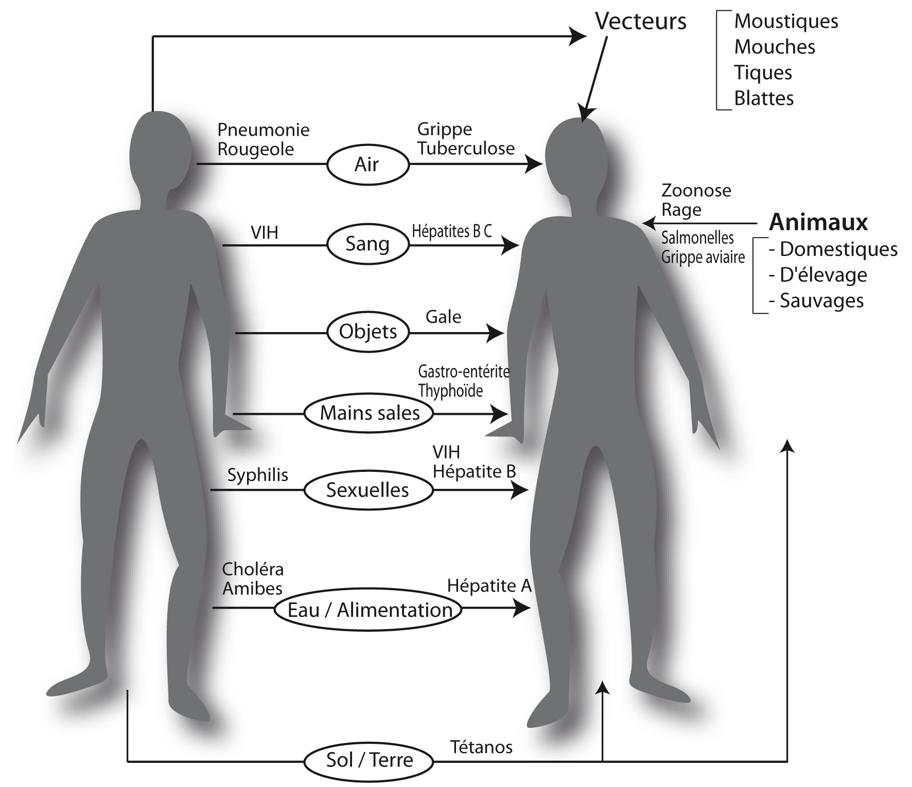

## I. Trois étapes sont nécessaires pour  
la transmission d’une maladie infectieuse

### Emission de l’agent infectieux à partir  
du réservoir d’agent infectieux

*   • Sujet malade ou porteur sain par des sources de contamination :
    *   les sécrétions oro-pharyngées émises lors de la toux, des éternuements, de la parole,
    *   les produits d’excrétion : salives, mucosités nasales, matières fécales…
    *   la peau infectée : plaie, liquide de vésicules,
    *   les cheveux infectés ou parasités,
    *   Le sang.
*   L’animal malade ou porteur sain
*   L’environnement : terre, eau, air, objets qui peuvent aussi être vecteurs d’agents infectieux

### Transmission par différents  
modes de contamination possibles

#### La transmission directe

La contamination se fait de personne à personne (ou de l’animal à l’homme) à partir du contaminateur malade ou porteur sain de l’agent infectieux, jusqu’à la personne saine.

**De personne à personne**

*   Aérienne pour les germes des infections respiratoires (rougeole, grippe, tuberculose, pneumonies…) les méningites bactériennes, par la toux, les éternuements…
*   Manu-portée : transmise par les mains pour les germes des infections des gastro-entérites, à transmission féco-orale (quand les conditions d’hygiène sont mauvaises, entre les matières fécales et la bouche, par les mains).
*   Sexuelle pour les maladies vénériennes (syphilis, VIH, hépatite B…).
*   Par le sang à l’occasion d’une transfusion, d’une blessure, d’une injection avec du matériel souillé (hépatites B et C, VIH…).
*   De peau à peau (gale, poux…).
*   Une transmission “verticale” de la mère à l’enfant existe également.

D’un animal contagieux à une personne, par exemple :

*   par voie cutanée (morsure transmettant la rage…),
*   par voie aérienne (grippe aviaire)…

#### La transmission indirecte

Elle passe par un intermédiaire : la contamination se fait hors de la présence du contaminateur par l’intermédiaire d’objets ou de matériel contaminés :

*   de l’eau et de l’alimentation, contaminés par des germes d’origine humaine (choléra, amibiase, salmonelles…),
*   du sol et de la terre (tétanos),
*   de vecteurs tels les moustiques (paludisme), mouches, tiques (maladie de Lyme), blattes (gastro entérites virales) etc…
*   d’objets (gale).

**Introduction de l’agent infectieux** (par la bouche, le nez, la peau…) chez la personne saine qui devient alors infectée.

**La période de contagion** est la période pendant laquelle la transmission de la maladie peut se faire, d’une personne à l’autre par exemple. Elle permet de définir la durée d’isolement pendant laquelle le sujet malade présente un risque pour la santé des autres personnes de la collectivité.

**La période d’incubation** d’une maladie transmissible permet d’estimer le temps durant lequel d’autres cas peuvent survenir dans la collectivité. C’est le temps entre la contamination et l’apparition des premiers signes d’une maladie.  
Le contrôle des maladies transmissibles nécessite donc une information précise sur la période d’incubation, la durée de contagion, les mesures à prendre concernant un éventuel isolement du sujet malade, l’hygiène et la prévention pour l’entourage.

## II. Mesures d’hygiène en collectivité

L’application des règles d’hygiène garde une place essentielle dans la prévention des maladies transmissibles en collectivité pour lutter contre les sources de contamination et réduire les moyens de transmission.  
Un rappel régulier de la bonne pratique des règles d’hygiène est nécessaire. Les mesures d’hygiène portent sur :

*   l’hygiène alimentaire,
*   l’hygiène des locaux,
*   l’hygiène du matériel,
*   l’hygiène du linge,
*   et l’hygiène individuelle.

Une application rigoureuse de ces mesures permet de s’opposer à la propagation des agents infectieux. Elles doivent s’appliquer chaque jour.

**Le lavage des mains** est une mesure essentielle dans les mesures d’hygiène individuelle. La transmission des agents infectieux par les mains est responsable de nombreuses infections.  
Le lavage des mains

*   doit être répété très souvent dans la journée, particulièrement avant un contact avec un aliment, avant chaque repas ;
*   est à renouveler à chaque fois qu’il y a un contact avec un produit corporel (selles, urine et autres liquides corporels) ;
*   se fait avec du savon ;
*   doit être complété par un bon entretien des ongles. Les ongles doivent être coupés courts et brossés régulièrement.

D’autres mesures d’hygiène sont indispensables :

*   ne pas cracher,
*   se moucher avec un mouchoir (si possible en papier à usage unique) ou se laver les mains après s’être mouché,
*   etc.