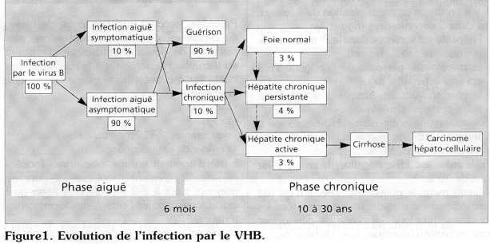
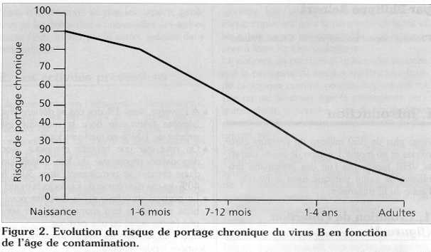
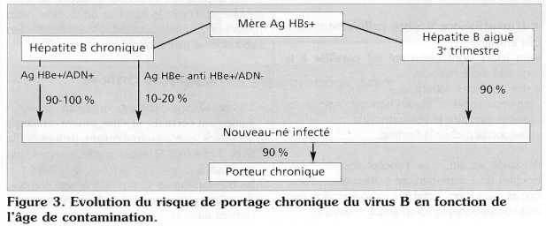
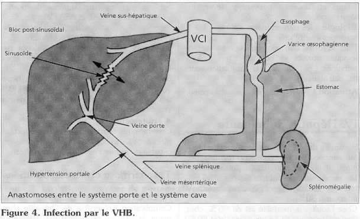

## I. Evolution et traitement

### 1. Evolution de l'infection _(figure 1)_

Elle est particulièrement sournoise et imprévisible à tous les âges de la vie. Quatre-vingt-dix pour cent des sujets infectés ne feront pas d'hépatite clinique.

Après une incubation comprise entre 6 semaines et 6 mois, le sujet infecté peut déclarer une hépatite aiguë (30 % des cas) avec ictère, asthénie, anorexie, insuffisance hépatique transitoire (transaminases élevées, chute du taux de prothrombine).

Alors, 4 évolutions sont possibles :

*   Guérison complète, clinique et biologique, avec disparition du virus dans le sang et dans les sécrétions sexuelles...

*   A l'inverse, dans 1% des cas se déclare une hépatite fulminante dont la mortalité est proche de 1 00 % en quelques jours.  
*   On peut voir une hépatite chronique avec dégradation progressive du foie, installation d'une cirrhose se compliquant, dans 30 % à 40 % des cas, d'un cancer du foie toujours mortel.

*   Le portage chronique est la dernière possibilité pouvant à tout moment évoluer vers une forme aiguë ou une cirrhose.

Avant d'entrer dans les détails, insistons sur 2 données fondamentales :

*   Plus le sujet est contaminé jeune, plus le risque d'infection chronique est grand (90% chez le nouveau-né) _(figure 2)._
*   Tous les sujets infectés, y compris les porteurs sains, sont dangereux pour leur entourage (contacts sexuels, sang, salive, et 30% dont on ne peut pas déterminer l'origine de la transmission).

C'est dire si la vaccination est impérative dans l'entourage d'un sujet infecté par le VHB.

**La clinique seule ne permet absolument pas  
d'affirmer que l'on est en présence d'une infection à VHB.**

### 2. Traitement

L'interféron est actuellement le seul médicament capable de freiner l'évolution de la maladie mais il est souvent mal toléré ; ses indications sont rares.

## Il. VHB et nouveau-né

La transmission du virus est essentiellement périnatale, soit par le contact direct avec le sang maternel, soit par déglutition des sécrétions lors du passage dans les voies génitales . Il y a un risque de contamination du nouveau-né dans 3 circonstances _(figure 3) :_

*   l'hépatite est survenue dans le 3e trimestre de la grossesse (90% des cas),
*   la mère reste porteuse de l'antigène HBs après une hépatite aiguë,
*   le plus souvent en Afrique, il s'agit d'une mère porteuse chronique.

S'il existe une antigénémie HBe associée à l'antigène HBs, le risque de contaminer le nouveau-né est de 90 %.

Si la mère est HBe négative, le risque n'est que de 30 %.

Cliniquement, le nouveau né infecté n'est pas immédiatement malade, mais comme tous les porteurs chroniques, il risque de développer une hépatite chronique, une cirrhose ou un cancer du foie quelques années plus tard. A l'inverse, un petit nombre de nouveau-nés infectés (moins de 3 %) développent vers 3 mois une hépatite aiguë, parfois mortelle. La vaccination, dès la naissance, est le seul traitement préventif qui évite, dans 98 % des cas, toutes ces complications redoutables. Sur 100 nouveau nés infectés à la naissance, 40 feront un cancer du foie vers 40 ans.

## III. Hépatite aiguë (enfant et adulte)

### 1. Clinique

Précédée, pendant quelques jours, de fièvre, de céphalées, de douleurs musculaires, plus rarement de douleurs articulaires, d'urticaire ou d'éruption ressemblant à la rougeole, l'hépatite aiguë B présente le même tableau que l'hépatite A :

*   anorexie;
*   fatigue ;
*   vomissements, diarrhée ou constipation;
*   douleur de l'hypocondre droit.

L'ictère apparaît ensuite avec urines foncées et selles légèrement décolorées. Il dure de quelques jours à 2-3 semaines. A noter qu'il existe souvent, chez l'enfant, des formes anictériques.

La convalescence dure de 3 à 6 semaines, la fatigue et l'anorexie pouvant persister plusieurs mois.

### 2. Biologie

Les transaminases s'élèvent 1 à 2 semaines avant l'ictère.

Dans la forme non compliquée, les tests biologiques doivent se normaliser en 3 à 4 semaines. Les facteurs de la coagulation sont, ici, peu abaissés.

**Attention ! Tout ictère n'est pas une hépatite.**

## IV. Hépatite fulminante

Survenant dans 1% des cas, son début est brutal, annoncé par une confusion mentale, des manifestations hémorragiques, puis un coma. Les transaminases sont très élevées et les facteurs de la coagulation effondrés (facteur V inférieur à 30 %).

Chez l'adulte, la mortalité est de 95%, chez l'enfant de moins de 16 ans, elle atteint 60 %. Une greffe hépatique en urgence' a permis, dans quelques cas, de sauver le malade.

## V. Hépatite chronique

Environ 10% des sujets ayant présenté une hépatite aiguë vont être atteints d'hépatite chronique.

Sur le plan clinique, la symptomatologie est pauvre :

*   fatigabilité,
*   amaigrissement,
*   anorexie.

On note souvent une hépatomégalie.

Seule la biologie permet de faire le diagnostic ;

*   transaminases ALAT et ASAT élevées,
*   syndrome inflammatoire : VS accélérée, CRP élevée, hypergammaglobulinémie.

La biopsie hépatique met en évidence des lésions inflammatoires de l'espace porte (c'est l'hépatite chronique persistante).

Si les lésions débordent sur le lobule hépatique, c'est l'hépatite chronique active (30 % des hépatites chroniques) dont le risque majeur est la cirrhose.

**Traitement** : comme nous l'indiquons dans l'introduction, rares sont les indications du seul médicament capable de freiner l'évolution : l'interféron.

### La cirrhose et ses complications

### 1. La cirrhose

Complication irréversible de l'hépatite chronique, la cirrhose est définie par des lésions anatomiques du foie associant :

*   nécrose des cellules hépatiques,
*   fibrose diffuse,
*   nodules de régénération.

Les conséquences de ces lésions sont de 2 ordres :

*   une insuffisance hépatocellulaire,
*   un trouble de la circulation veineuse intra-hépatique provoquant une hypertension portale.

Cliniquement, le foie est palpable dans 7 0 % des cas. Le caractère clinique le plus significatif est sa consistance dure, particulièrement marquée par la palpation d'un bord inférieur tranchant. La surface est régulière. La palpation est indolore.

### 2. Les complications de la cirrhose

#### a. L'hypertension portale

Les veines intra-hépatiques étant comprimées par la fibrose, la pression dans le système porte s'élève, créant des anastomoses entre le système porte et le système cave _(figure 4)._ L'hypertension portale et les anastomoses provoquent :

*   une dilatation des veines sous-cutanées dans la région sus-ombilicale,
*   une splénomégalie,
*   surtout des varices oesophagiennes dont la rupture peut entraîner une hémorragie digestive qui peut être mortelle _(figure 5)._

#### b. L'insuffisance hépato-cellulaire

Elle entraîne :

*   un ictère dont l'intensité est parallèle à la gravité de la maladie,
*   des troubles endocriniens

*   hyperoestrogénie chez l'homme avec atrophie testiculaire et gynécomastie,
*   aménorrhée chez la femme.

Au stade suivant, c'est l'encéphalopathie avec troubles du comportement : alternance d'apathie et d'agitation, instabilité, désorientation puis état confusionnel et somnolence croissante.

A l'examen, il existe un tremblement lent des extrémités, c'est le _flapping tremor_ s'accompagnant d'une odeur ammoniacale de l'haleine. L'hypertonie extrapyramidale au niveau des membres est fréquente.

#### c. L'ascite

Liée à l'hypertension portale et à l'insuffisance hépatique, elle est inéluctable : l'abdomen est augmenté de volume, distendu, avec un déplissement de l'ombilic.  
On observe surtout une matité mobile avec les changements de positions du malade.

La ponction exploratrice effectuée à mi-distance entre l'épine iliaque antéro-supérieure gauche et l'ombilic ramène un liquide citrin pauvre en protéines (<20 g/I) et en cellules (en l'absence de surinfection).

### 3. Biologie de la cirrhose

*   L'hypo-albuminémie est constante,
*   Egalement constant : l'allongement du temps de Quick avec diminution du facteur V (le taux du facteur V est le meilleur témoin du pronostic),
*   Les transaminases sont modérément élevées,
*   De même, les gammaglobulines sont modérément élevées.

## VI. Cancer du foie

Quatre-vingts pour cent des cancers primitifs du foie sont liés au VHB.

Survenant dans 15 % des hépatites chroniques actives, ils s'accompagnent :

*   d'une dégradation rapide de l'état général,
*   d'un amaigrissement,
*   d'une anorexie,
*   et souvent de douleur du flanc droit et d'un prurit.

A l'examen, on note une recrudescence de l'ictère et une hépatomégalie dure et régulière. L'échographie affirmera le diagnostic.

La durée de vie ne dépasse pas quelques mois.

Pour éviter les conséquences de l'infection par le VHB, pensons VACCINATION !

<table>

<tbody>

<tr>

<td>

### Infection par le VHB : ce qu'il faut retenir

<ul><li>L'infection initiale est souvent inapparente, l'ictère est souvent absent.</li><li>Ce sont les complications à long terme qui font toute la gravité de la maladie.</li><li>Plus le sujet est jeune, plus le risque d'infection chronique est grand.</li><li>Le vaccin protège à 100 %.</li><li>Le vaccin HB est le premier vaccin préventif d'un cancer.</li></ul></td>

</tr>

</tbody>

</table>

<table>

<tbody>

<tr>

<td>

### Hépatite B : les grandes dates

<ul><li>Vè siècle avant J.-C. : Hippocrate décrit l'hépatite épidémique</li><li>1930 : l'injection de sérum humain ou de vaccin de la fièvre jaune peut provoquer la maladie.</li><li>1973 : premier vaccin Maupas (dans la ville de Tours en France.</li></ul></td>

</tr>

</tbody>

</table>

_Développement et Santé, n°151, février 2001_