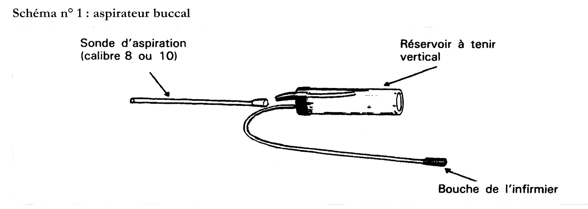
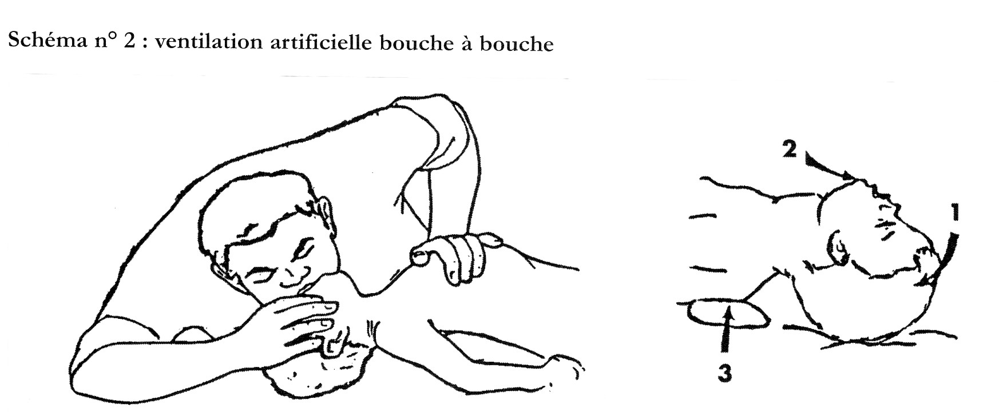
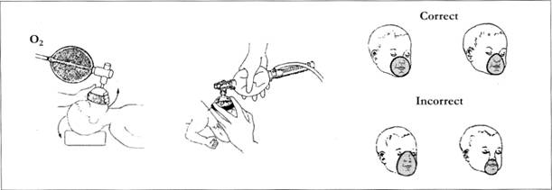

Six à huit pour cent des nouveau-nés ont, à la naissance, des difficultés respiratoires. Cette asphyxie peut avoir des conséquences dramatiques pour l'enfant; lésions cérébrales définitives, voire la mort.  
Pour éviter ce drame, tout infirmier doit installer un coin réanimation avec un matériel simple, disponible 24 heures sur 24.  
Quant aux autres personnes, de la sage-femme à la matrone, elles doivent savoir :

*   libérer les voies aériennes,
*   provoquer la respiration,
*   aider la circulation défaillante,
*   travailler avec propreté.
## I. Matériel souhaitable

*   Lavabo pour les mains avec du savon liquide.
*   Plan de travail avec une lampe (chauffante si nécessaire).
*   Sondes d'aspiration (calibre 8 ou 10).
*   Aspiration buccale ou mécanique (à pied).
*   Source d'oxygène si possible.

Pour assurer la liberté des voies respiratoires, il faut débarrasser les voies aériennes supérieures (pharynx, fosses nasales) des sécrétions qui risquent d'être aspirées dans la trachée lors des premiers mouvements respiratoires.

D'abord :

*   Orienter la tête sur le côté au moment de l'expulsion et nettoyer la cavité buccale avec l'index recouvert d'un linge propre. On peut aussi mettre l'enfant tête en bas et effectuer la même opération.
*   Un massage thoracique, en empoignant le thorax de l'enfant à deux mains et en exprimant doucement de l'abdomen vers le cou, favorise l'élimination des sécrétions.

## II. L’aspiration

Elle est indispensable si les maneeuvres précédentes sont inefficaces. On peut utiliser

*   Une poire d'aspiration elle est pratique mais peu efficace. Il faut la nettoyer et la faire bouillir à chaque fois faute de quoi elle peut provoquer de redoutables infections.
*   L'aspirateur à bouche (_schéma n° 1_) : c'est une solution efficace et peu chère car il peut être désinfecté de nombreuses fois (solution antiseptique, ébullition).
*   L'aspirateur à pied permet une aspiration plus puissante, mais son entretien est plus délicat.

**Les sondes d'aspiration**  
Elles doivent être souples, en plastique, de calibre charnière 8 ou 10 et, bien sûr, nettoyées après chaque utilisation.

## III. Stimuler la respiration

L'aspiration buccale et le massage thoracique sont d'excellents moyens pour stimuler la respiration.  
On peut aussi s'aider de :

*   la stimulation de la plante des pieds par petites claques,
*   la friction rapide du dos.

Enfin, le bouche à bouche (schéma n°2) peut être nécessaire, en plaçant la tête du nouveau-né en extension (sinon la glotte empêche la pénétration de l'air dans les poumons.

  
Le masque avec ballon (schéma n° 3) a l'avantage de ventiler et d'oxvgéner simultanément. il est réservé aux hôpitaux.

## IV. Oxygénation

Elle ne vient qu'après l'aspiration et la stimulation respiratoire. Le tuyau d'oxygène doit être approché à 2 ou 3 centimètres du nez et le débit réglé à 5 litres/minute.

## V. Intubation trachéale

Ce geste utile est difficile et parfois dangereux. Il ne peut être effectué que dans un centre spécialisé. L'intubation permet :

*   une meilleure aspiration,
*   une ventilation plus efficace.

_**Schéma n°3 : mode d'applicationdu masque de manière étanche**_

  

_Développement et Santé, n°197/198, 2010_