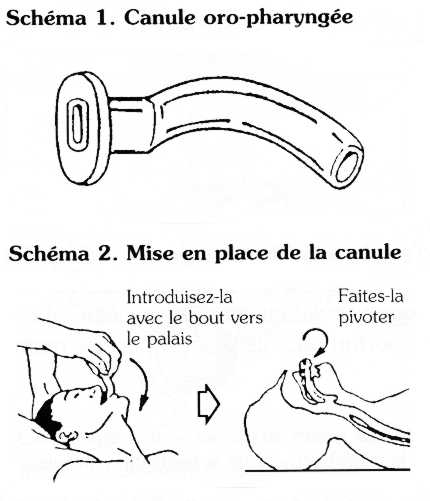
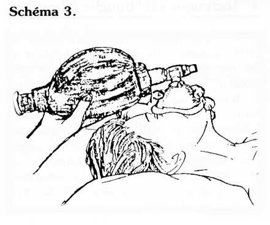
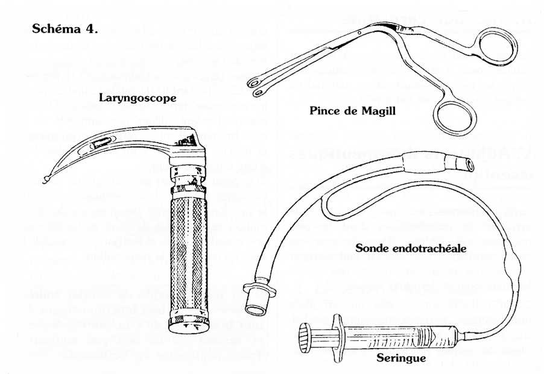

La réanimation n'est pas seulement affaire d'équipement et de matériel consommable, mais surtout de compétence et d'expérience du personnel médical. La réanimation d'un malade en situation de détresse cardiovasculaire autorise des gestes qui peuvent le sauver, mais aussi aggraver définitivement son état, si ces gestes ne sont pas effectués au moment opportun ou, s'ils le sont, par des mains non expertes.

Cette réanimation ne se conçoit donc qu'au niveau de structures sanitaires équipées: bloc opératoire d'hôpital de district, salle d'urgence ou d'admission d'un centre médical sous la responsabilité d'un médecin.
## **I. L'inefficacité circulatoire**

Le terme d'inefficacité circulatoire dans sa signification la plus complète, l'arrêt circulatoire, représente l'urgence totale n'admettant aucun délai dans l'institution de son traitement symptomatique.

### **1. Diagnostic**

Il ne tolère aucun délai. Il se fait essentiellement :

*   sur la disparition des pouls au niveau des gros troncs artériels,
*   sur l'aspect du sujet : perte de conscience, pâleur et souvent cyanose périphérique, mydriase bilatérale (inconstante),
*   en cours d'intervention chirurgicale, la plaie opératoire devient exsangue ou cyanosée, les vaisseaux immobiles.

### **2. Conduite à tenir**

*   Appeler à l'aide et noter l'heure.
*   Placer le sujet sur un plan dur.
*   S'assurer de l'absence de mouvements respiratoires, luxer le maxillaire inférieur vers l'avant et nettoyer au doigt le pharynx.

*   Deux gestes simultanés sont indispensables :
    *   le rétablissement de la ventilation alvéolaire,
    *   le massage cardiaque externe.
*   Mettre en place une perfusion percutanée sur une grosse veine périphérique avec un cathéter 16 ou 18 G, puis remplissage vasculaire en cas d'hémorragie.

*   Évaluer les résultats de la réanimation précoce, active et efficace au bout de quelques minutes.

## **II. Le rétablissement de la ventilation alvéolaire**

C'est le premier objectif des gestes d'urgence. Plusieurs techniques peuvent être employées en sachant que l'intubation endotrachéale est la plus efficace.

### **1. Technique du "bouche à bouche"**

C'est la plus rapide à mettre en oeuvre. Le rétablissement de la ventilation alvéolaire se fait par insufflation d'air expiré. Cette technique qui ne nécessite aucun matériel particulier n'est pas décrite dans cet article.

En ce qui concerne les techniques de bouche à bouche et de ventilation au masque avec Ambu, on peut s'aider en insérant une canule oro-pharyngée (type Mayo ou Guedel) : de taille adaptée à l'âge, elle facilite le passage de l'air et évite la chute de la langue sur le larynx _(schéma n° 1)_.

La canule est glissée sur la langue, tournée vers le haut, puis retournée afin que la canule repose sur la convexité de la langue. Fixer la canule avec du sparadrap sur la lèvre supérieure (_schéma n°_ _2)._

### **2. Ventilation au masque avec ballon auto-gonflable (Ambu)**

Cette technique rend de grands services dans trois circonstances particulières et devrait être connue de tous les médecins ou infirmiers exerçant dans un hôpital (_schéma n°_ _3)._

*   Réanimation d'un nouveau-né dans les premières minutes, lorsque l'évolution satisfaisante de cette réanimation permet d'éviter l'intubation.

*   Réanimation lors d'un arrêt circulatoire en attendant l'intubation qui doit être réalisée au plus vite.

*   Lors d'une apnée induite par l'injection d'un produit anesthésique, tout en sachant être prêt à intuber si nécessaire : le matériel d'intubation doit toujours être à portée de la main et vérifié lors de toute anesthésie.

**Technique**

Elle doit être rigoureuse :

*   Tête en hyper extension modérée.
*   Masque adapté au massif facial de l'adulte ou de l'enfant (pas de fuites au niveau de la bouche et du nez).
*   Luxer la mâchoire inférieure vers l'avant et le haut à l'aide de la main gauche en maintenant le masque sur le visage.
*   Ventiler avec le ballon (main droite) au rythme de :
    *   10 à 12/minute pour l'adulte
    *   20/minute pour l'enfant,
    *   40/minute pour le nouveau-né (attention alvéoles fragiles).

### **3. L'intubation endo-trachéale** **(par la bouche)**

Nous détaillerons ici le matériel nécessaire à une intubation et vous rappelons que lors de toute anesthésie, ce matériel doit être à portée de la main et en bon état de fonctionnement _(schéma n° 4_) _:_

*   Un laryngoscope avec un jeu de lames (courbes pour l'adulte, droites pour l'enfant), des ampoules et des piles de 1,5 V de rechange (attention : l'ampoule du laryngoscope se dévisse fréquemment et risque de tomber au fond de la gorge lors de la manoeuvre d'intubation).
*   Lidocaïne visqueuse pour enduire le bout de la sonde d'intubation.
*   Sondes d'intubation stériles avec raccords :
*   **6,5 - 7 - 7,5 avec ballonnets** pour l'adulte (vérifier l'étanchéité du ballonnet),
*   **2,5 à 5 sans ballonnet** pour l'enfant. Pour déterminer le calibre de la sonde à insérer chez un enfant, on choisit celle dont le diamètre se rapproche le plus du petit doigt de l'enfant.

*   Aspirateur à pied et sondes d'aspiration stériles.

*   Canules oro-pharyngées (Mayo ou Guedel) de différentes tailles.
*   Pinces de Magill ; pince de Kelly ou Kocher.
*   Seringue de 10 ml.
*   Sparadrap.
*   Ambu avec une valve s'adaptant sur les raccords des sondes d'intubation (vérifier +++)

**Technique (pour les droitiers)**

Tête en hyper extension (_schéma n° 5, (a))_ :

*   La lame du laryngoscope tenue de la main gauche est introduite dans la bouche sans blesser les lèvres en évitant de faire levier sur les dents et charge sur la langue ; le maxillaire inférieur est soulevé en avant et en haut sans mouvement du poignet qui reste bien ferme. Par ce mouvement l'épiglotte est repérée et le bout de la lame vient s'arrêter devant sans la charger _(b)_ (excepté chez le petit enfant, où l'on charge l'épiglotte sur la lame du laryngoscope _(c)._Les cordes vocales sont ainsi exposées; introduire la sonde d'intubation tenue de la main droite jusqu'à disparition du ballonnet derrière les cordes vocales _(d)._

*   Gonfler le ballonnet avec 7-8 ml d'air, clamper en dessous du ballonnet témoin avec la pince de Kocher _(e)._

*   Adapter l'Ambu avec la valve et ausculter les deux poumons : la sonde est en place et la ventilation est symétrique des deux côtés.
*   A l'inverse, l'auscultation de l'épigastre doit être silencieuse.

Si un seul poumon est ventilé, retirer la sonde de 1 à 2 cm après avoir dégonflé le ballonnet et recommencer la vérification par l'auscultation. En cas d'inefficacité ventilatoire (pas de bruit à l'auscultation), cela signifie que la sonde a été placée dans l'oesophage ; recommencer la manoeuvre d'intubation.

*   Mettre en place une canule oropharyngée.
*   Fixer très soigneusement la sonde en place avec du sparadrap.
*   La fréquence ventilatoire est la même que pour une ventilation au masque (10 à 12 par minute pour l'adulte).

L'extubation se fait lorsque le patient a récupéré une conscience normale, une ventilation spontanée efficace et un état hémodynamique satisfaisant (ne pas oublier de dégonfler le ballonnet et d'aspirer dans la trachée avant l'extubation) .

## **III. Massage cardiaque**

C'est le second geste d'urgence, à effectuer simultanément à la ventilation assistée. Les techniques ne nécessitant aucun matériel ne sont pas étudiées dans cet article.

## **IV. Adjuvants thérapeutiques essentiels**

L'arrêt circulatoire s'accompagne toujours de perturbations métaboliques dont la plus importante est l'acidose. Pour ramener une activité cardiaque normale, il faut corriger cette acidose et souvent utiliser des agents pharmacologiques (produits vaso-actifs).

**1.** Par cathéter intraveineux mis en place immédiatement, perfuser une solution alcalinisante si l'une est disponible : 200 ml de bicarbonate de sodium isotonique à 14 ‰ chez l'adulte ; de 10 à 100 ml chez l'enfant suivant le poids (environ 3 ml/kg).

**2.** L'injection de médicaments n'est efficace que sur un coeur qui a bénéficié d'un bon massage, d'une bonne ventilation et d'une correction de l'acidose.

Utiliser l'épinéphrine (Adrénaline®) (1 mg = 1 ml). Chez l'enfant (0,01 ml/kg) : une ampoule intraveineuse, renouvelable si besoin. Dans le cas de l'enfant, diluer une ampoule de 1 mg=1ml dans 9 ml de sérum salé ou glucosé et injecter 1 ml par 1 ml jusqu'à l'obtention d'une efficacité clinique.

Si le coeur ne repart plus, malgré un massage cardiaque externe et une ventilation corrects, le problème de l'arrêt des mesures de réanimation se pose. La décision se fondera sur une maladie causale et le délai qui a précédé la mise en oeuvre de la réanimation.

**Il est indispensable de vérifier toutes les semaines le bon fonctionnement de tout le matériel de réanimation (même et surtout s'il ne sert pas souvent). Toute négligence en ce domaine peut coûter la vie à un malade.**

_Développement et Santé, n° 156, décembre 2001_