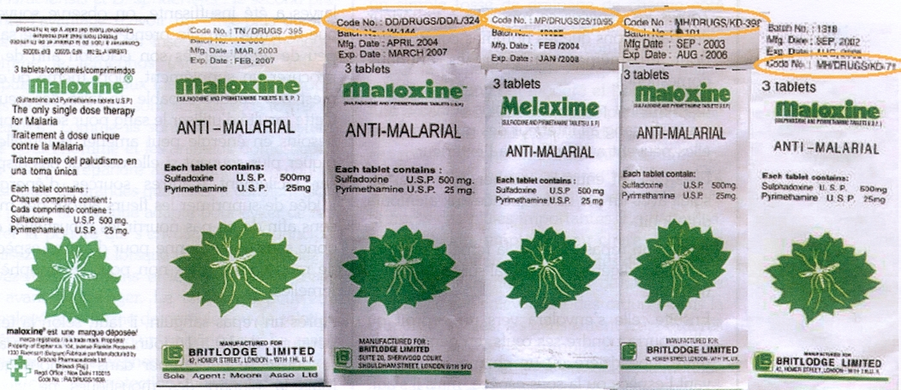

**Les six Maloxine/Melaxime (sulfadoxine-pyriméthamine)**

Le Maloxine®(sulfadoxine-pyriméthamine) représenté à l'extrême gauche sur la figure est un anti­parasitaire fabriqué par Gracure Pharmaceuticals Ltd. (code No RA/DRUGS/1639) en Inde pour Exphar s.a. en Belgique. Exphar est propriétaire de la marque Maloxinee et commercialise ce produit dans de nombreux pays d'Afrique dont la Côte d'Ivoire. Cette présentation, qui a été fournie par Exphar comme point de comparaison, est une ancienne version du packaging, la plus récente étant maintenant de design un peu plus sophistiqué et à dominante bleue (elle fait partie des échantillons collectés sur le terrain). Les cinq autres médicaments, 4 Maloxine et 1 Melaxime, sont des contrefaçons produites par des fabricants indiens différents (5 codes de fabricant différents) dont 4 ont pu être identifiés (l'un d'entre eux est l'industrie Syncom Formu­lations), le dernier ayant usurpé frauduleusement le code d'un autre fabricant (Brown and Burk Pharmaceutical), qui a réfuté tout lien avec la fabrication de Maloxine. Sur le contenant des 4 produits appelés Maloxine figure le nom d'une même société, "Britlodge Limited", pour laquel­le auraient été fabriqués les médicaments. Deux adresses différentes ont été utilisées mais toutes les deux seraient situées au Royaume-Uni. Après vérification, aucune trace de cette industrie n'a pu être retrouvée. Par ailleurs, certains de ces produits ont déjà été considérés comme des contrefaçons par le gouvernement nigérian et quelques procès sont actuellement en cours.

_Développement et Santé, n°189, 2008_