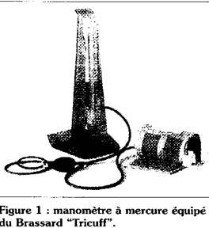
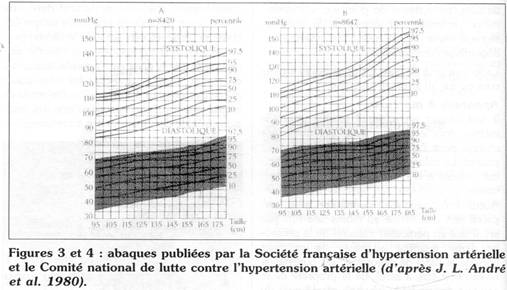

## I. Employer une technique de mesure rigoureuse

En pratique clinique, la méthode utilisée est celle de l'auscultation, la méthode de la palpa­tion peut parfois rendre service.

Un brassard de taille adaptée (voir ci-après) doit être enroulé autour du bras du patient, en centrant la poche gonflable sur l'artère humé­rale repérée par la palpation. Le bord inférieur doit être à au moins 2,5 cm de la fossette antécubitale. Il faut éviter que le stéthoscope touche les tubulures ou le brassard (éviter de le placer entre le brassard et le bras).

On doit alors placer la cloche du stéthoscope sur l'artère humérale repérée par la palpation. Le stéthoscope doit être appuyé le moins possible.

La pression artérielle **systolique** (PAS) doit être lue au moment où est perçu le premier bruit auscultatoire.

La pression artérielle **diastolique** doit être lue au moment où les bruits disparaissent. Dans quelques cas, les bruits peuvent ne pas dispa­raître, l'affaiblissement du son qui devient sourd détermine alors la PA diastolique (PAD).

La palpation du pouls radial permet de repé­rer la TA systolique : le gonflage du brassard pneumatique à une pression suprasystolique fait disparaître le pouls en aval (en général : pouls radial). Sa réapparition lors du dégonfla­ge détermine la PA systolique.

### Conditions de mesure

Quelques précautions sont nécessaires afin d'obtenir des chiffres exacts.

*   Le patient doit être dans un **environnement calme**, au repos depuis au moins 5 à 10 minutes.  
*   Il est souhaitable de mesurer la PA **à distan­ce des événements qui peuvent la faire varier** : émotion, effort physique, repas, consommation de tabac (15 minutes), de café (1 heure), d'alcool, de traitement par des dérivés sympathomimétiques, épisode doulou­reux, ponction veineuse, etc.

En dehors de la grossesse, la PA peut indiffé­remment être mesurée en **position assise ou allongée**, jambes non croisées. Le bras du patient doit être nu (pas de vêtement retrous­sé), paume ouverte et tournée vers le haut. En position assise, l'avant bras doit être soutenu par une tablette, de manière à ce que la cloche du stéthoscope posée sur l'artère humérale, soit à la hauteur du coeur, il est nécessaire d'éviter toute contraction musculaire du bras.

**Chez la femme enceinte**, en raison des caractéristiques hémodynamiques particulières à la grossesse, les positions couchée et debout sont des positions de contraintes qui augmentent la pression artérielle. La position recom­mandée est en fait la position assise, à distan­ce de l'examen gynécologique, après quelques minutes de calme et de conversation.

Un contrôle de la pression artérielle au niveau des deux bras doit avoir lieu au moins lors de la première consultation ; ultérieurement, le côté le plus élevé sera utilisé pour la sur­veillance.

Une mesure de la PA en position debout est souhaitable lorsqu'une hypotension orthosta­tique est recherchée.

## Il. Précautions et pièges

### 1. Choisir un brassard adapté pour chaque patient

Le brassard doit être inextensible et comporter une fermeture velcro ou à crochets (la ferme­ture par sangle doit être évitée, en raison d'un risque d'effet garrot modifiant les résultats de la mesure). Il doit être plus large de un à deux centimètres que la poche gonflable et beau­coup plus long.

La largeur de la poche gonflable doit mesurer 40 % de la circonférence maximale du bras, et sa longueur doit être le double de sa largeur.

La non-adaptation de la taille du brassard à la circonférence du bras est responsable d'er­reurs.

*   Si la poche est trop large ou trop longue, la PA est sous-estimée ;
*   Si la poche est trop étroite ou trop courte, la PA est surestimée.

Pour mesurer correctement la pression arté­rielle d'un adulte, il faut disposer d'au moins trois brassards de dimensions différentes.

### 2. Variabilité tensionnelle

La PA est un paramètre hémodynamique pré­sentant une grande variabilité (après les repas, pendant l'effort, après certaines émotions...). Pour cette raison, l'OMS recommande la répétition des mesures : 3 mesures lors de la même consultation et plusieurs consulta­tions espacées, avant de porter un diagnostic et entreprendre éventuellement un traitement.

Cependant de très rares cas d'hypertension artérielle maligne sont une urgence thérapeu­tique et nécessitent une hospitalisation. Ils se caractérisent par une PA très élevée (PAS pou­vant atteindre 300 mmHg et par des signes fonctionnels majeurs : céphalées pulsatiles, phos­phènes, acouphènes, insuffisance cardiaque...

### 3. Dégonflage-regonflage du brassard

Il ne faut jamais regonfler un brassard au cours d'une mesure pour vérifier la PAS. Si pour une raison ou une autre la mesure de la pression artérielle est considérée comme incorrecte, il faut dégonfler totalement et attendre une à deux minutes avant de recommencer une mesure.

### 4. Irrégularité du rythme cardiaque

Lorsque le rythme cardiaque est irrégulier, la détermination de la pression artérielle est particulièrement difficile, car le débit cardiaque et la pression artérielle peuvent fortement varier d'un battement cardiaque à l'autre. Les mesures prises sur des extrasystoles isolées ne doivent pas être retenues. En cas de fibrillation auriculaire, la pression systolique relevée doit être une moyenne de plusieurs mesures, de même que la pression artérielle diastolique. Dans tous les cas, il est important de considé­rer les pressions observées comme des approximations.

### 5. Pseudo-hypertension

Les chiffres de la pression artérielle au brassard peuvent être surestimés chez le diabétique, l'insuffisant rénal et surtout le sujet âgé. L'explication est la sclérose de la paroi artérielle devenue incompressible.

### 6. Les appareils de mesure

Le sphygmomanomètre utilisé pour la mesure de la pression artérielle par ausculta­tion comprend quatre éléments : une poche de compression incluse dans un brassard inextensible, un système de gonflage, un mano­mètre permettant la lecture de la pression régnant dans le brassard, un système de dégonflage contrôlable.

La lecture peut se faire sur un appareil à mer­cure ou sur un appareil anéroïde.

#### Appareils à mercure :

Il faut choisir un appareil gradué en milli­mètres, dont le brassard peut facilement être changé pour l'adapter à la taille du bras du patient. La colonne de mercure doit être verti­cale, placée à la hauteur des yeux de l'obser­vateur pour éviter les erreurs de lecture. Aucun étalonnage n'est nécessaire, mais l'ap­pareil doit être vérifié au moins une fois par an. Il faut en particulier s'assurer de la présen­ce d'une quantité adéquate de mercure (lorsque la valve de dégonflage est ouverte, le niveau doit être à zéro), de la propreté de la colonne de verre (du mercure oxydé peut s'y déposer), de l'étanchéité des tubulures (bras­sard gonflé et valve fermée, la chute de la pression doit être inférieure à 1 mmHg par seconde), de l'absence de fuite sur la poire de gonflage... _(figure 1)._

#### Appareils anéroïdes :

Ils sont moins précis mais moins fragiles et plus faciles à transporter, ils demeurent utiles au domicile des patients. Ces appareils doi­vent être gradués en millimètres et pouvoir recevoir des brassards de plusieurs dimensions _(figure 2)._ Certains modèles ne peuvent être correctement étalonnés et doivent donc être évités : ceux sur lesquels une butée bloque l'ai­guille au zéro, ceux sur lesquels le cadran peut tourner et ceux sur lesquels une molette per­met de placer le zéro en n'importe quel point du cadran. Leur étanchéité doit être égale­ment contrôlée. Ils devraient être étalonnés au moins tous les six mois sur l'échelle des pres­sions à l'aide d'un manomètre à mercure.

### 7. L'effet "blouse blanche"

Le stress du patient lors d'une visite médicale peut être la source d'une majoration des chiffres tensionnels.

### 8. Chez l'enfant

Utiliser un petit brassard adapté à la circonfé­rence du bras.  
Comme chez l'adulte, l'hypertension ne doit pas être diagnostiquée sur la base d'une seule mesure. Il faut répéter les mesures afin de déterminer la stabilité de l'augmentation de la PA. La mesure doit être effectuée chez un enfant calme en position assise ou couchée, elle doit être répétée au moins trois fois à différentes consultations avant de retenir un diagnostic quelconque _(figures 3 et 4)._ La pression artérielle varie avec le poids, la taille, le sexe et l'âge.

## III. Valeurs de la pression artérielle

### 1. Chez l'adulte

#### PA normale 

*   PAS < 140 mmHg (pression artérielle systolique)
*   **et** PAD < 90 mmHg (pression artérielle diastolique)

#### PA limite

*   PAS comprise entre 140 et 160 mmHg
*   **ou** PAD comprise entre 90 et 95 mmHg

#### HTA

*   PAS > 160 mmHg ou PAS > 95 mmHg

### 2. Chez la femme enceinte

Hypertension

*   PAS supérieure ou égale à  : 140 mmHg
*   ou PAD supérieure ou égale à 90 mmHg

### 3. Chez l'enfant _(voir figures 3 et 4)_

#### PA normale :

Systolique et diastolique infé­rieures au 90° percentile pour l'âge et le sexe.

#### PA normale élevée :

Systolique et/ou diasto­lique inférieures entre le 90° et 95° percentile pour l'âge et le sexe.

#### PA élevée :

Systolique et/ou diastolique égale ou supérieures au 95° percentile pour l'âge et le sexe.

## IV. Conclusion

De multiples facteurs font varier la pression artérielle. Le respect de certaines règles per­mettra d'éviter un grand nombre de pièges et de causes d'erreurs. C'est sur cette mesure que se fondent nombre de décisions dont les conséquences peuvent être importantes pour les patients. La mesure de la pression artériel­le est une affaire sérieuse, qui prend du temps, il est important d'appliquer une technique correcte et de répéter les mesures.

Une fois que le diagnostic est confirmé, le traitement initial peut reposer sur les interven­tions non pharmacologiques. Le traitement pharmacologique doit être réservé aux malades à pression artérielle significativement élevée et répondant mal aux approches non pharmacologiques.

_Développement et Santé, n°183, 2006_