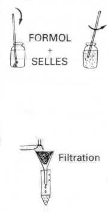
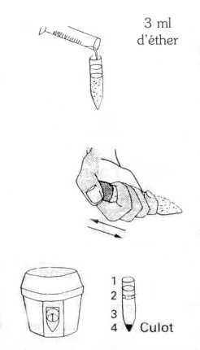
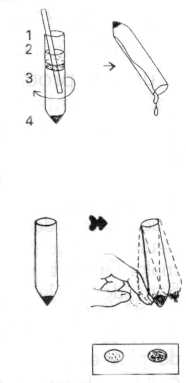

Cette technique est utilisée pour concentrer les parasites, trop rares pour être décelés à l'examen direct. Elle est utilisée lors d'une première recherche négative malgré des signes cliniques évocateurs (douleurs abdominales, diarrhées), et pour vérifier l'efficacité du traitement.

L'examen microscopique direct d'une selle doit toujours précéder la concentration des selles car les formes mobiles des protozoaires ne sont pas retrouvées par cette technique. En revanche, on retrouve les oeufs d'helminthes, les kystes des protozoaires et les larves d'anguillules.

**Principe**

Les selles sont mélangées à une solution de formol à 10 %. Après filtration du mélange, on ajoute 3 ml d'éther et on centrifuge. On obtient un caillot au fond du tube où se trouvent les oeufs, les kystes et les larves de parasites.

**Matériel**

- Centrifugeuse électrique ou manuelle
- Microscope : objectifs 10 x 40 Flacon ou grand tube
- Applicateur en bois ou anse
- Passoire ou gaze
- Entonnoir
- Tubes coniques à centrifuger gradués (au moins 15 ml)
- Bouchons ou parafilm
- Lames et lamelles
- Crayon marqueur.

**Réactifs**

- Formol du commerce
- Éther ou éther de pétrole
- Chlorure de sodium (NaCI)
- Solution de lugol.

**Mise en garde :**

L'éther dissout l'encre : étiqueter les tubes au crayon gras noir.

Le mélange éther-formol est détonant : manipuler loin des sources de chaleur.

## Méthode au formol-éther

### 1. Mélanger

Dans un grand tube environ 1 ml de selles avec 9 ml de formol à 10 %.

### 2. Filtrer

Le mélange obtenu à travers une couche de gaze et recueillir dans un tubeconique à centrifuger. (Parfois il est préférable de filtrer avec une " passoire à thé " car la gaze peut retenir un grand nombre de parasites).

<table>

<tbody>

<tr>

<td valign="top">Préparation des réactifs</td>

<td valign="top">Matériel</td>

</tr>

<tr>

<td valign="top"><ul><li>NACI à 0,85 0/o : peser 8,5 g de NaCI</li></ul>pour 1 litre d'eau distillée<ul><li>Solution de formol à 10% :</li></ul>- formol du commerce : 10 ml

- solution de NaCI à 0,85 % : 90ml

</td>

<td valign="top">

Balance et poids

Récipient à poudre

Eprouvette

Erlenmeyer

Pipettes

</td>

</tr>

</tbody>

</table>

***Attention : le formol est corrosif et toxique***

### 3. Ajouter

3 ml d'éther ou d'éther de pétrole.

### 4.Agiter

Vigoureusement pour obtenir une solution homogène.

### 5. Centrifuger

5 min avec une centrifugeuse manuelle ou 2 min 30 avec une centrifugeuse électrique, à vitesse moyenne.

Vous obtenez quatre couches :

1re couche : éther  
2e couche : débris  
3 e couche : formol  
4 e couche : le culot qui contient les oeufs, les kystes et les larves de parasites.

### 6. Éliminer

Les surnageants (1), (2), (3) pour recueillir le culot (4). Retourner le tube d'un coup brusque. Vous pouvez vous aider d'une pipette pour aspirer et rejeter les surnageants.

Attention à conserver intact le culot.

### 7. Bien mélanger

Le culot restant, en tapotant doucement le tube pour bien remettre en suspension.

### 8. Déposer

Deux gouttes du culot sur une lame. Ajouter une petite goutte de lugol, uniquement à la deuxième goutte du culot.

### 9. Couvrir

D'une lamelle et examiner au microscope objectif 10 x 40

(Schémas : d'après *Manuel des techniques* *de base pour le laboratoire médical*, Organisation Mondiale de la Santé, Genève 1982).

*Développement et Santé, n°119, octobre 1995*
