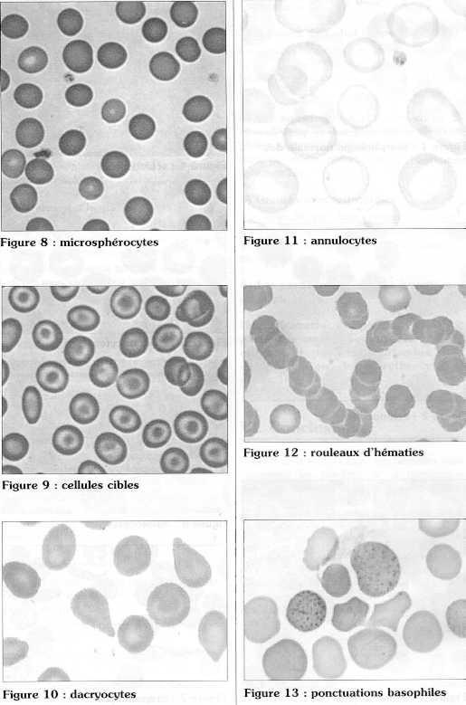
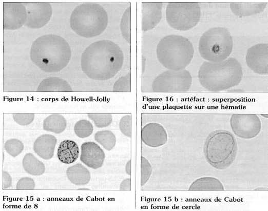

Les hématies peuvent être observées à l'état frais, entre lame et lamelle ou sur un frottis sanguin, après coloration.

Selon les techniques de coloration utilisées, elles apparaissent rouge-brun (coloration de Wright) ou roses (May-Grünwald-Giemsa). En cas de variations de pH des colorants, elles peuvent apparaître plus grises, voire verdâtres.

## I. Morphologie normale _(figure n° 1)_

Une hématie est une cellule anucléée ayant la forme d'un disque biconcave.  
Sa taille est d'environ 7 microns de diamètre et 2,5 microns d'épaisseur.  
Il existe une zone centrale plus claire, l'hémoglobine se répartissant de façon majoritaire en périphérie de la cellule.

## Il. Anomalies de taille

*   La _microcytose_ caractérise des hématies de taille inférieure à la normale et s'observe surtout au cours des anémies ferriprives et des thalassémies.  
*   La _macrocytose_ correspond à des hématies de taille supérieure à la normale. Elle s'observe au cours de différentes dysérythropoïèses (anomalie de synthèse au niveau de la moelle, avec érythropoïèse inefficace) : carences en folates ou vitamine B12, alcoolisme, traitement par AZT. Les hématies de grande taille observées sur frottis peuvent également correspondre à des réticulocytes qui seront mis en évidence après coloration au bleu de Crésyl.  
*   _L'anisocytose_ est définie par une grande diversité de taille des hématies sur un même frottis.

## III. Anomalies de coloration

*   L'_hypochromie_ est une diminution de coloration des hématies, souvent associée à une microcytose au cours de anémies ferriprives, ou à une macrocytose au cours des dysérythropoïèses.  
*   L'_anisochromie_ est définie par la variabilité de l'intensité de coloration des hématies sur un même frottis.  
*   La _polychromatophilie_ est caractérisée par une variabilité de coloration des hématies qui peuvent présenter des teintes différentes sur un même frottis, de façon plus ou moins homogène. Elle s'observe au cours des anémies hémolytiques et des dysérythropoïèses.

## IV. Anomalies de forme

### 1) Echinocyte (figure 2)

Encore appelé cellule crénelée,

*   il s'agit d'une hématie en forme de disque ou de sphère, hérissée de spicules fins, régulièrement répartis sur toute la surface de la cellule;
*   cet aspect correspond souvent à un artéfact : frottis mal séché ou sang trop longtemps conservé. On peut cependant observer des échinocytes au cours de différents états pathologiques : urémie, pathologie gastrique tumorale ou ulcéreuse.

### 2) Acanthocyte (figure 3)

L'hématie présente des spicules irréguliers en nombre variable (3 à 12), de taille et de répartition inégales, souvent terminés par une extrémité arrondie;

On observe les acanthocytes essentiellement au cours de cirrhoses éthyliques sévères, mais également en cas d'abéta-lipoprotéinémie, après splénectomie, au cours de malabsorptions.

### 3) Schizocyte (figure 4)

Le schizocyte correspond à un fragment d'hématie irrégulier, de taille et de forme variables, comportant au moins deux extrémités pointues. L'hématie prend parfois la forme d'un casque.

Cet aspect est observé au cours :

*   d'anémies hémolytiques microangiopathiques,
*   d'hémolyses dues à des prothèses valvulaires cardiaques,
*   des brûlures sévères.

### 4) Stomatocyte ou _mouth cell_ (figure 5)

Il s'agit d'un disque uniconcave, en forme de coupe à l'état frais. Sur frottis, la zone claire centrale de l'hématie prend la forme d'une fente ou d'un ovale.

On l'observe au cours d'anomalies congénitales de la membrane des hématies : stomatocytose, mais également en cas d'alcoolisme, au cours des cirrhoses ou des obstructions des voies biliaires.

### 5) Elliptocyte ou ovalocyte (figure 6)

L'hématie est dans ce cas allongée, ovale ou ellipsoïde.

Les elliptocytes sont parfois très allongés, mais les extrémités sont toujours arrondies, sans spicules, ce qui les différencie des drépanocytes.

Cet aspect s'observe au cours de l'elliptocytose héréditaire, pathologie congénitale de la membrane du globule rouge.

On peut retrouver des elliptocytes, moins nombreux et non spécifiques au cours de différentes dysérythropoïèses.

### 6) Drépanocyte ou sickle cell, hématie **falciforme** (figure 7)

L'hématie prend une forme allongée, classiquement en forme de faucille ou de croissant, avec deux spicules bipolaires : extrémités pointues, plus ou moins effilées.

Cet aspect est spécifique dans la quasi-totalité des cas d'une hémoglobinopathie : la drépanocytose.

### 7) Microsphérocyte (figure 8)

Les hématies observées à l'état frais sont sphériques.  
Sur frottis, elles apparaissent comme microcytaires alors que le volume globulaire moyen (VGM) est normal.  
Leur coloration est foncée et homogène, avec disparition du centre clair.

On les observe au cours de la maladie de Minkowski Chauffard ou sphérocytose héréditaire (anomalies congénitale de la membrane des hématies), mais également au cours d'autres anémies hémolytiques : elles sont dans ce cas moins nombreuses.

### 8) Cellule cible ou _target cell_, hématie **en cloche, codocyte** (figure 9)

L'aspect sur frottis est celui d'une cible ou d'une cocarde, l'hémoglobine étant répartie en périphérie et au centre de la cellule.

Les cellules cibles s'observent surtout au cours de certaines hémoglobinopathies (hémoglobinose C, thalassémie), parfois au cours des carences martiales.

### 9) Dacryocytes ou hématies en larme, **en poire ou en raquette** (figure 10)

Les hématies ont la forme d'une poire avec une extrémité arrondie et l'autre allongée, plus ou moins effilée.

Cet aspect est évocateur de fibrose médullaire et est rencontré au cours de la splénomégalie myéloïde, des dysérythropoïèses acquises, et de pathologies tumorales s'accompagnant de fibrose médullaire.

### 10) Annulocyte (figure 11)

C'est une hématie dont le centre clair est anormalement important.

Cet aspect correspond à une hypochromie, le plus souvent observée au cours des grandes anémies ferriprives.

### 11) Poïkilocytose

Les hématies présentent dans ce cas des formes variées avec association de nombreux aspects morphologiques différents.

### 12) Rouleaux d'hématies (figure 12)

Les globules rouges peuvent parfois s'accoler les uns aux autres, réalisant une image de rouleaux ou de piles d'assiettes.

Cet aspect est observé au cours des gammapathies monoclonales ou après perfusion de macromolécules.

## V. Inclusions intra-érythrocytaires

### 1) Ponctuations basophiles (figure 13)

Il s'agit de granulations gris-bleutées, de petite taille, dispersées à l'intérieur de la cellule.

Les hématies ponctuées peuvent être observées au cours des anémies hémolytiques, mais le plus souvent, elles témoignent d'une dysérythropoïèse : hémoglobinopathie, anémie mégaloblastique, anémie sidéroblastique ou intoxication par le plomb (saturnisme).

### 2) Corps de Howell-Jolly (figure 14)

Ils se présentent comme des granules sphériques, denses, violet-noir, de diamètre proche de 1 micron ; le plus souvent uniques et périphériques dans l'hématie.

On les retrouve de façon constante après splénectomie; ils sont présents au cours des dysérythropoïèses et parfois au cours des anémies hémolytiques.

### 3) Anneaux de Cabot (figure 15a et 15b)

Ce sont des filaments, circulaires ou en forme de 8, de taille variable, s'observant dans les mêmes situations que les corps de Howell-Jolly.

**Les anneaux de Cabot, les corps de Howell-Jolly et les ponctuations basophiles peuvent être observés simultanément chez un même patient, parfois dans une même cellule.**

### 4) Granulations azurophiles

Ces granulations, fines, rosées ou rouges, irrégulières, peuvent se voir après une hémolyse, mais correspondent le plus souvent à un artéfact.

### 5) Les parasites

Ils ne sont pas évoqués dans cet article.

**Une plaquette de petite taille peut** **parfois se superposer sur une hématie** **et ne doit pas être confondue avec** **une inclusion intra-érythrocytaire.** _(figure 16)_

## **VI. Conclusion**

L'étude de la morphologie des hématies vient compléter les résultats de la numération globulaire, associés à l'étude des constantes érythrocytaires : volume globulaire moyen, concentration et teneur globulaires moyennes en hémoglobine.

Les hématies peuvent présenter des aspects morphologiques variables, parfois associés. Certains aspects sont spécifiques d'une pathologie (drépanocytes), d'autres permettent une orientation diagnostique.

_Développement et Santé, n°161, octobre 2002_